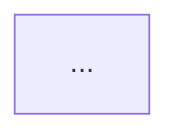

# Mermaid

Generate one Mermaid diagram (plus a short legend) at the requested depth.

## Invocation

```
mermaid L200 <description>
```

- **Level** (required): `L100` | `L200` | `L300` | `L400` (case-insensitive). If omitted, use **L200**.
- **Description**: the topic to diagram. Treat "this repo", "this codebase", or an implicit current-project topic as the workspace.

Do not write files unless the user asks. Reply with a fenced `mermaid` block, then a brief legend.

## Levels

Depth is about **abstraction**, not diagram size. Stay inside the node budget. Omit anything the level forbids. Prefer a second diagram over a crowded one.

| Level | Abstraction | Audience | Nodes | What to show | What to omit |
| --- | --- | --- | --- | --- | --- |
| **L100** | Conceptual / system context | Anyone, 30s scan | 4–8 | Actors, named systems, one-line purpose of each edge | Dirs, packages, APIs, protocols, tech internals |
| **L200** | Logical / containers | Engineer new to the area | 8–18 | Major subsystems, process/store boundaries, container-level tech, cross-boundary request path | File paths, function names, individual routes |
| **L300** | Components | Someone about to change it | 15–35 | Packages, domain services, key modules, important interfaces as labeled edges | Line-level code, every helper, speculative nodes |
| **L400** | Implementation | Debugging or implementing | scoped | Real files, types, handlers, routes, or a single request/data sequence | The whole system on one canvas |

**L400 rule:** one flow or one component, not the whole system. Split into multiple diagrams if needed.

## Grounding

Decide the source of truth from the description:

- **This workspace / a path / a feature in-repo** → inspect the tree before drawing. Do not invent subsystems.
- **A general concept** (e.g. OAuth2 code flow) → use domain knowledge; do not pretend it lives in the repo.

How much to inspect:

- **L100** — README / AGENTS.md / top-level dirs
- **L200** — plus key package READMEs and one listing of major subdirs (`pkg/`, `public/app/`, `packages/`, `apps/`)
- **L300** — plus entrypoints and domain listings (services, features, plugin dirs)
- **L400** — read the actual files for the described flow; cite real symbols only

If the tree contradicts a prior mental model, trust the tree.

## Chart type

Pick one primary type from the description:

| Topic sounds like | Type |
| --- | --- |
| Structure, architecture, "how is X put together" | `flowchart TB` (use `LR` only if the graph is a shallow pipeline) |
| Request, lifecycle, handshake | `sequenceDiagram` |
| States / modes | `stateDiagram-v2` |
| Types / interfaces at L400 | `classDiagram` |
| Data model at L300+ | `erDiagram` |

Default: `flowchart TB`. Do not use experimental Mermaid C4.

## Mermaid constraints

- Node and subgraph **IDs**: `[A-Za-z][A-Za-z0-9_]*` — no spaces, no hyphens in IDs.
- Labels: put punctuation/spaces inside `["..."]` or `["line1<br/>line2"]`.
- Subgraphs: `subgraph id["Visible title"]` — never `subgraph Visible Title`.
- Edges: short labels; one idea per edge.
- No HTML except `<br/>`. No `style`/`classDef` unless the user asks for color.
- No `click`, no `init`, no `%%{init:...}%%`.
- Every node you draw must earn its place at this level. Collapse leftovers into one "other" node or drop them and say so in the legend.

## Output

```markdown
**L200 — <one-line restatement of the description>**



<2–5 sentences: how to read it, what was intentionally left out, and (L300/L400) which dirs or files you inspected.>
```

If L400 needs two diagrams (structure + sequence), emit both, each with its own one-line title.

## Workflow

1. Parse level + description. Default level L200.
2. If the topic is in-repo, inspect at the depth above.
3. Choose chart type. List nodes that belong at this level; cut the rest.
4. Draw. Check IDs, budgets, and "no invented boxes".
5. Write the legend. Name what you omitted.

## Additional resources

- Worked L100–L400 of the same topic: [examples.md](examples.md)
