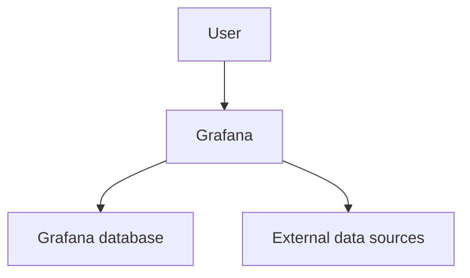
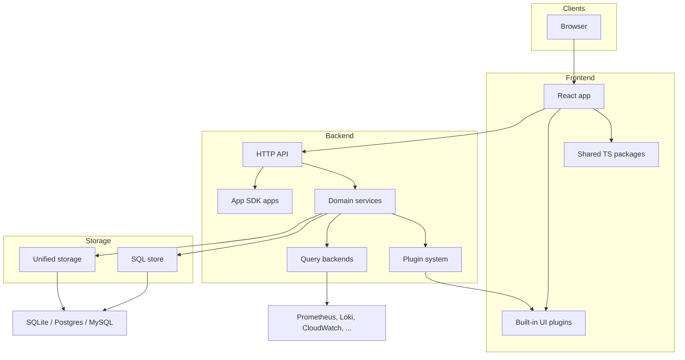
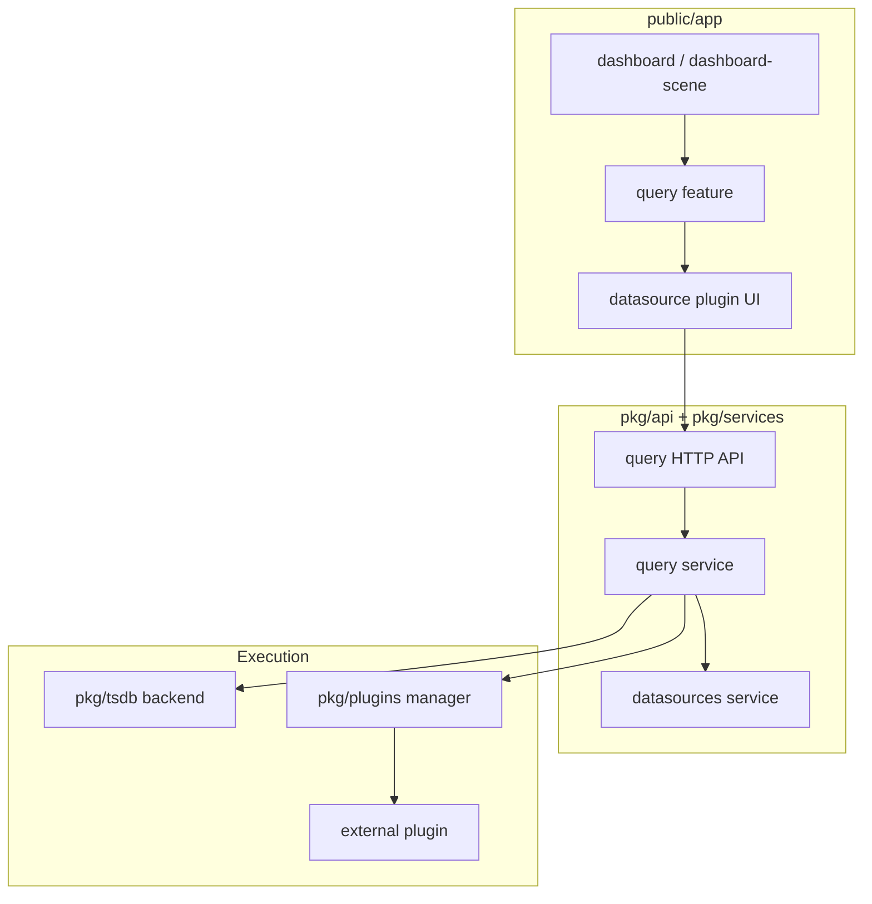
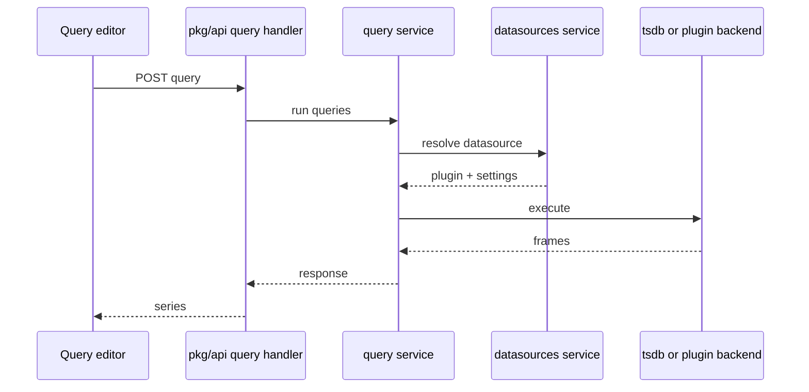

# Examples

Same topic at each level: **Grafana repo architecture**. Copy the shape, not the boxes, when the description is a different system.

## mermaid L100 Grafana repo architecture

**L100 — Grafana as a monitoring UI in front of data sources**

Users open Grafana to view and alert on telemetry. Grafana persists its own state (dashboards, users, settings) and queries external systems for data. No frontend/backend split, plugins, or storage variants.

## mermaid L200 Grafana repo architecture

**L200 — Grafana monorepo: UI, API, apps, plugins, storage**

Container-level view of `public/app`, `packages/`, `pkg/`, `apps/`, and `pkg/storage`. Request path is UI → HTTP API → services or App SDK apps → SQL / unified storage / plugin query backends. File-level handlers and individual services are omitted.

## mermaid L300 Grafana query path

**L300 — Component view of a dashboard query**

Packages and domain services on the dashboard query path. Inspect `public/app/features/dashboard`, `public/app/features/query`, `pkg/services/query`, `pkg/tsdb`, `pkg/plugins`. Authn, alerting, and unified storage are out of scope.

## mermaid L400 Grafana query HTTP handler

**L400 — Sequence of one query request through the API**

Single request. Node names must match real packages/handlers you opened; replace this sketch after reading the handler and service entrypoints. Do not expand into dashboard persistence or alerting on the same canvas.
