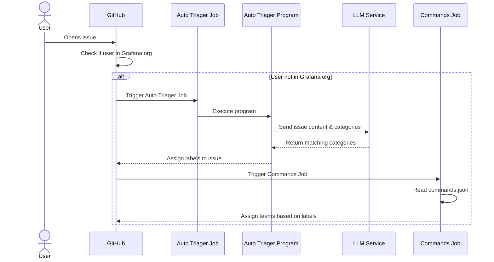

# GitHub & grafanabot automation

The bot is configured via [commands.json](https://github.com/grafana/grafana/blob/main/.github/commands.json) and some other GitHub workflows [workflows](https://github.com/grafana/grafana/tree/main/.github/workflows).

Comment commands:

* Write the word `/duplicate #<number>` anywhere in a comment and the bot will add the correct label and standard message.
* Write the word `/needsMoreInfo` anywhere in a comment and the bot will add the correct label and standard message.

Label commands:

* Add label `bot/question` the bot will close with standard question message and add label `type/question`
* Add label `bot/duplicate` the bot will close with standard duplicate message and add label `type/duplicate`
* Add label `bot/needs more info` for bot to request more info (or use comment command mentioned above)
* Add label `bot/close feature request` for bot to close a feature request with standard message and adds label `not implemented`
* Add label `bot/no new info` for bot to close an issue where we asked for more info but has not received any updates in at least 14 days.

## Metrics

Metrics are configured in [metrics-collector.json](https://github.com/grafana/grafana/blob/main/.github/metrics-collector.json) and are also defined in the 
[metrics-collector](https://github.com/grafana/grafana-github-actions/blob/main/metrics-collector/index.ts) GitHub action.

## Backport PR

To automatically backport a PR to a release branch like v7.3.x add a label named `backport v7.3.x`. The label name should follow the pattern `backport <branch-name>`. Once merged grafanabot will automatically 
try to cherry-pick the PR merge commit into that branch and open a PR. You must then add the milestone to your backport PR.

If there are merge conflicts the bot will write a comment on the source PR saying the cherry-pick failed. In this case you have to do the cherry pick and backport PR manually. 

The backport logic is written [here](https://github.com/grafana/grafana-github-actions/blob/main/backport/backport.ts)

## Auto triager bot

The auto triager bot is a github action that **assigns** labels to issues based on the issue contents. The logic to assign
labels is its own program and lives [here](https://github.com/grafana/auto-triager). It uses an LLM to do this.

The bot runs **every time** a new issue is opened in the grafana/grafana repository. You can find the bot definition [here](https://github.com/grafana/grafana/blob/main/.github/workflows/issue-opened.yml#L61)

The job only assign labels when the issue author is not a member of the Grafana organization in **GitHub**. The bot concurrency is 1.

This bot is not responsible for assigning teams, the [commands](https://github.com/grafana/grafana/blob/main/.github/workflows/commands.yml) workflow is responsible for doing that

### General diagram

### Team definitions

The team associated with labels are defined [here](https://github.com/grafana/grafana/blob/main/.github/commands.json). 
This bot is not responsible for assigning teams, the [commands](https://github.com/grafana/grafana/blob/main/.github/workflows/commands.yml) workflow is responsible for doing that.

The commands workflow code can be found [here](https://github.com/grafana/grafana-github-actions/tree/main/commands)

### Categories/Labels definitions

The categories (or labels) and the types used to categorize issues are defined in this same repository [here](https://github.com/grafana/grafana/tree/main/.github/workflows/auto-triager) the [prompt](https://github.com/grafana/grafana/blob/main/.github/workflows/auto-triager/prompt.txt) that is passed to the LLM is also defined there.

If you are adding a new category in the auto-triager repository you must define a team that owns the label in the
[commands.json](https://github.com/grafana/grafana/blob/main/.github/commands.json).

If you remove a label from the [commands.json](https://github.com/grafana/grafana/blob/main/.github/commands.json) and it doesn't have any other 
team associated with it you must remove it from the [labels file](https://github.com/grafana/grafana/blob/main/.github/workflows/auto-triager/labels.txt)

### Secrets

The bot secrets live in the vault. It uses a [shared workflow](https://github.com/grafana/shared-workflows/tree/main/actions/get-vault-secrets) to get the vault secrets, the
workflow requires a token with `contents:read` and `id-token:write` scopes for it to work.

### How to detect the bot is working?

The list of [unlabeled issues](https://github.com/grafana/grafana/issues?q=is%3Aopen+is%3Aissue+no%3Alabel) should remain empty as long as the bot is running.
There might be issues in the list if some team member removed all labels, but if the list grows to more
than 5 it is likely the bot is not working correctly.

### What to do if this bot is not working?

You can contact the plugins platform team in slack `#grafana-plugins-platform` and inform about the issue.

### Troubleshooting

Possible reasons why the bot is not working:

* The OpenAI API key is not valid anymore. The action output will show this in its error log. A new key needs to be
generated via the OpenAI UI and its value updated in vault. See [the action](https://github.com/grafana/grafana/blob/main/.github/workflows/issue-opened.yml#L72) to find the correct path to
update the key.
* The Slack webhook URL is not valid anymore. The action output will show this in its error log or the
#triage-automation-ci channel will stop showing messages about issue triaging. A new slack webhook url needs to be
generated for the auto triager app and its value updated in vault. 
* This bot is not responsible for assigning teams, the [commands](https://github.com/grafana/grafana/blob/main/.github/workflows/commands.yml) workflow is responsible for doing that
