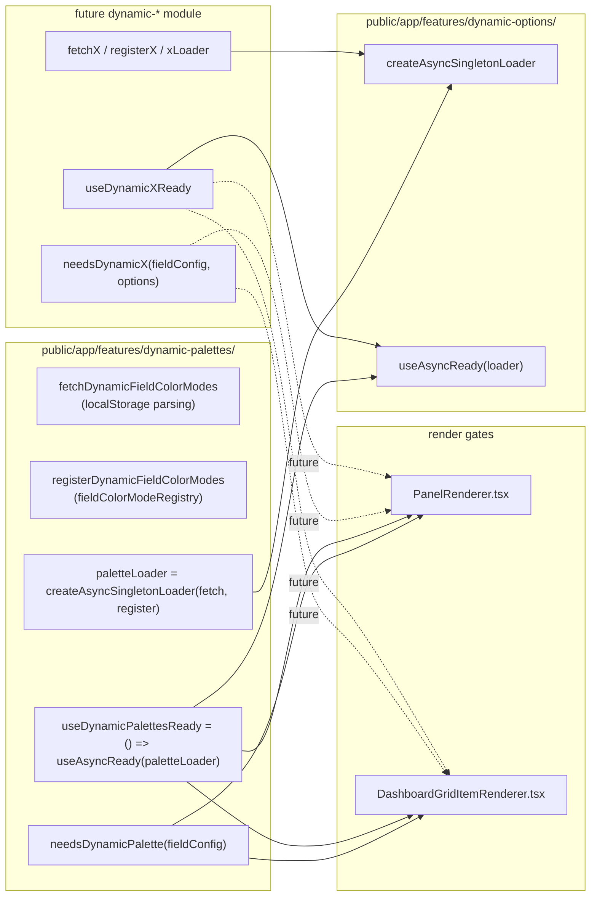

# Abstract Dynamic Panel Options

## Goal

Keep the architecture from PR #124415 (lazy cached singleton load → idempotent registration → per-panel render gate) but stop hard-coding it to `fieldColorModeRegistry` / `color.mode`. After this change:

- A single shared hook + loader factory live under `public/app/features/dynamic-options/` and know nothing about palettes.
- The existing `dynamic-palettes` module becomes the first "consumer" of that pattern, exposing the same public surface (`needsDynamicPalette`, `useDynamicPalettesReady`, etc.).
- A future panel option (e.g. dynamic mappings, dynamic units, a hydrated custom value) is added by creating its own `dynamic-<thing>/` module that copies the palettes module's shape - one `needs*(fieldConfig, options?)` predicate, one `useReady()` hook, one cached loader - and adding two lines to each render gate.

No central registry is introduced; each `dynamic-*` module is self-contained.

## Architecture



## Files to add

### `public/app/features/dynamic-options/createAsyncSingletonLoader.ts`

Generic factory that owns the cached promise + loaded flag - the bits currently inlined in `dynamicPalettes.ts`. Pseudocode:

```ts
export interface AsyncSingletonLoader<T> {
  load(): Promise<T>;
  isLoaded(): boolean;
  reset(): void; // tests only
}

export function createAsyncSingletonLoader<T>(
  fetcher: () => Promise<T>,
  onResolve?: (value: T) => void
): AsyncSingletonLoader<T>;
```

Internally: a module-scoped `cachedPromise` and `loaded` flag, exactly mirroring today's `cachedLoadPromise`/`dynamicPalettesLoaded` in [dynamicPalettes.ts](public/app/features/dynamic-palettes/dynamicPalettes.ts).

### `public/app/features/dynamic-options/useAsyncReady.ts`

Generic version of `useDynamicPalettesReady`:

```ts
export function useAsyncReady<T>(loader: AsyncSingletonLoader<T>): boolean {
  const [ready, setReady] = useState(loader.isLoaded());
  useEffect(() => {
    if (ready) return;
    let cancelled = false;
    loader.load().finally(() => {
      if (!cancelled) setReady(true);
    });
    return () => {
      cancelled = true;
    };
  }, [loader, ready]);
  return ready;
}
```

### Tests

- `public/app/features/dynamic-options/createAsyncSingletonLoader.test.ts` - covers caching, single in-flight, `isLoaded`/`reset`, `onResolve` side effect.
- `public/app/features/dynamic-options/useAsyncReady.test.tsx` - the existing render-gate behavior currently covered by `useDynamicPalettesReady.test.tsx`, lifted up to the generic hook with a stub loader.

## Files to refactor

### `public/app/features/dynamic-palettes/dynamicPalettes.ts`

Drop the bespoke `cachedLoadPromise` / `dynamicPalettesLoaded` / `loadDynamicFieldColorModes` / `isDynamicPalettesLoaded` / `resetDynamicFieldColorModesForTests` and replace with:

```ts
import { createAsyncSingletonLoader } from 'app/features/dynamic-options/createAsyncSingletonLoader';

export const dynamicPalettesLoader = createAsyncSingletonLoader(
  fetchDynamicFieldColorModes,
  registerDynamicFieldColorModes
);
```

`fetchDynamicFieldColorModes` and `registerDynamicFieldColorModes` keep their current bodies (localStorage parsing + `fieldColorModeRegistry.register`). Re-export `dynamicPalettesLoader.load`/`.isLoaded`/`.reset` under the existing names so the existing call sites and tests keep working with minimal churn.

### `public/app/features/dynamic-palettes/useDynamicFieldColorModes.ts`

Replace both `useDynamicFieldColorModes` and `useDynamicPalettesReady` with thin wrappers around the generic hook:

```ts
export const useDynamicPalettesReady = () => useAsyncReady(dynamicPalettesLoader);

export function useDynamicFieldColorModes(): UseDynamicFieldColorModesResult {
  // unchanged loading/error shape, implemented via useAsyncReady + a small error state
}
```

### `public/app/features/dynamic-palettes/needsDynamicPalette.ts`

Move the path knowledge (`fieldConfig?.defaults?.color?.mode`) out of the renderers and into the predicate so each `dynamic-*` module fully owns "what about this panel triggers me":

```ts
import { type FieldConfigSource, fieldColorModeRegistry } from '@grafana/data';

export function needsDynamicPalette(fieldConfig: FieldConfigSource | undefined): boolean {
  const mode = fieldConfig?.defaults?.color?.mode;
  if (!mode) return false;
  return fieldColorModeRegistry.getIfExists(mode) === undefined;
}
```

The signature deliberately accepts the whole `fieldConfig` (and a future variant could also accept panel `options`) so a non-id consumer can scan an arbitrary path without the renderer having to know about it. Tests in [needsDynamicPalette.test.ts](public/app/features/dynamic-palettes/needsDynamicPalette.test.ts) update to pass a `{ defaults: { color: { mode } } }` shape.

### `public/app/features/panel/components/PanelRenderer.tsx`

Stop reading `color.mode` here. Today:

```24:25:public/app/features/panel/components/PanelRenderer.tsx
  const colorMode = props.fieldConfig?.defaults?.color?.mode;
  const shouldWaitForDynamicPalette = needsDynamicPalette(colorMode);
```

becomes:

```ts
const shouldWaitForDynamicPalette = needsDynamicPalette(props.fieldConfig);
// future: const shouldWaitForX = needsDynamicX(props.fieldConfig, props.options);
const shouldWait = shouldWaitForDynamicPalette; /* || shouldWaitForX */
```

The gate component calls `useDynamicPalettesReady()` (and any future `useDynamicXReady()`) and ANDs them.

### `public/app/features/dashboard-scene/scene/layout-default/DashboardGridItemRenderer.tsx`

Same shape: replace

```27:28:public/app/features/dashboard-scene/scene/layout-default/DashboardGridItemRenderer.tsx
  const colorMode = panel.state.fieldConfig?.defaults?.color?.mode;
  const shouldWaitForDynamicPalette = needsDynamicPalette(colorMode);
```

with `needsDynamicPalette(panel.state.fieldConfig)` plus a comment marking where future `needsDynamicX(panel.state.fieldConfig, panel.state.options)` calls drop in. Loading text key stays panel-flavored ("Loading dynamic panel...") since it covers any pending dynamic option.

## Out of scope

- Adding a second concrete `dynamic-*` module - the plan leaves clear "drop in here" comments but the only consumer in this PR remains palettes.
- Changing the localStorage contract or the V2 transform fix from `44ac253` (those stay palette-specific).
- Any hydration of fully non-id values - the predicate signature is widened to `(fieldConfig, options?)` to support it later, but no scanning helper is added now.

## Risks

- The existing `resetDynamicFieldColorModesForTests` is part of the public surface used by [dynamicPalettes.test.ts](public/app/features/dynamic-palettes/dynamicPalettes.test.ts) and [useDynamicPalettesReady.test.tsx](public/app/features/dynamic-palettes/useDynamicPalettesReady.test.tsx); we keep it as a re-export of `dynamicPalettesLoader.reset` so tests don't churn.
- Two renderers always pay an extra `useState` per dynamic-option module even when the panel isn't using any of them. With cached singletons + `isLoaded()` short-circuit this is effectively free, but worth a sanity check on first paint.
