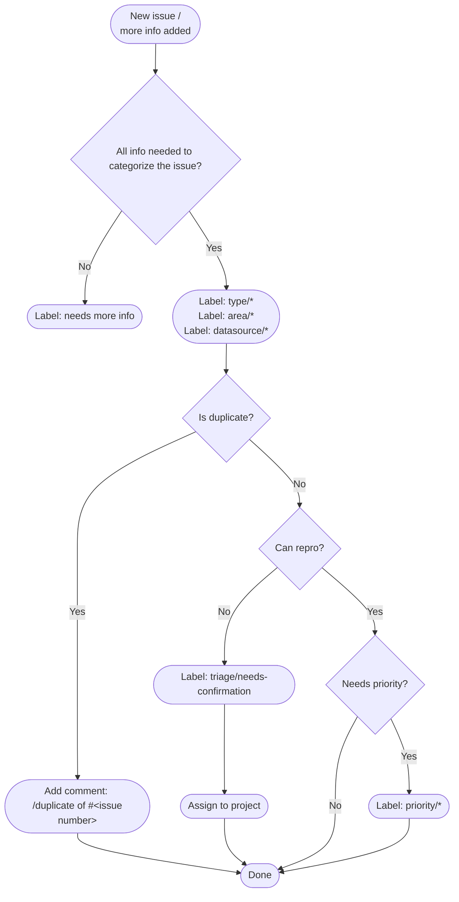

# Triage issues

The main goal of issue triage is to categorize all incoming Grafana issues and make sure each issue has all the essential information needed for anyone to understand and be able to start working on it.

> [!NOTE]
> This information is for Grafana project Maintainers, Owners, and Admins. If you are a Contributor, then you won't be able to perform most of the tasks in this topic.

The core maintainers of the Grafana project are responsible for categorizing all incoming issues and delegating any critical or important issue to other maintainers. Currently, one maintainer each week is responsible. Besides that part, triage provides an important way to contribute to an open source project.

## Simplified flowchart diagram of the issue triage process



## Key functions of issue triage

Triage helps ensure issues resolve quickly by:

- Ensuring the issue's intent and purpose is conveyed precisely. This is necessary because it can be difficult for an issue to explain how an end user experiences a problem and what actions they took.
- Giving a contributor the information they need before they commit to resolving an issue.
- Lowering the issue count by preventing duplicate issues.
- Streamlining the development process by preventing duplicate discussions.

If you don't have the knowledge or time to code, consider helping with triage. The community will thank you for saving them time by spending some of yours.

### 1. Find uncategorized issues

To get started with issue triage and finding issues that haven't been triaged you have two alternatives.

#### Browse unlabeled issues

The easiest and most straightforward way of getting started and finding issues that haven't been triaged is to browse [unlabeled issues](https://github.com/grafana/grafana/issues?q=is%3Aopen+is%3Aissue+no%3Alabel), and then work on them starting from the bottom to the top.

#### Subscribe to all notifications

The more advanced, but recommended way is to subscribe to all notifications from this repository which means that all new issues, pull requests, comments and important status changes are sent to your configured email address. Read this [guide](https://help.github.com/en/articles/watching-and-unwatching-repositories#watching-a-single-repository) for help with setting this up.

It's highly recommended that you set up filters to automatically remove emails from the inbox and label them accordingly. When issues are properly categorized you can easily understand when you need to act upon a notification or where to look to find issues that haven't been triaged.

Instructions for setting up filters in Gmail can be found [here](#setting-up-gmail-filters). Another alternative is to use [Trailer](https://github.com/ptsochantaris/trailer) or similar software.

### 2. Ensure the issue contains basic information

Before triaging an issue very far, make sure that the issue's author provided the standard information. This helps you make an educated recommendation on how to categorize the issue. The Grafana project uses [GitHub issue templates](https://docs.github.com/en/communities/using-templates-to-encourage-useful-issues-and-pull-requests/configuring-issue-templates-for-your-repository) to guide contributors to provide standard information that must be included for each type of template or type of issue.

#### Standard issue information that must be included

Grafana uses various [issue templates](https://github.com/grafana/grafana/issues/new/choose) to collect information from the issue reporter. The following list describes the standard information that is included.

##### Bug reports

Bug reports should explain what happened, what was expected, and how to reproduce it. Also, it should include additional information that may help giving a complete picture of what happened such as screenshots, [query inspector](https://community.grafana.com/t/using-grafanas-query-inspector-to-troubleshoot-issues/2630) output, and any relevant information about the environment. For example:

- Grafana version:
- Data source type & version:
- OS Grafana is installed on:
- User OS & Browser:
- Grafana plugins:
- Others:

##### Enhancement requests

> **Note:** Prior to August, 2023, community-submitted feature requests were submitted as [GitHub discussions](https://github.com/grafana/grafana/discussions). These are now submitted using the [feature request issue template](https://github.com/grafana/grafana/issues/new?assignees=&labels=type%2Ffeature-request&projects=&template=1-feature_requests.md).

When submitting an enhancement request we ask that users focus on the problem they'd like to solve and why it’s a problem rather than focusing on the solution itself. To facilitate these objectives, the feature requests template includes the following:

- What would you like to be added?:
- Why is this needed (describe your use case and goals)\*\*?:

##### Accessibility issues

This is a mix between a bug report and enhancement request but focused on accessibility issues to help make Grafana improve keyboard navigation, screen-reader support, and general accessibility. The report should include relevant [WCAG criteria](https://www.w3.org/WAI/WCAG21/quickref/?versions=2.0), if applicable.

Grafana Labs is dedicated to improving our graphical user interfaces and overall experience so that our product becomes usable and accessible for people with disabilities as well as anyone else. Learn more about Grafana's commitment to [A11y](https://grafana.com/accessibility/) (accessibility).

##### Support requests

In general, if the issue description and title is perceived as a question no more information is needed. See how to categorize these requests [here](#support-requests-1).

#### Good practices

To make it easier for everyone to understand and find issues a good rule of thumbs is to:

- Make sure that issue titles are named to explain the subject of the issue, are spelled correctly, and don't include irrelevant or sensitive information.
- Make sure that issue descriptions don't include irrelevant information, information from a template that hasn't been filled out, or sensitive information.
- Do your best effort to change the title and description or request suggested changes by adding a comment.

#### Do you have all the information needed to categorize an issue?

Depending on the issue, you might not feel all this information is needed. Use your best judgement. If you cannot triage an issue using what its author provided, explain kindly to the author that they must provide the previously mentioned information to clarify the problem. Label issue with `needs more info` and add any related `area/*` or `datasource/*` labels. Alternatively, use `bot/needs more info` label and the Grafana bot will request it for you.

If the author provides the standard information, but you are still unable to triage the issue, request additional information. Do this kindly and politely because you are asking for more of the author's time.

If the author does not respond to the requested information within a week, close the issue with a kind note stating that the author can request for the issue to be reopened when the necessary information is provided.

When you feel you have all the information needed, then you're ready to [categorize the issue](#3-categorize-an-issue).

If you receive a notification with additional information provided, but you aren't on issue triage anymore and you feel you don't have time to handle it, you should delegate it to the current person on issue triage.

### 3. Categorize an issue

An issue can have multiple labels. Typically, a properly categorized issue should at least have these labels:

- One label identifying its type (`type/*`).
- One or multiple labels identifying the functional areas of interest or component (`area/*`) and/or data source (`datasource/*`), if applicable.

| Label                    | Description                                                         |
| ------------------------ | ------------------------------------------------------------------- |
| `type/bug`               | A feature isn't working as expected given design, or documentation. |
| `type/feature-request`   | Request for a new feature, or enhancement.                          |
| `type/docs`              | Documentation problem, or enhancement.                              |
| `type/accessibility`     | Accessibility problem, or enhancement.                              |
| `type/question`          | Issue is a question or is perceived as such.                        |
| `type/duplicate`         | An existing issue of the same subject has already been reported.    |
| `type/works-as-intended` | A reported bug works as intended (that is, by design).              |
| `type/build-packaging`   | Build or packaging problem, or enhancement.                         |
| `area/*`                 | Subject is related to a functional area of interest, or component.  |
| `datasource/*`           | Subject is related to a core data source plugin.                    |

#### Duplicate issues

Make sure it's not a duplicate by searching existing issues using related terms from the issue title and description. If you think you know there is an existing issue, but can't find it, please reach out to one of the maintainers and ask for help. If you identify that the issue is a duplicate of an existing issue:

1. Add a comment `/duplicate of #<issue number>`. GitHub will recognize this and add some additional context to the issue activity.
1. The Grafana bot will do the rest, adding the correct label and a closing comment.
1. Add the `type/duplicate` label. Optionally, you may add any related `area/*` or `datasource/*` labels.

#### Bug reports

If it's not perfectly clear that it's an actual bug, quickly try to reproduce it.

**It can be reproduced:**

1. Add a comment describing detailed steps for how to reproduce it, if applicable.
1. Label the issue `type/bug` and at least one `area/*` or `datasource/*` label.
1. If you know that maintainers won't be able to put any resources into it for some time then label the issue with `help wanted` and optionally `beginner friendly` together with pointers on which code to update to fix the bug. This should signal to the community that we would appreciate any help we can get to resolve this.
1. Move on to [prioritizing the issue](#4-prioritization-of-issues).

**It can't be reproduced:**

1. Either [ask for more information](#2-ensure-the-issue-contains-basic-information) needed to investigate it more thoroughly.
1. Either [delegate further investigations](#investigation-of-issues) to someone else.

**It works as intended (that is, by design):**

1. Kindly and politely add a comment explaining briefly why we think it works as intended and close the issue.
1. Label the issue `type/works-as-intended`.

#### Enhancement or feature request?

1. Label the issue `type/feature-request` and add at least one `area/*` or `datasource/*` label.
1. Make sure the submitter has justified why this feature requests is important.

#### Documentation issue?

First, evaluate if the documentation makes sense to be included in the Grafana project:

- Is this something we want and can maintain as a project?
- Is this referring to usage of some specific integration and in that case is that a popular use case in combination with Grafana?
- If unsure, kindly and politely add a comment explaining that we would need [upvotes](https://github.blog/2016-03-10-add-reactions-to-pull-requests-issues-and-comments) to identify that lots of other users want or need this.

Second, label the issue `type/docs` and at least one `area/*` or `datasource/*` label.

**Minor typo/error/lack of information:**

There's a minor typo, error, or lack of information that adds a lot of confusion for users and is a big win to fix it:

1. Either update the documentation yourself and open a pull request.
1. Either delegate the work to someone else by assigning that person to the issue. Note that the milestone is automatically assigned and usually doesn't need to be manually edited.

**Major error/lack of information:**

1. Label the issue with `help wanted` and `beginner friendly`, if applicable, to signal that we find this important to fix and we would appreciate any help we can get from the community.
1. Move on to [prioritizing the issue](#4-prioritization-of-issues).

#### Accessibility issues

1. Label the issue `type/accessibility` and at least one `area/*` or `datasource/*` label.

#### Support requests

1. Kindly and politely direct the issue author to the [community site](https://community.grafana.com/) and explain that GitHub is mainly used for tracking bugs and feature requests. If possible, it's usually a good idea to add some pointers to the issue author's question.
1. Label the issue with `bot/question`. The Grafana bot will automatically close the issue, and it will add the type/question label for you.

### 4. Prioritization of issues

In general, bugs and enhancement issues should be labeled with a priority.

This is the most difficult thing with triaging issues since it requires a lot of knowledge, context and experience before it is possible to skillfully add a specific priority label.

The key here is to ask for help and discuss issues to understand how more experienced project members think and reason. By doing that you learn more and eventually be more and more comfortable with prioritizing issues.

In case there is an uncertainty around the prioritization of an issue, please ask the maintainers for help.

| Label                             | Description                                                                                                   |
| --------------------------------- | ------------------------------------------------------------------------------------------------------------- |
| `priority/critical`               | Highest priority. Must be actively worked on as someone's top priority right now.                             |
| `priority/support-subscription`   | This is important for one or several customers having a paid Grafana support subscription.                    |
| `priority/important-soon`         | Must be staffed and worked on either currently, or very soon, ideally in time for the next release.           |
| `priority/important-longterm`     | Important over the long term, but may need multiple releases to complete.                                     |
| `priority/nice-to-have`           | It's a good idea, but not scheduled for any release.                                                          |
| `priority/awaiting-more-evidence` | Lowest priority. Possibly useful, but not yet enough interest in it.                                          |
| `priority/unscheduled`            | Something to look into before and to be discussed during the planning of the next major/minor stable release. |

**Critical bugs**

1. If a bug has been categorized and any of the following criteria apply, the bug should be labeled as critical and must be actively worked on as someone's top priority right now:

   - Results in any data loss
   - Critical security or performance issues
   - Problem that makes a feature unusable
   - Multiple users experience a severe problem affecting their business, user experience, and so on.

1. Label the issue `priority/critical`.
1. If applicable, label the issue `priority/support-subscription`.
1. Add the issue to the next upcoming patch release milestone. Create a new milestone if there are none.
1. Escalate the problem to the maintainers.
1. Assign or ask a maintainer for help assigning someone to make this issue their top priority right now.

**Important short-term**

1. Label the issue `priority/important-soon`.
1. If applicable, label the issue `priority/support-subscription`.
1. Add the issue to the next upcoming patch or major/minor stable release milestone. Ask maintainers for help if unsure if it's a patch or not. Create a new milestone if there are none.
1. Make sure to add the issue to a suitable backlog of a GitHub project and prioritize it or assign someone to work on it now or very soon.
1. Consider requesting [help from the community](#5-request-help-from-the-community), even though it may be problematic given a short amount of time until it should be released.

**Important long-term**

1. Label the issue `priority/important-longterm`.
1. Consider requesting [help from the community](#5-request-help-from-the-community).

**Nice to have**

1. Label the issue `priority/nice-to-have`.
1. Consider requesting [help from the community](#5-request-help-from-the-community).

**Not critical, but unsure?**

1. Label the issue `priority/unscheduled`.
1. Consider requesting [help from the community](#5-request-help-from-the-community).

### 5. Request help from the community

It's generally a good idea to consider signaling to the community that help is appreciated and needed in case an issue isn't prioritized to be worked on by maintainers. Use your best judgement. In general, requesting help from the community means that a contribution has a good chance of getting accepted and merged.

In many cases the issue author or community as a whole is more suitable to contribute changes since they're experts in their domain. It's also quite common that someone has tried to get something to work using the documentation without success, made an effort to get it to work, reached out to the [community site](https://community.grafana.com/) to get the missing information, or some combination of these things.

In certain areas there probably exist domain experts who may be able to help:

- Database setups
- Authentication like OAuth providers and LDAP setups
- Platform-specific things
- Reverse proxy setups
- Alert notifiers

1. Kindly and politely add a comment to signal to users subscribed to updates of the issue.
   - Explain that the issue would be nice to get resolved, but it isn't prioritized to work on by maintainers for an unforeseen future.
   - If possible or applicable, try to help contributors getting starting by adding pointers and references to what code needs to be changed. Note any suggests for good ways of solving or implementing the issue.
1. Label the issue with `help wanted`.
1. If applicable, label the issue with `beginner friendly` to denote that the issue is suitable for a beginner to work on.
1. If possible, try to estimate the amount of work by adding `effort/small`, `effort/medium` or `effort/large`.

### Investigation of issues

When an issue has all basic information provided, but the triage responsible hasn't been able to reproduce the reported problem at a first glance, the issue is labeled [`triage/needs-confirmation`](https://github.com/grafana/grafana/labels/triage%2Fneeds-confirmation). Depending on the perceived severity and/or number of [upvotes](https://github.blog/2016-03-10-add-reactions-to-pull-requests-issues-and-comments), the investigation will either be delegated to another maintainer for further investigation or put on hold until someone else (maintainer or contributor) picks it up and eventually starts investigating it.

Investigating issues can be a very time consuming task, especially for the maintainers, given the huge number of combinations of plugins, data sources, platforms, databases, browsers, hardware, integrations, cloud services, and so on, that are used with Grafana. There are a certain number of combinations that are more common than others, and these are in general easier for maintainers to investigate.

For some other combinations it may not be possible at all for a maintainer to setup a proper test environment to investigate the issue. In these cases we really appreciate any help we can get from the community. Otherwise, the issue is highly likely to be closed.

Even if you don't have the time or knowledge to investigate an issue we highly recommend that you [upvote](https://github.blog/2016-03-10-add-reactions-to-pull-requests-issues-and-comments) the issue if you happen to have the same problem. If you have further details that may help investigating the issue, please provide as much information as possible.

### Automation

We have some automation that triggers on comments or labels being added to issues. Many of these automated behaviors are defined in [commands.json](https://github.com/grafana/grafana/blob/main/.github/commands.json). Or in other [GitHub Actions](https://github.com/grafana/grafana/tree/main/.github/workflows)

To learn more about bot actions, refer to our [bot documentation](https://github.com/grafana/grafana/blob/main/.github/bot.md).

### External PRs

Part of issue triage should also be triaging of external PRs. The main goal should be to make sure PRs from external contributors have an owner and aren't forgotten.

1. Check new external PRs which don't have a reviewer. You can easily search for pull requests made by external contributors by using the label: `pr/external` in your [query search](https://github.com/grafana/grafana/pulls?q=is%3Aopen+is%3Apr+label%3Apr%2Fexternal) Note: external PRs are automatically labeled with `pr/external` upon creation.
1. Check if there is a link to an existing issue. The link to a existing issue should be in the description section, underneath “Which issue(s) does this PR fix?:”. If not, and you know which issue it is solving, add the link yourself. Otherwise, ask the author to link the issue or create one.
1. Assign a reviewer based on who was handling the linked issue or what code or feature the PR touches (if all else fails, look at who was the last to make changes).

### Appendix

#### Setting up Gmail filters

If you're using Gmail, a best practice is to set up filters to automatically remove emails from the inbox and label them to make it easy for you to understand when you need to act upon a notification. You should be able to promptly process all incoming issues that haven't been triaged.

This may be set up by personal preference, but here's a working configuration for reference:

1. Follow instructions in [gist](https://gist.github.com/marefr/9167c2e31466f6316c1cba118874e74f)
1. In Gmail, go to **Settings** -> **Filters and Blocked Addresses**.
1. On the menu, select **Import filters**, then select and open the XML file.
1. Review the filters.
1. Optional: Select **Apply new filters to existing email**.
1. Create filters.

This gives you a structure of labels in the sidebar similar to the following:

```
 - Inbox
 ...
 - GitHub (mine)
   - activity
   - assigned
   - mentions
 - GitHub (other)
  - Grafana
```

- All notifications you’ll need to take action on should show up as unread in **GitHub (mine)** and its sub-labels.
- All notifications you don’t need to take action on show up as unread in **GitHub (other)** and its sub-labels.
