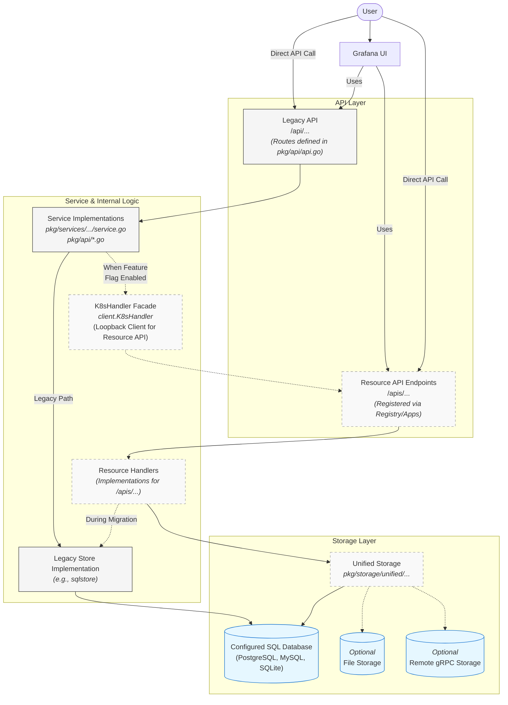
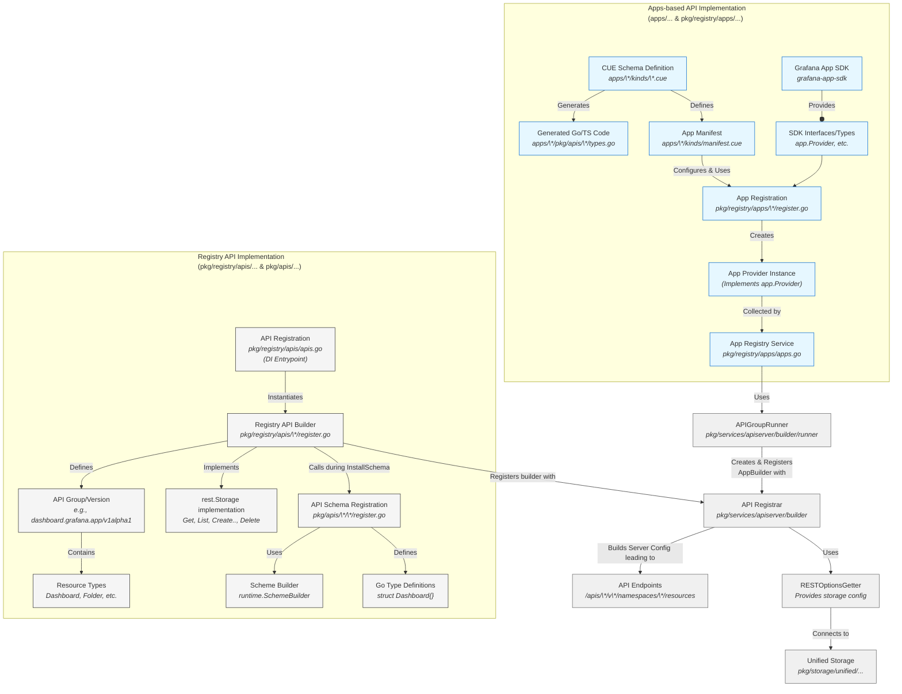

# Grafana Kubernetes-inspired backend architecture

Grafana is adopting a Kubernetes-inspired, resource-oriented model for all Grafana core resources (dashboards, folders, datasources, alert rules, ..) where users can interact with these resources by defining their desired state via well-structured objects sent to Grafana's new Resource APIs (`/apis/...`). Grafana then acts upon these declarations to align the system's current state with the requested state.

On top of adopting the declarative, eventually-consistent system design, we are also adopting Kubernetes API's strict approach to URL structures, versioning and schemas. This approach addresses limitations of Grafana's traditional Legacy APIs (`/api/...`), including:

- **Inconsistent designs:** Variations in structure, parameters, and response formats across different endpoints.
- **No versioning:** Difficulty managing breaking changes and API evolution without clear versioning.
- **Absence of schemas:** Lack of machine-readable schemas hindered programmatic interaction, validation, and tooling.
- **Limited extensibility model:** No standardized way for Grafana plugins to extend core APIs or use Grafana database for storing custom configs

The end goal is for the Resource APIs to become the only interface for managing core Grafana resources. We will eventually deprecate and remove all Legacy API endpoints.

## 1. Key Differences from Legacy API Endpoints

- **URL structure & versioning:**

  - **Resource APIs:** Follow Kubernetes conventions (`/apis/<group>/<version>/namespaces/<namespace>/<resource>/<name>`). Includes explicit API versions (e.g., `v0alpha1`, `v1`, `v2beta1`) in the path, allowing for controlled evolution and multiple versions of a resource API to co-exist.
  - **Legacy APIs:** Variable path structures (e.g., `/api/dashboards/uid/:uid`, `/api/ruler/grafana/api/v1/rules/:uid/:uid`). Less explicit versioning.

- **Resource schemas:**

  - **Resource APIs:** Each resource has a well-defined schema (`spec`) and is wrapped with an envelope with common metadata, all APIs come with an always-in-sync OpenAPI spec.
  - **Legacy APIs:** Structures vary

- **Namespacing / org context:**

  - **Resource APIs:** Uses explicit namespaces in the path (`/namespaces/<namespace>/...`) mapping to Grafana Organization IDs in OSS/Enterprise and Grafana Cloud Stack IDs in Grafana Cloud for scoping.
  - **Legacy APIs:** Org context determined implicitly (session, API key), not usually part of the URL structure.

- **Consistency of convenience features:**

  - **Resource APIs:** Convenience features such as resource history, restore and observability-as-code tooling come out of the box; a single implementation of convenience features works across all resources because of the standardization
  - **Legacy APIs:** Different APIs support different convenience features; implementations are feature-specific

- **Error Handling:**
  - **Resource APIs:** Uses Kubernetes error response conventions (HTTP status codes 400, 401/403, 404, 409; structured error body).
  - **Legacy APIs:** Variable error formats; Grafana-specific.

## 2. Core Concepts

- **Resource APIs:** New Grafana API endpoints that mimic the Kubernetes API structure (e.g., `/apis/dashboard.grafana.app/v1alpha1/dashboards`). These are served by Grafana itself and are distinct from any Kubernetes API running on the same system.

- **API implementation approaches:**
  - **Registry Approach (`pkg/registry/apis/...`):** Original method using Go code (`.../register.go` files). While newer resources are primarily defined using CUE in `apps/`, this path is still used for things such as legacy fallbacks for App-defined resources when data for that resource exists outside of unified storage.
  - **Apps Approach (`apps/...`):** The newer, more modular implementation where APIs are defined using CUE in self-contained modules. Each app defines resources in `kinds/*.cue` files and resources are registered via the App SDK. This is the direction Grafana is moving towards for all resources.
- **Unified Storage (`pkg/storage/unified/...`):** Internal abstraction handling resource persistence. It handles the conversion between the Resource API and the underlying storage backend.
- **`K8sHandler` (`pkg/services/apiserver/client/client.go`):** Internal client facade used by Grafana services. Provides a Kubernetes-like client interface (`Get`, `Create`, etc.) for the Resource API. Acts as an adapter during migration, enabling legacy services to use the Resource API. Does not interact with external systems - it interacts only with Grafana's own APIs.
- **Configured SQL database:** Grafana's primary persistence layer (PostgreSQL, MySQL, SQLite). The persistence target for actions initiated within Grafana's UI/Legacy API. It's the default backend for Unified Storage
- **App SDK (`github.com/grafana/grafana-app-sdk`):** SDK for the Apps Approach. Provides tools for defining resources (CUE) and generating code.

### 2.1 Unified Storage

The Unified Storage (`pkg/storage/unified/...`) is Grafana's internal persistence layer backing the Resource API. It decouples API handlers from the storage backend.

**Design Rationale:**

- **Addressing legacy limitations:** Traditionally, Grafana stored entire resource definitions (like dashboard JSON) as opaque blobs in resource-specific tables (e.g. `dashboard`). This made it difficult to query specific fields, implement consistent versioning/watching, or natively support Kubernetes concepts. It also made it impossible for plugins to store custom configs alongside core resources in Grafana database.
- **Supporting existing Databases (vs. etcd/Kine):** Instead of `etcd`, Unified Storage uses Grafana's existing SQL database support (PostgreSQL, MySQL, SQLite) for operational simplicity - we do not want to introduce `etcd` as a mandatory dependency - and backwards compatibility - we need to ensure Grafana continues to work in all the varied environments its being used.

**Key Characteristics:**

- **Implementing Kubernetes [`storage.Interface`](https://github.com/kubernetes/apiserver/blob/master/pkg/storage/interfaces.go#L168):** Provides an implementation of `k8s.io/apiserver/pkg/storage.Interface` via `apistore.Storage` (`pkg/storage/unified/apistore/store.go`). This adapter translates Kubernetes storage operations (`Create`, `Get`, `List`, `Watch`) to calls against Grafana's `resource.ResourceClient`.
- **Resource versioning:** Each resource stored in the Unified Storage has a `resourceVersion` that changes whenever the resource is modified. It's stored as a monotonically increasing counter and is used for optimistic concurrency control in updates; if the stored version differs from the provided version, the update is rejected with a 409 Conflict error.
- **Native `Watch` support:** `resourceVersion` enables efficient `Watch` capabilities, even on standard SQL databases. Every resource modification writes an entry to a `resource_history` table, tagged with the new `resourceVersion`. In HA mode, an internal poller reads this table based on `resourceVersion` to detect changes. In non-HA mode, writes trigger direct notifications via Go channels. The API server then streams these detected events (from polling or direct notification) to connected Watch clients.

### 2.2 Defining APIs through `/apps/*`

The `apps` directory structure is Grafana's intended future for defining APIs and implementing the Kubernetes-style resource model. Compared to the older Registry Approach, it offers:

- **Schema-first:** CUE definitions provide strong typing, validation, and code generation.
- **Modularity:** Each app is self-contained with its own versioning and dependencies.
- **Controllers/Reconcilers:** The App SDK supports controllers (reconcilers) that watch resources and align system state with the resource `spec`.
- **Admission Webhooks:** Apps can define validation or mutation logic via admission webhooks in their manifests, applied before resources are saved.

**Example: Playlist App (`apps/playlist/`)**

- `(plugin)/kinds/playlist.cue`: CUE schema for the `Playlist` resource kind and its `spec`.
- `(plugin)/kinds/manifest.cue`: App and resource kind metadata.
- `(plugin)/pkg/apis/playlist/v0alpha1/`: Generated Go types from the CUE schema.
- `(plugin)/pkg/reconcilers/reconciler_playlist.go`: Reconciler acting on `Playlist` resources.
- `(root)/pkg/registry/apps/playlist/register.go`: Registers the `Playlist` kind and API endpoints using the App SDK.

The Apps Approach creates the same Resource API endpoints (`/apis/...`) as the Registry Approach, but with a cleaner implementation and improved developer experience. It's the standard pattern for all future Grafana resources.

### 2.3 Kubernetes API Compatibility

Grafana's Resource APIs adopts many Kubernetes API conventions but is **not strictly conformant** to the official Kubernetes API specification. We diverge from the Kubernetes architecture and Kubernetes API specification when needed for Grafana's own unique requirements or to avoid operational complexity. Each architectural difference can surface as behavioral or wire-level incompatibility with the vanilla Kubernetes API.

In other words, even when the URLs / resources look Kubernetes-like, some API Server guarantees might not hold. We are adopting Kubernetes API patterns, general structure, and declarative style. A strict, byte-for-byte conformance to the API spec is currently not a goal.

The list of major architectural changes includes:

- **Persistence:** Uses Grafana's configured SQL database (PostgreSQL, MySQL, SQLite) via Unified Storage, not `etcd`.
- **Auth:** Uses Grafana's standard auth (API keys, sessions, RBAC/Permissions), not Kubernetes ServiceAccounts or RBAC.
- **Resource Definition:** Uses golang (Registry Approach) or CUE schemas (Apps Approach), not Kubernetes CRDs applied to an external `kube-apiserver`.
- **Controllers/Reconcilers:** Run **internally within the Grafana server process**, not as external operators talking to `kube-apiserver`.
- **Dealing with large resources:** Some of Grafana resources can be much larger than what Kubernetes/etcd allows which impacts design of some operations (e.g. `LIST`)
- **Dataplane routes:** Not all Grafana Legacy APIs can be expressed as simple CRUD operations (e.g. datasource queries or proxy routes). We are going to define custom, resource- or group-level routes to handle these scenarios.

## 3. Diagrams

### Request Flow



### Registry vs Apps Approach



## 4. Migration Path: From Legacy APIs to Resource APIs

**Coexistence During Migration:**

Both API styles will coexist for a while. How they interact depends on the specific resource and the stage of migration. The migration generally follows these steps per resource type:

1. **Define schema:** Define the resource using CUE (Apps Approach). Introduce an Alpha version (`v1alpha1`).
2. **Implement handlers:** Create Resource API handlers (CRUD) interacting with legacy storage. The goal for the initial alpha version is to expose the current functionality of the legacy API through the new Resource API structure, using CUE for schema definition, rather than to undertake a full resource/data model redesign.
3. **Add feature flag:** Create a flag (e.g., `kubernetesClient<Resource>`), initially off.
4. **Implement routing/translation:** Modify Legacy API handlers to check the flag and delegate calls to the Resource API or storage layer when active.
5. **Testing & promotion (Beta):** Enable the flag by default after testing. Promote API to Beta (`v1beta1`). Beta APIs aim for stability but may have breaking changes following a deprecation policy.
6. **Migrate data to Unified Storage:** Under another feature flag, gradually change the source of truth from legacy to unified storage.
7. **Stabilization (GA):** Promote to GA (`v1`) when stable. GA APIs provide strong stability guarantees.
8. **Deprecate Legacy API:** Officially deprecate the corresponding Legacy API endpoint after the Resource API reaches GA. Communicate deprecation timelines (e.g., deprecated in X, removed in Y).
9. **Remove Legacy API:** Remove the Legacy API endpoint after the deprecation period.

This process, using feature flags and versioning (Alpha/Beta/GA), ensures backward compatibility while progressively moving towards the target API structure.

The frontend code is also updated gradually. As Resource API endpoints stabilize, frontend code managing those resources switches from Legacy to Resource APIs, benefiting from improved consistency and validation.

## 5. So does it all mean I can point `kubectl` directly at the Grafana server and use it to create dashboards?

**Yes, with caveats.** `kubectl` is supported under a dev-mode-only, experimental `grafanaAPIServerEnsureKubectlAccess` feature flag and requires `server.protocol` set to `https`. Enabling `https` causes Grafana to configure its web server with TLS certificates, either loading specified certificate/key files or generating self-signed ones if none are provided.

```bash
#!/bin/bash
# Assumes Grafana running from repo root - adjust if running packaged Grafana (e.g., /usr/local/etc/grafana/grafana-apiserver/grafana.kubeconfig).
export KUBECONFIG=../../data/grafana-apiserver/grafana.kubeconfig

cat <<EOF | kubectl apply -f -
apiVersion: folder.grafana.app/v1beta1
kind: Folder
metadata:
  name: kubectl-folder
spec:
  title: Folder from kubectl
status: {}
EOF

cat <<EOF | kubectl apply -f -
apiVersion: dashboard.grafana.app/v1beta1
kind: Dashboard
metadata:
  name: kubectl-dash
spec:
  title: Dashboard from kubectl
  editable: true
  schemaVersion: 41
  panels:
    - title: hello
      type: text
      options:
        mode: markdown
        content: '## Hello kubectl!'
status: {}
EOF

# Annotate Dashboard to place it in the Folder
kubectl annotate --overwrite dashboards.dashboard.grafana.app kubectl-dash grafana.app/folder=kubectl-folder
```

**Standard Behavior (Flag disabled):**

By default, `kubectl` cannot connect directly to Grafana. Grafana APIs use standard Grafana authentication (sessions, API keys), which `kubectl` does not handle natively.

**Experimental `kubectl` support (Flag enabled):**

If you enable the `grafanaAPIServerEnsureKubectlAccess` feature flag, Grafana will enter "dev mode" and generate a `grafana.kubeconfig` file in its config directory. The kubeconfig contains a bearer token and server details allowing `kubectl` to connect to Grafana's Resource API. Relying on the flag for production workflows is discouraged in favor of using Grafana's standard provisioning method.
