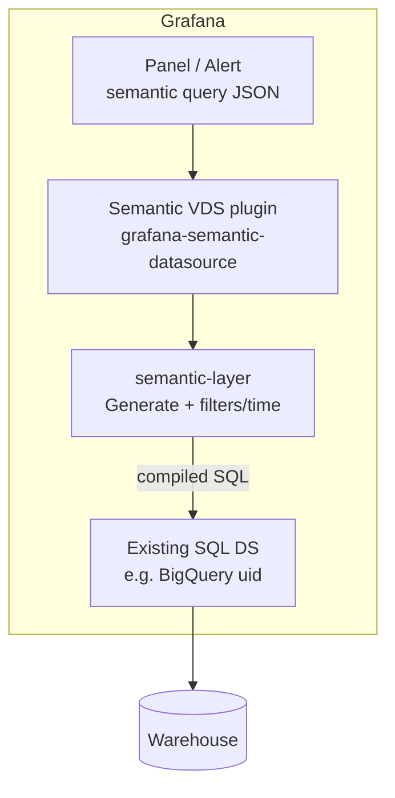
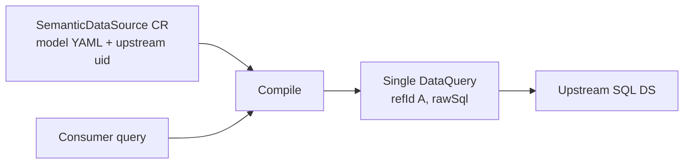

# Semantic Virtual Datasources — implementation plan

> Status: **DRAFT v2**.
> Author: `sj` (with assistant).
> Target repo: `grafana/grafana` (OSS-first).
> Companion to [virtual-datasources.md](./virtual-datasources.md) (general / composite VDS).
>
> **Likely build order:** this variant first. The general VDS (saved-query
> graphs + expression fan-in) may never ship if semantic VDS meets the
> product need.

## Changelog

- **v2** — reviewer pass: Steep-influenced PoC query shape (not
  Cube-compatible JSON as a goal); explicit goal to **not** run Cube;
  multi-model joins as a near-term requirement; richer semantic-layer
  value prop; drop production migration framing.
- **v1** — initial plan: semantic-layer compile path, upstream SQL
  datasource delegation, Cube-datasource problem framing, phased delivery.

## 1. Problem

### 1.1 Cube datasource today

The [grafana-cube-datasource](https://github.com/grafana/grafana-cube-datasource)
plugin is a normal Grafana backend datasource. Panels send Cube-shaped JSON
(`dimensions`, `measures`, `filters`, `timeDimensions`, …) to a Go plugin,
which calls **Cube’s REST API** (`/cubejs-api/v1/load`). Cube owns:

- The semantic model (YAML in `cube-models`, synced to Cube servers).
- Warehouse credentials and SQL generation/execution.

Grafana never runs warehouse SQL for panel queries.

### 1.2 The “two BigQuery datasources” pain

If the org already has a **BigQuery datasource in Grafana** (credentials,
default project, IAM, provisioning), adopting Cube for semantics forces a
**second** warehouse configuration:

| Config surface            | Cube path                                                                          | Grafana-only path   |
| ------------------------- | ---------------------------------------------------------------------------------- | ------------------- |
| BQ service account / auth | Cube env / Cube Cloud                                                              | Grafana BQ DS       |
| Default project / dataset | Cube `sql_table` refs                                                              | Grafana DS settings |
| Credential rotation       | Update Cube **and** optionally a Grafana BQ DS used only for “Edit SQL in Explore” | Update Grafana once |

The Cube plugin’s optional `exploreSqlDatasourceUid` only deep-links compiled
SQL into Explore — it does **not** execute panel queries through Grafana’s BQ
DS. Dashboard data still flows Cube → warehouse.

Operational cost: every credential or project change is done in two places,
with no sync guarantee.

### 1.3 What we want instead

A **by-reference semantic layer inside Grafana** that:

1. Stores a **model** (YAML: dimensions, measures, `sql_table`) in unified
   storage — updates cascade to panels and alerts.
2. Accepts a **semantic query** from the panel (shape TBD for PoC — likely
   closer to [Steep](https://github.com/grafana/semantic-layer/blob/main/docs/steep-analysis.md)
   than Cube; see §5.3).
3. **Compiles** that query to SQL using
   [`github.com/grafana/semantic-layer`](https://github.com/grafana/semantic-layer)
   (Go library, Cube-flavoured YAML).
4. **Executes** the SQL through an **existing** Grafana SQL datasource
   (BigQuery, Postgres, …) — **one** credential store.

This is still a “virtual” datasource from the consumer’s perspective (picker
entry, uid reference, cascade on model edit), but the implementation is
**compile-and-delegate**, not **inline an expression query graph**.

## 2. Relationship to general Virtual Datasources

| Aspect           | General VDS ([plan](./virtual-datasources.md))             | Semantic VDS (this doc)                         |
| ---------------- | ---------------------------------------------------------- | ----------------------------------------------- |
| Primary use case | Saved composite queries (multi-DS + `__expr__`)            | Metrics/dimensions over one SQL warehouse       |
| Definition       | `spec.queries[]` + `outputRefId` + frame schema            | `spec.model` (YAML) + `spec.upstream`           |
| Evaluation       | Expand to inner `DataQuery` graph; run expression pipeline | `semantic-layer.Generate` → one SQL `DataQuery` |
| Upstream         | N datasources + optional SQL/math nodes                    | **One** SQL datasource uid                      |
| AdHoc (PoC)      | Post-pipeline filter on `data.Frame`                       | **Compile-time** `WHERE` in SQL                 |
| Cube server      | Not used                                                   | **Must not** be used (explicit goal)            |
| Panel query API  | Grafana query graph                                        | Semantic query JSON (Steep-like PoC; not Cube)  |
| Maturity         | v3 draft, not implemented                                  | **First candidate to implement**                |

Shared infrastructure we **reuse** from the general plan where it still fits:

- App Platform CR + unified storage + RBAC.
- Synthetic `*datasources.DataSource` for picker uid resolution (§4.4 of
  general plan).
- Two evaluation call sites: `service.QueryData` and `getExprRequest`
  (alerting).
- Feature toggles, observability patterns, identity posture for alerts.

We **do not** reuse for PoC:

- `Expander` graph inlining, refId prefix rewriting, `__expr__` DAG
  constraints, post-pipeline frame AdHoc applier.

If semantic VDS ships and stabilises, treat general VDS as **optional /
deferred** unless a concrete composite-query requirement appears.

## 3. Goals

1. **Do not run Cube.** No Cube server, Cube Cloud, or Cube REST API on the
   query path. Semantics and SQL generation live in Grafana +
   `github.com/grafana/semantic-layer`. The existing Cube datasource plugin
   remains a separate product; this feature does not depend on it.
2. **Single warehouse config.** Semantic definitions reference
   `spec.upstream.datasourceUid` — an existing Grafana SQL DS. One place to
   rotate credentials and project defaults.
3. **By-reference model — single source of truth for business metrics.**
   Model YAML lives in a CR; panels and alerts reference the semantic VDS uid
   only. Renaming a measure, fixing a definition, or adding a dimension
   updates every consumer on next eval. No copied query graphs, no divergent
   panel SQL.
4. **Server-side compile + execute.** Browser sends a semantic query; backend
   compiles SQL and delegates to the upstream plugin’s query path.
5. **Alerting parity.** Same compile path in `getExprRequest` as interactive
   queries (no TS-only filtering).
6. **Multi-model joins immediately after launch.** The Go engine does not
   support joins today, but cross-model queries are a **day-one product
   requirement** once Semantic VDS exists — not a distant follow-up. Engine
   work (join paths, multi-model YAML) runs in parallel with Grafana wiring;
   PoC may ship single-model first only if join support lands in the same
   release train.

### 3.1 Why a semantic layer (not just “better AdHoc”)

Compared to general VDS (post-hoc frame filters) or raw SQL datasources, a
semantic layer buys:

| Benefit                   | What it means                                                                                                                   |
| ------------------------- | ------------------------------------------------------------------------------------------------------------------------------- |
| **Governed metrics**      | `total_revenue` is defined once (`SUM(amount - discount)`), not re-derived per dashboard.                                       |
| **Safe exploration**      | Consumers pick from declared dimensions/measures; they cannot reference arbitrary columns.                                      |
| **Consistent time**       | Model-level `time_dimension` (and Steep-style per-metric time, if we adopt it) keeps time semantics aligned across panels.      |
| **Filter pushdown**       | AdHoc and dashboard filters compile into `WHERE` on the warehouse query — efficient and correct for aggregates.                 |
| **Joins across entities** | Orders + customers + products in one query without hand-written join SQL in every panel.                                        |
| **Cascade on change**     | Fix the model → every panel and alert picks it up; contrasts with saved queries (copy) and duplicated BQ DS config (Cube path). |

General VDS solves **by-reference composite graphs**. Semantic VDS solves
**by-reference business semantics** over SQL warehouses.

## 4. Non-goals (PoC)

- **Cube-compatible panel query JSON** — we are not committing to
  `dimensions` / `measures` / `timeDimensions` as the panel API for PoC.
  Initial UX may be closer to Steep (metrics-first, required time per
  metric, allowlisted breakdown dimensions). Reusing `grafana-cube-datasource`
  query-editor code is optional, not a requirement.
- Multi-warehouse queries (one upstream SQL DS per semantic VDS instance).
- Model authoring UI beyond minimal YAML editor (LLM-authored YAML is the
  near-term authoring story per semantic-layer `AGENTS.md`).
- General VDS composite graphs (explicitly out of scope for this track).
- Production migration from `cube-models` / `cube-bigquery` — almost nothing
  runs on that stack today; no seamless migration narrative required.

## 5. Architecture

### 5.1 Components





### 5.2 Storage — App Platform CR

New app `apps/semanticdatasource/` (name TBD — avoid colliding with
`virtualdatasource` if both exist). Kind `SemanticDataSource`,
group `semanticdatasource.grafana.app`, version `v0alpha1`.

```cue
spec: {
    title:        string
    description?: string
    tags?: [...string]

    // Cube-flavoured YAML (models[], not cubes[]). Validated at admission
    // by compiling with github.com/grafana/semantic-layer.
    model: string

    // Exactly one warehouse entry point — an existing Grafana datasource.
    upstream: {
        datasourceUid: string!   // e.g. existing BigQuery DS
    }

    // Optional defaults passed to the upstream SQL plugin (dialect-specific).
    upstreamQueryDefaults?: {
        // BigQuery: dataset, location, etc. — only if not inferrable from model
        database?: string
        project?: string
    }
}
```

**Admission validation:**

1. `semanticlayer.New(spec.model)` succeeds.
2. `upstream.datasourceUid` resolves to a datasource whose type is in an
   allowlist (`grafana-bigquery-datasource`, `postgres`, `mysql`, … — exact
   list decided during PoC).
3. Model `sql_table` references are consistent with upstream capabilities
   (lightweight static check where possible; full check deferred).

**Model vs instance:** One CR = one semantic datasource instance in the picker.
PoC engine today accepts one model per YAML file; **multi-model YAML + joins**
are required in the first product release (see §3 goal 6).

### 5.3 Consumer query shape (PoC: Steep-influenced, not Cube)

The panel query format is **not** locked to Cube’s REST shape. For PoC we
expect something closer to **Steep** (metrics-first, explicit time, constrained
breakdowns) — see
[`semantic-layer/docs/steep-analysis.md`](https://github.com/grafana/semantic-layer/blob/main/docs/steep-analysis.md).

Illustrative direction (names and fields TBD in a follow-up API sketch):

```json
{
  "metrics": ["payments.total_amount"],
  "breakdown": ["payments.payment_method"],
  "time": {
    "from": "$__from",
    "to": "$__to",
    "granularity": "day"
  },
  "filters": [],
  "limit": 10000
}
```

The compiler maps this to whatever the engine accepts. **Today** the library
only implements a simpler Cube-like slice:

```go
semanticlayer.Query{
    Dimensions: []string{"payments.payment_method"},
    Measures:   []string{"payments.total_amount"},
}
```

PoC work includes either (a) extending the library toward Steep’s query model,
or (b) a thin adapter in Grafana from the Steep-shaped panel JSON to the
current `Query` until the engine catches up.

**Compile-time extensions** (Grafana wrapper + engine):

| Concern            | Compile behaviour                                                                                                   |
| ------------------ | ------------------------------------------------------------------------------------------------------------------- |
| `filters` / AdHoc  | Parameterized `WHERE`                                                                                               |
| Time range + grain | `WHERE` + bucketed time in `SELECT` / `GROUP BY` using model `time_dimension` (and per-metric time if Steep-shaped) |
| `limit`            | Dialect-aware `LIMIT`                                                                                               |
| Multi-model        | `JOIN` from declared join paths (engine; blocks “GA” until present)                                                 |

### 5.4 Backend evaluation — compile and delegate

New package `pkg/services/semanticdatasource/`:

```go
type Compiler struct {
    // wraps semanticlayer.Layer cached per CR resourceVersion
}

func (c *Compiler) Compile(
    ctx context.Context,
    spec *SemanticDataSourceSpec,
    q SemanticQuery,
) (*backend.DataQuery, error)
```

**Interactive path** (`pkg/services/query/query.go`):

1. `ExpandSemanticQueries(ctx, req)` — for each query targeting
   `grafana-semantic-datasource`:
   - Load CR by uid (cached per request).
   - Merge panel query + request-level AdHoc filters + template variables.
   - `Compile` → single `DataQuery` with `datasource.uid = spec.upstream.datasourceUid`
     and SQL body appropriate for that plugin (e.g. BQ `rawSql` / editor mode).
   - Replace semantic target with that `DataQuery` (same outer `refId`).
2. Continue normal `parseMetricRequest` / plugin dispatch.

**Alerting path** (`pkg/services/ngalert/eval/eval.go`):

- Same `ExpandSemanticQueries` (or shared helper) at top of `getExprRequest`.
- Alert rules store semantic JSON on the VDS target; expansion happens each
  eval — model cascade works without rewriting the rule.

**No expression pipeline** for the semantic path in PoC. The inner graph is
always length 1.

Pseudo-code:

```
for q in req.Queries:
    if isSemanticDatasource(q.datasource):
        sds := lookupSemanticDS(ctx, q.datasource.UID)
        merged := mergeFilters(q, req.AdHocFilters, scopedVars)
        sql, err := compiler.Compile(sds.spec.model, merged)
        replace q with DataQuery{
            RefID: q.RefID,
            DatasourceUID: sds.spec.upstream.datasourceUid,
            Query: upstreamPluginShape(sql, sds.spec.upstreamQueryDefaults),
        }
```

### 5.5 Synthetic datasource resolution

Same defence-in-depth as general VDS §4.4:

- `getDataSourceFromQuery` returns `SyntheticDataSource(uid)` for
  `grafana-semantic-datasource` before hitting `data_source` table.
- After expansion, only the **upstream** uid appears in the request.

### 5.6 Frontend plugin

**Default assumption:** new built-in `grafana-semantic-datasource` (or
`public/app/features/semantic/`) with a **Steep-influenced** query editor —
metric picker, allowlisted breakdown dimensions, time range from dashboard.

We may borrow layout patterns from `grafana-cube-datasource`, but we are **not**
targeting Cube query JSON compatibility (§4). Dual-mode in the Cube plugin
(remains Cube-backed) is possible but not the plan’s default — it couples
release cadence and UX to a product we are explicitly not running on this path.

Config:

- **Required:** `upstreamDatasourceUid` — existing SQL datasource.
- **Model:** CR uid for the semantic VDS instance (or inline YAML admin shortcut).

### 5.7 Metadata and AdHoc

- `getTagKeys`: expose dimensions with `adHocFilter` semantics from compiled
  model (all string dimensions by default in PoC).
- `getTagValues`: run `SELECT DISTINCT <dim> … LIMIT n` via compile +
  delegate (same path as panel query, scoped by existing filters).
- AdHoc filters compile to `WHERE` — **no** post-pipeline frame filter needed.

### 5.8 Identity and RBAC

- **Interactive:** caller must have **query** permission on upstream SQL DS
  (semantic VDS is a façade). Eval uses caller identity when delegating.
- **Alerts:** at rule save + eval, verify rule identity can query upstream DS.
  Semantic VDS read permission alone is insufficient.
- **Model CR:** separate `semanticdatasources:read|write` verbs (mirror general
  VDS).

### 5.9 Observability

Metrics (subsystem `semanticdatasource`):

- `semantic_compile_total{result,dialect}`
- `semantic_compile_duration_seconds`
- `semantic_delegate_total{upstream_type,result}`
- `semantic_model_resource_version_age_seconds`

Logs: `semantic_uid`, `upstream_uid`, `compiled_sql_hash` (not full SQL in
prod logs by default), `dimension_count`, `measure_count`.

Tracing: span `semantic.compile` → child span on upstream plugin query.

### 5.10 Error model

| Code                               | HTTP | Meaning                                 |
| ---------------------------------- | ---- | --------------------------------------- |
| `semantic.notFound`                | 404  | CR uid missing                          |
| `semantic.modelInvalid`            | 400  | YAML failed semantic-layer compile      |
| `semantic.upstreamNotFound`        | 404  | `upstream.datasourceUid` missing        |
| `semantic.upstreamForbidden`       | 403  | Caller cannot query upstream            |
| `semantic.upstreamTypeUnsupported` | 400  | Upstream DS type not in allowlist       |
| `semantic.queryInvalid`            | 400  | Unknown member, empty query, bad filter |
| `semantic.compileUnsupported`      | 400  | Feature not in engine yet (e.g. join)   |

## 6. semantic-layer library integration

**Dependency:** add `github.com/grafana/semantic-layer` to Grafana’s `go.mod`
(vendor or pseudo-version during active development).

**Today (library):**

- `New(yaml)` → `Generate(Query{Dimensions, Measures})` → SQL string.
- Required `time_dimension`; no filters/time grain in SQL yet.

**Grafana-owned wrapper** (`pkg/services/semanticdatasource/compile.go`):

- Filter → SQL `WHERE` (parameterized).
- Time range / granularity → SQL using `time_dimension` (first slice of
  semantic-layer roadmap after bare generate).
- Dialect wrapping: BQ vs Postgres `LIMIT`, identifier quoting, time
  bucketing functions.

Keep **pure generate** in the library; keep **Grafana integration** (AdHoc,
template vars, upstream plugin JSON shapes) in Grafana.

**Joins (engine, blocking for GA):** extend `semantic-layer` with multi-model
YAML and join-path compilation (Steep-style `joinPaths` or OSI relationships —
decision in engine repo). Grafana does not implement joins in the delegate
layer; it passes the compiled SQL through.

## 7. Comparison: three ways to get “metrics in Grafana”

|                          | Cube plugin          | General VDS           | Semantic VDS                   |
| ------------------------ | -------------------- | --------------------- | ------------------------------ |
| Warehouse creds          | Cube                 | N upstream DS configs | **One** Grafana SQL DS         |
| Query language           | Cube JSON            | Grafana query graph   | Semantic JSON (Steep-like PoC) |
| Model storage            | Git → Cube           | CR (query graph)      | CR (YAML model)                |
| Cascade on edit          | Redeploy/sync Cube   | Yes                   | Yes                            |
| Governed metrics         | Via Cube model       | No (opaque graph)     | Yes (declared measures)        |
| Multi-entity join        | Via Cube             | Via `__expr__` SQL    | Via semantic layer (required)  |
| Runs Cube server         | Yes                  | No                    | **No (explicit goal)**         |
| Alerting                 | Supported            | Planned               | Planned (same expand hook)     |
| Operational moving parts | Cube server + plugin | Grafana only          | Grafana only                   |

## 8. Phased delivery

### Phase 0 — Plans (this doc + review)

- Align with Sharing / 2h / data-transform on “semantic first, general VDS
  optional”.
- Lock PoC panel query shape (Steep-influenced API sketch).
- Confirm join design in `semantic-layer` (parallel track).

### Phase 1 — Backend compile + delegate (no new UI)

1. Feature toggle `semanticDatasources`.
2. App `apps/semanticdatasource/` + CRD.
3. `pkg/services/semanticdatasource/` — compile, expand, upstream delegation.
4. Hook `ExpandSemanticQueries` in `service.QueryData` and `getExprRequest`.
5. Synthetic DS resolution.
6. Integration test: CR with `payments.yml` + test Postgres/BQ DS → frame.

**Acceptance:** curl/query API with hand-crafted semantic target returns same
data as raw SQL DS query against equivalent `SELECT`.

### Phase 2 — Frontend

1. `upstreamDatasourceUid` in config; model picker from CR API.
2. Steep-influenced query editor (metrics + breakdown + time).
3. `getTagKeys` / `getTagValues` via compile+delegate.
4. Playwright: pick metric, breakdown, AdHoc filter, time range.

### Phase 3 — Engine + product parity

1. **Multi-model joins** in `semantic-layer` + end-to-end tests through Semantic VDS.
2. Time grain + filter support in compiler (library + Grafana wrapper).
3. Alerting hardening (identity checks, rule validation).

### Phase 4 — Hardening

- Caching keyed by `semanticUid + resourceVersion + query + time range`.
- Folder-scoped RBAC on model CRs.
- Public dashboards policy (likely disallow until upstream access analysed).

**Explicitly not scheduled:** general VDS graph expansion unless requested.

## 9. File-by-file sketch (Phases 1–2)

### New

- `apps/semanticdatasource/...` (CUE, admission, register)
- `pkg/services/semanticdatasource/service.go` — CR resolver
- `pkg/services/semanticdatasource/compile.go` — library + filters/time
- `pkg/services/semanticdatasource/expand.go` — metric + alert expansion
- `pkg/services/semanticdatasource/delegate.go` — build upstream `DataQuery`
- `pkg/services/semanticdatasource/*_test.go`
- `go.mod` — `github.com/grafana/semantic-layer`

### Edited

- `pkg/services/query/query.go` — expand before `parseMetricRequest`
- `pkg/services/ngalert/eval/eval.go` — expand in `getExprRequest`
- `pkg/services/featuremgmt/registry.go` — `semanticDatasources`
- `public/app/plugins/datasource/grafana-semantic-datasource/` (or equivalent)

## 10. Risks

1. **Dialect divergence.** semantic-layer emits ANSI-ish SQL; BQ/Postgres
   need wrappers. Mitigation: dialect enum on CR or inferred from upstream DS
   type; test matrix per upstream.
2. **Feature gap vs Cube.** No pre-aggregations, no Cube cache, no Continue-wait
   semantics. Mitigation: honest UX; target warehouses where raw SQL is
   acceptable for PoC dashboards.
3. **Model authoring.** YAML-only is brittle for non-expert users. Mitigation:
   LLM-assisted authoring, later UI.
4. **Join engine schedule.** Product wants joins at launch; engine is
   single-model today. Mitigation: parallel engine track; do not GA Semantic VDS
   without cross-model queries.
5. **General VDS confusion.** Two “virtual” docs. Mitigation: this doc states
   build order; general doc gets a banner pointing here.

## 11. Decisions locked for PoC

1. **Do not run Cube** on this path — semantics in Grafana + semantic-layer only.
2. **One upstream SQL datasource per semantic VDS** — no multi-warehouse.
3. **Compile-and-delegate** — not expression-graph expansion.
4. **semantic-layer** is the model + SQL generator; Grafana owns filter/time/
   AdHoc + upstream shaping.
5. **Warehouse credentials live only in the existing SQL DS** — semantic VDS
   stores no secrets.
6. **Panel query shape: Steep-influenced for PoC** — not Cube-compatible JSON.
7. **Multi-model joins** required in the first release (engine parallel work).
8. **Build semantic VDS before general VDS** — general plan remains reference
   only until a composite-query requirement is validated.

## 12. Open questions

1. **App name / kind:** `SemanticDataSource` separate app vs `VirtualDataSource`
   with `spec.kind: semantic | composite` discriminator?
2. **Plugin strategy:** new built-in vs feature module in core — default is
   built-in, not dual-mode Cube plugin.
3. **Panel query API:** exact Steep mapping (metrics-only vs dims+measures).
4. **Model storage:** inline YAML on CR only, or separate `SemanticModel` CR
   referenced by many instances?
5. **Upstream allowlist:** which SQL plugins in PoC — BQ only, or BQ + Postgres?
6. **Alerting toggle:** separate `semanticDatasourcesInAlerts` like general VDS,
   or ship together?
7. **Join model in YAML:** Steep `joinPaths` vs OSI relationships vs
   Cube-style `joins` — decided in engine repo, consumed by Grafana.

## 13. References

| Repo                                                                                    | Role                                          |
| --------------------------------------------------------------------------------------- | --------------------------------------------- |
| [`grafana/semantic-layer`](https://github.com/grafana/semantic-layer)                   | YAML → SQL compiler (Go)                      |
| [`grafana/grafana-cube-datasource`](https://github.com/grafana/grafana-cube-datasource) | Separate Cube proxy plugin (not on this path) |
| [`grafana/cube-models`](https://github.com/grafana/cube-models)                         | Related Cube YAML; not a migration target     |
| [General VDS plan](./virtual-datasources.md)                                            | Composite-query variant (deferred)            |
