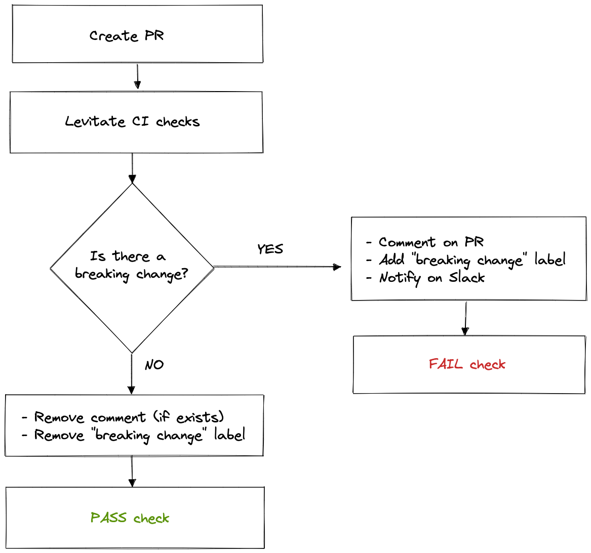
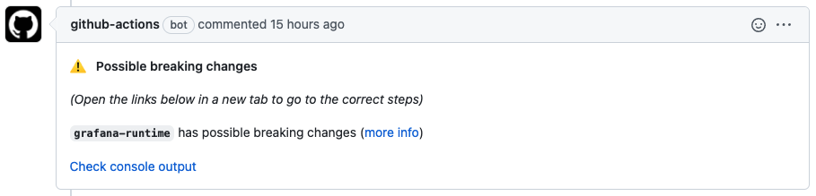
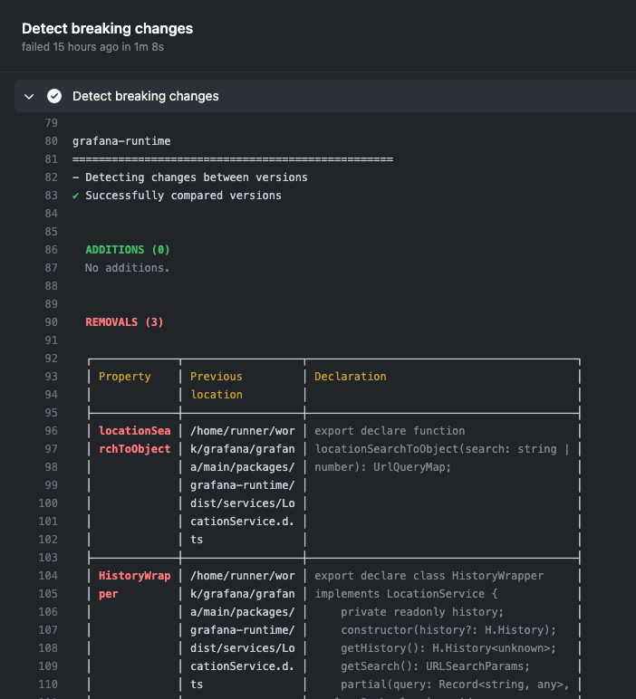
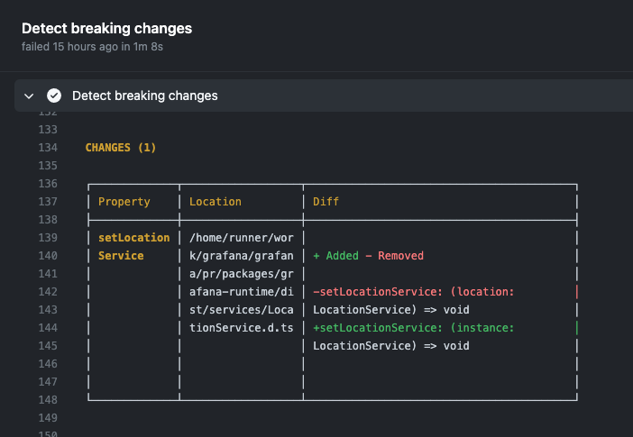
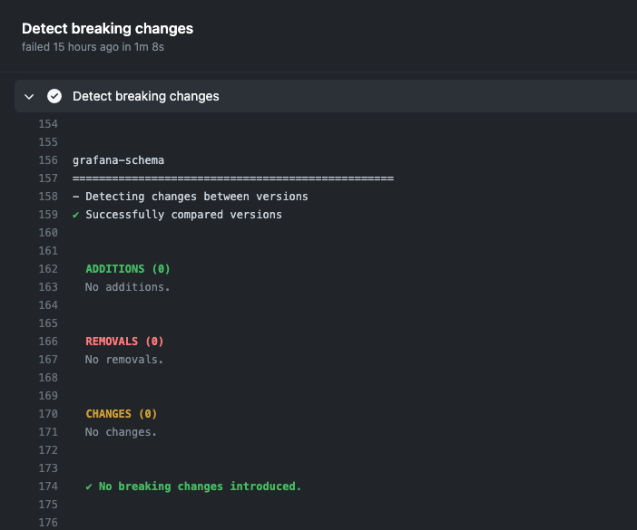

# Handling breaking changes in Grafana frontend APIs

This guide tries to help you identify and communicate breaking changes introduced to our frontend API.

- [What are our public APIs?](#what-are-our-public-apis)
- [What is Levitate?](#what-is-levitate)
- [How does the CI workflow look like?](#how-does-the-ci-workflow-look-like)
- [I received a comment on my PR, what does it mean?](#i-received-a-comment-on-my-pr-what-does-it-mean)
- [**I know it's a breaking change, what's next?**](#i-know-its-a-breaking-change-whats-next)
  - [Introduce breaking changes only in major versions](#introduce-breaking-changes-only-in-major-versions)
  - [Deprecate first](#deprecate-first)
  - [Communicate](#communicate)
- [I still have questions, who can help me out?](#i-still-have-questions-who-can-help-me-out)

---

## What are our public APIs?

The Grafana frontend codebase is exposing functionality through NPM packages to make plugin development easier and faster.
These packages live in the `/packages` folder and contain packages like:

- `@grafana/data`
- `@grafana/runtime`
- `@grafana/ui`
- etc. ([They can be viewed here](https://github.com/grafana/grafana/tree/main/packages)

Any change that causes dependent software to behave differently is considered to be breaking.

## What is Levitate?

[`@grafana/levitate`](https://github.com/grafana/levitate) is a tool created by Grafana that can show breaking changes between two versions of a **TypeScript** package or a source file.

It can list exported members of an NPM package or imports used by an NPM package,
**but we are mainly using it for comparing different versions of the same package to see changes in the exported members.**

A Github workflow runs against every pull request and comments a hint in case there are
possible breaking changes. It also adds the `"breaking change"` label to the pull request.

## How does the CI workflow look like?



## I received a comment on my PR, what does it mean?



Receiving a comment like the one above does not necessarily mean that you actually introduced breaking
changes (as certain edge cases are still not covered by the tool), but as there is a good chance we rather raise attention.

By clicking the links in the comment ("more info" or "Check console output") you can view more detailed information about what triggered the notification.

**Removed exported members** (console view):<br />
This means that some previously exported members won't be available in the newer version of the package which can break dependent plugins.



**Changed an existing member** (console view):<br />
This means that a member was changed in a way that can break dependent plugins.



**No breaking changes** (console view):<br />
Seeing this suggests that whilst changes were made, most probably none of them were breaking. You are good to go! 👏



## How can I decide if it is really a breaking change?

First go to the console output of the workflow and make sure that the diffs make sense.

It can happen that Levitate highlights a change which is marked with TSDoc tags `// @alpha` or `// @internal` in
which case you can choose to ignore it - keep in mind though that these flags won't really hold developers back
from using your code and most likely it is going to cause them problems if we are breaking them.

It can also happen that Levitate marks changing an interface as a possible breaking change.
For anyone that implements that interface introducing a new property will break their code. Whilst this is correctly marked as a breaking change maybe it is an interface that is never implemented by other developers. In which case you can choose to ignore Levitate's message.

These notifications are only warnings though, and **in the end it's up to the author of the PR to make a decision that makes the most sense.**

## I know it's a breaking change, what's next?

### Introduce breaking changes only in major versions

We can make breaking changes less painful if they are only happening between major releases of Grafana.

### Deprecate first

Whenever possible try to deprecate first what you are about to remove or change. For example:

```javascript
import { deprecationWarning } from '@grafana/data';

/**
 * @deprecated -- this is no longer necessary and will be removed in Grafana 9.0.0
 */
myOldFunction(name: string) {
    deprecationWarning('MyFile', 'myOldFunction', 'myNewFunction');
    // ...
}
```

1. Add a deprecation comment `// @deprecated`
2. Add info in the comment about **when it is going to be removed**
3. Add info in the comment about **what should be used instead**
4. In case it's a function or a method, use `deprecationWarning(<file name>, <old name>, <new name>)` to raise attention during runtime as well
5. Update the [migration guide](../docs/sources/developers/plugins/migration-guide.md) with your instructions

### Communicate

Reach out to **@grafana/plugins-platform-frontend** to help finding which plugins are using the code that is just about to change, so we try making it smoother by communicating it to them.

---

## I still have questions, who can help me out?

We are here to help.

Please either ping us in the pull request by using the **@grafana/plugins-platform-frontend** handle or reach out to us on the internal Slack in `#grafana-plugins-platform`.
