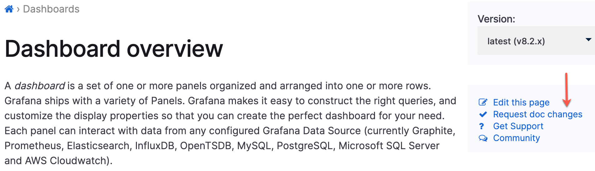
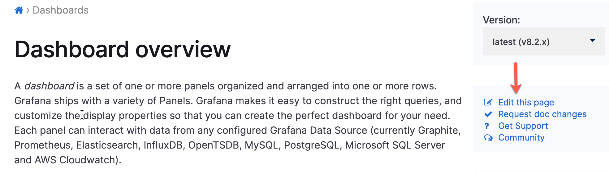

# Contribute to our documentation

We provide these guidelines to help our contributors make additions or corrections to our documentation.

## Welcome

Welcome. We're glad you're here to help make our technical documentation even better. We develop content that leads our users to success using Grafana products. Technical accuracy is our primary consideration, and we value the use of inclusive language. We regard your feedback as a gift - thanks for reading through these guidelines.

### Intended audience

We write these guidelines for contributors who are interested in improving our technical content.

## Understanding the structure of Grafana documentation

All Grafana Enterprise and OSS documentation is located in the [Grafana open source project](https://github.com/grafana/grafana) GitHub repository: https://github.com/grafana/grafana/tree/main/docs/sources.

- The **sources** directory organizes content by topic areas, for example **administration** and **alerting**.
- Topic directories include an `_index.md` file, which provides an overview of the topic, and optionally includes subtopics that provide more detail.

> The `_index.md` file is required.

### Writing in markdown

We write technical documentation using [Markdown](https://en.wikipedia.org/wiki/Markdown). We've put together a short guide to help you how to structure and format your content.

To access the markdown guide, refer to [Markdown style guide](documentation-markdown-guide.md).

## Ways to contribute

We're thrilled that you are considering contributing to the documentation. You can contribute content in the following ways:

- [Request a change](#request-a-change)
- [Edit a topic](#edit-a-topic)
- [Write a topic](#write-a-topic)

### Request a change

Request a change when you want to make a suggestion about a topic, but don't want to provide an edit that generates a pull request. Requesting a change gives you the freedom to express your ideas without committing language. Your suggestion can reflect a small change to wording or can reflect larger, more substantive changes.

GitHub captures your request as an **Issue** logged against the repository.

Before you begin:

- Create a GitHub account.

To request a change, complete the following steps:

1.  While viewing the topic, click **Request a change**.

The Issue title auto-populates with the location of the file about which you are requesting a change.

2. Enter a change request description.

3. Add the **type/docs** label.

4. Click **Submit new issue**.

### Edit a topic

If you want to recommend a small change, such as suggesting a correction to a topic, you can edit the topic directly in GitHub. You are not required to fork and clone the repo to use this approach.

Other small changes might include:

- Adding steps to a task
- Adding clarifying language to a concept
- Providing an example

Before you begin:

- Create a GitHub account.

To edit a topic, complete the following steps:

1. While viewing the topic you want to edit, click **Edit this page**.

2. Add your changes to the topic.

3. Scroll to the bottom of the page and enter a branch name.

   For example, enter `clarified dashboard panel definition`.

4. Click **Commit**.

   GitHub prompts you to create a PR.

5. Complete the prompts provided in the body of the PR.

6. Click **Create pull request**.

### Write a topic

At Grafana Labs, we use the principles of topic-based authoring when we write technical documentation. Topic-based authoring provides guidelines for writing three _types_ of technical documentation: concept, task, and reference. Before you begin writing, establish the topic type you want to write.

#### Understanding topic types

Technical content is divided into three topic types: concept, task, and reference.

- **Concept**: A concept topic explains _what_ a feature (or idea) is, and why it is important.
- **Task**: A task topic explains _how_ to complete an end user procedure in the system. Task topics contain steps.
- **Reference** A reference topic contains lookup information that a user might consult when they complete a task. Documenting a list of values with descriptions is a common form of reference topic.

**Example**

Suppose you are writing content for a site called _Doggie handbook_. You might organize your topics like this:

**Concepts**

- What a dog is
- Brief history of dogs
- Why you might want a dog
- Tasks dogs can be trained to do

**Tasks**

- Feed the dog
- Groom the dog
- Train the dog

**References**

- List of dog equipment you will need
- Table of breeds that includes breed name, size range, short or long hair, and type of dog

#### Prepare your environment

Before you begin writing, we recommend that you fork and clone the Grafana repository so that you can use a text editor locally to create branches, commit your changes, and create a PR.

While this document doesn't include git commands or descriptions of Github operations, you might find these links useful.

- [Install git](https://git-scm.com/book/en/v2/Getting-Started-Installing-Git): We store all source code, including documentation, in Git repositories.
- [Fork a repo](https://docs.github.com/en/get-started/quickstart/fork-a-repo): Locate the repo you want to clone, and fork it.
- [Clone a repo](https://docs.github.com/en/repositories/creating-and-managing-repositories/cloning-a-repository): Clone the repository to your local machine.
- [Create a branch](https://git-scm.com/book/en/v2/Git-Branching-Basic-Branching-and-Merging): Before you make change, create a branch. Do not push changes against the `main` branch.
- [Create a PR](https://docs.github.com/en/pull-requests/collaborating-with-pull-requests/proposing-changes-to-your-work-with-pull-requests/creating-a-pull-request): After you add, commit, and push your changes, create a PR in Github.

#### Use a documentation template to contribute a topic

We have provided documentation templates that align with each topic type:

- [Concept](templates/doc-concept-template.md)
- [Task](templates/doc-task-template.md)
- [Reference](templates/doc-reference-template.md)

Each template provides additional usage and formatting guidelines. We recommend that you make a copy of whichever template you are using, then add content.

> Remove any unused content before you commit your changes.

#### View a local build

Prior to pushing your changes, you can view a local build of the documentation so that you can review your work.

To view a local build:

1. Install [Docker](https://www.docker.com/products/docker-desktop).

1. Run Docker.

1. Navigate to the **docs** root directory.

1. Run `make build`.

1. Open `localhost:3002` to review your changes.

## Push changes and create a PR

When you are ready for other people to review your work, perform the following tasks.

1. [Add](https://git-scm.com/docs/git-add) your changes, which prepares your content for the next commit.

1. [Commit](https://git-scm.com/docs/git-commit) your changes.

1. [Push](https://git-scm.com/docs/git-push) your changes to Github.

1. [Create a PR](https://docs.github.com/en/pull-requests/collaborating-with-pull-requests/proposing-changes-to-your-work-with-pull-requests/creating-a-pull-request) in Github.

The docs build system automatically conducts a series of tests to ensure that the content doesn't conflict with other content in the docs repository.

### Understanding the PR review and approval workflow

When a PR is added to the repo with a label associated with `docs`, it will be reviewed by a member of the technical writing team. Depending on the size of the PR and the priority of other work, the PR will either be immediately reviewed and merged (minor fixes typically follow this pattern) or the PR will be triaged and placed in the backlog of work or moved into further development.

## Join our community

For general discussions on documentation, you’re welcome to join the `#docs` channel on our [public Grafana Slack](http://slack.raintank.io) team.

## Reference: Top five writing tips

While we don't provide a comprehensive style guide in this document, here's a few writing tips to help the writing process.

### Consider the audience

Write for an audience that is computer literate and has general technical knowledge, but is not necessarily familiar with Grafana or the finer points of observability.

Pretend you are explaining your topic to a brand new Grafana user or developer.

### Write clear and concise sentences and paragraphs

Use the following sentence structure when you write: _subject_—_verb_—_object_. If you are telling a user to do something, write an imperative sentence. For example “Enter the refresh rate time interval and click Save.”

- You can also start a sentence with an _if_ clause, which positions the condition before the action.
- Limit the number of words in a sentence to 20..

### Use active voice

Active voice makes the performer of the action the subject
of the sentence. When you write in passive voice, the recipient of the action (and not the performer) becomes the subject of the sentence.

Active-voice sentences are more direct and clearly identify _who_ is doing _what_. Not all tasks are completed by a user; sometimes the system can also be a performer (and by extension, the subject of the sentence). When you write in active voice you clearly make that distinction, which results in more engaging and less wordy content.

| Use (active)                                          | Avoid (passive)                                                      |
| ----------------------------------------------------- | -------------------------------------------------------------------- |
| After you upgrade the software, restart the computer. | After the software has been upgraded, the computer can be restarted. |
| Click **OK** to save the dashboard.                   | The dashboard is saved when the **OK** button is clicked.            |
| Create a dashboard.                                   | A dashboard is created by you.                                       |

### Avoid obscure non-English words and abbreviations

Users might be unfamiliar with some non-English words and abbreviations such as _per_, _vs_, and _via_. Latin abbreviations in particular, like _i.e._, _e.g._, and _etc._, are vague.

| Use          | Don’t use   |
| ------------ | ----------- |
| through      | via         |
| that is      | i.e.        |
| according to | per, as per |
| and so on    | etc.        |

### Write self-contained topics

Thanks to search engines, every page in the documentation might be a reader's entry point. This means that each page needs to be self-contained and make sense on its own. The reader should not need to read other topics in order to perform the task or understand the concept.

However, try to be helpful and link to related information. Using the _Doggie handbook_ example, the concept topic that explains what dogs can be trained to do might link to the Train the dog task.
