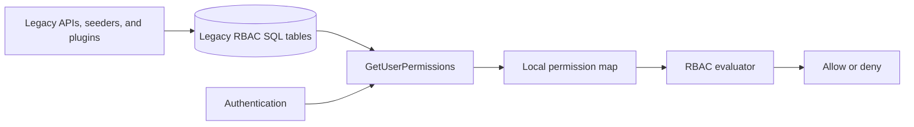
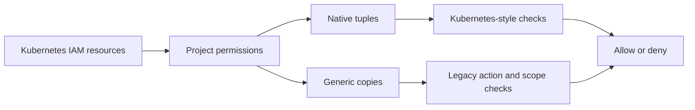
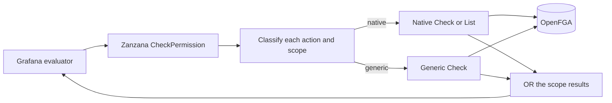
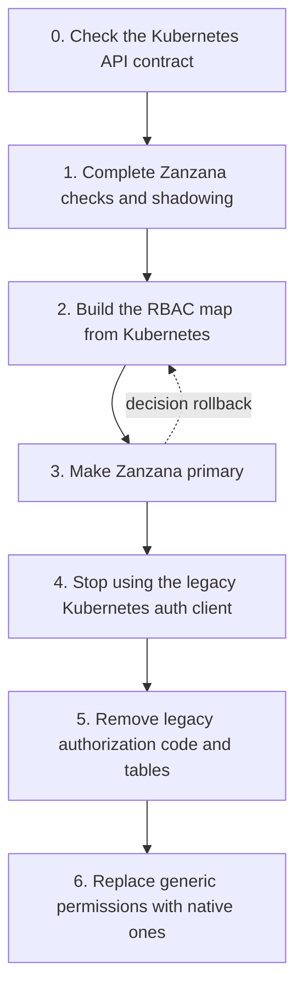

# Migrating Grafana authorization from legacy RBAC to Zanzana

## Background

Grafana currently uses two authorization systems:

- **Legacy RBAC** stores roles, permissions, and role assignments in SQL. A permission has an action and an optional scope. Grafana loads a user's permissions into memory and checks requests against that map.
- **Zanzana** is Grafana's authorization service built on OpenFGA. It reads authorization data from Kubernetes APIs, turns that data into relationship tuples, and answers authorization checks.

The long-term goal is:

1. Kubernetes APIs are the place where Grafana writes and reads permission rules.
2. Zanzana makes authorization decisions.
3. OpenFGA stores the data used for those decisions.
4. Grafana removes the old SQL authorization tables and the code that maintains them.

We cannot make this change all at once. Many Grafana endpoints still ask for legacy actions and scopes. Some of those permissions already have a direct Kubernetes and OpenFGA form. Others need a generic form until we add a direct mapping.

Some permissions already exist only in Kubernetes and Zanzana. Today, Grafana copies the supported native permissions back into the legacy in-memory map so RBAC can still allow them. This is useful during the migration, but it does not cover every permission.

The migration has three separate parts:

1. **Storage:** where roles, assignments, teams, and resource permissions are saved.
2. **Decisions:** whether RBAC or Zanzana controls the allow or deny result.
3. **Compatibility reads:** how Grafana builds the old action-to-scopes map for the UI, inspection APIs, and the RBAC shadow check.

These parts should move separately. This lets us change storage before decision authority, and decision authority before every old caller has been rewritten.

**Main code areas:**

- [Legacy RBAC permission queries](pkg/services/accesscontrol/database/database.go)
- [Authentication permission loading](pkg/services/authn/authnimpl/sync/rbac_sync.go)
- [Legacy action and scope evaluator](pkg/services/accesscontrol/evaluator.go)
- [Kubernetes IAM APIs](apps/iam/pkg/apis/iam/v0alpha1)
- [Kubernetes-to-Zanzana reconciler](pkg/services/authz/zanzana/server/reconciler)
- [OpenFGA schema](pkg/services/authz/zanzana/schema)
- [Native and generic translation](pkg/services/authz/zanzana/fallback.go)
- [Primary and shadow selection](pkg/services/accesscontrol/acimpl/accesscontrol.go)
- [Current Zanzana-to-RBAC merge](pkg/services/accesscontrol/acimpl/zanzana_resolver.go)

### Terms used in this document

| Term                 | Plain meaning                                                                                           |
| -------------------- | ------------------------------------------------------------------------------------------------------- |
| Legacy permission    | An action and optional scope, such as `teams:create` or `dashboards:read` on `dashboards:uid:abc`.      |
| Native permission    | A legacy permission that has a direct Kubernetes and OpenFGA mapping.                                   |
| Generic permission   | A legacy action and scope stored as an encoded OpenFGA object because it has no direct mapping yet.     |
| Legacy evaluator     | The `accesscontrol.Evaluator` API used by Grafana callers. We can keep this API after SQL RBAC is gone. |
| RBAC engine          | The code that checks a request against `map[action][]scope`.                                            |
| Zanzana engine       | The code that checks Zanzana and OpenFGA directly.                                                      |
| Local permission map | The action-to-scopes map attached to the signed-in identity.                                            |
| Primary engine       | The engine whose result controls the request.                                                           |
| Shadow engine        | The engine that runs only for comparison. Its result does not affect the request.                       |
| Projection           | Turning Kubernetes authorization data into OpenFGA tuples.                                              |

### How legacy RBAC works today

Legacy RBAC stores authorization data in these SQL tables:

- `role` stores fixed, basic, managed, plugin, and custom roles.
- `permission` stores each role's actions and scopes.
- `user_role` assigns roles to users and service accounts.
- `team_role` assigns roles to teams.
- `team_member` stores team membership.
- `builtin_role` connects basic roles such as Admin, Editor, Viewer, and None to RBAC roles.
- `org_user` stores organization membership and the basic organization role.

For a normal request:

1. Authentication calls `GetUserPermissions`.
2. That query joins the user's direct roles, team roles, and basic role.
3. `SyncPermissionsHook` groups the result by action.
4. Grafana stores the result in `Identity.Permissions[orgID]`.
5. `AccessControl.Evaluate` checks the request against that map.



The migration must preserve these rules:

- Direct user roles, team roles, basic roles, service accounts, and anonymous access all affect decisions.
- If a request has several allowed scopes, one matching scope is enough.
- Wildcards can cover all resources, one resource kind, or child paths.
- A request with no scope asks whether the subject has any permission for that action.
- `EvalAny` means OR. `EvalAll` means AND.
- Scope resolvers can turn numeric IDs into UIDs or add parent scopes, then retry.
- A delegated token can reduce a user's permissions. Combining permissions must never make that token less restrictive.

### How Zanzana and the Kubernetes APIs work

The Kubernetes IAM APIs contain the authorization rules:

- `Role` and `GlobalRole` contain permissions.
- `RoleBinding` assigns a role to a user, service account, or team.
- `ResourcePermission` grants access to a specific resource.
- `Team` contains members and team admins.
- `User` and `ServiceAccount` contain basic-role information.
- `Folder` contains the hierarchy used for inherited access.
- Settings contain the anonymous user's basic role.

The MT reconciler reads these resources for each namespace. It builds the full set of expected OpenFGA tuples, compares that set with Zanzana, and adds or removes tuples. Mutation hooks can update tuples sooner. Periodic reconciliation fixes missed updates and removes old tuples.

Native tuples look like this:

```text
user:alice       assignee  role:basic_editor
team:ops#member  assignee  role:custom_team_creator
role:creator#assignee create group_resource:iam.grafana.app/teams
role:viewer#assignee  get    resource:dashboard.grafana.app/dashboards/abc
user:alice       member    team:ops
folder:child     parent    folder:parent
```

When there is no direct native mapping, Zanzana stores an encoded generic object:

```text
role:plugin_reader#assignee granted rbac_action:v1.<encoded-action>
role:plugin_reader#assignee granted rbac_permission:v1.<encoded-action>.<encoded-scope>
```

The action object supports checks with no scope. The permission object supports exact scopes and wildcards.

### What this branch does today

This branch has three migration features:

1. **Native permission merge.** With `zanzanaMergeUserPermissions`, Grafana lists supported native grants from Zanzana and adds them to the SQL-based local map. Generic permissions are not added.
2. **One Zanzana check for legacy permissions.** `CheckPermission` accepts one legacy action and zero or more scopes. It checks native and generic forms and allows if any requested scope is allowed.
3. **Primary and shadow routing.** With `zanzanaRBACFallbackChecks`, Grafana runs the full evaluator through the primary engine and runs the other engine in the background. `primary_engine` chooses `rbac` or `zanzana`.

The branch fixes the main team-permission bug. When Zanzana is primary, Grafana sends every permission leaf to Zanzana. It does not deny a native permission only because that permission is missing from the local map.

For example, `teams:create` maps to `create` on the teams group resource. A user can receive that permission through a team binding in Zanzana even when `SignedInUser.Permissions` does not contain `teams:create`.

One important gap remains. The UI, permission-inspection APIs, and an RBAC primary or shadow still need a complete local permission map. The current native merge is not complete because it cannot list generic grants. Therefore, this branch does not yet allow us to remove the legacy authorization tables.

In a legacy-primary or dual-write IAM storage mode, Kubernetes API writes may also be present in the legacy authorization tables. That can make the local map look complete during a normal rollback test. It does not prove that compatibility reads work after SQL is removed; unified-only mode must be tested with grants created after the mirror is disabled.

## Problem

Grafana cannot remove the legacy RBAC tables while requests or compatibility APIs still depend on a map built from those tables.

Moving only writes to Kubernetes causes false denials when RBAC cannot see a Kubernetes-only grant. Falling back to RBAC when Zanzana fails is also unsafe. RBAC may have stale data and could allow a permission that was already revoked in Zanzana.

The migration must provide:

- **Complete storage:** every legacy action and scope can be stored in Zanzana without changing its meaning.
- **Complete decisions:** Zanzana can answer every legacy permission check.
- **All identity types:** users, service accounts, basic roles, custom roles, global roles, teams, external groups, anonymous users, and delegated identities keep their current behavior.
- **Complete compatibility reads:** the UI and inspection APIs can still obtain the old action-to-scopes view without SQL authorization tables.
- **Safe updates:** grants and revocations reach the decision store within a measured time.
- **Safe rollout:** we can compare RBAC and Zanzana before changing authority, and switch back quickly without changing stored rules.
- **Mixed permissions:** one action may have a native scope and a generic scope. The check must consider both and allow if either matches.
- **Token safety:** delegated token limits must still apply on top of Zanzana permissions.
- **Deployment support:** embedded and standalone Zanzana, OSS and Enterprise, and global and namespaced permissions must have clear behavior.

## Goals

1. Use Kubernetes IAM APIs as the source of permission rules.
2. Store every permission in Zanzana: native when possible, generic when needed.
3. Make Zanzana control every legacy action and scope decision.
4. Keep legacy wildcard, Boolean, resolver, inheritance, and token behavior.
5. Build the compatibility permission map from Kubernetes APIs instead of legacy SQL.
6. Support full RBAC-primary and Zanzana-primary comparison modes.
7. Define clear promotion and rollback checks.
8. Remove the old authorization-table reads and writes after the rollout is safe.
9. Replace generic permissions with native mappings over time.

### Non-goals

- Rewrite every Grafana endpoint in one change.
- Change the public meaning of current actions or scopes.
- Fall back to another engine when the primary engine returns an error.
- Treat the frontend permission map as a security boundary.
- Define a native model for every permission in this document.
- Remove user, team, organization, or service-account data that is not authorization-only data.
- Pick the final numeric rollout thresholds. Owners must approve those before production rollout.

## Proposals

### Proposal 0: Keep the current design

Keep SQL RBAC as the authority for legacy checks. Use Zanzana only for Kubernetes-style checks and partial shadowing.

This avoids short-term change, but it prevents removal of the SQL authorization tables. Every permission moved to Kubernetes must also be copied back into the local RBAC map. Missing one translation causes a false denial.

#### Benefits

- Lowest short-term migration risk.
- Current RBAC behavior and SQL debugging tools remain available.

#### Costs

- SQL stays an authorization datastore and availability dependency.
- Every new native permission needs a reverse translation.
- Shadow comparisons remain incomplete.
- SQL, Kubernetes resources, the local map, and OpenFGA can drift apart.
- We cannot finish the storage migration.

### Proposal 1: Store a generic copy of every permission

For every permission, write both:

- its native tuples when a native mapping exists; and
- generic action and scope objects for legacy checks.

All legacy checks would use the generic copy. Kubernetes-style checks would use native tuples.

**Architecture diagram:**



#### How checks work

- A legacy check never needs to translate to a Kubernetes request.
- Generic objects keep exact legacy scopes and wildcard behavior.
- A no-scope check uses the generic action object.
- A scoped check uses the exact object and its valid wildcard candidates.

#### Extra work required

`Role` permissions are not the only source of native tuples. `ResourcePermission`, basic roles, folder inheritance, and future native sources also create grants. The system would need to create generic copies for all of them.

Every update and delete would have to keep the native and generic copies in sync. Reconciliation would need to find and repair differences.

#### Benefits

- Legacy checks are simple and exact.
- Permission enumeration is straightforward.
- It could work as a short-term bridge.

#### Costs

- Most tuples are duplicated.
- Writes, reconciliation, storage, and caches cost more.
- Native and generic copies can disagree.
- Legacy checks do not test the native model used by Kubernetes callers.
- Native translation bugs can stay hidden.
- Removing the generic copy later requires another careful migration.

This proposal may help as a temporary bridge, but it is not the recommended final design.

### Proposal 2: One Zanzana check over native and generic permissions

Store each permission in its best form:

- use native tuples when the mapping is exact;
- use a generic object when there is no exact mapping.

One Zanzana endpoint answers all legacy action and scope checks. The caller does not inspect the local map and does not choose native or generic handling.

This is the recommended proposal.

**Architecture diagram:**



#### Storage model

Kubernetes IAM resources hold the permission rules. The reconciler creates these tuples:

| Kubernetes source                          | Zanzana result                                                       |
| ------------------------------------------ | -------------------------------------------------------------------- |
| Mapped `Role` or `GlobalRole` permission   | Native tuple.                                                        |
| Unmapped `Role` or `GlobalRole` permission | Generic action object and, when scoped, a generic permission object. |
| `RoleBinding`                              | Subject-to-role assignment. Team bindings use `team:<uid>#member`.   |
| `ResourcePermission`                       | Direct native relation on a resource.                                |
| `Team`                                     | Member and admin relations.                                          |
| `User` or `ServiceAccount`                 | Basic-role assignment.                                               |
| `Folder`                                   | Parent relation for inherited access.                                |
| Anonymous settings                         | Anonymous subject-to-basic-role assignment.                          |

Each valid role permission must produce one form: native or generic. It must not produce zero forms or both forms.

The choice is made for each action and scope pair, not only for the action. This means one action can use both forms. For example:

- `roles:read` on `roles:*` can be native.
- `roles:read` on `roles:uid:specific` can be generic.

When a request has both scopes, Zanzana checks both forms and allows if either scope is allowed. This is what “mixed native and generic scopes” means.

Bad permission data must stop reconciliation. It must not be silently skipped or changed into a broader grant.

Datasource actions and scopes need one extra step. `RoleToTuples` first converts their Kubernetes form into the normal legacy form. For example, `*.datasource.grafana.app/datasources:get` becomes `datasources:read`. Classification happens after that conversion.

#### Check API

The branch uses the existing extension RPC:

```protobuf
message CheckPermissionRequest {
  string namespace = 1;
  string subject = 2;
  repeated string teams = 3;
  string action = 4;
  repeated string scopes = 5;
}

message CheckPermissionResponse {
  bool allowed = 1;
}
```

The request contains the subject, namespace, effective teams, one action, and zero or more scopes.

Delegated token permissions are request limits, not stored grants. Grafana requires both the token and Zanzana to allow each permission leaf. A non-persistent token identity, such as an access-policy service identity, uses only its signed permission map.

The server supports users, service accounts, and anonymous subjects. It validates the action and scopes, ensures that the namespace exists, and returns only `allowed`. Detailed errors stay in server logs. If Zanzana is primary and returns an error, Grafana denies the request. It does not use the RBAC shadow result.

#### How a permission leaf is checked

| Request type                                          | Zanzana behavior                                                               |
| ----------------------------------------------------- | ------------------------------------------------------------------------------ |
| Native action with no scope, such as `teams:create`   | Check the native group-resource relation.                                      |
| No-scope check for an action that normally has scopes | Ask whether any native object exists and also check the generic action marker. |
| Native exact scope                                    | Run the normal Kubernetes-style resource check.                                |
| Native wildcard                                       | Check the mapped group-resource or wildcard relation.                          |
| Generic exact scope                                   | Check the encoded action and scope object.                                     |
| Generic wildcard                                      | Check the exact request and every valid wildcard candidate.                    |
| Several scopes                                        | Allow if any native or generic scope is allowed.                               |
| Invalid action or scope                               | Reject it. Never turn invalid input into an allow.                             |

`EvalAny` and `EvalAll` stay in Grafana. Each leaf calls Zanzana. Scope candidates for one leaf are deduplicated and batch checked. Batching several evaluator leaves is not part of this branch.

The wildcard candidate builder keeps every form accepted by `ValidateScope`. A trailing `*` is valid only after `:` or `/`. A partial-prefix form such as `plugins:id:foo*` is invalid and projection rejects it.

#### Scope resolvers

The existing evaluator can retry after changing a scope. The Zanzana path keeps that behavior.

Examples:

- turn `teams:id:12` into `teams:uid:<uid>`;
- turn a numeric user ID into a user UID;
- add a parent folder scope; or
- leave a wildcard unchanged without looking up a resource.

The write path and request path must use the same translation metadata. Two mapping tables would drift over time.

#### Team permissions

A team role binding uses the `team:<uid>#member` userset. The request sends the user's effective team UIDs as context. OpenFGA follows this chain:

```text
user:alice member team:ops
team:ops#member assignee role:team-creators
role:team-creators#assignee create group_resource:iam.grafana.app/teams
```

For `teams:create`, Zanzana checks whether Alice can create the teams group resource. It does not require `SignedInUser.Permissions` to contain `teams:create`.

An ordinary user or service-account access token only proves the identity. It is not automatically a downscope. Zanzana must still check the persistent identity. Only a genuinely delegated token uses its permission map as an extra limit.

If external groups are configured as the source of team context, use those groups. Do not also add stored teams unless the product rules explicitly require that union.

#### Example: `POST /api/teams/`

The endpoint asks for `teams:create`. Alice is in `team:ops`, and that team has a role that grants `teams:create`.

The stored relationship is:

```text
user:alice member team:ops
team:ops#member assignee role:team-creators
role:team-creators#assignee create group_resource:iam.grafana.app/teams
```

The result by migration stage is:

1. **RBAC from SQL:** SQL loads `teams:create` into Alice's local map. RBAC allows.
2. **Kubernetes storage with RBAC primary:** the role may exist only in Kubernetes. RBAC needs the native merge. Without it, RBAC denies even though Zanzana has the grant.
3. **RBAC primary with Zanzana shadow:** RBAC returns its result. Zanzana checks the team relationship in the background and records whether the results match.
4. **Zanzana primary:** Zanzana controls the request. The local map is not used to authorize a persistent user. RBAC uses the map only for shadow comparison.
5. **After SQL removal:** the endpoint may still call `EvalPermission("teams:create")`, but that evaluator leaf calls Zanzana. No SQL permission row is needed.

Fixing only the native merge is not enough. The merge helps RBAC and compatibility consumers. The final decision path must check the stored relationship directly.

#### Compatibility permission map

Direct authorization and permission listing are different jobs.

The UI, navigation, permission-inspection APIs, and RBAC shadow still need an action-to-scopes map. When Zanzana is primary, this map is not allowed to control backend authorization.

The final compatibility resolver is **not implemented in this branch**. The current `ZanzanaPermissionResolver` lists only supported native grants and merges them with SQL permissions. It does not list generic grants.

The future resolver should read Kubernetes IAM resources, not OpenFGA. It must:

1. Find role bindings for the user, effective teams, and basic role.
2. Read the referenced roles and global roles.
3. Return the action and scope pairs stored in those roles.
4. Include direct resource permissions for the user, teams, and basic role.
5. Convert UIDs to numeric-ID scopes only where an old caller still needs that form.
6. Remove duplicates.
7. Apply delegated token limits before returning the map.

Start without a new cache. Measure the real cost first.

The map changes like this:

```text
Before Phase 2: SQL permissions + current native Zanzana merge
After Phase 2:  Kubernetes-derived compatibility permissions only
```

We do not add a paginated Zanzana `ListPermissions` RPC. Kubernetes contains the original permission rules and is the right source for listing them. Zanzana remains focused on allow and deny decisions.

#### Primary and shadow engines

Today the two engines use different inputs:

```text
RBAC: evaluator over the local permission map
Zanzana: evaluator whose leaves call CheckPermission
```

| Configuration                       | Returned result | Background result |
| ----------------------------------- | --------------- | ----------------- |
| `zanzanaRBACFallbackChecks=false`   | RBAC            | None              |
| Checks on, `primary_engine=rbac`    | RBAC            | Zanzana           |
| Checks on, `primary_engine=zanzana` | Zanzana         | RBAC              |

The shadow runs in the background with a five-second timeout. It compares the complete evaluator result. It does not change the request.

Until the Kubernetes compatibility resolver exists, some mismatches are expected. A Kubernetes-only generic grant can let Zanzana allow while RBAC denies because the local map cannot list that grant.

If the primary engine returns an error, Grafana follows that engine's failure rule. It does not use the shadow result as a per-request fallback. Zanzana primary fails closed.

#### Reconciliation and consistency

The first version uses the existing mutation hooks and MT reconciler. Kubernetes IAM APIs contain the rules. Zanzana is the derived decision store.

This design accepts the current short delay between a Kubernetes change and the matching Zanzana tuple update. We will measure grant and revocation delay during rollout. We are not adding revisions, freshness watermarks, or another projection system before measurements show they are needed.

#### Failures

| Failure                  | RBAC primary                                         | Zanzana primary                                                                |
| ------------------------ | ---------------------------------------------------- | ------------------------------------------------------------------------------ |
| Zanzana timeout or error | Return RBAC; record the shadow error.                | Deny; never use the RBAC shadow result.                                        |
| Legacy SQL error         | Follow current RBAC failure behavior.                | Primary decision still works; RBAC shadow may fail.                            |
| Compatibility map error  | Fail setup instead of silently dropping permissions. | Direct checks work; compatibility reads return an error or clear stale result. |
| Reconciliation delay     | Keep using the chosen primary and report health.     | Existing delay applies; operators can change authority back to RBAC.           |
| Invalid permission       | Stop reconciliation and report the bad object.       | Never silently omit the grant.                                                 |
| Shadow timeout           | No user-facing effect; record a metric.              | No user-facing effect; record a metric.                                        |
| Missing team context     | Deny team-derived access and report it.              | Deny team-derived access and report it.                                        |

#### Security

- Zanzana-primary errors fail closed.
- Every request and tuple operation uses the correct organization or stack namespace.
- Delegated token limits are combined with, not replaced by, the subject's Zanzana result.
- Use one configured source for effective groups. Do not accidentally union stored and external groups.
- Measure revocation delay. A stale allow is more dangerous than a stale deny.
- Reject bad wildcards, control characters, encoded values, and subject formats.
- Do not put subjects, raw actions, or raw scopes in metric labels.
- Define a clear global namespace strategy for Grafana Admin and `NoOrgID` permissions before removing SQL.

#### Performance

- Deduplicate scopes and wildcard candidates before OpenFGA checks.
- Reuse namespace store and model metadata.
- Give shadow work its own timeout.
- Do not list all effective permissions on the hot decision path.
- Measure native, generic, mixed, and no-scope checks with bounded labels.
- Batch evaluator leaves later if measurements show it is needed.

Only permissions without a native mapping add generic tuples. Generic tuple and check counts show how much migration work remains.

#### Benefits

- Zanzana can control every decision without copying every native grant.
- Kubernetes and legacy callers test the same native tuples.
- Direct resource permissions are included.
- Full shadow checks expose translation mistakes.
- Old action and scope callers keep working during the migration.
- Generic objects can be removed one permission family at a time.

#### Costs

- The action-and-scope translator must be correct and shared by writes and checks.
- No-scope checks for a normally scoped action may need a list or existence query.
- Mixed native and generic scopes add some check and debug complexity.
- The UI and inspection APIs still need the future Kubernetes compatibility resolver.
- The first version keeps the current reconciliation delay.

## Migration prerequisite

This plan assumes the Kubernetes IAM APIs can already return all authorization data that Zanzana needs. The internal storage mode does not matter to this plan.

The APIs must provide roles, global roles, role bindings, resource permissions, teams, users, service accounts, folders, and anonymous settings. Zanzana and Grafana consumers use that API contract instead of depending on the backing database.

There is no Kubernetes API rollout phase in this design. The remaining work is Zanzana projection, full checks, Kubernetes-based compatibility reads, authority changes, and old-code removal.

## Existing rollout controls

This branch uses existing controls and adds no new feature flag.

| Control                           | What it does                                                                                                                                                       |
| --------------------------------- | ------------------------------------------------------------------------------------------------------------------------------------------------------------------ |
| `zanzana`                         | Starts Zanzana and tuple sync. It does not change `AccessControl.Evaluate` by itself.                                                                              |
| `[zanzana.reconciler] mode = mt`  | Builds tuples from Kubernetes IAM APIs.                                                                                                                            |
| `zanzanaMergeUserPermissions`     | Adds supported native Zanzana grants to the SQL-based local map. It does not add generic grants.                                                                   |
| `zanzanaRBACFallbackChecks`       | Enables `CheckPermission` and primary/shadow routing. When off, legacy evaluation is RBAC-only even if `primary_engine=zanzana`.                                   |
| `[zanzana.client] primary_engine` | Chooses `rbac` or `zanzana` as the returned decision when checks are enabled.                                                                                      |
| `zanzanaNoLegacyClient`           | Makes Kubernetes-style authorization client providers use Zanzana. It does not choose the legacy evaluator's primary engine, replace the local map, or remove SQL. |

Decision routing and tuple sync are separate. Changing `primary_engine` or turning off fallback checks must not delete stored rules or stop reconciliation.

The future Kubernetes compatibility resolver needs its own rollout control. Do not reuse `zanzanaNoLegacyClient`; that flag already has a narrower meaning.

## What is implemented in this branch

| Area                                      | Status                                                                                                                                                |
| ----------------------------------------- | ----------------------------------------------------------------------------------------------------------------------------------------------------- |
| Native-or-generic role translation        | Implemented. Datasource actions and scopes are normalized first.                                                                                      |
| Kubernetes resource projection            | Implemented for folders, roles, global-role composition, role bindings, resource permissions, teams, users, service accounts, and anonymous settings. |
| Legacy action and scope checks in Zanzana | Implemented for native, generic, mixed, wildcard, no-scope, and team checks.                                                                          |
| Grafana evaluator integration             | Implemented for permission leaves, `EvalAny`, `EvalAll`, resolver retries, primary/shadow routing, and token limits.                                  |
| Metrics and sampled mismatch logs         | Implemented.                                                                                                                                          |
| Current native merge into RBAC            | Kept for migration. Generic permissions are still missing from that map.                                                                              |
| Kubernetes compatibility resolver         | Not implemented.                                                                                                                                      |
| Removal of legacy authorization tables    | Not implemented.                                                                                                                                      |
| Enterprise-only code changes              | None needed. The shared code works with the Enterprise overlay and license.                                                                           |

## Migration plan



### Phase 0: Check the Kubernetes API contract

**Data source:** Kubernetes IAM APIs.

**Decision authority:** RBAC.

Confirm that Zanzana can read every required identity, role, binding, permission, team relation, folder relation, and anonymous setting through the Kubernetes APIs.

The RBAC map still comes from SQL plus the current native merge. That merge is temporary.

**Done when:** the MT reconciler can read all required objects for representative namespaces.

**Branch status:** assumed by the design and covered by the Enterprise manual run.

### Phase 1: Complete Zanzana checks and shadowing

**Data source:** Kubernetes IAM APIs.

**Decision authority:** RBAC.

**Config:** `zanzana=true`, MT reconciler, `zanzanaRBACFallbackChecks=true`, `primary_engine=rbac`.

Work:

1. Store every valid role permission as exactly one native or generic form.
2. Reconcile all supported Kubernetes authorization resources.
3. Send every legacy evaluator leaf to Zanzana in shadow. Do not skip native leaves.
4. Cover native, generic, mixed, wildcard, no-scope, team, service-account, anonymous, and resolver cases.
5. Apply delegated token limits per leaf. Use signed claims only for non-persistent token subjects.
6. Record complete-result matches, mismatches, errors, and latency.
7. Keep the current native merge so RBAC remains usable while it is primary.

```text
request -> SQL + native merge -> RBAC -> returned result
       \-> Kubernetes tuples -> Zanzana -> shadow result
```

**Rollback:** turn off `zanzanaRBACFallbackChecks`. Tuple sync stays on.

**Done when:** all permission and identity tests pass and the approved shadow metrics are healthy.

**Branch status:** implemented. Production still needs a shadow soak.

### Phase 2: Build the RBAC compatibility map from Kubernetes

**Data source:** Kubernetes IAM APIs.

**Decision authority:** RBAC.

Build the future compatibility resolver. It reads role bindings, roles, global roles, basic roles, team bindings, and resource permissions from Kubernetes and returns `map[action][]scope`.

Use this map for authentication, UI capability checks, permission inspection, and the RBAC shadow. Do not add a Zanzana permission-list RPC.

During rollout, compare the Kubernetes map with the current SQL-plus-native-merge map. Once a cohort uses the Kubernetes resolver, do not query or union the SQL authorization map for that cohort. A failed Kubernetes read is an error, not an empty map.

```text
Kubernetes APIs -> compatibility map -> RBAC -> returned result
Kubernetes APIs -> Zanzana tuples -> Zanzana -> shadow result
```

**Rollback:** return the cohort to the SQL-plus-native-merge resolver while the SQL mirror still exists. This needs a future flag; do not use `zanzanaNoLegacyClient`.

**Done when:** RBAC and all compatibility consumers run for the required soak using only the Kubernetes-derived map.

**Branch status:** not implemented.

### Phase 3: Make Zanzana the decision authority

**Data source:** Kubernetes IAM APIs.

**Decision authority:** Zanzana.

**Config:** `zanzanaRBACFallbackChecks=true`, `primary_engine=zanzana`.

Zanzana controls every legacy evaluator leaf. Errors deny. RBAC runs only as a shadow using the Kubernetes-derived compatibility map.

```text
request -> Zanzana -> returned result
       \-> Kubernetes compatibility map -> RBAC -> shadow result
```

**Rollback:** set `primary_engine=rbac`. Stored Kubernetes rules and tuple sync do not change.

**Done when:** all cohorts finish the approved soak and no security check bypasses the unified Zanzana path.

**Branch status:** primary selection and Zanzana authority are implemented and manually tested. Production rollout should still follow Phase 2.

### Phase 4: Stop using the legacy Kubernetes authorization client

**Data source:** Kubernetes IAM APIs.

**Decision authority:** Zanzana for both legacy evaluator leaves and Kubernetes-style clients.

**Config:** `zanzana=true`, `zanzanaNoLegacyClient=true`.

This changes the client returned by `pkg/services/authz/rbac.go`. It does not remove SQL or the compatibility map.

**Rollback:** turn off `zanzanaNoLegacyClient`.

**Branch status:** implemented and manually tested. No Enterprise-only code was needed.

### Phase 5: Remove legacy authorization code and tables

Remove authorization reads and writes for `role`, `permission`, `user_role`, `team_role`, and `builtin_role`. Also remove the native merge, SQL permission caches, old seed and migration jobs, and the legacy Kubernetes-style RBAC client.

Keep `AccessControl.Evaluate` as an adapter whose leaves call Zanzana. Keep the Kubernetes-derived map only for UI and inspection callers that still need it.

Drop the physical SQL tables in a separate database migration after logical use has stopped and downgrade rules are clear.

**Branch status:** not implemented.

### Phase 6: Replace generic permissions with native ones

Move one permission family at a time. Compare native and generic results, switch to native after they match, then remove the old generic tuples.

Generic permissions may remain for plugin-defined actions if we choose that as a product contract.

**Branch status:** generic checks work now; removal is future work.

## Authorization matrix

| Phase | Primary decision | RBAC map source                   | Zanzana use                           | Legacy authorization tables  |
| ----- | ---------------- | --------------------------------- | ------------------------------------- | ---------------------------- |
| 0     | RBAC             | SQL + optional native merge       | Partial projection                    | Required                     |
| 1     | RBAC             | SQL + optional native merge       | Full shadow                           | Required for RBAC            |
| 2     | RBAC             | Kubernetes compatibility resolver | Full shadow                           | Not read by migrated cohorts |
| 3     | Zanzana          | Kubernetes map for shadow and UI  | Primary for legacy evaluator leaves   | Not needed for decisions     |
| 4     | Zanzana          | Kubernetes map for shadow and UI  | Also used by Kubernetes-style clients | Not needed for decisions     |
| 5     | Zanzana          | Compatibility callers only        | Only decision engine                  | Remove                       |
| 6     | Zanzana          | Compatibility callers only        | Native first                          | Removed                      |

## Testing

### Permission contract test

For each permission fixture:

1. Create the Kubernetes source object.
2. Reconcile it into Zanzana.
3. Check the expected native or generic tuple.
4. Bind it to each supported subject type.
5. Call the public check API and expect allow.
6. Remove the grant.
7. Wait for reconciliation and expect deny.

Do not create the expected decision by calling the same private translator used by the write path. That could hide a shared bug.

### Identity cases

- Direct user binding.
- Team binding with stored membership.
- Team binding with external groups.
- Basic organization role.
- Custom and global roles.
- Service account.
- Anonymous user.
- Delegated token that is narrower than the subject's stored grants.

### Permission cases

- Native no-scope action such as `teams:create`.
- Native exact and wildcard scopes.
- Folder inheritance.
- Direct resource permission.
- Generic no-scope action.
- Generic exact, kind wildcard, global wildcard, and child-path wildcard scopes, plus rejection of invalid partial-prefix wildcards.
- One action with both native and generic scopes.
- Numeric ID that needs UID resolution.
- `EvalAny`, `EvalAll`, and nested evaluators.
- Bad actions, scopes, subjects, and namespaces.

### Reconciliation cases

- First namespace sync.
- Restart with existing data.
- Mutation plus periodic reconciliation.
- Grant, update, and revoke delay.
- Old tuple cleanup.
- Partial batch failure.
- Leader changes and multiple replicas.
- Cache invalidation after identity or permission changes.

### Rollout cases

- RBAC primary returns RBAC and records the Zanzana result.
- Zanzana primary returns Zanzana and records the RBAC result.
- Shadow timeouts do not change the primary result.
- Zanzana-primary errors deny.
- Changing authority does not change stored permission rules.
- RBAC can use only the Kubernetes compatibility map after SQL reads are disabled.

## Validation completed on this branch

The branch was built and run as Grafana Enterprise with the standard Enterprise
overlay and a development license. No Enterprise-only source changes were needed.
The following focused Go test executions all passed:

- 617 tests in `accesscontrol/acimpl`, `authz/zanzana`, and `setting`;
- 816 tests in `authz/zanzana/server`, `authz/rbac`, and
  `accesscontrol/dualwrite`; and
- 427 Enterprise-tagged tests in `accesscontrol/acimpl` and
  `authz/zanzana/server`.

The main manual fixture used the three rollout states from the test guide. Its IAM
storage mode kept the current SQL compatibility mirror available. The fixture had:

- a user with one legacy `teams:read` grant;
- a Kubernetes IAM team, role, and binding with native `teams:create`,
  `teams:write`, scoped `dashboards:read`, generic `plugins.app:access`, and mixed
  `roles:read`;
- a service account with the same Kubernetes IAM role;
- a no-role user; and
- a Viewer used as a stable control.

Observed API results:

| Request                               | RBAC only | RBAC + shadow | Zanzana primary |
| ------------------------------------- | --------: | ------------: | --------------: |
| Anonymous team search                 |       401 |           401 |             401 |
| Main user: team search and create     |       200 |           200 |             200 |
| Main user: dashboard read             |       200 |           200 |             200 |
| Main user: generic plugin access      |       200 |           200 |             200 |
| Main user: mixed role list and get    |       200 |           200 |             200 |
| No-role user: protected requests      |       403 |           403 |             403 |
| Viewer: dashboard read                |       200 |           200 |             200 |
| Kubernetes-style dashboard request    |       200 |           200 |             200 |
| Service account: dashboard and plugin |       200 |           200 |             200 |

The rendered UI showed the dashboard, team list, new-team control, and Assistant
app for the main user in all three states. The no-role user received Forbidden
responses and had no Assistant navigation. The Viewer kept dashboard access. This
checkout has no standalone Roles page, so role behavior was verified through the
API.

The first team-create pass exposed a supporting permission that the fixture was
missing. The handler creates a Team and then updates it to add the persistent user
as an administrator. `teams:create` authorizes the create and `teams:write` on all
teams authorizes the update. After adding both permissions, the final request in
each state returned 200, logged no follow-up authorization error, and stored the
creator as a Team admin.

Shadow and Zanzana-primary requests produced fallback comparison metrics. The
normal three-state fixture produced matches, and RBAC-only produced no fallback
checks. An isolated ordinary service-account token request increased both the
Zanzana allow counter and the match counter, confirming that an ordinary token is
not treated as a delegated permission ceiling. Valid namespaces repeatedly
reported `inSync=true` with no tuple changes or batch failures.

A separate diagnostic forced IAM Roles and RoleBindings to unified-only mode and
created fresh grants that could not have been mirrored into the legacy tables:

- Zanzana primary allowed a native service-account `teams:create` grant, while
  RBAC only had no such local-map entry and returned 403.
- For a generic plugin grant, RBAC-primary shadow returned 403 and recorded
  `zanzana_allow_rbac_deny`; Zanzana primary returned 200 for the same token and
  request.

This diagnostic confirms both sides of the migration boundary. Direct Zanzana
authorization works with Kubernetes-only IAM data. RBAC, UI capability checks, and
permission-inspection APIs still need the Phase 2 Kubernetes compatibility map
before the legacy authorization tables can be removed.

The manual run also verified that a partial-prefix scope such as
`plugins:id:foo*` is rejected by the current scope validator. Valid wildcards must
end after `:` or `/`. The focused fallback tests cover that rejection.

### Known follow-up issues

- An `org-0` Zanzana store makes the MT reconciler fail a ResourcePermission list
  with `invalid org id`. Valid namespaces still reconcile. Production must
  prevent, remap, or remove invalid global namespaces.
- `grafana_zanzana_reconcile_last_success_timestamp_seconds` stays at zero in MT
  mode even while namespace metrics show success. Use namespace metrics until the
  global gauge is fixed or removed.
- The SQL-independent Kubernetes compatibility resolver is not implemented. This
  is the main blocker for removing the authorization tables.

## Metrics and rollout gates

The branch adds these decision metrics:

- `grafana_accesscontrol_fallback_comparisons_total` for matches, both mismatch directions, errors, and shadow timeouts.
- `grafana_accesscontrol_fallback_engine_duration_seconds` for RBAC and Zanzana latency.
- `grafana_accesscontrol_fallback_checks_total` for Zanzana leaf allows, denies, and errors.

Existing reconciler metrics show namespace status, expected tuples, add and delete counts, fetch time, batch errors, leader state, queue depth, and error phase.

Every mismatch is counted. About one in sixteen evaluator hashes is logged. The log contains the action, a short evaluator hash, and both results. It does not contain the subject or raw scope.

Future metrics should cover:

- native, generic, mixed, and no-scope check volume;
- Kubernetes compatibility resolver latency and errors;
- generic tuple and decision counts;
- an MT-aware global success timestamp; and
- a clear invalid-namespace signal.

Metric labels must not contain a subject, raw action, or raw scope.

In the normal three-state run, expected comparisons were matches. The explicit unified-only diagnostic produced the expected `zanzana_allow_rbac_deny` result for a generic grant that the current local map cannot list. Valid namespaces repeatedly reconciled with `inSync=true` and no batch failures.

Before promotion, require:

1. Complete and fresh reconciliation for the cohort.
2. No unexplained decision mismatch during the agreed observation period.
3. Approved Zanzana availability and latency.
4. Grant and revoke probes within the agreed time.
5. Complete compatibility reads for UI and API callers.
6. Rollback tested under load.
7. Security review of identities, tokens, namespaces, and failure behavior.

## Other options considered

### Reload permissions before every RBAC check

This is too expensive and still cannot guarantee generic or contextual grants are present.

### Special-case missing native actions

Fixing only `teams:create` moves the bug. The next migrated action would fail in the same way.

### Use RBAC when Zanzana errors

This makes stale SQL data a hidden authority and can allow a revoked grant. Use shadow mode for comparison and an explicit rollout rollback instead.

### Rewrite every caller first

That would require changing too many endpoints before the storage migration can move. Keeping `AccessControl.Evaluate` as an adapter separates caller migration from decision migration.

## Open questions

1. Which namespace owns Grafana Admin and `NoOrgID` permissions? How do we avoid invalid names such as `org-0`?
2. Should delegated-token intersection stay in Grafana or later move into a standard authorization context?
3. What Kubernetes source provides all fixed and basic roles in OSS deployments?
4. Should generic permission support remain for plugin-defined actions after core permissions are native?
5. Which future flag selects the Kubernetes compatibility resolver?

## Recommendation

Use Proposal 2: store each permission as native or generic, and use one Zanzana check for every legacy action and scope decision.

Treat the local permission map as a temporary compatibility view. Build it from Kubernetes APIs before removing the SQL authorization tables.

## References and implementation notes

### References

- [Legacy access-control service](pkg/services/accesscontrol/acimpl/service.go)
- [Legacy access-control SQL store](pkg/services/accesscontrol/database/database.go)
- [Authentication permission loading](pkg/services/authn/authnimpl/sync/rbac_sync.go)
- [Evaluator behavior](pkg/services/accesscontrol/evaluator.go)
- [Primary and shadow integration](pkg/services/accesscontrol/acimpl/accesscontrol.go)
- [Decision metrics](pkg/services/accesscontrol/acimpl/fallback_metrics.go)
- [Kubernetes IAM API types](apps/iam/pkg/apis/iam/v0alpha1)
- [Zanzana documentation](pkg/services/authz/zanzana/README.md)
- [Translation table](pkg/services/authz/zanzana/common/translations.go)
- [Native and generic checks](pkg/services/authz/zanzana/fallback.go)
- [OpenFGA schemas](pkg/services/authz/zanzana/schema)
- [MT reconciler](pkg/services/authz/zanzana/server/reconciler)
- [Native check implementation](pkg/services/authz/zanzana/server/server_check.go)
- [Legacy permission check implementation](pkg/services/authz/zanzana/server/server_check_permission.go)
- [Role projection](pkg/services/authz/zanzana/tuple_helpers.go)
- [Current native merge](pkg/services/accesscontrol/acimpl/zanzana_resolver.go)

### Implementation notes

- Some internal names still use `fallback` for compatibility. User-facing text should call this primary and shadow checking.
- Keep decision routing separate from tuple sync.
- Use `TranslatePermission` on both write and request paths. Normalize datasource actions and scopes before classification.
- Keep `WithoutResolvers` behavior and resolver retries.
- Treat compatibility-map errors differently from direct decision errors.
- Never add subjects, raw actions, or raw scopes to metric labels.
- Remove physical SQL tables only after all logical use has stopped and downgrade rules are clear.
- Keep regression tests for team grants, mixed scopes, valid delimiter-bounded wildcards, rejected partial-prefix wildcards, token limits, and datasource normalization.
- The Enterprise build uses the shared OSS implementation; no Enterprise fork is needed.
