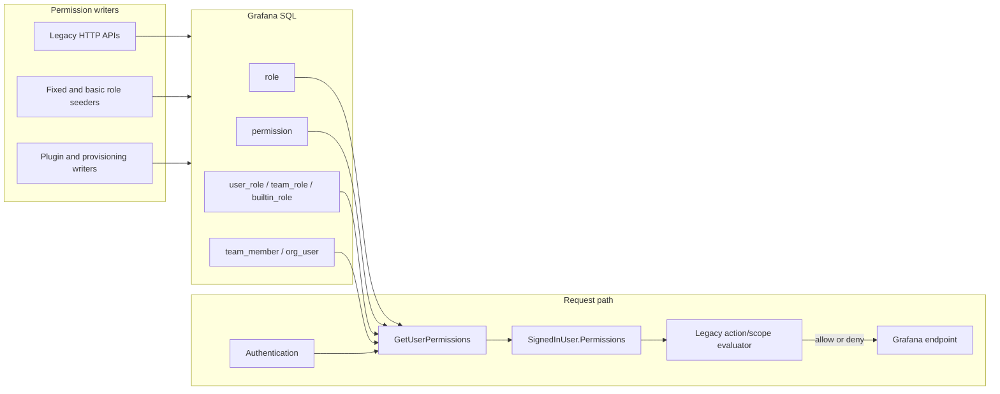
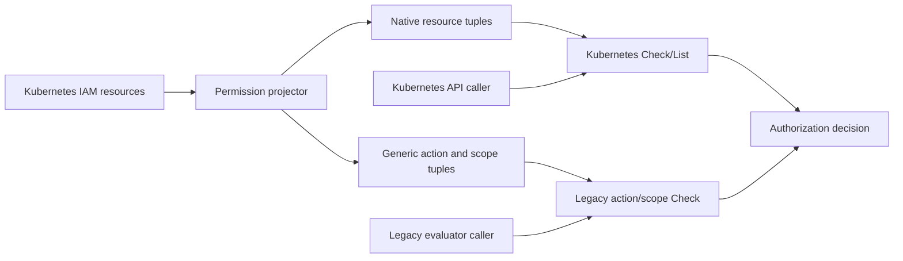
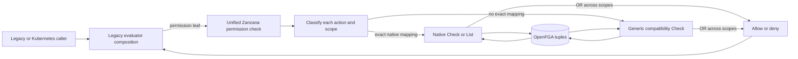
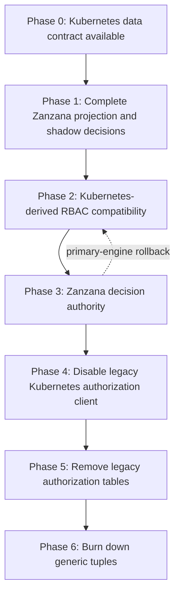

# Migrating Grafana authorization from legacy RBAC to Zanzana

## Background

Grafana currently has two authorization models in active use:

- **Legacy RBAC** represents a permission as an action and optional scope, stores roles, permissions, and assignments in SQL tables, materializes effective permissions onto the authenticated identity, and evaluates requests against that in-memory permission map.
- **Zanzana** is Grafana's authorization service around OpenFGA. It consumes Kubernetes-style IAM resources, translates them into relationship tuples, and answers `Check`, `BatchCheck`, and `List` requests against those tuples.

The long-term direction is to make Kubernetes APIs the permission-management interface, Zanzana the authoritative decision engine, and OpenFGA the authorization datastore. This lets Grafana remove the legacy RBAC permission tables and their associated synchronization, caching, query, and migration code.

The migration cannot be atomic. Some Grafana APIs still express requirements as legacy action/scope checks, some permissions already have native Kubernetes/OpenFGA translations, and other permissions need a compatibility representation until a native resource model exists. Some permissions have already moved out of the legacy permission tables, so the current RBAC engine merges permissions reverse-listed from Zanzana back into its effective legacy permission map.

This document separates three concerns which can move independently:

1. **Storage authority:** where roles, assignments, teams, and resource permissions are written and persisted.
2. **Decision authority:** which engine's allow or deny result controls a request.
3. **Compatibility read model:** how legacy action/scope permission lists are produced for the legacy evaluator, frontend capability maps, and permission-inspection APIs.

Treating these as separate cutovers allows Grafana to migrate storage before decisions, decisions before all callers are rewritten, and native permission models incrementally without losing legacy semantics.

**Relevant implementation areas:**

- [Legacy RBAC permission queries](pkg/services/accesscontrol/database/database.go)
- [Authentication-time permission materialization](pkg/services/authn/authnimpl/sync/rbac_sync.go)
- [Legacy action/scope evaluator](pkg/services/accesscontrol/evaluator.go)
- [Kubernetes IAM APIs](apps/iam/pkg/apis/iam/v0alpha1)
- [MT Kubernetes-to-Zanzana reconciler](pkg/services/authz/zanzana/server/reconciler)
- [OpenFGA schema](pkg/services/authz/zanzana/schema)
- [Native and generic permission projection](pkg/services/authz/zanzana/fallback.go)
- [Current access-control engine selection](pkg/services/accesscontrol/acimpl/accesscontrol.go)
- [Current transitional Zanzana-to-RBAC merge resolver](pkg/services/accesscontrol/acimpl/zanzana_resolver.go)

### Terminology

| Term                             | Meaning in this document                                                                                                                |
| -------------------------------- | --------------------------------------------------------------------------------------------------------------------------------------- |
| Legacy permission                | A Grafana RBAC action plus an optional scope, such as `teams:create` or `dashboards:read` on `dashboards:uid:abc`.                      |
| Native permission                | A legacy permission with an exact Kubernetes/OpenFGA resource, verb, relation, and object translation.                                  |
| Generic compatibility permission | A legacy action/scope stored as an opaque `rbac_action` or `rbac_permission` OpenFGA object because no exact native translation exists. |
| Legacy evaluator                 | The `accesscontrol.Evaluator` action/scope composition API. This interface can remain after SQL RBAC is removed.                        |
| Legacy engine                    | Evaluation against a materialized `map[action][]scope`.                                                                                 |
| Zanzana engine                   | Direct authorization against Zanzana/OpenFGA tuples.                                                                                    |
| Effective-permission projection  | Reverse-listing Zanzana grants and reconstructing the legacy action/scope view.                                                         |
| Primary engine                   | The engine whose result is returned to the caller.                                                                                      |
| Shadow engine                    | The engine evaluated for comparison only. Its result does not affect the request.                                                       |

### Existing legacy RBAC architecture

Legacy RBAC stores normalized authorization data in Grafana's SQL database:

- `role` identifies fixed, basic, managed, plugin, and custom roles.
- `permission` stores action/scope rows for each role.
- `user_role` assigns roles directly to users or service accounts.
- `team_role` assigns roles to teams; `team_member` expands team membership.
- `builtin_role` connects Grafana Admin, Admin, Editor, Viewer, and None to RBAC roles.
- `org_user` stores organization membership and the basic organization role.

`GetUserPermissions` joins these tables for the current organization, user, teams, and basic roles. During authentication, `SyncPermissionsHook` groups the returned rows by action and places them in `Identity.Permissions[orgID]`. Middleware and services normally call `AccessControl.Evaluate`, which evaluates the request against this materialized map.

**Current-state architecture:**



Legacy RBAC has several properties that the migration must preserve:

- Permissions from direct user assignments, team assignments, basic roles, service accounts, and anonymous access participate in the same decision.
- A scoped evaluator allows when any requested scope matches any granted scope.
- Wildcards are delimiter-aware and may represent all resources, all resources of a kind, or descendants under a path.
- A scopeless evaluator means the subject has at least one grant for the action.
- `EvalAny` and `EvalAll` compose permission leaves using Boolean OR and AND.
- Scope resolvers can retry a decision after translating an internal numeric ID into a Kubernetes UID or after deriving parent-resource scopes.
- Token-defined and delegated identities may restrict the permissions of the underlying subject. Local permission union must never broaden those restrictions.

### Existing Zanzana and Kubernetes IAM architecture

The Kubernetes IAM APIs provide structured resources used to derive authorization tuples:

- `Role` contains legacy action/scope permissions and optional references to global roles.
- `GlobalRole` contains cluster-scoped permission definitions.
- `RoleBinding` assigns a role to a user, service account, or team.
- `ResourcePermission` grants a resource-level verb or action set to a user, service account, team, or basic role.
- `Team` contains stored team membership and team-admin relationships.
- `User` and `ServiceAccount` carry organization-role information.
- `Folder` provides the hierarchy used by inherited resource authorization.

The MT reconciler lists these resources per namespace, computes the full expected tuple set, diffs it against Zanzana, and adds or deletes tuples. Mutation hooks can also update Zanzana on individual Kubernetes API changes, while periodic reconciliation repairs drift. OpenFGA stores relationships between subjects, roles, teams, group resources, folders, and individual resources.

Examples of native tuples include:

```text
user:alice       assignee  role:basic_editor
team:ops#member  assignee  role:custom_team_creator
role:creator#assignee create group_resource:iam.grafana.app/teams
role:viewer#assignee  get    resource:dashboard.grafana.app/dashboards/abc
user:alice       member    team:ops
folder:child     parent    folder:parent
```

When a legacy permission cannot be represented exactly in the native resource model, the compatibility projector stores an opaque, versioned object:

```text
role:plugin_reader#assignee granted rbac_action:v1.<encoded-action>
role:plugin_reader#assignee granted rbac_permission:v1.<encoded-action>.<encoded-scope>
```

The action object preserves scopeless “has any permission for this action” checks. The permission object preserves exact and wildcard scope semantics. Subjects can reach either representation through direct assignment, basic-role assignment, role inheritance, or contextual team membership.

Zanzana's standard Kubernetes authorization path accepts a namespace, canonical subject, effective teams, group, resource, verb, name, folder, and subresource. It checks broad group-resource grants, folder inheritance, and exact typed or generic resources. `List` provides the inverse view used to enumerate accessible resources.

### Current hybrid behavior

The repository contains three hybrid mechanisms:

1. **Kubernetes-to-legacy permission merge.** When `zanzanaMergeUserPermissions` is enabled, `GetUserPermissions` reverse-lists the native permission families supported by `ZanzanaPermissionResolver` and merges them with SQL permissions. This keeps the legacy map correct for supported native grants already removed from legacy tables. It does not enumerate generic compatibility permissions.
2. **Unified legacy-permission check.** The `CheckPermission` extension RPC accepts a canonical subject, namespace, effective teams, one action, and zero or more scopes. It evaluates each requested scope through its native or generic representation and ORs the results.
3. **Primary/shadow legacy evaluator routing.** When `zanzanaRBACFallbackChecks` is enabled, `AccessControl.Evaluate` runs the complete evaluator through the configured primary engine and runs the other engine asynchronously for comparison. `[zanzana.client] primary_engine` selects `rbac` or `zanzana`.

This branch closes the original decision gap: when Zanzana is primary, every evaluator leaf is sent to `CheckPermission`, including native leaves such as `teams:create`. The local permission map is used only for RBAC evaluation and for token restrictions. Native leaves no longer short-circuit against `SignedInUser.Permissions`.

For example, `teams:create` translates to `create` on the teams group resource. A team-derived grant can therefore authorize `POST /api/teams/` through contextual team membership even when `GetUserPermissions` does not include that team permission.

The remaining dependency is compatibility enumeration. RBAC-primary decisions, frontend capability maps, and permission-inspection APIs still depend on SQL permissions plus the incomplete native Zanzana merge. A Kubernetes-derived compatibility resolver has not been implemented by this branch, so the legacy authorization tables cannot yet be removed.

## Problem

Grafana cannot remove the legacy RBAC tables while authorization decisions still depend on a permission map derived from those tables. Moving only the storage or translation side to Kubernetes and Zanzana produces incomplete identities and false denials. Conversely, falling back to legacy RBAC after a Zanzana error would make SQL a permanent availability dependency and could produce stale allows after a revocation.

The migration must solve the following dimensions:

- **Complete storage:** every existing legacy action/scope must have a lossless Zanzana representation before its SQL row can be removed.
- **Complete decisions:** every action/scope evaluator leaf must be answerable directly by Zanzana, regardless of whether its stored representation is native or generic.
- **Complete identities:** direct users, service accounts, basic roles, custom roles, global roles, teams, external groups, anonymous access, and delegated identities must preserve their current semantics.
- **Complete enumeration:** frontend capability maps and permission-inspection APIs still need an effective legacy action/scope view during the migration.
- **Consistent writes and revocations:** a successful permission mutation must not be followed by an authorization decision against a stale representation.
- **Safe rollout:** RBAC and Zanzana decisions must be comparable before authority changes, and authority changes must be immediately reversible without changing stored permission intent.
- **Mixed representations:** translation is determined per action/scope pair, so different scopes for the same action can use different representations. Scoped and scopeless checks must preserve legacy OR semantics across every applicable representation.
- **Deployment variants:** embedded and standalone Zanzana, OSS and Enterprise IAM APIs, and namespaced versus global permissions do not all expose the same resource set.
- **Security context:** token restrictions and delegated permissions must constrain the relation-based result rather than being accidentally replaced by the subject's full Zanzana grants.

## Goals

1. Make Kubernetes IAM APIs the authoritative write interface for permission intent.
2. Store every existing legacy action/scope losslessly in Zanzana, using native tuples where an exact mapping exists and generic compatibility tuples otherwise.
3. Make Zanzana authoritative for all legacy action/scope decisions, including callers that continue using `AccessControl.Evaluate`.
4. Preserve legacy scope matching, Boolean composition, scope resolution, team inheritance, role inheritance, and token downscoping.
5. Preserve a complete effective-permission read model for compatibility APIs and frontend capability maps without using legacy permission tables.
6. Support RBAC-primary and Zanzana-primary shadow modes with full-decision comparison.
7. Define measurable promotion and rollback gates for each migration phase.
8. Remove reads and writes to the legacy `role`, `permission`, `user_role`, `team_role`, and `builtin_role` authorization paths after all gates pass.
9. Eventually replace generic compatibility tuples with native Kubernetes/OpenFGA translations for every supported Grafana permission.

### Non-goals

- Rewriting every Grafana endpoint to use Kubernetes request types in one change.
- Changing the public meaning of existing actions or scopes during the storage migration.
- Allowing an authorization request to fall back to a secondary engine after the primary engine returns an error.
- Using the frontend permission map as a security boundary.
- Defining the final native resource model for every currently generic permission in this document.
- Removing user, team, organization, or service-account domain data that is not exclusively legacy authorization storage.
- Selecting final numerical mismatch, latency, or availability thresholds; owners must approve those thresholds before rollout.

## Proposals

### Proposal 0: Do nothing

Continue using SQL RBAC as the authoritative legacy action/scope engine and use Zanzana only for Kubernetes-native authorization paths and partial shadowing.

This preserves current behavior but prevents removal of the legacy authorization tables. Every permission moved exclusively to Kubernetes requires reverse-listing and merging into the legacy permission map. The merge becomes increasingly complex as more resource kinds and identity relationships move, and any omission can deny valid requests.

#### Pros

- No near-term migration risk.
- Existing legacy authorization behavior remains unchanged.
- Existing SQL inspection and debugging tools continue to work.

#### Cons

- SQL remains an authoritative permission datastore and availability dependency.
- Every new Kubernetes-native permission requires a reverse translation into legacy scopes.
- Zanzana shadow comparisons remain incomplete for legacy-only actions.
- Permission intent can drift among SQL, Kubernetes resources, the identity permission map, and OpenFGA tuples.
- The project cannot achieve its storage-decommissioning goal.

### Proposal 1: Mirror every permission into generic compatibility tuples

Write a generic `rbac_action` marker and, when scoped, a generic `rbac_permission` object for every role permission, including permissions that also have native tuples. Continue writing native tuples for Kubernetes authorization. Route all legacy action/scope checks through the generic objects.

**Architecture diagram:**



#### Authorization behavior

- Legacy checks never need to translate a requested action/scope into a native Kubernetes request.
- Generic objects preserve exact legacy action/scope semantics and wildcard matching.
- Native tuples remain available for Kubernetes-style request authorization.
- Scopeless checks query the action marker.
- Scoped checks query the exact scope and its legal wildcard candidates.

#### Required extensions

Native role permissions are not the only source of native tuples. `ResourcePermission` resources produce tuples directly from resource verbs and subjects. To make the generic model complete, the system would also have to derive equivalent legacy action/scope objects from every `ResourcePermission`, basic-role resource grant, inherited folder grant, and future native permission source.

Every write and delete would have to keep both representations synchronized, and reconciliation would have to detect and repair divergence between them.

#### Pros

- Simple and exact legacy check implementation.
- Scopeless action checks are efficient.
- Provides a straightforward effective legacy permission enumeration model.
- Can be introduced as a tactical bridge before a unified native request translator is complete.

#### Cons

- Duplicates most authorization tuples and increases write, reconciliation, storage, and cache costs.
- Creates two representations whose behavior can drift.
- Does not automatically cover native tuples written outside the role-permission projector.
- Legacy checks do not exercise the native model used by Kubernetes APIs, weakening parity validation.
- Native translation bugs can remain hidden until callers migrate away from legacy checks.
- Cleanup requires proving that no legacy consumer depends on the generic mirror.

This proposal is viable as a temporary acceleration mechanism, but it is not recommended as the target architecture.

### Proposal 2: Unified Zanzana decision over native and generic tuples

Store each permission in its best representation and make a unified Zanzana endpoint responsible for answering legacy action/scope checks. Native permissions use the normal Kubernetes/OpenFGA resource check path; permissions without an exact native representation use generic compatibility objects. The caller does not inspect the local permission map or choose an engine per scope.

This is the recommended proposal.

**Architecture diagram:**



#### Storage model

Permission intent is stored in Kubernetes IAM resources. The reconciler projects each source object into OpenFGA:

| Kubernetes source                                          | Zanzana projection                                                                          |
| ---------------------------------------------------------- | ------------------------------------------------------------------------------------------- |
| `Role` or `GlobalRole` permission with an exact mapping    | Native group-resource, folder, typed-resource, generic-resource, user, team, or role tuple. |
| `Role` or `GlobalRole` permission without an exact mapping | Generic action marker and optional action/scope object.                                     |
| `RoleBinding`                                              | Subject-to-role `assignee` relation. Team subjects use `team:<uid>#member`.                 |
| `ResourcePermission`                                       | Direct or basic-role native relation on a resource.                                         |
| `Team`                                                     | User/service-account membership and admin relations.                                        |
| `User` or `ServiceAccount`                                 | Basic-role assignment relation.                                                             |
| `Folder`                                                   | Parent relation used for inherited checks.                                                  |
| Anonymous settings                                         | Anonymous subject to basic-role assignment.                                                 |

The projector must satisfy an exact-one invariant for each role permission: a valid permission yields either its exact native representation or its generic representation, never neither.

Translation is determined per action/scope pair. Consequently, different scopes for the same action may be stored in different representations: some as native relations and others as generic compatibility permissions. Authorization must check all applicable representations and preserve legacy OR semantics. For example, `roles:read` on `roles:*` can use a native group-resource relation while `roles:read` on `roles:uid:specific` uses a generic compatibility object.

Invalid permission data must fail reconciliation rather than being silently dropped or broadened.

`RoleToTuples` first canonicalizes Kubernetes datasource actions and scopes through the shared datasource translation helpers. For example, `*.datasource.grafana.app/datasources:get` becomes `datasources:read`, and `*.datasource.grafana.app/datasources:*` becomes `datasources:*`. This is required before native/generic classification; without it, existing datasource-related role permissions fail MT reconciliation or produce objects that cannot satisfy legacy checks.

#### Unified check contract

The branch implements the existing extension RPC as the general legacy-permission decision API. The protobuf contract remains:

```protobuf
message CheckPermissionRequest {
  string namespace = 1;
  string subject = 2;
  repeated string teams = 3;
  string action = 4;
  repeated string scopes = 5;
}

message CheckPermissionResponse {
  bool allowed = 1;
}
```

The request context includes:

- Canonical subject type and UID.
- Effective stored teams or externally supplied groups according to authentication configuration.
- Organization or stack namespace.
- Anonymous or service-account identity type.

Token restrictions are not persisted authorization intent. Grafana intersects a delegated token's signed permission map with the Zanzana result for each evaluator leaf. Non-persistent token subjects, such as access-policy service identities, continue to use only their signed permission map.

The server accepts canonical user, service-account, and anonymous subjects. `AccessControl` derives `org-<id>` when the requester has no explicit namespace, validates each action/scope leaf, and calls the RPC once per evaluator leaf. The response contains only `allowed`; it does not expose raw tuples or sensitive identity data.

The exported server method calls `EnsureNamespace` before evaluation. Detailed translation and OpenFGA errors are logged server-side and returned to Grafana as a generic check error. When Zanzana is primary, Grafana returns an error and denies rather than using the RBAC shadow result.

#### Decision dispatch

The server validates the action and every requested scope, then handles the following cases:

| Requirement                                            | Zanzana behavior                                                                                                                                                                                          |
| ------------------------------------------------------ | --------------------------------------------------------------------------------------------------------------------------------------------------------------------------------------------------------- |
| Native unscoped action such as `teams:create`          | Translate action metadata to the group, resource, and verb, then check the group-resource relation.                                                                                                       |
| Scopeless check for an ordinarily scoped native action | Determine whether the subject has any native object for the action using `List` or an equivalent existence query. Also check the generic action marker because the action may have generic-shaped grants. |
| Native exact scope                                     | Translate to a Kubernetes-style check and use normal group-resource, folder, typed-resource, or generic-resource semantics.                                                                               |
| Native wildcard scope                                  | Check the corresponding group-resource or translated wildcard relation.                                                                                                                                   |
| Generic exact scope                                    | Check the encoded action/scope object.                                                                                                                                                                    |
| Generic wildcard scope                                 | Check the requested scope plus each valid wildcard candidate.                                                                                                                                             |
| Multiple scopes                                        | OR the native and generic results, preserving `EvalPermission` semantics.                                                                                                                                 |
| Invalid action or scope                                | Reject it before the RPC in `AccessControl`; the inner server checker also treats it as invalid. Never convert it into an allow.                                                                          |

`EvalAny` and `EvalAll` remain in the Grafana process and call the unified checker for each leaf. This preserves existing composition without forcing Zanzana to understand Grafana-specific evaluator trees. Scope candidates within one leaf are deduplicated and sent through one OpenFGA batch check. Batching multiple evaluator leaves is not implemented.

#### Scope resolution

The current evaluator first checks the supplied scopes and, after denial, can mutate scopes through registered resolvers and retry. The unified design retains that behavior.

Typical cases include:

- Translating `teams:id:<numeric-id>` to `teams:uid:<uid>`.
- Translating `users:id:<numeric-id>` to a user UID.
- Adding parent folder or resource scopes.
- Preserving wildcard scopes without looking up a resource that may not exist.

The classification used by the write-side projector and the request-side dispatcher must share the same translation metadata. Separate mapping tables would eventually drift.

#### Team permissions

Role bindings assigned to a team are stored using the `team:<uid>#member` userset. A request supplies effective team UIDs as contextual tuples connecting the subject to those teams. OpenFGA then follows:

```text
user:alice member team:ops
team:ops#member assignee role:team-creators
role:team-creators#assignee create group_resource:iam.grafana.app/teams
```

For `teams:create`, the unified native check asks whether `user:alice` has `create` on the teams group resource. It does not depend on `SignedInUser.Permissions` containing `teams:create`.

The effective groups sent to Zanzana must follow the same configuration as ID-token group claims. When external groups are authoritative, the request must use the external group set rather than unioning stored teams and accidentally broadening access.

#### Worked example: `POST /api/teams/`

The endpoint declares `EvalPermission("teams:create")`. Assume `user:alice` belongs to `team:ops`, `team:ops` is bound to `role:team-creators`, and that role grants `teams:create`.

The stored native relationship chain is:

```text
user:alice member team:ops
team:ops#member assignee role:team-creators
role:team-creators#assignee create group_resource:iam.grafana.app/teams
```

The interaction changes by phase:

1. **SQL/RBAC primary:** authentication queries the SQL assignment and permission tables, materializes `teams:create` in Alice's permission map, and the legacy evaluator allows the middleware check.
2. **Partial Kubernetes migration with RBAC primary:** the role or assignment may exist only in Kubernetes/Zanzana. `GetUserPermissions` must reverse-list the native group-resource grant and merge `teams:create` into the legacy map. If that projection is missing, RBAC incorrectly denies even though Zanzana has the grant.
3. **Implemented shadow mode:** RBAC returns the result from its current SQL map plus the optional native Zanzana merge. In parallel, the unified Zanzana checker translates `teams:create` to `create` on the teams group resource, supplies Alice's effective team context, and records whether the decisions match. Generic or unsupported native grants can legitimately mismatch until the Phase 2 resolver exists.
4. **Zanzana primary:** the unified native check controls the request. The local permission map is not consulted for persistent authorization. RBAC evaluates the current map only in the background for comparison; after Phase 2, that shadow map comes from Kubernetes APIs.
5. **End state after legacy removal:** the endpoint may continue declaring `EvalPermission("teams:create")`, but that evaluator is an adapter whose leaf calls Zanzana. Neither SQL permission rows nor a materialized map are required for the authorization decision.

This example illustrates why repairing only the permission merge is insufficient: the merge is required for the legacy engine and compatibility consumers, while the Zanzana engine must check the stored native relationship directly.

#### Kubernetes-derived compatibility read model

Direct authorization and permission enumeration are different operations. `GetUserPermissions` remains necessary for frontend capability maps, navigation, permission-inspection APIs, and the shadow legacy engine, but it must not be authoritative when Zanzana is primary.

This Kubernetes-derived resolver is a required follow-up and is **not implemented in this branch**. The implemented `ZanzanaPermissionResolver` reverse-lists only registered native action/resource translations. With `zanzanaMergeUserPermissions`, those results are unioned into the SQL-derived permission map. Generic action/scope objects are intentionally not enumerated, so this merge cannot become the final compatibility model.

The compatibility resolver reads permission intent from the Kubernetes IAM APIs rather than reconstructing it from OpenFGA. It must:

1. Read the subject's `RoleBinding` objects, including bindings for effective teams and the subject's basic organization role.
2. Resolve referenced `Role` and `GlobalRole` objects, including global-role inheritance and omitted permissions.
3. Return the action/scope pairs stored in those roles without translating them through OpenFGA.
4. Include direct `ResourcePermission` grants for the subject, effective teams, and basic role, translating their native resource form to legacy action/scope only for compatibility consumers.
5. Convert resource UIDs to legacy numeric-ID scopes only where a compatibility caller still requires them.
6. Union and deduplicate results by action and scope.
7. Apply token and delegated-permission restrictions before returning the result.

The first Kubernetes-derived implementation should not add a cache. Existing API and storage caching remains unchanged until measurements show that another cache is needed.

While RBAC is primary, its effective map is:

```text
legacy SQL permissions + existing reverse-listed native Zanzana permissions
```

After Kubernetes storage becomes authoritative and before the legacy evaluator is removed, the map becomes:

```text
Kubernetes-derived compatibility permissions only
```

When Zanzana is primary, this map is a compatibility read model and RBAC-shadow input only. It must not influence the direct decision. No paginated Zanzana `ListPermissions` RPC is added: Kubernetes is the intended source for permission enumeration, while Zanzana remains optimized for authorization decisions.

#### Primary and shadow engine behavior

The implementation evaluates the same Grafana evaluator tree through both engines, but their current data sources are different:

```text
RBAC decision = evaluator over SignedInUser.Permissions (SQL plus the optional native Zanzana merge)
Zanzana decision = evaluator whose leaves call the unified Zanzana checker
```

| Configuration                            | Returned decision        | Background comparison    |
| ---------------------------------------- | ------------------------ | ------------------------ |
| `zanzanaRBACFallbackChecks=false`        | Legacy RBAC decision     | None                     |
| Checks enabled, `primary_engine=rbac`    | Legacy RBAC decision     | Unified Zanzana decision |
| Checks enabled, `primary_engine=zanzana` | Unified Zanzana decision | Legacy RBAC decision     |

The shadow evaluation runs asynchronously with a five-second timeout and does not inherit cancellation from the completed HTTP request. Comparisons are recorded at the complete evaluator result. Until the Kubernetes compatibility resolver exists, K8s-only generic grants and native grants unsupported by the merge are expected to appear as Zanzana-allow/RBAC-deny mismatches; these are evidence of an incomplete RBAC read model rather than incorrect Zanzana authorization.

Native leaves must not bypass Zanzana when it is primary. Generic leaves are evaluated normally by RBAC when RBAC is primary or shadow; they are not specially reconstructed into the local permission map.

If the primary engine errors, the request follows that engine's failure policy. It does not synchronously fall back to the shadow engine. Zanzana-primary authorization fails closed.

#### Reconciliation and initial consistency model

The first implementation uses the existing mutation hooks and MT reconciler. Kubernetes IAM APIs are the source of permission intent; Zanzana is their derived decision store. A missing namespace is initialized through `EnsureNamespace`, mutation hooks update affected tuples, and periodic reconciliation repairs drift and prunes orphan tuples.

This design initially accepts the existing eventual-consistency window. It does not add resource-version propagation, authorization revisions, freshness watermarks, or a second authoritative projection. Revocation delay and reconciliation lag must be measured during shadow rollout. A stronger read-after-write contract can be designed later if production evidence requires it.

#### Failure modes

| Failure                                | RBAC-primary behavior                                                                                                   | Zanzana-primary behavior                                                                     |
| -------------------------------------- | ----------------------------------------------------------------------------------------------------------------------- | -------------------------------------------------------------------------------------------- |
| Zanzana check timeout or error         | Return RBAC result; record shadow error.                                                                                | Fail closed; do not return shadow RBAC result.                                               |
| Legacy SQL error                       | Fail according to current RBAC behavior.                                                                                | Does not affect the primary decision; may affect shadow comparison until SQL is retired.     |
| Effective-permission enumeration error | RBAC cannot produce a complete primary map; fail the authorization setup rather than silently omitting migrated grants. | Direct checks continue; compatibility UI/read APIs return an error or explicitly stale data. |
| Reconciliation lag                     | Continue using the configured primary and record reconciliation health.                                                 | The existing eventual-consistency window applies; operators can roll authority back.         |
| Invalid permission translation         | Block reconciliation and surface the invalid object.                                                                    | Do not silently omit the grant.                                                              |
| Shadow timeout                         | No user-facing effect; record timeout metric.                                                                           | No user-facing effect; record timeout metric.                                                |
| Team context unavailable               | Deny team-derived grants and emit a diagnostic metric.                                                                  | Deny team-derived grants and emit a diagnostic metric.                                       |

#### Security considerations

- **Fail closed:** Zanzana errors must never become allows when it is primary.
- **Namespace isolation:** every request, store, and tuple operation must include the canonical organization or stack namespace.
- **Delegation:** a subject relation must be intersected with token or delegated restrictions. The system must not treat a token as the unrestricted user.
- **External groups:** use exactly one configured effective group source. Do not union external and stored groups unless product semantics explicitly require it.
- **Revocation safety:** stale grants are more severe than stale denials; measure mutation and reconciliation lag and keep authority rollback independent from stored intent.
- **Invalid scopes:** reject malformed wildcards, control characters, ambiguous encodings, and noncanonical subjects.
- **Observability privacy:** metrics must not use raw subject, action, or scope as labels. Logs containing them must be sampled and access controlled.
- **Global permissions:** Grafana Admin and no-organization permissions need an explicit global namespace/store strategy or an intentionally separate authority boundary before SQL removal.

#### Performance and scaling

The unified checker adds a remote or in-process decision for legacy evaluator leaves. The implementation should:

- Batch leaves from `EvalAny` and `EvalAll` where possible.
- Deduplicate scope and wildcard candidates before issuing OpenFGA checks.
- Reuse namespace store and model metadata.
- Bound shadow execution independently of the primary request.
- Avoid using full effective-permission enumeration on the hot authorization path.
- Measure native, generic, mixed, and scopeless decision latency separately without high-cardinality labels.

The generic compatibility model increases tuple count only for permissions that lack native translations. Tracking generic tuple and decision volume gives a measurable burn-down metric as native coverage increases.

#### Pros

- Makes Zanzana authoritative for every decision without duplicating every native permission.
- Uses the same native tuples for Kubernetes and legacy callers.
- Covers direct `ResourcePermission` tuples as well as role-derived tuples.
- Continuously validates native translation semantics through full shadow decisions.
- Keeps legacy action/scope callers working while their storage and decision engine change underneath them.
- Provides a clear end state where generic compatibility objects can be removed incrementally.

#### Cons

- Requires a robust legacy action/scope-to-native-check translator.
- Scopeless checks over ordinarily scoped native actions may require an existence/List operation.
- Mixed native and generic scopes make batching and diagnostics more complex.
- Requires a complete Kubernetes-derived compatibility resolver for permission-list consumers.
- Initially retains the existing eventual-consistency window, which must be measured during rollout.

## Migration prerequisite

This plan assumes the Kubernetes IAM APIs are already a complete and usable contract for authorization data. `Role`, `GlobalRole`, `RoleBinding`, `ResourcePermission`, `Team`, `User`, `ServiceAccount`, folder, and anonymous-setting data can be read through those APIs. Whether an API is backed by legacy SQL, unified storage, dual write, or another internal mode is outside this plan. Zanzana and Grafana consumers depend only on the Kubernetes API contract.

There is therefore no Kubernetes API rollout phase here. The remaining migration is to complete Zanzana projection and decisions, move compatibility reads to Kubernetes, change decision authority, and then remove legacy implementation details.

## Existing rollout controls

The branch reuses existing controls; it does not add a new feature flag.

| Control                           | Implemented purpose                                                                                                                                                                                                                                                                                                |
| --------------------------------- | ------------------------------------------------------------------------------------------------------------------------------------------------------------------------------------------------------------------------------------------------------------------------------------------------------------------ |
| `zanzana`                         | Enables the Zanzana service/client and tuple synchronization. It does not by itself change `AccessControl.Evaluate` authority.                                                                                                                                                                                     |
| `[zanzana.reconciler] mode = mt`  | Makes Zanzana build tuples from the Kubernetes IAM APIs. The API backing mode is intentionally opaque.                                                                                                                                                                                                             |
| `zanzanaMergeUserPermissions`     | Reverse-lists supported native Zanzana actions and merges them into the SQL-derived legacy permission map. It does not enumerate generic compatibility permissions.                                                                                                                                                |
| `zanzanaRBACFallbackChecks`       | Enables the unified native/generic `CheckPermission` path and primary/shadow evaluator routing. When disabled, `AccessControl.Evaluate` is RBAC-only even if `primary_engine` is set to `zanzana`.                                                                                                                 |
| `[zanzana.client] primary_engine` | With unified checks enabled, selects `rbac` or `zanzana` as the returned decision while the other evaluator runs asynchronously in shadow.                                                                                                                                                                         |
| `zanzanaNoLegacyClient`           | Makes the Kubernetes-style authorization client providers in `pkg/services/authz/rbac.go` return the Zanzana client instead of the legacy RBAC client. It does not select `AccessControl.Evaluate` authority, replace `GetUserPermissions`, disable the SQL permission store, or remove the RBAC shadow evaluator. |

Stored intent and tuple synchronization are independent from decision routing. Changing `primary_engine` or disabling `zanzanaRBACFallbackChecks` must not delete or stop reconciling tuples.

The future Kubernetes-derived compatibility resolver needs an explicit rollout decision. This design does not overload `zanzanaNoLegacyClient` with that responsibility because the current implementation gives the flag a narrower, already deployed meaning.

## Implementation status in this branch

| Area                                               | Status                                                                                                                                                                                  |
| -------------------------------------------------- | --------------------------------------------------------------------------------------------------------------------------------------------------------------------------------------- |
| Native-or-generic role projection                  | Implemented by `TranslatePermission` and `RoleToTuples`; Kubernetes datasource action/scope forms are canonicalized first.                                                              |
| Kubernetes resource projection                     | Implemented by the MT reconciler for folders, roles/global-role composition, role bindings, resource permissions, teams, users, service accounts, and per-namespace anonymous settings. |
| Unified legacy action/scope decision               | Implemented by `CheckPermission`, including native, generic, mixed-scope, wildcard, scopeless, and contextual-team checks.                                                              |
| Grafana evaluator integration                      | Implemented for `EvalPermission`, `EvalAny`, `EvalAll`, resolver retries, primary/shadow routing, and token restrictions.                                                               |
| Rollout metrics and sampled mismatch logs          | Implemented with bounded Prometheus labels and deterministic sampled logs.                                                                                                              |
| Existing Zanzana-to-RBAC native merge              | Retained as a transition mechanism; generic permissions remain absent from the merged map.                                                                                              |
| Kubernetes-derived compatibility resolver          | Not implemented.                                                                                                                                                                        |
| Removal of legacy authorization-table reads/writes | Not implemented.                                                                                                                                                                        |
| Enterprise-specific source changes                 | None required; the shared implementation runs with the Enterprise overlay and license.                                                                                                  |

## Migration plan



### Phase 0: Kubernetes API prerequisite

**Permission data interface:** Kubernetes IAM APIs.

**Decision authority:** legacy RBAC.

Confirm that every identity, role, assignment, permission, direct resource grant, team relation, folder relation, and anonymous setting needed by Zanzana is readable through the Kubernetes APIs. This is contract validation, not a rollout or storage-mode project.

The existing legacy RBAC permission map remains SQL-derived and continues to merge reverse-listed Zanzana permissions for grants that no longer exist in legacy permission tables. This merge is necessary until Phase 2; it is not part of the final design.

**Exit gate:** the MT reconciler can obtain every required source object through Kubernetes APIs for representative namespaces.

**Implementation status:** the branch assumes this contract and the manual Enterprise run successfully reconciled representative roles, role bindings, teams, users, service accounts, folders, resource permissions, and anonymous settings through the Kubernetes APIs.

### Phase 1: Complete Zanzana projection and full shadow decisions

**Permission data interface:** Kubernetes IAM APIs.

**Decision authority:** legacy RBAC map.

**Configuration:** `zanzana=true`, MT reconciler, `zanzanaRBACFallbackChecks=true`, `primary_engine=rbac`.

Actions:

1. Project each `Role` and `GlobalRole` permission to exactly one representation: native when exact, generic otherwise.
2. Reconcile role bindings, direct resource permissions, teams, basic roles, users, service accounts, folders, and anonymous assignment tuples from Kubernetes resources.
3. Send every legacy evaluator leaf to the unified Zanzana checker; do not locally short-circuit native leaves.
4. Support native, generic, mixed-scope, wildcard, scopeless, team-derived, service-account, anonymous, and resolver-retry checks.
5. Intersect delegated token permissions with Zanzana per leaf. Evaluate non-persistent token subjects from signed claims only.
6. Compare complete evaluator results and record errors, mismatches, and latency using bounded labels.
7. Continue the existing `zanzanaMergeUserPermissions` behavior so RBAC remains a complete baseline while it is primary.

```text
request -> SQL + current Zanzana merge -> RBAC evaluator -> authoritative result
       \-> unified native/generic Zanzana evaluator -> shadow result
```

**Rollback:** disable `zanzanaRBACFallbackChecks`; reconciliation remains enabled.

**Exit gate:** all legacy permission leaves are eligible for comparison, the required identity and permission contract tests pass, and mismatch/error/latency measurements meet the rollout gate.

**Implementation status:** implemented in this branch. Production promotion remains gated on representative reconciliation coverage and an approved shadow soak.

### Phase 2: Kubernetes-derived RBAC compatibility

**Permission data interface:** Kubernetes IAM APIs.

**Decision authority:** legacy RBAC evaluator.

**Configuration:** keep full Zanzana shadowing. The resolver-selection rollout mechanism is not implemented or selected by this branch.

Implement a Kubernetes compatibility resolver that builds `map[action][]scope` from role bindings, effective roles/global roles, basic-role assignment, team bindings, and direct resource permissions. Use it for authentication-time materialization, frontend capability maps, permission inspection, and the RBAC shadow engine. Do not add a Zanzana permission-enumeration RPC.

During rollout, compare the Kubernetes-derived map with the current SQL-plus-Zanzana-merge map. Once a cohort selects the Kubernetes resolver, that request path must not query legacy authorization tables and must not union the old map back in. A missing Kubernetes read is an error, not an empty permission set.

```text
Kubernetes IAM APIs -> compatibility map -> RBAC evaluator -> authoritative result
Kubernetes IAM APIs -> Zanzana tuples -> unified checker -> shadow result
```

**Rollback:** switch the cohort back to the SQL-plus-native-merge resolver while legacy table mirrors still exist. The control that selects the compatibility resolver is future work; the current `zanzanaNoLegacyClient` flag must not be used for this purpose. Decision semantics do not change.

**Exit gate:** RBAC primary runs for the required soak period using only Kubernetes-derived permissions, including frontend and inspection consumers, and the current Zanzana-to-RBAC merge is no longer needed.

**Implementation status:** not implemented.

### Phase 3: Zanzana decision authority

**Permission data interface:** Kubernetes IAM APIs.

**Decision authority:** unified Zanzana checker.

**Configuration:** `zanzanaRBACFallbackChecks=true`, `primary_engine=zanzana`.

Zanzana allows and denies control every legacy evaluator leaf. Errors fail closed. The RBAC evaluator runs only as a shadow over the Kubernetes-derived compatibility map. Promotion can be namespace- or cohort-based using existing rollout configuration.

```text
request -> unified native/generic Zanzana evaluator -> authoritative result
       \-> Kubernetes-derived map -> RBAC evaluator -> shadow result
```

**Rollback:** set `primary_engine=rbac`. This changes only decision routing; Kubernetes intent and Zanzana reconciliation continue.

**Exit gate:** all cohorts complete the approved soak, no decision depends on legacy authorization tables, and no security-relevant caller bypasses the unified checker.

**Implementation status:** primary-engine selection and authoritative Zanzana evaluation are implemented and manually exercised. Production promotion remains sequenced after Phase 2 so RBAC shadow and compatibility consumers no longer depend on an incomplete SQL/native-merge map.

### Phase 4: Disable the legacy Kubernetes-style authorization client

**Permission data interface:** Kubernetes IAM APIs.

**Decision authority:** unified Zanzana checker for legacy evaluators; Zanzana client for Kubernetes-style `Check`, `BatchCheck`, and `List` callers.

**Configuration:** enable `zanzanaNoLegacyClient` with `zanzana=true` after the applicable Kubernetes-style client paths have completed their soak.

This flag changes the client returned by `pkg/services/authz/rbac.go`. It does not remove SQL authorization-table access or the compatibility map. It can therefore be tested independently from physical storage removal.

**Rollback:** disable `zanzanaNoLegacyClient`; stored Kubernetes intent and Zanzana tuples remain unchanged.

**Implementation status:** implemented and manually exercised. No Enterprise-specific source changes were required.

### Phase 5: Remove legacy authorization implementation

Remove reads and writes specific to `role`, `permission`, `user_role`, `team_role`, and `builtin_role`; remove the old Zanzana-to-RBAC merge, SQL permission caches, seed/migration jobs, and the legacy Kubernetes-style RBAC client. Keep `AccessControl.Evaluate` as a compatibility adapter to Zanzana and keep the Kubernetes-derived map only for non-authoritative UI/inspection contracts until those callers migrate.

Physical schema removal is a separate reviewed database migration after logical dependencies have soaked and downgrade constraints are understood.

**Implementation status:** not implemented.

### Phase 6: Burn down generic compatibility permissions

Add exact native models permission family by permission family. For one family at a time, compare its native and generic decisions, switch classification to native after parity, and reconcile away obsolete generic tuples. Generic compatibility may remain for plugin-defined actions only if that is an explicit product contract.

**Implementation status:** generic compatibility projection and decisions are implemented; family-by-family removal is future work.

## Authorization interaction matrix

| Phase | Permission data interface                                      | Primary decision | RBAC map source                     | Zanzana role                                       | Legacy authorization tables  |
| ----- | -------------------------------------------------------------- | ---------------- | ----------------------------------- | -------------------------------------------------- | ---------------------------- |
| 0     | Kubernetes APIs available; legacy implementation still present | RBAC             | SQL + optional native Zanzana merge | Partial projection                                 | Required                     |
| 1     | Kubernetes APIs                                                | RBAC             | SQL + optional native Zanzana merge | Complete full-decision shadow                      | Required for RBAC baseline   |
| 2     | Kubernetes APIs                                                | RBAC             | Kubernetes compatibility resolver   | Complete shadow                                    | Not read by migrated cohorts |
| 3     | Kubernetes APIs                                                | Zanzana          | Kubernetes resolver, shadow/UI only | Authoritative for legacy evaluator leaves          | Not required for decisions   |
| 4     | Kubernetes APIs                                                | Zanzana          | Kubernetes resolver, shadow/UI only | Also serves Kubernetes-style authorization clients | Not required for decisions   |
| 5     | Kubernetes APIs                                                | Zanzana          | Compatibility consumers only        | Sole decision engine                               | Remove                       |
| 6     | Kubernetes APIs                                                | Zanzana          | Compatibility consumers only        | Native-first                                       | Removed                      |

## Testing strategy

### Projection and decision contract

For every supported permission fixture:

1. Create its Kubernetes source object.
2. Reconcile it into Zanzana.
3. Assert the expected native or generic tuple shape.
4. Bind it to each supported subject type.
5. Assert the unified public decision API allows the intended request.
6. Delete or revoke the source object.
7. Wait for the existing reconciliation path and assert the same API denies.

The test must not call private projector helpers to manufacture the decision-side expectation; otherwise write and read paths can share the same bug.

### Required identity matrix

- Direct user role binding.
- Team role binding with stored membership.
- Team role binding with configured external groups.
- Basic organization role.
- Custom and global role composition.
- Service account.
- Anonymous subject.
- Token-defined or delegated identity with restrictions narrower than the subject's full grants.

### Required permission matrix

- Native unscoped action such as `teams:create`.
- Native exact and wildcard resource scopes.
- Folder-inherited dashboard and folder permissions.
- Direct `ResourcePermission` grants.
- Generic scopeless action.
- Generic exact, kind wildcard, global wildcard, and descendant wildcard scopes.
- One action with both native and generic scopes.
- Numeric-ID scope that requires UID resolution.
- `EvalAny`, `EvalAll`, and nested compositions.
- Invalid actions, malformed scopes, invalid subjects, and empty namespaces.

### Reconciliation and consistency tests

- Initial namespace reconciliation.
- Existing namespace freshness after process restart.
- Concurrent mutation and periodic reconciliation.
- Add, update, and revoke visibility within the measured reconciliation window.
- Orphan tuple pruning.
- Partial batch failure leaves the previous complete decision state intact.
- Leader changes and multiple Grafana/Zanzana replicas.
- Cache invalidation after role, permission, team, external-group, and token changes.

### Rollout tests

- RBAC-primary returns RBAC while recording the full Zanzana decision.
- Zanzana-primary returns Zanzana while recording the full RBAC decision.
- Shadow timeouts do not delay or change primary results beyond their independent budget.
- Zanzana-primary errors fail closed.
- Authority rollback changes only routing, not stored intent.
- SQL-disabled RBAC compatibility mode obtains its complete map from the Kubernetes IAM APIs.

## Implementation validation

The branch was built and run as Grafana Enterprise using the standard Enterprise-to-OSS overlay and a valid development license. No Enterprise-specific source changes were required. Focused Go tests for `pkg/services/accesscontrol/acimpl` and `pkg/services/authz/zanzana/...` passed 620 tests across ten packages.

The manual fixture contained:

- A user with a legacy team-derived `teams:read` permission.
- A separate Kubernetes `Team`, `Role`, and `RoleBinding` granting native `teams:create`, scoped `dashboards:read`, generic `plugins.app:access`, and mixed native/generic `roles:read` permissions.
- A Viewer without the custom team binding, used to verify negative controls and unchanged basic-role access.

The observed HTTP decisions were:

| Request                                  | RBAC only | RBAC primary + shadow | RBAC primary + native merge | Zanzana primary | Zanzana primary + no legacy client |
| ---------------------------------------- | --------: | --------------------: | --------------------------: | --------------: | ---------------------------------: |
| Anonymous team search                    |       401 |                   401 |                         401 |             401 |                                401 |
| Team user: team search                   |       200 |                   200 |                         200 |             200 |                                200 |
| Team user: create team                   |       403 |                   403 |                         200 |             200 |                                200 |
| Team user: scoped dashboard read         |       403 |                   403 |                         200 |             200 |                                200 |
| Team user: generic plugin access         |       403 |                   403 |                         403 |             200 |                                200 |
| Team user: mixed role list/get           |       403 |                   403 |                         403 |             200 |                                200 |
| Viewer: team search/create               |       403 |                   403 |                         403 |             403 |                                403 |
| Viewer: existing plugin/dashboard access |       200 |                   200 |                         200 |             200 |                                200 |

This validates the intended boundaries:

- Shadow mode does not change the returned RBAC decision.
- `zanzanaMergeUserPermissions` reconstructs supported native grants but does not reconstruct generic or mixed grants.
- Zanzana-primary evaluation authorizes native, scoped, generic, and mixed permissions from their stored tuples.
- `zanzanaNoLegacyClient` does not change legacy-evaluator decisions once Zanzana is primary.
- Disabling all migration decision flags restores RBAC-only behavior without changing stored Kubernetes intent.

The team-permission failure that motivated this work was also isolated. After temporarily removing the user from the explicit Kubernetes grant team, Zanzana still allowed team search from the separately stored legacy team permission, while team creation, plugin access, dashboard access, and role reads were denied. Restoring the Kubernetes team membership restored those K8s-derived grants. Therefore, authoritative Zanzana decisions no longer require the team permission to be present in `SignedInUser.Permissions`.

The initial Enterprise reconciliation exposed a datasource translation defect: Kubernetes-form datasource actions and scopes were passed directly into legacy classification. Canonicalizing both forms before `RoleToTuples` projection fixed reconciliation, and regression tests cover the action and scope forms.

### Observed follow-up issues

- A discovered `org-0` Zanzana store causes the MT reconciler to repeatedly fail its ResourcePermission list with `invalid org id`. Valid `default` and `stacks-11` namespaces continue reconciling successfully, but production rollout must prevent, remap, or remove invalid global namespaces.
- `grafana_zanzana_reconcile_last_success_timestamp_seconds` remains zero in MT mode while the per-namespace reconciler success metrics increase. Dashboards must use the per-namespace metrics until the global gauge is made MT-aware or removed.
- Creating a user through the redirected Kubernetes Users API succeeded, but password login using the supplied create payload failed. This is a user-provisioning compatibility question rather than a `CheckPermission` decision failure, but migration fixtures and operational tooling must not assume password creation semantics that the API does not provide.

## Observability and rollout gates

The branch implements these decision metrics:

- `grafana_accesscontrol_fallback_comparisons_total`, with `match`, both mismatch directions, `zanzana_error`, `rbac_error`, and `shadow_timeout` results.
- `grafana_accesscontrol_fallback_engine_duration_seconds`, labeled only by `rbac` or `zanzana`.
- `grafana_accesscontrol_fallback_checks_total`, with `allow`, `deny`, and `error` results for unified Zanzana leaves.

Existing reconciler metrics cover namespace-reconcile status, expected tuple counts, add/delete diffs, CRD fetch duration, batch failures, leader state, work-queue depth, and error phase. Reconciler logs include the namespace, expected tuple count, tuple additions/deletions, and `inSync` state.

Decision mismatches are always counted. Logs are deterministically sampled at approximately one in sixteen evaluator hashes and contain the evaluator action string, an eight-byte scope/evaluator hash, and both decisions. They do not include the subject or raw scope. These logs remain access controlled because action names can still reveal endpoint intent.

The following observability remains future work or depends on future components:

- Native, generic, mixed, and scopeless check volume by a bounded translation-kind label.
- Kubernetes compatibility resolver latency, errors, and result cardinality.
- Generic tuple count and generic decision volume as migration burn-down indicators.
- An MT-aware global reconciliation-success timestamp or removal of the current zero-valued legacy gauge.
- A bounded signal that distinguishes invalid namespaces such as `org-0` from ordinary CRD fetch errors.

Metrics must avoid subject, raw action, and raw scope labels. Bounded resource-family or translation-kind labels are acceptable after cardinality review.

In the final manual no-legacy-client run, the decision metrics reported 19 matches and three Zanzana-allow/RBAC-deny comparisons across 22 evaluations per engine. Those three mismatches corresponded to K8s-only generic/mixed grants that the current RBAC map cannot enumerate. The valid test namespace repeatedly reconciled 1,492 tuples with zero additions, zero deletions, `inSync=true`, and zero batch-write failures.

Promotion gates should include:

1. Complete reconciliation coverage and freshness for the cohort.
2. No unexplained decision mismatches for the approved observation window.
3. Zanzana availability and latency within the approved budgets.
4. Successful grant and revocation propagation probes within the approved window.
5. Complete compatibility enumeration for frontend and API consumers.
6. Confirmed rollback behavior under load.
7. Security review of identity context, delegation, namespace isolation, and failure policy.

## Alternatives considered

### Call `GetUserPermissions` before every legacy check

This would refresh the materialized permission map, including Zanzana-native grants, before evaluation. It is not recommended because reverse enumeration is more expensive than a direct decision, remains cache-sensitive, and can still omit generic, contextual, or newly introduced permission sources.

### Special-case missing native actions

Routing only `teams:create` or selected native actions through the generic checker does not work reliably. Native permissions do not necessarily emit generic tuples, and the next migrated permission would create the same problem.

### Fall back to RBAC when Zanzana errors

This improves apparent availability but makes SQL and the legacy evaluator permanent hidden authorities. It can also allow a request from stale RBAC data after a Zanzana-side revocation. Shadow engines are for comparison and rollback decisions, not per-request fallback.

### Rewrite all callers to native Kubernetes checks first

This provides a clean final interface but requires coordinating a very large number of endpoints before storage migration can proceed. Keeping the legacy evaluator interface as a Zanzana adapter decouples caller migration from authority migration.

## Open questions

1. **Global authorization:** which namespace and store own Grafana Admin and permissions evaluated with `NoOrgID`, and how should invalid derived namespaces such as the observed `org-0` store be prevented or remapped?
2. **Delegated identities:** should the current per-leaf intersection remain in Grafana, or eventually move into a standard `authlib.AuthInfo` authorization context?
3. **OSS role resources:** OSS currently omits some Role and RoleBinding resources from the default MT CRD set. What is the canonical Kubernetes API source for fixed/basic role definitions in every deployment variant?
4. **Generic end state:** after native coverage is complete for core Grafana permissions, should generic compatibility remain supported for plugin-defined actions?
5. **Compatibility resolver rollout:** which control selects the future Kubernetes-derived permission map without overloading `zanzanaNoLegacyClient`?

## Consensus

TBD — to be filled after review and discussion.

The proposed recommendation is Proposal 2: exact native-or-generic storage with a unified Zanzana decision endpoint, while treating effective legacy permission maps as a temporary compatibility read model.

## Other notes

### References

- [Legacy access-control service](pkg/services/accesscontrol/acimpl/service.go)
- [Legacy access-control SQL store](pkg/services/accesscontrol/database/database.go)
- [Authentication permission synchronization](pkg/services/authn/authnimpl/sync/rbac_sync.go)
- [Access-control evaluator semantics](pkg/services/accesscontrol/evaluator.go)
- [Legacy evaluator primary/shadow integration](pkg/services/accesscontrol/acimpl/accesscontrol.go)
- [Primary/shadow decision metrics](pkg/services/accesscontrol/acimpl/fallback_metrics.go)
- [Legacy Kubernetes access-client adapter](pkg/services/accesscontrol/authorizer.go)
- [Kubernetes IAM API types](apps/iam/pkg/apis/iam/v0alpha1)
- [Zanzana service documentation](pkg/services/authz/zanzana/README.md)
- [Zanzana translation table](pkg/services/authz/zanzana/common/translations.go)
- [Native and generic permission projection](pkg/services/authz/zanzana/fallback.go)
- [Zanzana OpenFGA schemas](pkg/services/authz/zanzana/schema)
- [MT reconciler](pkg/services/authz/zanzana/server/reconciler)
- [Zanzana native Check implementation](pkg/services/authz/zanzana/server/server_check.go)
- [Unified legacy permission Check implementation](pkg/services/authz/zanzana/server/server_check_permission.go)
- [Role permission projection and datasource canonicalization](pkg/services/authz/zanzana/tuple_helpers.go)
- [Current transitional Zanzana-to-RBAC merge resolver](pkg/services/accesscontrol/acimpl/zanzana_resolver.go)
- [Kubernetes-style RBAC-primary shadow client](pkg/services/authz/zanzana/client/shadow_client.go)
- [Kubernetes-style Zanzana-primary shadow client](pkg/services/authz/zanzana/client/shadow_rbac_client.go)

### Implementation notes

- Historical `fallback` names remain in the feature flag, Prometheus subsystem, and some internal identifiers for rollout compatibility. User-facing behavior and documentation call the path the unified legacy permission checker.
- Keep engine selection independent from tuple synchronization so authority can roll back without stopping writes or reconciliation.
- Keep role projection and request-side classification on `TranslatePermission`; datasource-shaped Kubernetes actions/scopes must be canonicalized before classification. Action enumeration still uses the existing bounded `TranslateActionToListParams` registry.
- Preserve `WithoutResolvers` engine configuration and checker dependencies.
- Treat effective-permission enumeration errors differently from direct authorization errors; enumeration is a read-model concern after Zanzana becomes primary.
- Avoid adding subjects, actions, or scopes to Prometheus labels.
- Make physical SQL table removal a separate migration after logical dependency removal and downgrade-policy review.
- Keep the implemented regression coverage for team-derived `teams:create`, native/generic mixed scopes, token restrictions, and Kubernetes datasource action/scope canonicalization in the unified checker contract suite.
- No Enterprise-specific code fork is needed for this design; Enterprise validation uses the normal overlay and shared OSS implementation.
