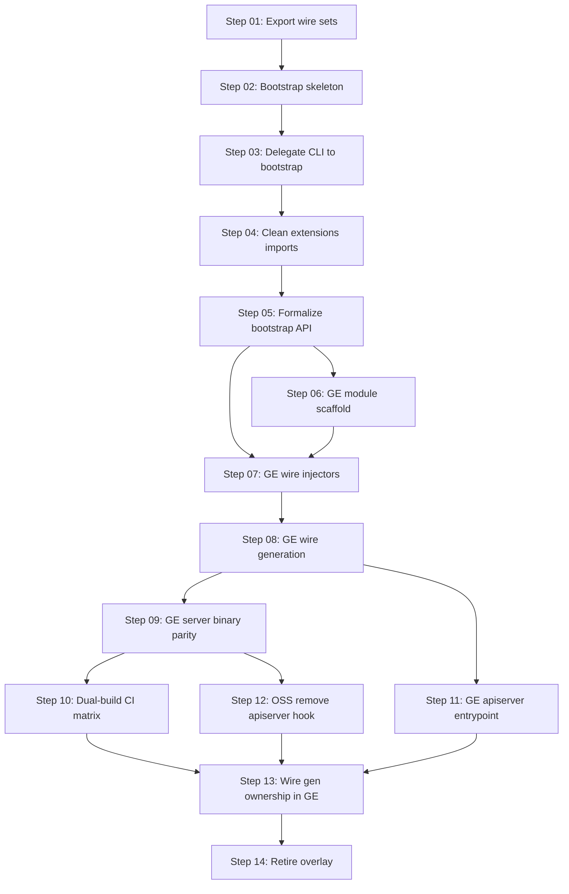

# Grafana Enterprise Standalone Server — Implementation Specs

This directory contains step-by-step implementation specifications for migrating Grafana Enterprise to a standalone Go module that imports OSS, while keeping the overlay model working until cutover is complete.

**Design rationale:** [grafana-enterprise-standalone-server-proposal.md](../grafana-enterprise-standalone-server-proposal.md)

**File structure & modules (before/after):** [file-structure-before-after.md](file-structure-before-after.md)

**Approach:** Option A (OSS bootstrap library) + Option D (stub-first GE module). Option B (OSS edition registry) and Option C (service-only binaries) are explicitly out of scope.

## Notes for public repository

This directory is committed to the public `grafana/grafana` repository. A pre-commit review should confirm:

| Category | Status |
|----------|--------|
| Credentials, API keys, tokens, license files | None present |
| Internal-only URLs (Slack, Jira, private registries with auth) | None present |
| Employee names, emails, machine-local paths | None present |
| Enterprise source code | None — architecture and file paths only |

**Private enterprise repository:** References to `grafana/grafana-enterprise` point to Grafana's private repository. That URL and sibling checkout layout (`../grafana-enterprise`) are already documented elsewhere in OSS (e.g. `make enterprise-dev`, enterprise dev guides). External contributors cannot clone that repo; CI examples assume Grafana org credentials.

**Product names:** Enterprise feature packages (licensing, SAML, RBAC, apiserver, etc.) are named at the same level as existing public OSS references to enterprise build tags and overlay paths — no implementation details.

## Principles

1. **OSS never imports Grafana Enterprise.** OSS may retain a neutral `pkg/extensions` stub (`IsEnterprise = false`). Enterprise code is overlaid into that path during transition; that is a build/sync concern, not an OSS→GE import.
2. **Each step is one PR** (or a tightly coupled pair where noted). Every PR must leave the tree in a shippable state.
3. **No behavior changes unless the step says so.** Refactors preserve existing wire graphs, CLI flags, and runtime semantics.
4. **Verify OSS and Enterprise** at every step that touches shared code.
5. **Integration and E2E tests run on every step.** Refactors to wire, bootstrap, and startup code can break behavior that unit tests miss. A green unit-test run is necessary but not sufficient — integration and E2E acceptance smoke are required before merge on every PR.

## Step dependency graph



## Repository ownership

| Steps | Primary repo | Notes |
|-------|--------------|-------|
| 01–05, 10, 12 | `grafana/grafana` (OSS) | Overlay must keep working |
| 06–09, 11, 13–14 | `grafana/grafana-enterprise` (GE) | OSS changes only where noted for CI/cutover |

Steps 06+ assume `grafana-enterprise` is cloned as a sibling of `grafana` (`../grafana-enterprise`).

Even when a step's code changes are in GE only, **run integration and E2E from the OSS repo** against the overlay build (or the GE binary once it replaces overlay) to confirm nothing regressed.

## Global invariants (every PR)

These must pass before merge unless the step explicitly documents a temporary exception:

### OSS-only (no enterprise overlay)

```bash
make gen-go
make lint-go
make build-backend
make run-go
# Spot-check: binary starts, /api/health responds
go test -tags=oss -short ./pkg/server/...
make test-go-unit SHARD=1 SHARDS=1   # or targeted package tests
```

### Enterprise overlay linked (`make enterprise-dev` running, or one-shot copy)

Requires `pkg/extensions/ext.go` present (from overlay).

```bash
make gen-go                    # generates both wire_gen.go and enterprise_wire_gen.go
make lint-go
make build-backend             # local/Makefile sets GO_BUILD_TAGS=enterprise
make run-go                    # same; enterprise tags via local/Makefile
make test-enterprise-go        # enterprise backend packages
```

### Full build (when step touches frontend or release paths)

```bash
make build                     # backend + frontend
yarn test --no-watch           # or targeted frontend tests if step is backend-only
```

### Integration tests (required — every step)

Integration tests exercise real database wiring, HTTP handlers, and service lifecycles. They catch regressions from wire/bootstrap refactors that unit tests with mocks miss.

**Prerequisites** (once per dev machine / CI job):

```bash
make devenv sources=postgres_tests
```

**Required on every PR** (from `grafana/grafana` root):

```bash
make test-go-integration-postgres SHARD=1 SHARDS=1
```

Run additional integration shards or targets when a step touches a specific subsystem (e.g. `make test-go-integration-alertmanager` for alerting changes). At minimum, one postgres integration shard must pass.

If integration tests fail due to environment setup (devenv not running), the PR author must document that CI passed — **do not skip locally without confirming CI coverage**.

### E2E tests (required — every step)

E2E acceptance smoke validates user-visible flows through the running server and frontend. Run this on every step to confirm refactors did not break end-to-end behavior.

**Prerequisites:**

- Enterprise overlay linked (`make enterprise-dev` or one-shot `enterprise-to-oss.sh`) for steps 01–13, since that is the shipping path during migration.
- Frontend built at least once: `make build-js` (or `make build`).
- Playwright browsers installed: `yarn playwright install chromium` (first time only).

**Required on every PR** (from `grafana/grafana` root):

```bash
yarn e2e:playwright --grep @acceptance
```

This is the minimum smoke subset. Expand scope when a step touches related user flows (e.g. add `--grep provisioning` when changing provisioning bootstrap paths). Step 14 cutover phases may require the full E2E suite — see that step's spec.

For **OSS-only steps (01–05)** where enterprise overlay is not yet involved in the change, still run the acceptance smoke against the **enterprise overlay build** if available — that is the combined product under test during migration. If overlay is unavailable locally, CI must run enterprise overlay + E2E before merge.

### Standard integration & E2E block

Copy this block into every step's verification section (adjust paths only when the step specifies GE-binary-specific E2E):

```bash
# Prerequisites: make devenv sources=postgres_tests (once, keep running)
# Prerequisites: enterprise overlay linked; make build-js

make test-go-integration-postgres SHARD=1 SHARDS=1
yarn e2e:playwright --grep @acceptance
```

## Standard PR template

Each step README ends with sections the implementing PR should fill in:

- **Summary** — what changed and why
- **Test plan** — commands run with results (must include integration + E2E)
- **Enterprise verification** — overlay build/run/tests
- **Risk** — what could break and how it was checked

## Step index

| Step | Title | Repo | Depends on |
|------|-------|------|------------|
| [01](step-01-export-wire-sets.md) | Export shared wire sets | OSS | — |
| [02](step-02-bootstrap-package-skeleton.md) | Bootstrap package skeleton | OSS | 01 |
| [03](step-03-delegate-cli-to-bootstrap.md) | Delegate CLI to bootstrap | OSS | 02 |
| [04](step-04-clean-extensions-imports.md) | Clean extensions side-effect imports | OSS | 03 |
| [05](step-05-formalize-bootstrap-api.md) | Formalize bootstrap public API | OSS | 04 |
| [06](step-06-ge-module-scaffold.md) | GE module scaffold + health binary | GE | 05 |
| [07](step-07-ge-wire-injectors.md) | GE wire injectors | GE | 05, 06 |
| [08](step-08-ge-wire-generation.md) | GE wire generation + first server build | GE | 07 |
| [09](step-09-ge-server-binary-parity.md) | GE single-binary CLI parity | GE | 08 |
| [10](step-10-dual-build-ci-matrix.md) | Dual-build CI matrix (includes integration + E2E in all paths) | OSS + GE | 09 |
| [11](step-11-ge-apiserver-entrypoint.md) | GE apiserver entrypoint | GE | 08 |
| [12](step-12-oss-remove-apiserver-hook.md) | OSS remove apiserver CLI hook | OSS | 09, 11 |
| [13](step-13-wire-gen-ownership-in-ge.md) | Wire generation ownership in GE | GE + OSS | 10, 12 |
| [14](step-14-retire-overlay.md) | Retire overlay | GE + OSS | 13 |

## LLM execution notes

When implementing a step:

1. Read the step README in full, then the design proposal section it references.
2. Read surrounding code before editing; match existing patterns.
3. Do **not** expand scope into frontend, import-path renames, or unrelated refactors.
4. Run **all** verification commands listed in the step, including:
   - Unit tests and build/run smoke checks
   - **Integration:** `make test-go-integration-postgres SHARD=1 SHARDS=1`
   - **E2E:** `yarn e2e:playwright --grep @acceptance`
   See [Integration tests](#integration-tests-required--every-step) and [E2E tests](#e2e-tests-required--every-step) above for prerequisites.
5. If `make gen-go` changes generated files, commit them in the same PR.
6. Stop and ask the human if wire generation fails with errors that require redesigning provider sets.
7. Record integration and E2E results in the PR test plan — a refactor PR is not complete without them.
