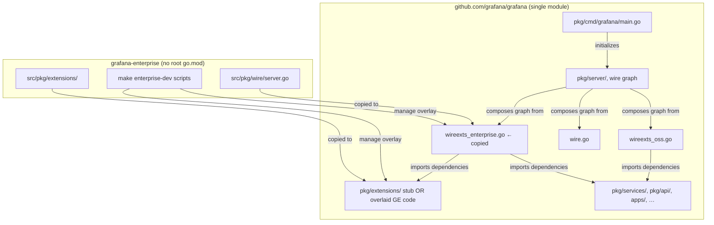
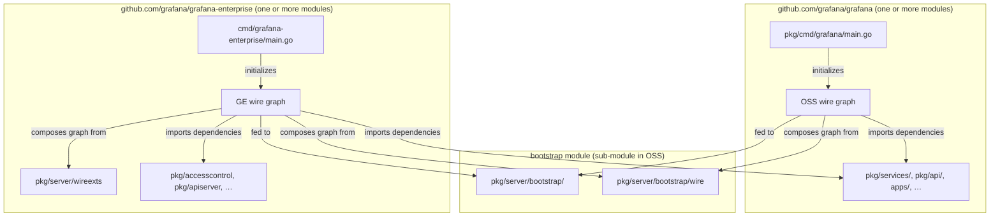

# File structure & modules: before and after

Companion to the [design proposal](../grafana-enterprise-standalone-server-proposal.md) and [implementation specs](README.md).

This document describes the repository layout, Go modules, Wire ownership, and binary entry points **today** (overlay model) versus the **target** (GE imports OSS as a module).

---

## Module graph

### Before (today)



### After (target)



---

## Entry points

| Role | Before | After |
|------|--------|-------|
| **OSS binary** | `pkg/cmd/grafana/main.go` → `grafana server`, `grafana cli`, (+ `grafana apiserver` when enterprise overlaid) | Same path, but **OSS-only**: `server` + `cli` only. No enterprise hooks in `main`. |
| **Enterprise binary** | *None* — enterprise runs via overlaid OSS binary (`make run` / `bin/grafana`) | `cmd/grafana-enterprise/main.go` → `grafana-enterprise server`, `server target`, `apiserver`, etc. |
| **Server startup** | `pkg/cmd/grafana-server/commands/cli.go` → `server.Initialize()` | OSS and GE both call `pkg/server/bootstrap.RunServer()` with edition-specific injectors |
| **Module targets** | `grafana server target …` via `target.go` → `server.InitializeModuleServer()` | Same CLI shape on GE binary; bootstrap + GE wire |
| **Standalone apiserver** | OSS `main` registers `InitializeAPIServerFactory()` (noop OSS / real when overlaid) | GE `main` only; uses GE `pkg/apiserver` + GE wire |
| **Operators** | `pkg/operators/enterprise_register.go` (copied from GE) blank-imported from OSS build | GE `main` blank-imports `github.com/grafana/grafana-enterprise/pkg/operators` |

---

## File structure — OSS (`grafana/grafana`)

### Before

```
grafana/                              module: github.com/grafana/grafana
├── go.mod                            # monolithic OSS module (+ go.work submodules)
├── pkg/
│   ├── cmd/
│   │   ├── grafana/main.go           ★ ENTRY: all editions build from here
│   │   ├── grafana-server/commands/  ★ startup: RunServer, RunTarget, flags
│   │   └── grafana-cli/              ★ ENTRY: admin CLI subcommands
│   ├── server/
│   │   ├── wire.go                   shared wire sets + injectors
│   │   ├── wireexts_oss.go           OSS edition wire (build tag: oss)
│   │   ├── wireexts_enterprise.go    ← COPIED from GE (build tag: enterprise)
│   │   ├── wire_gen.go               generated (OSS)
│   │   ├── enterprise_wire_gen.go    ← COPIED / generated (enterprise)
│   │   ├── server.go, module_server.go, …
│   │   └── module_registerer.go      noop ModuleRegisterer (OSS)
│   ├── extensions/                   gitignored except stub OR full GE tree when overlaid
│   │   ├── main.go                   IsEnterprise = false (OSS stub)
│   │   └── ext.go                    ← from overlay: IsEnterprise = true
│   ├── operators/
│   │   └── enterprise_register.go    ← COPIED from GE
│   ├── services/ …                   entire product backend
│   └── api/ …
├── public/app/extensions/            ← COPIED frontend (overlay)
└── local/Makefile                    ← symlink to GE scripts (enterprise-dev targets)
```

### After

```
grafana/                              module: github.com/grafana/grafana
├── go.mod                            # OSS only; no GE dependency
├── pkg/
│   ├── cmd/
│   │   ├── grafana/main.go           ★ ENTRY: OSS binary only
│   │   ├── grafana-server/commands/  thin wrappers → bootstrap
│   │   └── grafana-cli/
│   ├── server/
│   │   ├── bootstrap/                ★ NEW: public startup API for external mains
│   │   │   ├── bootstrap.go          RunServer, RunTarget, signals, config
│   │   │   └── buildinfo.go
│   │   ├── wiresets/                 ★ NEW: exported Basic, Server, CLI, Test sets
│   │   ├── wire.go                   shared injectors; wire.Build(wireExtsSet) OSS only
│   │   ├── wireexts_oss.go           only OSS edition bindings
│   │   ├── wire_gen.go               OSS generation only
│   │   ├── server.go, module_server.go, …
│   │   └── module_registerer.go      noop (unchanged)
│   ├── extensions/                   stub only (IsEnterprise = false)
│   │   └── main.go
│   ├── services/ …                   unchanged bulk of product
│   └── api/ …
└── (no public/app/extensions/, no wireexts_enterprise.go, no enterprise_register.go)
```

---

## File structure — Enterprise (`grafana/grafana-enterprise`)

### Before

```
grafana-enterprise/                   NO root go.mod
├── src/
│   ├── pkg/
│   │   ├── extensions/               ★ canonical enterprise backend (~100+ packages)
│   │   │   ├── apiserver/            standalone k8s apiserver factory
│   │   │   ├── licensing/, saml/, accesscontrol/, …
│   │   │   └── server/               ModuleRegisterer (authz, authn, audit)
│   │   └── wire/
│   │       ├── server.go             ★ wireexts_enterprise.go source
│   │       └── enterprise_wire_gen.go
│   ├── pkg/operators/enterprise_register.go
│   └── public/                       frontend extensions
├── enterprise-to-oss.sh              overlay → OSS
├── build.sh                          CI overlay → OSS
└── scripts/Makefile → OSS local/Makefile
```

Import paths in GE source today: `github.com/grafana/grafana/pkg/extensions/...` (because code is copied into the OSS tree at build/dev time).

### After

```
grafana-enterprise/                     module: github.com/grafana/grafana-enterprise
├── go.mod                            require github.com/grafana/grafana vX.Y.Z
├── cmd/
│   └── grafana-enterprise/
│       └── main.go                   ★ ENTRY: enterprise binary
├── pkg/
│   ├── wire/
│   │   ├── wire.go                   injectors (Initialize, InitializeModuleServer, …)
│   │   ├── edition.go                wireExtsBasicSet + enterprise binds
│   │   └── wire_gen.go               ★ generated in GE repo
│   ├── bootstrap/                    optional thin CLI flags (or reuse OSS bootstrap)
│   ├── apiserver/                    moved from extensions/apiserver
│   ├── licensing/, saml/, accesscontrol/, …
│   ├── server/                       ModuleRegisterer
│   └── operators/enterprise_register.go
├── src/public/                       FE (release/build still TBD)
└── Makefile                          make gen-wire, make build
```

Import paths target: `github.com/grafana/grafana-enterprise/pkg/...` for GE-owned code; `github.com/grafana/grafana/pkg/...` for OSS services, wiresets, and bootstrap.

---

## Wire / DI ownership

| Piece | Before | After |
|-------|--------|-------|
| Shared core graph (`wireBasicSet`, `wireSet`) | `pkg/server/wire.go` (unexported) | `pkg/server/wiresets/` (exported, OSS) |
| OSS edition bindings | `wireexts_oss.go` | `wireexts_oss.go` (unchanged role) |
| Enterprise edition bindings | `wireexts_enterprise.go` in OSS (copied) | `grafana-enterprise/pkg/wire/edition.go` |
| `Initialize()` injector | OSS `wire.go` → `wireExtsSet` via **build tag swap** | OSS: `wireExtsSet` = OSS only. GE: own `Initialize()` → OSS `wiresets.Server` + GE edition set |
| Generated DI | `wire_gen.go` + `enterprise_wire_gen.go` in OSS | `wire_gen.go` in OSS; `wire_gen.go` in GE |
| `make gen-go` | Generates both graphs in OSS | OSS: OSS only. GE: `make gen-wire` |

---

## Build & dev workflow

| Activity | Before | After |
|----------|--------|-------|
| Dev enterprise | `make enterprise-dev` (rsync + watch) → `make run` in OSS | **Transition:** overlay still works. **End state:** `cd grafana-enterprise && make build && ./bin/grafana-enterprise server -homepath=../grafana` |
| OSS dev | `make run` in OSS | Unchanged |
| Release enterprise | OSS CI runs `build.sh` (copies GE into OSS) → builds `bin/grafana` | GE CI builds `bin/grafana-enterprise` importing pinned OSS module |
| Breaking OSS change | Silently breaks overlay until someone runs enterprise build | GE `go build` fails until GE updates OSS pin |

---

## Transition state (steps 01–13)

While the overlay still exists, both shapes coexist:

```
OSS repo still receives copies:
  GE pkg/wire/edition.go     → pkg/server/wireexts_enterprise.go
  GE pkg/wire/wire_gen.go    → pkg/server/enterprise_wire_gen.go
  GE pkg/*                   → pkg/extensions/   (legacy overlay path)

Developers may use EITHER:
  make enterprise-dev + make run          (legacy monolith from OSS tree)
  ./bin/grafana-enterprise server …       (new GE entry, increasing parity)
```

See the [step index](README.md#step-index) for when each path is added or retired.

---

## Single-binary guarantee

Both before and after ship **one process, one binary** for full Grafana Enterprise:

| | Before | After |
|---|--------|-------|
| Binary name | `grafana` (built from OSS tree with `-tags enterprise`) | `grafana-enterprise` (built from GE module) |
| What's inside | OSS `main` + overlaid `pkg/extensions` + enterprise wire | GE `main` + GE `pkg/*` + imported OSS `wiresets` / `bootstrap` / `services` |
| Explicitly not doing | N/A | Microservice-only split (Option C rejected) |

The GE binary remains a single monolith that composes OSS via imports — not a fleet of separate deployable services for the core product.
