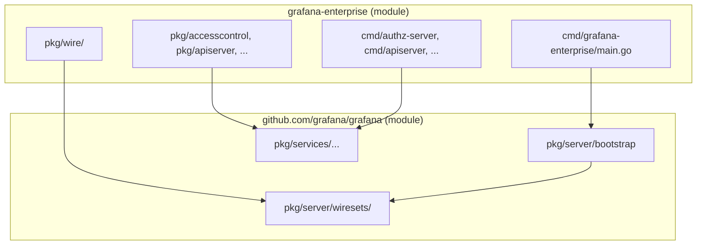

# Design: Making Grafana Enterprise Runnable as a Standalone API Server

**Implementation specs:** [ge-standalone/README.md](ge-standalone/README.md) — step-by-step PR-sized tasks.

**File structure & modules (before/after):** [ge-standalone/file-structure-before-after.md](ge-standalone/file-structure-before-after.md)

## Context

### Current overlay model

Enterprise development uses a **dual-repo overlay**, not a Go module dependency:

| Stage | Mechanism | What gets overlaid |
|-------|-----------|-------------------|
| Dev (`make enterprise-dev`) | `enterprise-to-oss.sh` + file watcher | Backend → `pkg/extensions/`, wire → `pkg/server/wireexts_enterprise.go` + `enterprise_wire_gen.go`, frontend → `public/app/extensions/`, operators, devenv blocks, fonts, emails |
| Build (`build.sh` in CI) | Same copy + merge `defaults.ini` / `sample.ini` | Same paths |
| Reverse sync | `oss-to-enterprise.sh` | Changes in overlaid OSS paths sync back to `grafana-enterprise` |

The overlay is **one-way at dev time** (Enterprise → OSS), with bidirectional sync only for the watched paths. OSS `.gitignore` hides overlaid enterprise code; the canonical source lives in `grafana-enterprise/src/pkg/extensions/`.

### Where server startup lives today

All runtime bootstrap is in OSS:

```64:71:pkg/cmd/grafana/main.go
	// Add the enterprise command line to build an api server
	f, err := server.InitializeAPIServerFactory()
	if err == nil {
		cmd := f.GetCLICommand(buildInfo)
		if cmd != nil {
			app.Commands = append(app.Commands, cmd)
		}
	}
```

Wire DI is centralized in `pkg/server/`:

- `wire.go` — shared wire sets (both editions)
- `wireexts_oss.go` — OSS-only extensions (`//go:build wireinject && oss`)
- `wireexts_enterprise.go` — copied from GE; enterprise overrides (`//go:build wireinject && (enterprise || pro)`)
- Generated: `wire_gen.go` (OSS) / `enterprise_wire_gen.go` (enterprise)

Enterprise already hooks in at several **extension points**:

| Extension point | OSS default | Enterprise override |
|-----------------|-------------|---------------------|
| `ModuleRegisterer` | `ProvideNoopModuleRegisterer` | `extserver.ProvideEnterpriseModuleRegisterer` (authz, authn, audit-log-processor) |
| `wireExtsStandaloneAPIServerSet` | `standalone.NoOpAPIServerFactory` | `extapiserver.ProvideAPIFactory` → `grafana apiserver` |
| Service interfaces via wire binds | OSS impls (licensing, caching, RBAC, etc.) | Enterprise impls in `wireExtsBasicSet` |
| `extensions.IsEnterprise` | `false` | `true` via `ext.go` |

### Why GE cannot run on its own today

1. **No root `go.mod`** in `grafana-enterprise` — only small tool modules under `scripts/` and devenv.
2. **No `main` package** — the only production binary is `pkg/cmd/grafana` in OSS.
3. **Wire graphs live in OSS** — enterprise wire is injected by copying `wireexts_enterprise.go` into OSS and generating `enterprise_wire_gen.go` there.
4. **Massive direct imports** — enterprise code imports `github.com/grafana/grafana/pkg/...` throughout (see `wireexts_enterprise.go` and `extensions/apiserver/factory.go`, which alone imports hundreds of OSS packages).
5. **Build pipeline assumes overlay** — CI runs `build.sh` to copy enterprise into OSS, then builds from OSS.

The `grafana apiserver` command is the closest thing to a standalone GE server, but it still runs inside the OSS-built binary and depends heavily on OSS packages for auth, storage, plugins, etc. MT deployments (mt-tilt) run the same monolithic `grafana` binary with different `-target` flags — they are process-separated, not repo-separated.

### Related work (Problem #1)

The `publicdashboards/alias.go` pattern flattens nested imports so Wire and external consumers import one package instead of many `internal/*` paths. That reduces coupling surface area and is a prerequisite for making OSS a clean importable module — but it does not solve bootstrap ownership.

---

## Requirements

### Functional

- **R1**: `grafana-enterprise` can `go build` and `go run` a server binary without the overlay being present.
- **R2**: The GE binary can start as an API server (at minimum: `grafana apiserver` equivalent; eventually full `grafana server` equivalent).
- **R3**: GE can be versioned and released independently of OSS, with explicit dependency on an OSS module version.
- **R4**: Breaking OSS changes must cause compile failures in GE, not silent runtime breakage.

### Non-functional (transition constraints)

- **T1**: The overlay model (`make enterprise-dev`) must keep working throughout migration.
- **T2**: Existing CI/build pipelines (`build.sh`, Drone) must not break.
- **T3**: Developers should not need to maintain two divergent implementations of the same feature.
- **T4**: Incremental migration — start with stubs/no-ops, replace with real OSS imports over time.

---

## Options

### Option A: OSS Bootstrap Library + GE Thin Binary *(recommended)*

**Shape**: Extract a stable, importable bootstrap API from OSS (e.g. `github.com/grafana/grafana/pkg/server/bootstrap` or `pkg/runtime`). GE gets its own `go.mod`, `cmd/grafana-enterprise/main.go`, and wire graph that composes OSS bootstrap + enterprise extensions.

```
┌─────────────────────────────────────┐
│  grafana-enterprise (go module)     │
│  cmd/grafana-enterprise/main.go     │
│  pkg/wire/ (enterprise wire sets)   │
│  pkg/... (today's extensions/)      │
└──────────────┬──────────────────────┘
               │ go.mod require
               ▼
┌─────────────────────────────────────┐
│  github.com/grafana/grafana (OSS)   │
│  pkg/server/bootstrap  ← NEW        │
│  pkg/server/wire.go (shared sets)   │
│  pkg/services/...                   │
└─────────────────────────────────────┘
```

**OSS changes**:
- Introduce `pkg/server/bootstrap` exporting edition-agnostic startup:
  - `RunServer(ctx, EditionConfig) error`
  - `RunModuleTarget(ctx, target string, EditionConfig) error`
  - `RunAPIServer(ctx, EditionConfig) error`
- Move shared wire sets from `wire.go` into importable packages (possibly `pkg/server/wiresets/...`).
- Keep `wireexts_oss.go` in OSS; enterprise wire sets move to GE repo permanently.

**GE changes**:
- Add root `go.mod` with `require github.com/grafana/grafana vX.Y.Z`.
- Move `src/pkg/extensions/` → `pkg/` with import path `github.com/grafana/grafana-enterprise/pkg/...`.
- Wire graph in GE repo imports OSS wire sets + provides enterprise overrides (same content as today's `wireexts_enterprise.go`, but owned by GE).
- `main.go` calls `bootstrap.Run(...)` with enterprise edition config.

**Overlay compatibility during transition**:
- Overlay script continues copying GE code into `pkg/extensions/` **and** GE standalone builds from GE repo directly.
- Single source of truth: GE repo. Overlay becomes a **compatibility shim** that rsyncs GE packages into OSS paths for legacy builds.
- Wire: GE generates `enterprise_wire_gen.go` in GE repo; overlay copies it to OSS `pkg/server/` until OSS monolith build is retired.

| Pros | Cons |
|------|------|
| Clean module boundary; explicit OSS version pin | Requires extracting bootstrap API from OSS (non-trivial refactor) |
| GE CI can compile/test without overlay | Two wire generation paths during transition |
| Aligns with alias.go / flat-package work | Bootstrap API must be designed carefully to avoid ossifying internals |
| Overlay keeps working as a shim | Initial stub phase still pulls in large OSS transitive deps |

---

### Option B: Edition Registry in OSS (build-tag plugin model)

**Shape**: OSS owns `main` and all wire infrastructure. GE implements a registered `Edition` interface; selection is via build tag or link-time registration.

```go
// pkg/server/edition/edition.go (OSS)
type Edition interface {
    WireExtensions() wire.ProviderSet
    ModuleRegisterer() ModuleRegisterer
    APIServerFactory() standalone.APIServerFactory
}

// pkg/cmd/grafana/main_enterprise.go (build tag: enterprise)
//go:build enterprise
func init() { server.RegisterEdition(enterpriseedition.Default) }
```

GE repo ships a package `github.com/grafana/grafana-enterprise/edition` consumed by OSS via `go.mod` replace/require.

| Pros | Cons |
|------|------|
| Minimal change to entry-point structure | GE still cannot run without OSS repo checkout |
| Natural extension of existing build tags | Does not satisfy R1/R3 — GE is a library, not a runnable product |
| Wire stays in one place | Perpetuates "OSS owns everything" — opposite of stated goal |
| Easy overlay compatibility | LLMs still edit OSS for enterprise concerns |

**Verdict**: Good interim step, insufficient as end state. Could be Phase 1 within Option A.

---

### Option C: Service-first decomposition (MT-native)

**Shape**: Treat GE as a **fleet of services**, not a monolith. Formalize what mt-tilt already does: authz-server, authn-server, apiserver, setting-service, etc. each get their own `cmd/` in GE repo with minimal wire graphs.

```
grafana-enterprise/
  cmd/authz-server/main.go      → imports OSS authz + GE zanzana
  cmd/authn-server/main.go      → imports OSS authn + GE authn
  cmd/apiserver/main.go         → imports extapiserver (already ~standalone)
  cmd/setting-service/main.go   → ...
```

Each binary has a **small, purpose-built wire set** instead of the full `Initialize()` graph (~2000 lines in `enterprise_wire_gen.go`).

| Pros | Cons |
|------|------|
| Matches MT architecture direction | Does not give you a "full Grafana Enterprise server" binary |
| Smaller compile units; faster iteration | Many binaries to maintain, test, release |
| `grafana apiserver` is already close to this | Shared deps (DB, licensing, secrets) still need OSS imports |
| Natural stub/no-op starting point per service | Operational complexity vs. single binary |

**Verdict**: Complementary to Option A, not a replacement. Use for MT services; still need Option A (or D) for monolith parity.

---

### Option D: Stub-first GE module (minimal viable server)

**Shape**: Create GE `go.mod` + `main.go` that compiles and starts HTTP with all enterprise services as no-ops. Incrementally replace stubs with OSS imports.

**Phase 0 stub server**:
```go
// cmd/grafana-enterprise/main.go
func main() {
    cfg := setting.NewCfg()           // OSS import
    srv := stubserver.New(cfg)        // GE: returns 501 for most routes
    srv.RegisterEnterpriseAPIs(...)   // Real GE apiserver groups only
    srv.ListenAndServe()
}
```

Wire is deferred initially — manual DI or a tiny wire graph. As each service is needed, add the corresponding OSS wire set.

| Pros | Cons |
|------|------|
| Fastest path to "GE compiles and runs" | Stub server is not production-useful for a long time |
| Validates module boundary early | Risk of two divergent DI approaches (stub vs wire) |
| Matches team's stated intent | Full feature parity requires eventually importing most of Option A anyway |
| Zero impact on overlay | May accumulate tech debt if stubs linger |

**Verdict**: Good **Phase 0** within Option A, not a standalone long-term architecture.

---

### Option E: Keep monolith in OSS, GE as replace-only module (status quo+)

**Shape**: OSS `go.mod` adds `replace github.com/grafana/grafana-enterprise => ../grafana-enterprise`. Enterprise code moves to GE module but **main and wire stay in OSS**. Overlay replaced by `go.work` + replace directive.

| Pros | Cons |
|------|------|
| Smallest diff from today | GE still cannot build/run independently (R1 fails) |
| Eliminates rsync scripts eventually | OSS repo still required for any build |
| Explicit module version | Doesn't solve "GE as API server in its own right" |

**Verdict**: Useful intermediate step to eliminate overlay rsync, but does not meet the core goal.

---

## Recommended Approach: Phased Option A + C

Combine a **bootstrap library extraction** (A) with **service-first binaries** (C) for MT, using **stub-first** (D) to unblock early compiles.

### Architecture target



### Phase 0: Stub GE module (4–6 weeks)

**Goal**: GE repo has `go.mod`, compiles, runs a health-check HTTP server.

| Task | OSS | GE | Overlay impact |
|------|-----|----|----|
| Add root `go.mod` to GE | — | `require github.com/grafana/grafana@version` | None |
| Create `cmd/grafana-enterprise/main.go` | — | Stub HTTP + `/healthz` | None |
| CI: `go build ./...` in GE repo | — | New Drone job | None |
| Continue alias.go flattening | Ongoing | — | None |

Overlay unchanged. Validates module boundary.

### Phase 1: Extract bootstrap API (6–10 weeks)

**Goal**: OSS exposes a stable startup surface; GE can call it.

**OSS additions** (`pkg/server/bootstrap`):

```go
type Config struct {
    HomePath    string
    Edition     EditionHooks   // ModuleRegisterer, APIServerFactory, etc.
    WireExtras  wire.ProviderSet
}

func RunServer(ctx context.Context, cfg Config) error
func RunTarget(ctx context.Context, cfg Config, target string) error
```

Refactor `pkg/cmd/grafana-server/commands/cli.go` to delegate to `bootstrap.RunServer`. The existing `ModuleRegisterer` and `APIServerFactory` hooks become the `EditionHooks` struct — minimal new abstraction.

**Extract shared wire sets** into importable packages:
- `pkg/server/wiresets/core.go` — sqlstore, featuremgmt, setting, metrics
- `pkg/server/wiresets/api.go` — HTTPServer deps
- Keep edition-specific sets in GE

**Overlay compatibility**:
- OSS `wireexts_enterprise.go` becomes a **thin re-export** of GE wire sets (generated or copied) until overlay is retired.
- `make enterprise-dev` continues copying; additionally, GE repo can build standalone via `go.work`:

```
go.work
use (
    ./grafana
    ./grafana-enterprise
)
replace github.com/grafana/grafana => ./grafana
```

Developers choose overlay OR go.work; both work.

### Phase 2: Standalone apiserver binary (4–6 weeks)

**Goal**: `grafana-enterprise apiserver` runs without overlay.

- Move `extensions/apiserver/` to GE module (already ~self-contained via cobra).
- `cmd/apiserver/main.go` in GE imports OSS packages it needs + GE apiserver factory.
- mt-tilt Dockerfile builds from GE repo instead of OSS monolith.
- OSS `InitializeAPIServerFactory` continues working via overlay for legacy path.

This delivers the most immediate MT value (R2 for apiserver).

### Phase 3: Full server composition (ongoing)

**Goal**: `grafana-enterprise server` equivalent.

- Port enterprise wire sets to GE-owned `pkg/wire/server.go`.
- Generate `wire_gen.go` in GE repo.
- Replace stubs with OSS wire set imports one service group at a time:
  1. Licensing, settings, config (needed everywhere)
  2. Auth/RBAC (authz-server, authn-server)
  3. Secrets, encryption, KMS
  4. Remaining background services

Track progress with a **service readiness matrix** (stub / partial / full per service).

### Phase 4: Retire overlay (future)

- OSS CI builds OSS-only; GE CI builds GE importing OSS module.
- Remove `enterprise-to-oss.sh` / `oss-to-enterprise.sh`.
- Remove `pkg/extensions/` from OSS (keep empty `.keep` + `IsEnterprise = false` stub).
- Single binary release from GE repo; OSS releases OSS-only.

---

## Key design decisions

### 1. Where does Wire live?

| Layer | Owner | Rationale |
|-------|-------|-----------|
| Shared wire sets (`wireSet` in `wire.go`) | OSS | Core services are OSS |
| Edition overrides (`wireExtsBasicSet` enterprise binds) | GE | Enterprise owns replacements |
| Injector functions (`Initialize`, `InitializeModuleServer`) | OSS bootstrap | Stable API surface |
| Generated wire code | Per-edition, per-repo | GE generates its own `wire_gen.go` |

### 2. Import path migration for enterprise code

Today: `github.com/grafana/grafana/pkg/extensions/...` (overlaid into OSS)

Target: `github.com/grafana/grafana-enterprise/pkg/...`

**Transition**: Type-alias or thin re-export packages in OSS during overlay phase:

```go
// pkg/extensions/licensing/service.go (OSS, overlaid during transition)
package licensing
import ent "github.com/grafana/grafana-enterprise/pkg/licensing"
type LicenseTokenService = ent.LicenseTokenService
```

Or keep overlay copying GE code into `pkg/extensions/` with OSS import paths until Phase 4 — simpler, avoids mass rename upfront.

### 3. Bootstrap API stability

The bootstrap package should expose **interfaces and wire set constructors**, not concrete types from `pkg/server/wire_gen.go`. Follow the `ModuleRegisterer` precedent — OSS defines the hook, GE provides the implementation.

Avoid exporting the 2000-line generated injectors directly; export named entry points:

```go
bootstrap.RunServer(ctx, bootstrap.ServerOptions{...})      // full server
bootstrap.RunModule(ctx, "authz-server", ...)              // dskit target
bootstrap.RunAPIServer(ctx, ...)                           // k8s apiserver
```

### 4. Stub strategy

For services not yet wired, provide **OSS no-op implementations** (many already exist: `ProvideNoopModuleRegisterer`, `NoOpAPIServerFactory`, `OSSLicensingService`). GE bootstrap should default to no-ops and require explicit opt-in to real implementations via wire sets.

This matches existing patterns and avoids inventing parallel stub hierarchies.

---

## Overlay compatibility checklist

During all phases, maintain these invariants:

| Invariant | How |
|-----------|-----|
| `make enterprise-dev` works | Keep rsync scripts; GE standalone is additive |
| `make run` from OSS with overlay | Unchanged until Phase 4 |
| `make gen-go` / Wire generation | OSS generates both OSS and enterprise graphs; GE eventually generates its own |
| Enterprise CI (`build.sh`) | Continues copying into OSS for release builds until Phase 4 |
| Frontend overlay | Unaffected by backend bootstrap work |
| Branch sync requirement | Unchanged until overlay retired |

**Dual-build CI matrix** (add during Phase 1):

```
OSS-only:     go build -tags oss ./pkg/cmd/grafana
GE-overlay:   make enterprise-dev && go build -tags enterprise ./pkg/cmd/grafana
GE-standalone: cd grafana-enterprise && go build ./cmd/grafana-enterprise
```

All three must pass before merging breaking OSS changes.

---

## Risks and mitigations

| Risk | Impact | Mitigation |
|------|--------|------------|
| Bootstrap API leaks OSS internals | GE tightly coupled despite module boundary | Strict API review; only expose wire sets + interfaces; alias.go pattern |
| Dual wire graphs diverge | Overlay and standalone behave differently | Shared wire set packages; CI matrix; generated diff checks |
| Mass import surface slows GE builds | Poor DX | Continue Problem #1 flattening; extract smaller OSS sub-modules over time |
| Stub server languishes in production | Missing enterprise features silently | Service readiness matrix; integration tests per service |
| Frontend still needs overlay | Incomplete "GE standalone" story | Out of scope for this doc; backend-first; FE can follow with npm package pattern |
| go.mod version lag | GE pins stale OSS | Automated dependabot/Renovate across repos; compile failures on bump = feature |

---

## Open questions

1. **Release artifact**: Does "GE runnable" mean one `grafana-enterprise` binary (monolith parity) or a container fleet (MT services only)? Recommendation: both, but prioritize apiserver + module targets first.

2. **Import path cutover**: Big-bang rename to `github.com/grafana/grafana-enterprise/pkg/...` vs. keep `pkg/extensions/` paths via overlay indefinitely? Recommendation: keep overlay paths until Phase 3, then rename.

3. **Pro edition**: Does Pro share GE bootstrap or need its own module? The existing `pro` build tag suggests shared wire sets — `EditionHooks` should accommodate Pro as a third edition.

4. **Wire generation ownership**: Should GE run its own `make gen-go` against OSS wire sets, or should OSS publish pre-defined wire set packages that need no generation in GE? Recommendation: GE-owned generation importing OSS sets.

5. **OSS module granularity**: Is the entire `github.com/grafana/grafana` module acceptable as a dependency, or should bootstrap depend on smaller modules (`grafana/pkg/services/...` as separate modules)? Recommendation: start with monolithic OSS module; split later aligned with alias.go work.

---

## Summary

| Option | Meets R1–R4? | Overlay-safe? | Recommendation |
|--------|-------------|---------------|----------------|
| A: Bootstrap library + GE binary | Yes | Yes (shim phase) | **Primary target** |
| B: Edition registry in OSS | Partial | Yes | Phase 1 stepping stone |
| C: Service-first MT binaries | Partial (R2 for services) | Yes | **Parallel track** for MT |
| D: Stub-first | Partial initially | Yes | **Phase 0** kickoff |
| E: replace-only module | No (R1) | Yes | Insufficient alone |

The path forward is **not** a big-bang rewrite. The codebase already has the right extension points (`ModuleRegisterer`, wire edition sets, `APIServerFactory`, interface-based service replacement). The work is to:

1. **Extract** those hooks into an importable OSS bootstrap package.
2. **Give GE its own module and main**, starting with stubs.
3. **Move wire ownership** for enterprise overrides into GE.
4. **Keep the overlay as a compatibility shim** until standalone CI is proven.
5. **Retire the overlay** once GE imports OSS as a versioned module and ships its own binary.

That sequence satisfies the transition constraint (overlay keeps working), delivers incremental value (apiserver and module targets first), and makes breaking OSS changes visible at GE compile time rather than silently breaking the overlay.
