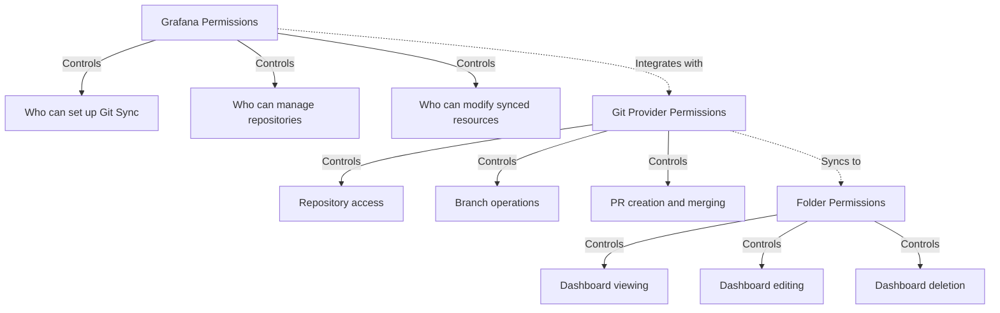
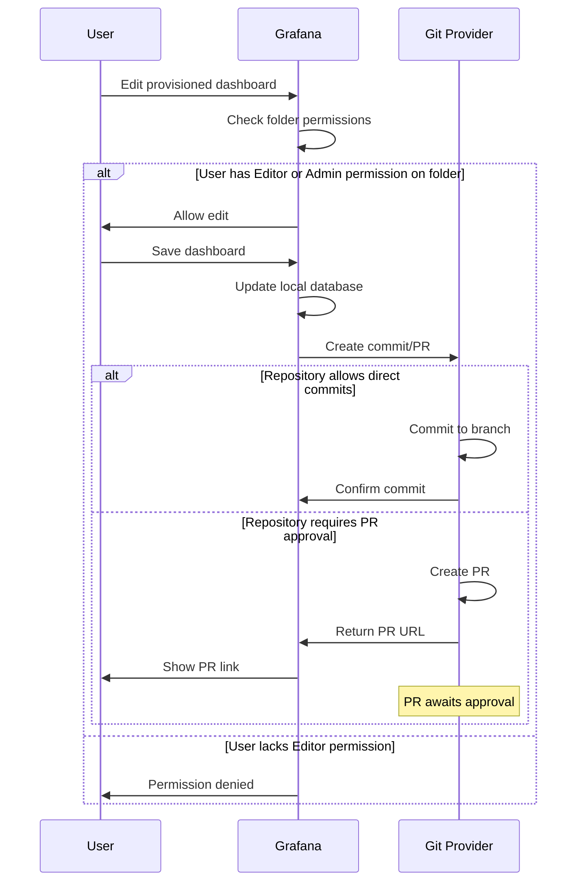
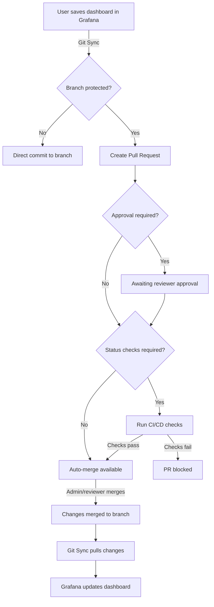
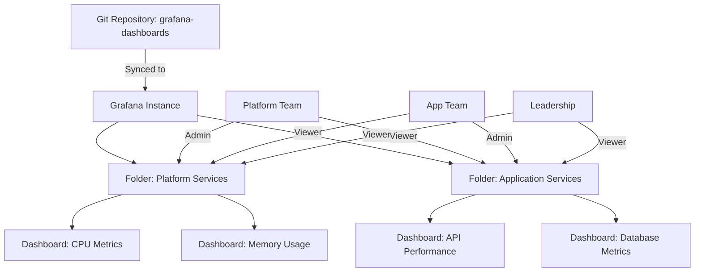

# Git Sync permissions and access control



**Git Sync is now GA for Grafana Cloud, OSS and Enterprise.** Refer to [Usage and performance limitations](https://grafana.com/docs/grafana/<GRAFANA_VERSION>/as-code/observability-as-code/git-sync/usage-limits) to understand usage limits for the different tiers.

[Contact Grafana](https://grafana.com/help/) for support or to report any issues you encounter and help us improve this feature.



Git Sync integrates Grafana with external Git providers to manage resources as code. This integration involves permissions at multiple layers: within Grafana, at the Git provider level, and in your Git repositories. Understanding these permission boundaries is essential for secure and effective Git Sync operations.

This guide explains the permission model for Git Sync from the user perspective, covering required roles, repository configurations, and best practices.

## Permission layers

Git Sync permissions operate across three distinct layers:



1. **Grafana permissions**: Control who can configure Git Sync and work with provisioned resources
2. **Git provider permissions**: Define access to repositories and operations like creating PRs
3. **Folder permissions**: Determine who can view and modify dashboards within provisioned folders

## Grafana permissions

### Setting up Git Sync

To configure Git Sync and create repository connections, users must have:

- **Grafana Admin role**: The ability to set up Git Sync repositories is restricted to users with the Grafana Admin flag set
- **Access to Administration menu**: Navigate to **Administration > General > Provisioning**


In Grafana Cloud, the equivalent role is **Grafana Cloud Admin** or **Admin** at the organization level.


### Managing repositories

After Git Sync is configured, Grafana Admins can:

- Create new repository connections
- Update repository settings (branch, path, sync interval, etc.)
- Delete repository connections
- Manually trigger sync operations (pull from Git)
- View sync status and logs

### Working with provisioned resources

Permissions for viewing and modifying provisioned resources (dashboards, folders) depend on the folder-level permissions assigned to each provisioned folder.

**Default folder permissions:**

When Git Sync creates a provisioned folder, it assigns these default permissions:

| Grafana Role | Folder Permission |
|--------------|-------------------|
| Admin        | Admin             |
| Editor       | Editor            |
| Viewer       | Viewer            |

These permissions can be customized after the folder is created. Refer to [Manage folder permissions](#folder-and-dashboard-permissions) for details.

### Permission flow for dashboard changes

The following diagram illustrates how permissions interact when a user modifies a provisioned dashboard:



## Git provider permissions

Git Sync requires specific permissions on the Git provider to read repository contents, create commits, and manage pull requests.

### GitHub permissions

When using GitHub as your Git provider, you can authenticate using either a **GitHub App** (recommended) or a **Personal Access Token (PAT)**.

#### GitHub App permissions (recommended)

The GitHub App must have the following repository permissions:

| Permission      | Access Level  | Purpose                                                                                       |
|-----------------|---------------|-----------------------------------------------------------------------------------------------|
| Administration  | Read          | Validates branch protection rules; may be used for repository settings verification           |
| Contents        | Read & Write  | Reads dashboard JSON files from the repository; commits changes back to Git                   |
| Metadata        | Read          | Accesses repository metadata (automatically granted)                                          |
| Pull Requests   | Read & Write  | Creates pull requests when branch protection requires reviews                                 |
| Webhooks        | Read & Write  | Configures webhooks for instant synchronization (optional, required for webhook support only) |

To create a GitHub App with these permissions, refer to [Create a GitHub App](https://grafana.com/docs/grafana/<GRAFANA_VERSION>/as-code/observability-as-code/git-sync/git-sync-setup/set-up-before/#create-a-github-app).


If your GitHub App lacks the required permissions, Git Sync will fail during setup or synchronization. Ensure all permissions are granted before installing the app.


#### Personal Access Token (PAT)

If you use a PAT instead of a GitHub App, ensure the token has these scopes:

- `repo` (Full control of private repositories)
  - Includes: `repo:status`, `repo_deployment`, `public_repo`, `repo:invite`, `security_events`

PATs are simpler to set up but have broader permissions than GitHub Apps and don't support fine-grained access control.

### GitLab permissions

For GitLab repositories, Git Sync requires an access token with the following scopes:

| Scope            | Purpose                                                   |
|------------------|-----------------------------------------------------------|
| `api`            | Full API access for repository operations                 |
| `read_repository`| Read repository contents                                  |
| `write_repository`| Write commits and create merge requests                  |

Alternatively, use a **Project Access Token** or **Group Access Token** with the **Maintainer** role for more granular control.

### Bitbucket permissions

For Bitbucket repositories, Git Sync requires an **App Password** with these permissions:

| Permission        | Access Level | Purpose                                    |
|-------------------|--------------|--------------------------------------------|
| Repositories      | Read & Write | Read files and push commits                |
| Pull Requests     | Read & Write | Create and manage pull requests            |
| Webhooks          | Read & Write | Configure webhooks (optional)              |

### Pure Git (generic Git provider)

When using pure Git authentication (for providers without native integration), provide:

- **Username**: Git username
- **Password/Token**: Personal access token or password with repository write access

The exact permissions depend on your Git provider's authorization model.

## Repository configuration

Beyond authentication, your Git repository must be configured to align with your organization's change management policies.

### Branch protection

Branch protection rules determine whether changes can be committed directly to the synced branch or must go through a pull request approval process.

#### Direct commits (no branch protection)

If the synced branch has no protection rules:

- Grafana commits dashboard changes **directly** to the branch
- Changes appear immediately in Git
- No review process is enforced

**Use case**: Development environments or low-risk repositories where rapid iteration is prioritized.

#### Protected branches (PR workflow)

If the synced branch has protection rules enabled:

- Grafana creates a **pull request** for each dashboard change
- Changes must be **reviewed and approved** before merging
- Additional checks (CI/CD, status checks) can be required
- Provides audit trail and change control

**Use case**: Production environments or compliance-sensitive repositories where change approval is mandatory.

### GitHub branch protection settings

To configure branch protection in GitHub:

1. Navigate to your repository on GitHub
1. Go to **Settings > Branches**
1. Add a rule for your synced branch (e.g., `main` or `production`)
1. Configure the following settings based on your requirements:

**Recommended settings for production environments:**

| Setting                                      | Recommended Value | Purpose                                                  |
|----------------------------------------------|-------------------|----------------------------------------------------------|
| Require a pull request before merging        | ✅ Enabled        | Enforce PR workflow for all changes                      |
| Require approvals                            | 1-2 reviewers     | Ensure changes are reviewed before merging               |
| Dismiss stale pull request approvals         | ✅ Enabled        | Re-review if new commits are pushed                      |
| Require status checks to pass                | ✅ Enabled        | Run CI/CD validation before merging                      |
| Require branches to be up to date            | ✅ Enabled        | Prevent conflicts by ensuring PRs are current            |
| Require signed commits                       | Optional          | Enhance security with GPG-signed commits                 |
| Include administrators                       | ✅ Enabled        | Apply rules to all users, including repository admins    |
| Restrict who can push to matching branches   | Optional          | Limit direct pushes to specific users/teams              |
| Allow force pushes                           | ❌ Disabled       | Prevent history rewriting                                |
| Allow deletions                              | ❌ Disabled       | Prevent accidental branch deletion                       |

**Example branch protection flow:**



### GitLab protected branches

To configure protected branches in GitLab:

1. Navigate to your project on GitLab
1. Go to **Settings > Repository > Protected branches**
1. Select the branch to protect (e.g., `main`)
1. Configure:
   - **Allowed to merge**: Maintainers only (or specific users/groups)
   - **Allowed to push**: No one (force PR workflow) or Maintainers
   - **Require approval**: Enable merge request approvals

**GitLab approval rules:**

1. Go to **Settings > Merge requests > Approval rules**
1. Set the number of required approvals
1. Optionally, require approvals from **code owners** defined in a `CODEOWNERS` file

### Bitbucket branch permissions

To configure branch permissions in Bitbucket:

1. Navigate to your repository on Bitbucket
1. Go to **Repository settings > Branch permissions**
1. Add a branch permission rule for your synced branch
1. Configure:
   - **Prevent deletion**: ✅ Enabled
   - **Prevent rewriting history**: ✅ Enabled
   - **Restrict merges**: Require pull request approval
   - **Number of approvals**: Set minimum reviewers

## Folder and dashboard permissions

Provisioned folders and dashboards inherit Grafana's standard permission model with some Git Sync-specific considerations.

### Default folder permissions

By default, folders provisioned with Git Sync have these roles:

- **Admin**: Admin
- **Editor**: Editor
- **Viewer**: Viewer

These default permissions ensure that users with appropriate Grafana roles can immediately work with synced dashboards.

### Customizing folder permissions


To modify permissions, each provisioned folder must include the `_folder.json` metadata file with the folder's UID. Without it, folder permissions will be lost if the folder is moved to a different path in the Git repository.

For new provisioned folders managed with Git Sync, the metadata file is added automatically if you created the folder from the Grafana UI. If your folder is missing the metadata file, you'll see a warning in the UI with instructions on how to add it.


You can customize folder permissions using:

- **Grafana UI**: Navigate to the folder, click the settings icon, and select **Permissions**
- **HTTP API**: Use the [Dashboard Permissions API](https://grafana.com/docs/grafana/<GRAFANA_VERSION>/developer-resources/api-reference/http-api/dashboard_permissions/)
- **RBAC (Enterprise/Cloud)**: Use [Role-Based Access Control](ref:rbac) for fine-grained permission management

### Permission inheritance

Dashboards within a provisioned folder inherit the folder's permissions:

- **Viewer** role: Can view dashboards but cannot edit them
- **Editor** role: Can view and edit dashboards, save changes (which creates commits/PRs in Git)
- **Admin** role: Full control, including deleting dashboards and modifying folder permissions


Deleting a dashboard from the Grafana UI also removes it from Git on the next sync. Ensure users understand that UI deletions are permanent and affect the Git repository.


### Team-based access control

For multi-team setups, you can assign specific teams to provisioned folders:

1. Navigate to the folder in Grafana
1. Go to **Folder settings > Permissions**
1. Add teams with appropriate roles:
   - **Team A**: Editor (can modify dashboards for Team A's services)
   - **Team B**: Viewer (can view but not modify)
   - **Platform Team**: Admin (can manage folder structure and permissions)

**Example multi-team permission structure:**



## Best practices

### Principle of least privilege

- Grant users the **minimum permissions** needed for their role
- Use **Viewer** role by default; upgrade to **Editor** only when necessary
- Restrict **Admin** role to platform teams or designated administrators

### Separate environments

Use different repository branches or paths for different environments:

- **Development**: Less restrictive, allows direct commits for rapid iteration
- **Staging**: Moderate protection, require 1 approver for changes
- **Production**: Strict protection, require 2+ approvers and status checks

### Audit and monitoring

- Enable **audit logging** in Grafana to track who made changes and when
- Review **Git commit history** to understand dashboard evolution over time
- Monitor **pull request activity** to identify bottlenecks in approval workflows
- Use **webhooks** to trigger alerts when sensitive dashboards are modified

### Code owners

For large repositories, use `CODEOWNERS` files to automatically assign reviewers:

**Example `.github/CODEOWNERS` (GitHub):**

```
# Platform dashboards require approval from platform team
/platform/ @org/platform-team

# Application dashboards require approval from app team
/applications/ @org/app-team

# Production dashboards require approval from both teams
/production/ @org/platform-team @org/app-team
```

**Example `CODEOWNERS` (GitLab):**

```
# Same syntax as GitHub
/platform/ @platform-team
/applications/ @app-team
/production/ @platform-team @app-team
```

### Service accounts for Git Sync

When configuring Git Sync authentication:

- Use **service accounts** or **dedicated machine users**, not personal accounts
- Rotate **access tokens** regularly (e.g., every 90 days)
- Store **credentials securely** using Grafana's built-in secret storage or external secret management (e.g., HashiCorp Vault)
- Limit **repository access scope** to only the repositories needed for Git Sync

### Testing permission changes

Before applying permission changes to production:

1. Test in a **development environment** first
1. Verify that:
   - Users with **Viewer** role cannot edit dashboards
   - Users with **Editor** role can save changes and create PRs
   - **Branch protection** rules prevent unauthorized direct commits
   - **PR approvals** are enforced correctly
1. Document the permission model for your team

## Troubleshooting permissions

### "Permission denied" when saving a dashboard

**Cause**: User lacks **Editor** or **Admin** permission on the provisioned folder.

**Solution**:
1. Navigate to the folder in Grafana
1. Go to **Folder settings > Permissions**
1. Grant the user or their team **Editor** or **Admin** role

### Git Sync fails with "403 Forbidden"

**Cause**: The GitHub App or access token lacks the required permissions.

**Solution**:
1. Verify the GitHub App has **Contents: Read & Write** and **Pull Requests: Read & Write**
1. If using a PAT, ensure it has the `repo` scope
1. Reinstall the GitHub App if permissions were updated

### Pull requests not created for dashboard changes

**Cause**: Branch protection is not enabled, or Git Sync is configured to commit directly.

**Solution**:
1. Enable branch protection on the synced branch in your Git provider
1. Configure **Require pull request before merging** in GitHub (or equivalent in GitLab/Bitbucket)
1. Verify the branch name in Git Sync settings matches the protected branch

### Folder permissions reset after moving folder in Git

**Cause**: The folder is missing the `_folder.json` metadata file.

**Solution**:
1. Ensure the folder contains a `_folder.json` file with the folder UID:

   ```json
   {
     "apiVersion": "folder.grafana.app/v1beta1",
     "kind": "Folder",
     "metadata": {
       "name": "<FOLDER_UID>"
     },
     "spec": {
       "title": "<FOLDER_DISPLAY_NAME>"
     }
   }
   ```

1. Commit the file to Git
1. Sync the changes to Grafana

## Related documentation

- [Git Sync introduction](https://grafana.com/docs/grafana/<GRAFANA_VERSION>/as-code/observability-as-code/git-sync/)
- [Set up Git Sync](https://grafana.com/docs/grafana/<GRAFANA_VERSION>/as-code/observability-as-code/git-sync/git-sync-setup/)
- [Roles and permissions](ref:roles-and-permissions)
- [Role-Based Access Control (RBAC)](ref:rbac)
- [Work with provisioned repositories](https://grafana.com/docs/grafana/<GRAFANA_VERSION>/as-code/observability-as-code/git-sync/use-git-sync/)
