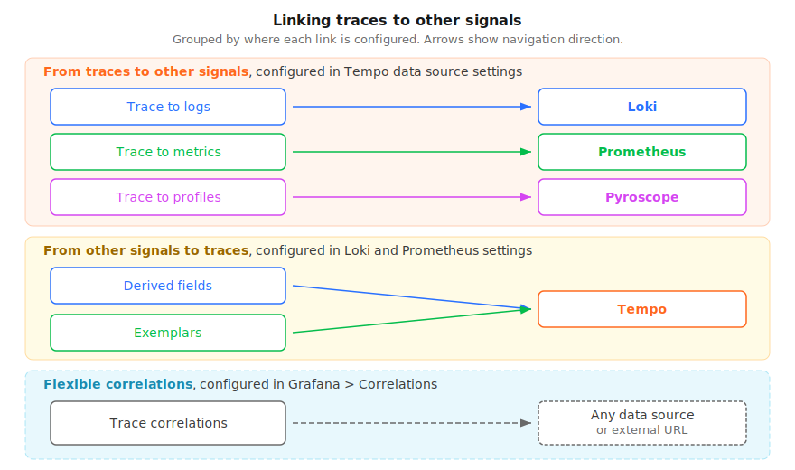

# Configure the Tempo data source

The Tempo data source connects Grafana to your Tempo database and lets you configure features and integrations with other telemetry signals.

You can configure the data source using either the data source interface in Grafana or using a configuration file.
This page explains how to connect Grafana to Tempo, set up authentication, and enable streaming.
For trace correlation features, provisioning, and other settings, refer to the linked sub-pages.

Depending upon your tracing environment, you may have more than one Tempo instance.
Grafana supports multiple Tempo data sources.

## Before you begin

To configure a Tempo data source, you need:

- Administrator rights to your Grafana instance.
- A Tempo instance configured to send tracing data to Grafana.
- An application or service instrumented to emit traces. Refer to [Instrument for tracing](https://grafana.com/docs/tempo/<TEMPO_VERSION>/getting-started/instrumentation/) if you haven't set this up yet.

If you're provisioning a Tempo data source, you also need administrative rights on the server hosting your Grafana instance.
Refer to [Provision the Tempo data source](https://grafana.com/docs/grafana/<GRAFANA_VERSION>/datasources/tempo/configure-tempo-data-source/provision/) for provisioning instructions.


You can't modify a provisioned data source from the Grafana UI. The settings form is read-only and the **Save & test** button is replaced by **Test** (you can test the connection but not save changes).

To make changes, you can either:

- **Clone the data source:** Create a new data source of the same type and copy the settings from the provisioned data source. Refer to [Clone a provisioned data source for Grafana Cloud](https://grafana.com/docs/grafana/<GRAFANA_VERSION>/datasources/tempo/configure-tempo-data-source/provision/#clone-a-provisioned-data-source-for-grafana-cloud).
- **Update the provisioning file:** Edit the YAML configuration file. Refer to [Provision the Tempo data source](https://grafana.com/docs/grafana/<GRAFANA_VERSION>/datasources/tempo/configure-tempo-data-source/provision/).
  

## Add or modify a data source

You can use these procedures to configure a new Tempo data source or to edit an existing one.

### Add a new data source

Follow these steps to set up a new Tempo data source:

1. Select **Connections** in the main menu.
1. Enter `Tempo` in the search bar.
1. Select **Tempo**.
1. Select **Add new data source** in the top-right corner of the page.
1. On the **Settings** tab, complete the **Name**, **Connection**, and **Authentication** sections.
   - Use the **Name** field to specify the name used for the data source in panels, queries, and Explore. Toggle the **Default** switch for the data source to be pre-selected for new panels.
   - Under **Connection**, enter the **URL** of the Tempo instance. Refer to the [connection](#connection) section for URL format examples.
   - Complete the [**Authentication** section](#authentication).

1. Optional: Configure other sections to add capabilities to your tracing data. Refer to the [Configure trace correlations](trace-correlations/) and [Other settings](#other-settings) sections for available options.
1. Select **Save & test**.

This video explains how to add data sources, including Loki, Tempo, and Mimir, to Grafana and Grafana Cloud. Tempo data source setup starts at 4:58 in the video.



### Update an existing data source

To modify an existing Tempo data source:

1. Select **Connections** in the main menu.
1. Select **Data sources** to view a list of configured data sources.
1. Select the Tempo data source you want to modify.
1. Configure or update additional sections to add capabilities to your tracing data.
1. After completing your updates, select **Save & test**.

## Connection

The URL format depends on your environment:

| Environment          | URL format                                 | Example                                             |
| -------------------- | ------------------------------------------ | --------------------------------------------------- |
| Self-managed Tempo   | `http://<TEMPO_HOST>:<PORT>`               | `http://tempo:3200`                                 |
| Grafana Cloud Traces | `https://tempo-<REGION>.grafana.net/tempo` | `https://tempo-prod-01-eu-west-0.grafana.net/tempo` |

The default port depends on the protocol: `3200` for HTTP, `9095` for gRPC.


Grafana Cloud includes [Grafana Cloud Traces](https://grafana.com/docs/grafana-cloud/send-data/traces/), a pre-configured tracing data source backed by Tempo. Add a Tempo data source manually when you need to connect to a self-managed Tempo instance or require custom configuration beyond what Grafana Cloud Traces provides.

The URLs in this table are for **querying** traces from Grafana. To configure how your applications **send** traces to Tempo (OTLP endpoints), refer to [Set up tracing](https://grafana.com/docs/grafana-cloud/send-data/traces/set-up-tracing/) for Grafana Cloud or [Instrument for tracing](https://grafana.com/docs/tempo/<TEMPO_VERSION>/getting-started/instrumentation/) for self-managed Tempo.


## Authentication

Use this section to select an authentication method to access the data source.


Use Transport Layer Security (TLS) for an additional layer of security when working with Tempo.
For additional information on setting up TLS encryption with Tempo, refer to [Configure TLS communication](https://grafana.com/docs/tempo/<TEMPO_VERSION>/configuration/network/tls/) and [Tempo configuration](https://grafana.com/docs/tempo/<TEMPO_VERSION>/configuration/).


[//]: # 'Shared content for authentication section procedure in data sources'



**Connecting to Grafana Cloud Traces:** Select **Basic authentication**. Use your Grafana Cloud stack's instance ID (shown in the Tempo data source URL on the Cloud Portal) as the **User**, and a Cloud Access Policy token with `traces:read` scope as the **Password**. Don't use your Grafana login credentials.

**Self-managed Tempo:** If Tempo is configured without authentication, select **No authentication**. If your Tempo instance uses basic auth, enter the credentials configured in your Tempo `server` block or reverse proxy.

## Multi-tenancy

If you're using a multi-tenant Tempo deployment, you need to send a tenant ID with each request so Tempo routes queries to the correct tenant.

To configure multi-tenancy:

1. In the Tempo data source settings, scroll to the **Authentication** section.
1. Expand the **HTTP Headers** subsection.
1. Add a header with the name `X-Scope-OrgID` and the value set to your tenant ID.

This header is set in the Grafana data source for _querying_. The same header must also be set on the _write path_ (in your Alloy or OpenTelemetry Collector configuration) to route trace data to the correct tenant on ingest.

For more information, refer to the [Tempo multi-tenancy documentation](https://grafana.com/docs/tempo/<TEMPO_VERSION>/operations/multitenancy/).

## Streaming

Streaming enables TraceQL query results to be displayed as they become available.
Without streaming, no results are displayed until all results have returned.

To use streaming, you need to:

- Run Tempo version 2.2 or later, or Grafana Enterprise Traces (GET) version 2.2 or later, or use Grafana Cloud Traces.
- **Grafana Cloud Traces:** Streaming is supported out of the box. No additional infrastructure configuration is required.
- **Self-managed Tempo or GET:** Tempo must have `stream_over_http_enabled: true` in its configuration for streaming to work. If your Tempo or GET instance is behind a load balancer or proxy that doesn't support gRPC or HTTP2, streaming may not work and should be deactivated.

  For more information, refer to [Tempo gRPC API](https://grafana.com/docs/tempo/<TEMPO_VERSION>/api_docs/#tempo-grpc-api).

### Activate streaming

Streaming is available in Grafana and Grafana Cloud.
The Streaming section has two toggles:

- **Search queries**: Streams TraceQL search results as they arrive.
- **Metrics queries**: Streams TraceQL metrics query results as they arrive.

Enable one or both depending on which query types you use.

When streaming is active, it shows as **Enabled** in **Explore**.
To check the status, select Explore in the menu, select your Tempo data source, and expand the **Options** section.

### Troubleshoot streaming

If streaming isn't working, refer to [Streaming issues](https://grafana.com/docs/grafana/<GRAFANA_VERSION>/datasources/tempo/troubleshooting/#streaming-issues) in the troubleshooting guide.

## Connect traces to other signals

Grafana provides several ways to link traces to other telemetry signals. The following diagram shows the available correlation mechanisms, the direction each goes, and where each is configured.

The Tempo data source settings page includes three sections for linking from spans to other signals. Each corresponds to a section in the settings form:

- [Trace to logs](configure-trace-to-logs/): Navigate from spans to related logs in Loki or another log data source.
- [Trace to metrics](configure-trace-to-metrics/): Link spans to metrics queries in Prometheus or other metrics data sources.
- [Trace to profiles](configure-trace-to-profiles/): Link spans to profiling data in Grafana Pyroscope with embedded flame graphs.

For more flexible, rule-based correlations that can target any data source or external URL, use Grafana [Trace correlations](trace-correlations/). Trace correlations are configured under **Configuration > Correlations**, not in the Tempo data source settings.

To link _from_ logs or metrics _to_ traces (the reverse direction), refer to:

- [Derived fields](https://grafana.com/docs/grafana/<GRAFANA_VERSION>/datasources/loki/configure-loki-data-source/#derived-fields) in the Loki data source (for logs to traces). The [trace to logs](configure-trace-to-logs/) page also covers this setup.
- [Exemplars](https://grafana.com/docs/grafana/<GRAFANA_VERSION>/fundamentals/exemplars/) in the Prometheus data source (for metrics to traces).

## Other settings

- [Additional settings](additional-settings/): Configure Service graph, node graph, search, TraceID query, span bar, and other settings.
- [Provision the Tempo data source](provision/): Configure the Tempo data source using a YAML file and clone provisioned data sources.

## Custom query variables

To use a variable in your trace to logs, metrics, or profiles configuration, you need to wrap it in `${}`.
For example, `${__span.name}`.

| Variable name          | Description                                                                                                                                                                                                                                                                                                                              |
| ---------------------- | ---------------------------------------------------------------------------------------------------------------------------------------------------------------------------------------------------------------------------------------------------------------------------------------------------------------------------------------- |
| **\_\_tags**           | This variable uses the tag mapping from the UI to create a label matcher string in the specific data source syntax. The variable only uses tags that are present in the span. The link is still created even if only one of those tags is present in the span. You can use this if all tags are not required for the query to be useful. |
| **\_\_span.spanId**    | The ID of the span.                                                                                                                                                                                                                                                                                                                      |
| **\_\_span.traceId**   | The ID of the trace.                                                                                                                                                                                                                                                                                                                     |
| **\_\_span.duration**  | The duration of the span.                                                                                                                                                                                                                                                                                                                |
| **\_\_span.name**      | Name of the span.                                                                                                                                                                                                                                                                                                                        |
| **\_\_span.tags**      | Namespace for the tags in the span. To access a specific tag named `version`, you would use `${__span.tags.version}`. In case the tag contains dot, you have to access it as `${__span.tags["http.status"]}`.                                                                                                                            |
| **\_\_trace.traceId**  | The ID of the trace.                                                                                                                                                                                                                                                                                                                     |
| **\_\_trace.duration** | The duration of the trace.                                                                                                                                                                                                                                                                                                               |
| **\_\_trace.name**     | The name of the trace.                                                                                                                                                                                                                                                                                                                   |
