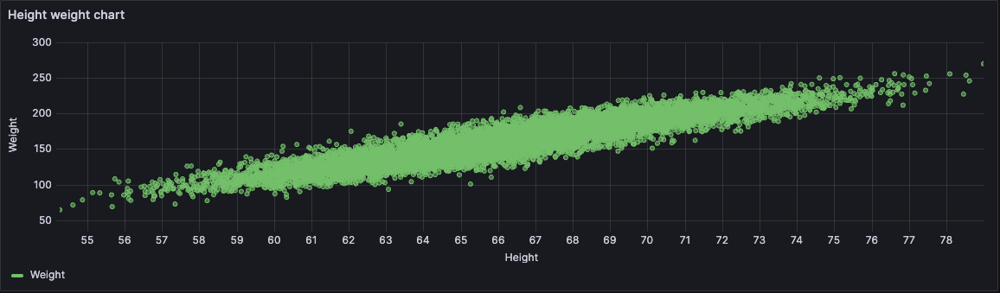

# XY chart

XY charts provide a way to visualize arbitrary x and y values in a graph so that you can see the easily show the relationship between two variables.

<!--add more ideal use cases/examples here-->

## Supported data formats

You can use any type of tabular data in an xy chart. This type of visualization doesn't require time data.

## XY chart options

### Series mapping

Set how series data is mapped in the chart.

- **Auto** - Automatically generates series from all available data frames (or datasets). You can filter to select only one frame.
- **Manual** - Explicitly define the series by selecting from available data frames.

Depending on your series mapping selection, the rest of the **XY chart** options differ. Expand the sections below for options based on your mapping mode.

### Auto series mapping options



#### Frame

By default, all data frames are available and displayed in the chart. You can filter to select only one frame.

#### X-field

Select which field the x-axis represents. By default, this is the first number field in each data frame. For example, you enter the following CSV content:

| a   | b   | c   |
| --- | --- | --- |
| 0   | 0   | 0   |
| 1   | 1   | 9   |
| 2   | 2   | 4   |

In the resulting chart, the values in column "a" are used as the x-field unless you define it differently.

#### Y-fields

The series of the chart are generated from the y-fields. After the x-field is set, by default, all the remaining number fields in the data frame are designated as the y-fields. You can select one y-field to include or you can use [overrides][Configure an override] to exclude y-fields individually. To disable y-fields individually:

- Series > Hide in area > Viz

#### Size field

Use this option to set which field value controls size of the points in the chart. This value is relative to the minium and maximum of all the values in the data frame.

When you select this option, you can then set the [Point size](#point-size), [Min point size](#min-point-size), and [Max point size](#max-point-size) options.

<!--shouldn't the other series on the chart still show up even if you've set this using one field, assuming you're using all the data frames? -->

#### Color field

This option is only valid when you've set the **Size field** option. Grafana sets this field based on the size of a value relative to the min and max values of a series or the **Min point size** and **Max point size** values if they're set. To use the color value options under the Standard options, you must set this field.

Typically, this option is used when you only have one series displayed in the chart.

#### Show

Set how values are represented in the visualization.

- **Points** - Display values as points. When you select this option, the [Point size](#point-size), [Min point size](#min-point-size), and [Max point size](#max-point-size) options are also displayed. These fields are only valid when you set the **Size field** option.
- **Lines** - Display values as lines. When you select this option, the [Line style](#line-style) and [Line width](#line-width) options are also displayed.
- **Both** - Display values as both points and lines.

#### Point size

Set the size of the points, from 1 to 100 pixels in diameter. The default size is 5 pixels. You can set an [override][Configure field overrides] to set the pixel size by series.

#### Min point size

Use this option to control the minimum point size when you've set the **Size field** option. You can [override][Configure field overrides] this option for specific series.

#### Max point size

Use this option to control the minimum point size when you've set the **Size field** option. You can [override][Configure field overrides] this option for specific series.

#### Line style

Set the style of the line. To change the color, use the standard [color scheme][] field option.

- **Solid:** Display a solid line. This is the default setting.
- **Dash:** Display a dashed line. When you choose this option, a list appears for you to select the length and gap (length, gap) for the line dashes. Dash spacing set to 10, 10 (default).
- **Dots:** Display dotted lines. When you choose this option, a list appears for you to select the gap (length = 0, gap) for the dot spacing. Dot spacing set to 0, 10 (default)

#### Line width

Set the width of the lines, from 1 to 10 pixels.



### Manual series mapping options



#### Data

<!--what is the scenario where you need to choose a data set?-->

Select your data set. You have more than one dataset or table, so you can select series (dataframe)

This option is only available when you set **Series mapping** to **Manual** mode.

You'll set the **X-field** and **Y-field** options, as well as the **Point color** and **Point size** rules

#### Add series

Select the series that you want to include in the visualization.

#### X-field

Select which field the x-axis represents.

#### Y-fields

Select which fields the y-axis represents.

In **Manual** mode, you can control both the **X-field** and **Y-field** options.

In **Auto** mode, you can only update the x-field and the y-fields are automatically assigned based on that selection. In this mode you can enable and disable the **Y-field**.

For example, if your data source has a table with five columns, you may want to disable one or more of the columns so that they're not included in the visualization.

#### Point color

Explicitly define the **Point color** rules. Select from **Fixed color** or a field.

#### Point size (Manual mode)

Explicitly define the **Point size** rules. This option is specific to when you're defining fields in manual mode and not the same as the general [Point size option](#point-size) for the visualization. Select from **Fixed value** or a field.

#### Show

Set how values are represented in the visualization.

- **Points** - Display values as points. When you select this option, the [Point size](#point-size) option is also displayed.
- **Lines** - Display values as lines. When you select this option, the [line style](#line-style) and [line width](#line-width) options are also displayed.
- **Both** - Display values as both points and lines.

#### Point size

Set the size of the points, from 1 to 40 pixels in diameter.

#### Line style

Set the style of the line. To change the color, use the standard [color scheme][] field option.

- **Solid:** Display a solid line. This is the default setting.
- **Dash:** Display a dashed line. When you choose this option, a list appears for you to select the length and gap (length, gap) for the line dashes. Dash spacing set to 10, 10 (default).
- **Dots:** Display dotted lines. When you choose this option, a list appears for you to select the gap (length = 0, gap) for the dot spacing. Dot spacing set to 0, 10 (default)

#### Line width

Set the width of the lines, from 1 to 10 pixels.



## Tooltip options

Tooltip options control the information overlay that appears when you hover over data points in the graph.



## Legend options

Legend options control the series names and statistics that appear under or to the right of the graph.



## Axis options

Options under the axis category change how the x- and y-axes are rendered. Some options do not take effect until you click outside of the field option box you are editing. You can also or press `Enter`.

### Placement

Select the placement of the y-axis.

- **Auto:** Automatically assigns the y-axis to the series. When there are two or more series with different units, Grafana assigns the left axis to the first unit and the right axis to the units that follow.
- **Left:** Display all y-axes on the left side.
- **Right:** Display all y-axes on the right side.
- **Hidden:** Hide all axes.

To selectively hide axes, [Add a field override][] that targets specific fields.

### Label

Set a y-axis text label. If you have more than one y-axis, then you can assign different labels using an override.

### Width

Set a fixed width of the axis. By default, Grafana dynamically calculates the width of an axis.

By setting the width of the axis, data with different axes types can share the same display proportions. This setting makes it easier for you to compare more than one graph’s worth of data because the axes are not shifted or stretched within visual proximity to each other.

### Show grid lines

Set the axis grid line visibility.

- **Auto:** Automatically show grid lines based on the density of the data.
- **On:** Always show grid lines.
- **Off:** Never show grid lines.

### Color

Set the color of the axis.

- **Text:** Set the color based on theme text color.
- **Series:** Set the color based on the series color.

### Show border

Set the axis border visibility.

### Scale

Set the y-axis values scale.

- **Linear:** Divides the scale into equal parts.
- **Logarithmic:** Use a logarithmic scale. When you select this option, a list appears for you to choose a binary (base 2) or common (base 10) logarithmic scale.
- **Symlog:** Use a symmetrical logarithmic scale. When you select this option, a list appears for you to choose a binary (base 2) or common (base 10) logarithmic scale. The linear threshold option allows you to set the threshold at which the scale changes from linear to logarithmic.

### Centered zero

Set the y-axis to be centered on zero.

### Soft min and soft max

Set a **Soft min** or **soft max** option for better control of y-axis limits. By default, Grafana sets the range for the y-axis automatically based on the dataset.

**Soft min** and **soft max** settings can prevent small variations in the data from being magnified when it's mostly flat. In contrast, hard min and max values help prevent obscuring useful detail in the data by clipping intermittent spikes past a specific point.

To define hard limits of the y-axis, set standard min/max options. For more information, refer to [Configure standard options][].

### Transform

Use this option to transform the series values without affecting the values shown in the tooltip, context menu, or legend.

- **Negative Y transform:** Flip the results to negative values on the Y axis.
- **Constant:** Show the first value as a constant line.

{}
The transform option is only available as an override.
{}



## Other visualization options

### Panel options

Learn about [panel options][] that you can set for a visualization.

### Standard options

Learn about [standard options][] that you can set for a visualization.

### Data links

Learn about [data links][] that you can set for a visualization.

### Field overrides

Learn about [field overrides][Configure field overrides] that you can set for a visualization.

{}
[Color scheme]: "/docs/grafana/ -> /docs/grafana/<GRAFANA VERSION>/panels-visualizations/configure-standard-options#color-scheme"
[Color scheme]: "/docs/grafana-cloud/ -> /docs/grafana-cloud/visualizations/panels-visualizations/configure-standard-options#color-scheme"

[Add a field override]: "/docs/grafana/ -> /docs/grafana/<GRAFANA VERSION>/panels-visualizations/configure-overrides#add-a-field-override"
[Add a field override]: "/docs/grafana-cloud/ -> /docs/grafana-cloud/visualizations/panels-visualizations/configure-overrides#add-a-field-override"

[Configure standard options]: "/docs/grafana/ -> /docs/grafana/<GRAFANA VERSION>/panels-visualizations/configure-standard-options#max"
[Configure standard options]: "/docs/grafana-cloud/ -> /docs/grafana-cloud/visualizations/panels-visualizations/configure-standard-options#max"

[color scheme]: "/docs/grafana/ -> /docs/grafana/<GRAFANA VERSION>/panels-visualizations/configure-standard-options#color-scheme"
[color scheme]: "/docs/grafana-cloud/ -> /docs/grafana-cloud/visualizations/panels-visualizations/configure-standard-options#color-scheme"

[Configure field overrides]: "/docs/grafana/ -> /docs/grafana/<GRAFANA VERSION>/panels-visualizations/configure-overrides"
[Configure field overrides]: "/docs/grafana-cloud/ -> /docs/grafana-cloud/visualizations/panels-visualizations/configure-overrides"

[panel options]: "/docs/grafana/ -> /docs/grafana/<GRAFANA VERSION>/panels-visualizations/configure-panel-options"
[panel options]: "/docs/grafana-cloud/ -> /docs/grafana-cloud/visualizations/panels-visualizations/configure-panel-options"

[standard options]: "/docs/grafana/ -> /docs/grafana/<GRAFANA VERSION>/panels-visualizations/configure-standard-options"
[standard options]: "/docs/grafana-cloud/ -> /docs/grafana-cloud/visualizations/panels-visualizations/configure-standard-options"

[data links]: "/docs/grafana/ -> /docs/grafana/<GRAFANA VERSION>/panels-visualizations/configure-data-links"
[data links]: "/docs/grafana-cloud/ -> /docs/grafana-cloud/visualizations/panels-visualizations/configure-data-links"
{}
