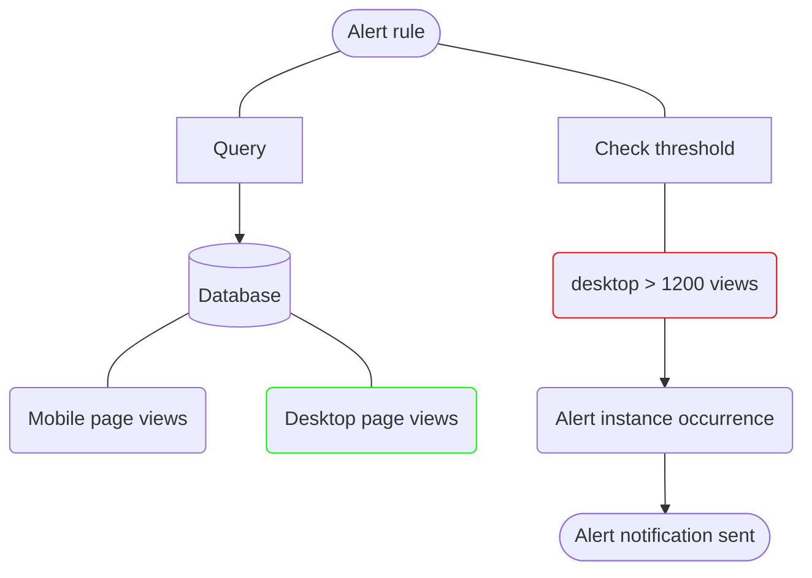

# Get started with Grafana Alerting II

```mermaid
flowchart TB
    R(["Alert rule"]) --- Q["Query"]
    R --- exp["Check threshold"]
    Q --> D[("Database")]
    D --- tsdata("Mobile page views") & tsdata2("Desktop page views")
    exp --- V("desktop > 1200 views")
    V --> I("Alert instance occurrence")
    I --> N(["Alert notification sent"])
    style tsdata2 stroke:#0f0
    style V stroke:#f00
```