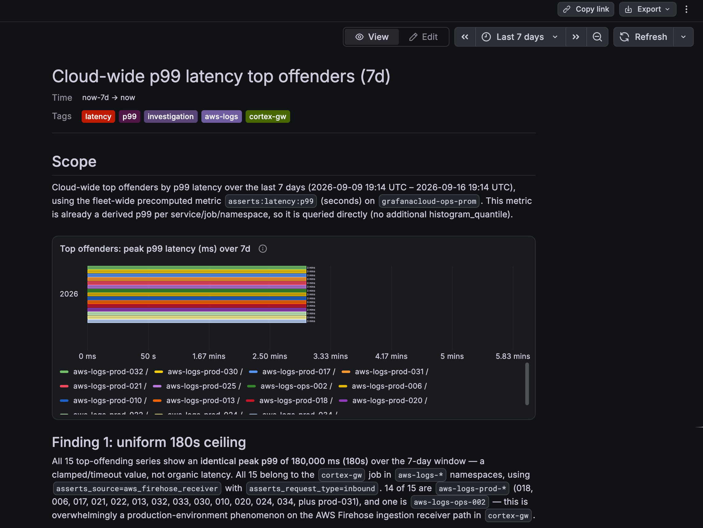
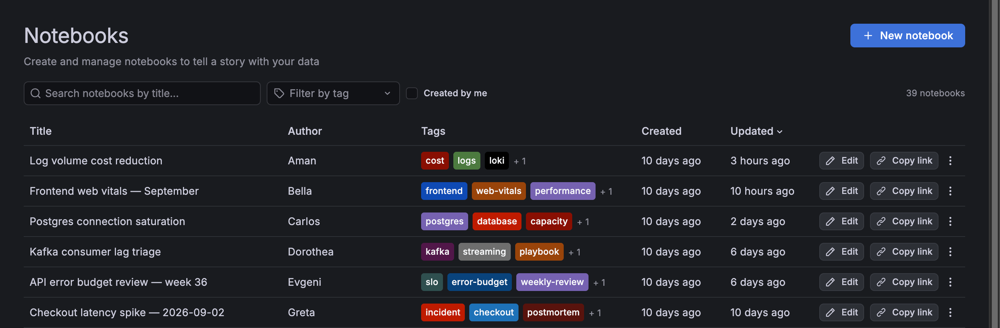
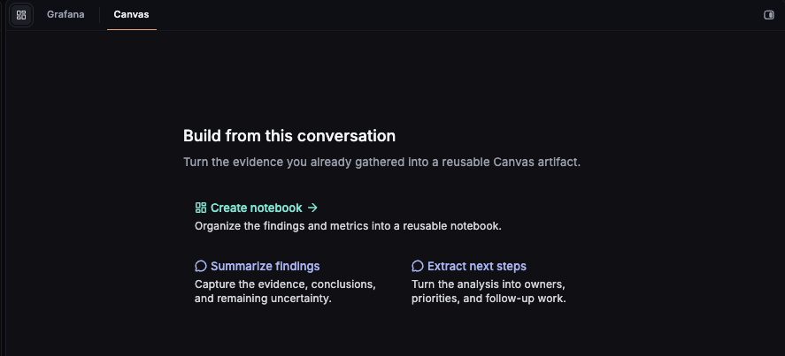

---
labels:
  products:
    - cloud
    - enterprise
    - oss
title: Notebooks
weight: 85
description: Create and manage notebooks, a linear, narrative artifact for investigations that include text and panel blocks.
---

# Notebooks



A notebook is a linear page of blocks.
Text blocks hold narrative and notes, and panel blocks hold queries that render inline.
The sequence mirrors how an investigation proceeds, so it tells the story of an investigation without extra authoring.

Every block is directly editable, and you can rewrite, reorder, or remove anything in the notebook.
You can also add more context, as needed.

You can share a saved notebook with your teammates and reload it as context for a new or continuing investigation in a Grafana Assistant investigation.
This way, the next investigation builds on what was already learned.



A notebook has the following benefits:

- Provides a space to persist what you learned from your Grafana Assistant chats.
- Removes the need for incident-specific dashboards that contribute to dashboard sprawl.
- Doesn't require you to declare an incident to be able to generate an investigation artifact, providing a space for pre-escalation work.
- Keeps your investigation notes within Grafana rather than in external tools, like chat apps, wikis, or stand-alone documents.

Many investigations never become incidents, but the pre-escalation work often includes important signals, and notebooks let you keep that.
Additionally, they provide reusable context you can return to the next time something similar happens.
Each investigation in a notebook makes the next one faster.

## Notebooks, Dashboards, and Workspace

Notebooks offer the following advantages over other tools for recording investigations:

<!-- prettier-ignore-start -->

| Feature | Pro                                                                                                                               | Con                                                     |
| ------- | --------------------------------------------------------------------------------------------------------------------------------- | ------------------------------------------------------- |
| Dashboard | Reusable | <ul><li>You have to design the dashboard while you're still in the investigation stage.</li><li>Dashboard is no longer a curated surface.</li></ul>                            |
| Workspace canvas | No design concerns | <ul><li>Ephemeral</li><li>Agent-authored</li><li>Not editable</li></ul>                                                                                       |
| Notebook | <ul><li>Scratch pad while you work that you can clean up later</li><li>Picks up where the Workspace canvas leaves off</li><li>Human-authored and editable.</li><li>Reusable</li></ul> |    |

<!-- prettier-ignore-end -->

## Manage notebooks

The **Notebooks** page lists all of the notebooks in your organization, along with the following details:

- Title
- Author username
- Tags
- Creation date
- Date of last update



You can search the page by notebook title and filter by tags or by notebooks you authored.

On this page, you can also take the following actions on a notebook:

- Edit
- Copy a shareable link
- Delete
- Export by copying the raw Markdown
- Export by downloading a .md file

When you export a notebook, panels render as JSON code blocks, like this:

```json
[
  {
    "refId": "A",
    "datasource": "grafanacloud-usage",
    "type": "prometheus",
    "query": {
      "expr": "grafanacloud_org_metrics_billable_series"
    }
  }
]
```

## Add notebooks

To create a notebook from the **Notebooks** page, follow these steps:

1. Navigate to **Notebooks**.
1. Click **+ New notebook**.
1. Update the title of the notebook to something more descriptive and easy to search.
1. Add tags to further define the subject of your notebook.
1. Start typing to start a text block or click one of the other options to add:

   - **Heading**: Adds an H3 heading.
   - **Paragraph**: The default. Use this to revert to paragraph text if you've previously selected another option.
   - **Code**: Select a language to write the code, like plain text, Go, or SQL.
   - **Visualization**: Opens the panel query editor with a graph panel below it.

1. Add as many blocks as you need.
1. In the toolbar, take the following actions, as needed:

   - Click the undo and redo icons at the top of the notebook to revert or reinstate changes.
   - Change the time range of the notebook.
   - Change the refresh rate of the notebook.

1. When you've finished making changes, click **View** to leave edit mode.

You don't need to save a notebook because it auto-saves throughout the creation process.

You can also get a share link, export, and delete a notebook from this screen.

## Create notebooks from Grafana Assistant Workspace

When you complete a chat with the Grafana Assistant in Workspace, notebooks help you pick up where the canvas leaves off.

While you investigate in Workspace, the canvas assembles the work as an ephemeral notebook of the questions, panels, and findings.
The Assistant builds the canvas autonomously in **Investigation** mode, or by way of your chat.

When the canvas is worth keeping, you can direct Assistant to create a notebook or click the option:



## Add notebooks to incidents

TBD

## Edit notebooks

To edit a notebook, follow these steps:

1. Navigate to **Notebooks**.
1. Click the title of the notebook you want to update.
1. Click **Edit** at the top of the notebook to leave view mode.
1. Make any needed updates.

   Note that you might need to expand panel queries to edit them as they might be collapsed, by default.

1. When you've finished making changes, click **View** to leave edit mode.

You don't need to save a notebook because it auto-saves throughout the creation process.
