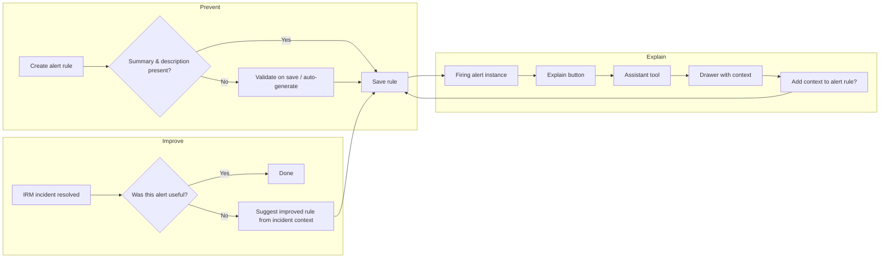

# The Mystery Alert

**Hackathon project · Grafana Alerting + IRM + Assistant**

Turn vague, unactionable alerts into context-rich notifications — before they page someone at 3am, and after they fire.

---

## The problem

You get paged. You open Grafana and see:

- A vague alert name
- A raw query
- No summary, no description, no sense of what to do

You ignore the notification, go back to bed, and wake up to a customer escalation.

Grafana already supports the annotations that make alerts actionable — **summary** and **description** — but they are optional and often left empty. We have the tools to fill that gap. This hackathon puts them to work.

---

## Hackathon outcome

By the end of the hackathon, a user should be able to:

1. **Find out more** about a firing alert when context is missing
2. **Decide** whether the alert is useless or just under-documented
3. **Prevent recurrence** by improving the alert rule with generated context

---

## Solution overview

| Phase | When | What |
| --- | --- | --- |
| **Prevent** | Alert rule creation / save | Require or auto-generate summary & description |
| **Explain** | Alert instance is firing | Use Assistant to infer context from query, labels, and history |
| **Improve** | After incident resolution | Ask "Was this alert useful?" and feed learnings back into the rule |

---

## Scope

### Must have

- **Auto-add missing descriptions and summaries** into alerts created in the UI

### Bonus

- **Validate on save** — catch a new alert with a missing description or summary and generate it at save time
- **Export changes** for rules managed as code (provisioning / Terraform / file export)

---

## Doc index

| Document | Purpose |
| --- | --- |
| [Product spec](./product-spec.md) | Feature requirements, acceptance criteria, and technical notes |
| [User flows](./user-flows.md) | Step-by-step flows for creation, Explain, impact evaluation, and IRM check-in |
| [Work breakdown](./work-breakdown.md) | Ownership, milestones, and demo script |

---

## Team

| Area | Owner | Focus |
| --- | --- | --- |
| Frontend validation | Lauren | Mandatory summary & description on alert rule form; save validation |
| Assistant tool | Pepe | Query/history analysis; description & summary generation |
| Explain UI | TBD | Explain button, drawer, "add context to alert" action |
| IRM integration | TBD | Incident check-in, usefulness question, context feedback loop |

---

## Published product docs

Hackathon product documentation lives in the official docs tree (for deploy preview):

| Product | Path |
| --- | --- |
| **Grafana Alerting** | `docs/sources/alerting/mystery-alert/` |
| **Grafana IRM** | `irm/docs/sources/irm/mystery-alert/` (grafana/irm repo) |

Open PRs on branch `hackathon/mystery-alert` in each repo to get deploy previews.

## Related Grafana docs

- [Labels and annotations](https://grafana.com/docs/grafana/latest/alerting/fundamentals/alert-rules/annotation-label/) — `summary` and `description` annotation keys
- [Create Grafana-managed alert rules](https://grafana.com/docs/grafana/latest/alerting/alerting-rules/create-grafana-managed-rule/) — current optional summary/description fields
- [Provision alerting resources](https://grafana.com/docs/grafana/latest/alerting/set-up/provision-alerting-resources/) — export path for rules-as-code bonus

## Repo pointers

| Area | Path |
| --- | --- |
| Alerting product docs | `docs/sources/alerting/` |
| Alerting UI | `public/app/features/alerting/unified/` |
| ngalert backend | `pkg/services/ngalert/` |
| Alerting package | `packages/grafana-alerting/` |
