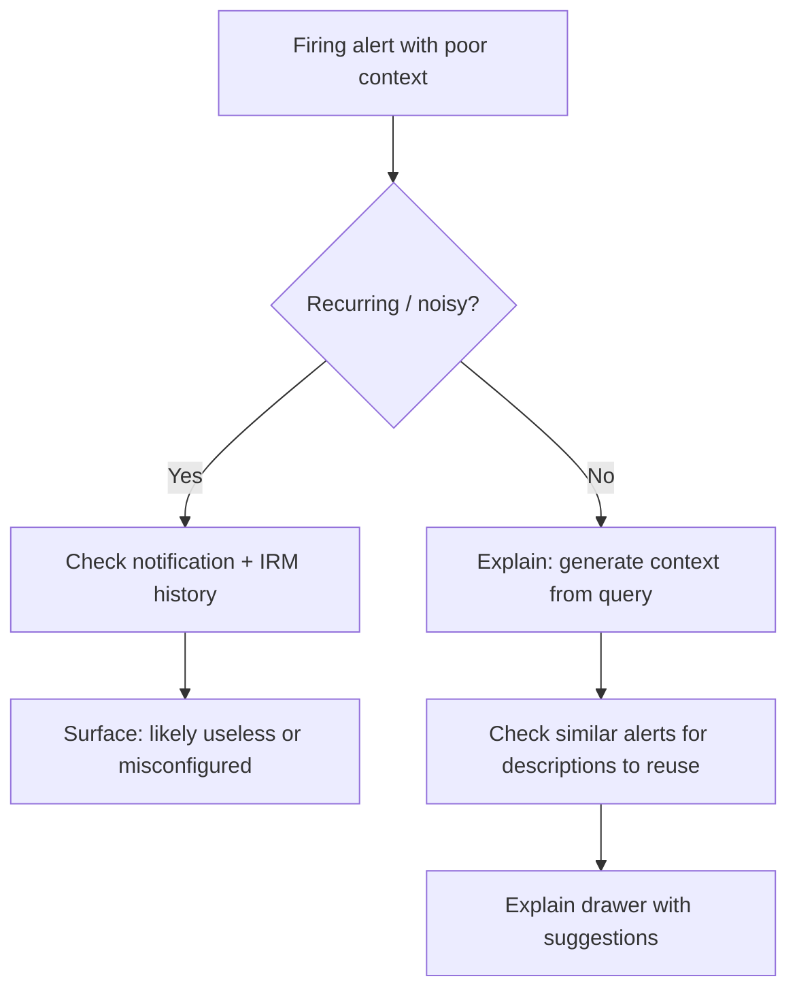

# Product spec — The Mystery Alert

## Problem statement

Alert notifications are only actionable when they answer: **what happened**, **why it matters**, and **what to do next**. Today, many Grafana alert rules ship with empty `summary` and `description` annotations. On-call engineers receive pages they cannot triage without deep context — or they dismiss them and miss real incidents.

---

## Goals

### Primary

Make alert rules created in the UI include meaningful **summary** and **description** annotations — either supplied by the author or generated automatically.

### Secondary

1. Help on-call engineers understand a **firing alert instance** when annotations are missing
2. Distinguish **useless alerts** from **under-documented alerts**
3. Close the loop after incidents so alerts improve over time

### Non-goals (hackathon)

- Replacing notification routing or contact point configuration
- Full production-ready Assistant/GCX integration (prototype is fine)
- Changing default notification templates org-wide (bonus only)

---

## Feature areas

### 1. Pre-creation — frontend validation

**Owner:** Lauren

**Problem:** Authors can save alert rules without summary or description.

**Solution:** Treat summary and description as required fields on the Grafana-managed alert rule form.

| Requirement                                                                     | Priority | Notes                                                                                                                  |
| ------------------------------------------------------------------------------- | -------- | ---------------------------------------------------------------------------------------------------------------------- |
| Add visible **Summary** and **Description** fields to create/edit alert rule UI | Must     | Map to `annotations.summary` and `annotations.description`                                                             |
| Block save when either field is empty                                           | Must     | Inline validation + error message                                                                                      |
| Show helper text explaining what each field is for                              | Should   | Link to [annotation docs](https://grafana.com/docs/grafana/latest/alerting/fundamentals/alert-rules/annotation-label/) |
| On save with missing fields, offer **Generate with Assistant**                  | Bonus    | Ties into Assistant tool (Pepe)                                                                                        |

**Acceptance criteria**

- [ ] User cannot save a new Grafana-managed rule without summary and description
- [ ] User cannot save edits that clear summary or description
- [ ] Validation errors are field-level and clear
- [ ] (Bonus) Save attempt with empty fields triggers Assistant generation offer

---

### 2. Pre-creation — validate on save with auto-generation

**Owner:** Lauren + Pepe

**Problem:** Validation alone creates friction; authors may not know what to write.

**Solution:** On save, if summary or description is missing, call the Assistant tool to generate them before persisting the rule.

| Requirement                                                      | Priority | Notes                         |
| ---------------------------------------------------------------- | -------- | ----------------------------- |
| Detect missing summary/description at save time                  | Bonus    | Extends frontend validation   |
| Call Assistant with rule query, labels, and existing annotations | Bonus    |                               |
| Pre-fill generated values; allow user to edit before final save  | Bonus    |                               |
| Export updated rule for provisioning workflows                   | Bonus    | File export / API / Terraform |

**Acceptance criteria**

- [ ] (Bonus) Save with empty fields opens generation flow instead of hard block
- [ ] (Bonus) Generated text is editable before commit
- [ ] (Bonus) Updated annotations appear in exported/provisioned rule payload

---

### 3. Retrospective — Explain button on alert instance

**Owner:** Explain UI + Pepe

**Problem:** A firing alert has no useful context in the notification or instance view.

**Solution:** Add an **Explain** action on the alert instance that calls Assistant/GCX and surfaces inferred context in a drawer.

| Requirement                                                     | Priority | Notes                                                 |
| --------------------------------------------------------------- | -------- | ----------------------------------------------------- |
| **Explain** button on alert instance detail                     | Must     | Alerting → Alert rules → instance, or Alerts page     |
| Drawer UI showing generated summary, description, and rationale | Must     |                                                       |
| Assistant reads query, labels, and annotations                  | Must     |                                                       |
| **Add this context to the alert?** action                       | Must     | Writes generated summary/description back to the rule |
| Include Explain output in default notification template         | Bonus    | So pages are richer even before rule is updated       |

**Assistant tool inputs**

- Alert rule query (and expressions)
- Labels and existing annotations
- (Bonus) Notification history for this rule
- (Bonus) IRM incident history linked to this alert

**Assistant tool outputs**

- Proposed `summary` (short, notification-friendly)
- Proposed `description` (longer, runbook-style)
- Confidence / source notes (which signals were used)

**Acceptance criteria**

- [ ] Explain button visible on firing alert instance when summary or description is empty or very short
- [ ] Drawer loads within reasonable time with loading state
- [ ] User can accept generated context and persist to alert rule
- [ ] (Bonus) Explain content available as template variable for notifications

---

### 4. Impact evaluation — is this alert useless?

**Owner:** Pepe + Explain UI

**Problem:** Not every vague alert needs better docs — some are noise.

**Solution:** Before or alongside Explain, analyse whether similar alerts are actionable and what happened historically.

| Signal                   | What to check                                                                    |
| ------------------------ | -------------------------------------------------------------------------------- |
| **Similar alerts**       | Other rules with same/similar query or labels; do they have summary/description? |
| **Past actions**         | Silences, resolutions, acknowledgement patterns                                  |
| **Notification history** | Was anyone paged? Did notifications get muted?                                   |
| **Alert history**        | Is this recurring? Same instance flapping?                                       |
| **Query analysis**       | Is the query meaningful, too broad, or copy-pasted?                              |

**Decision tree**

**Acceptance criteria**

- [ ] Explain flow considers at least query + labels for generation
- [ ] (Stretch) UI indicates if alert appears recurring based on history
- [ ] (Stretch) Similar alerts with good annotations are suggested as references

---

### 5. Bulk actions — find under-documented alerts

**Owner:** TBD

**Problem:** The problem exists at scale across many existing rules.

**Solution:** Bulk view or filter for alert rules with missing or short summary/description.

| Requirement                                                   | Priority | Notes                  |
| ------------------------------------------------------------- | -------- | ---------------------- |
| Filter or report: rules with empty summary and/or description | Should   | Alert rules list       |
| Filter: summary or description below N characters             | Should   | Configurable threshold |
| Bulk **Explain** or **Generate** for selected rules           | Bonus    |                        |

**Acceptance criteria**

- [ ] User can identify rules missing annotations without opening each rule
- [ ] (Bonus) Bulk generation for selected rules

---

### 6. IRM integration — close the loop

**Owner:** IRM integration

**Problem:** Incidents reveal which alerts are not useful, but that knowledge does not flow back to alerting.

**Solution:** After incident resolution, ask whether the triggering alert was useful and offer to improve it.

| Requirement                                                        | Priority | Notes                                  |
| ------------------------------------------------------------------ | -------- | -------------------------------------- |
| **Was this alert useful?** prompt at end of IRM incident flow      | Bonus    | Yes → no action; No → improvement flow |
| Feed IRM timeline/context into alert instance view                 | Bonus    | Link incident notes back to alert      |
| If not useful, consolidate incident context to suggest better rule | Bonus    | Reuse Assistant tool                   |
| Suggest related Alert or SLO after incident                        | Stretch  |                                        |

**Acceptance criteria**

- [ ] (Bonus) Resolved incident shows usefulness check-in
- [ ] (Bonus) "No" path opens suggested summary/description/rule changes
- [ ] (Stretch) IRM context visible on related alert instance

---

## Annotation reference

Grafana uses standard annotation keys on alert rules:

| Key           | Purpose                         | Example                                                                                                   |
| ------------- | ------------------------------- | --------------------------------------------------------------------------------------------------------- |
| `summary`     | Short text for notifications    | `Instance {{ $labels.instance }} is down`                                                                 |
| `description` | Detailed context / runbook hint | `The uptime check for {{ $labels.job }} has failed for 5m. Check the service logs and restart if needed.` |

See: `docs/sources/alerting/fundamentals/alert-rules/annotation-label.md`

---

## Open questions

1. **Threshold for "short"** — character count vs. heuristic (e.g. no template variables, no labels referenced)?
2. **Data-source-managed rules** — same validation for Prometheus/Mimir rules, or Grafana-managed only for hackathon?
3. **Assistant availability** — GCX in Cloud only, or local Assistant stub for OSS demo?
4. **Permissions** — who can accept "Add context to alert" (rule editor vs. viewer)?
5. **Provisioning export** — file provisioning, HTTP API, or Terraform for bonus demo?

---

## Demo script (5 min)

1. Show an alert rule with empty summary/description firing → vague notification
2. Click **Explain** on the instance → drawer with generated context
3. Click **Add this context to the alert** → rule updated
4. Create a new rule without annotations → validation blocks save (or auto-generates on bonus path)
5. (Bonus) Resolve IRM incident → "Was this alert useful?" → improve rule from incident context
