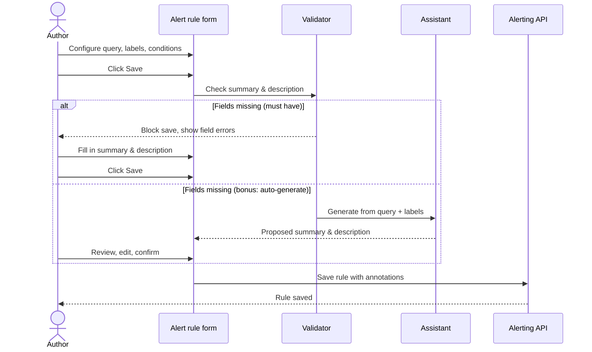
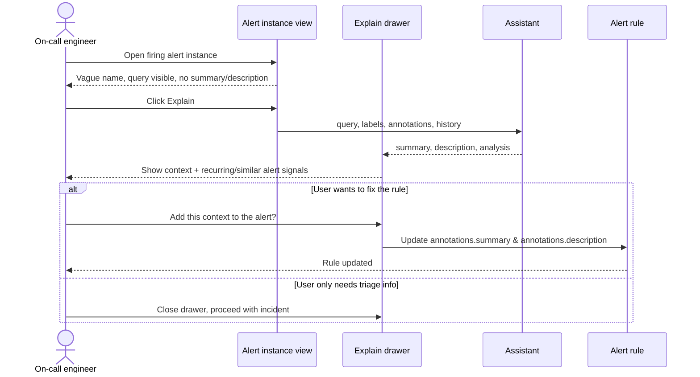
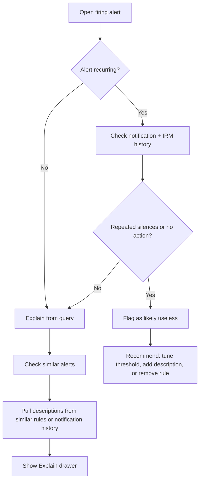
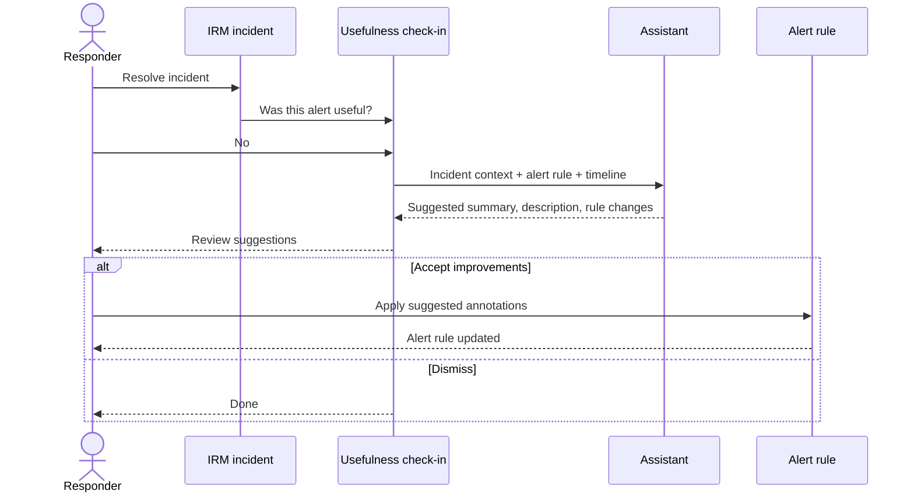

# User flows — The Mystery Alert

## Flow 1 — Create alert rule (prevent)

**Actor:** Alert rule author  
**Goal:** Save a rule with actionable summary and description

### Steps

1. Author opens **Alerting → Alert rules → New alert rule**
2. Configures query, labels, and evaluation settings
3. Fills **Summary** and **Description** (new required fields)
4. Clicks **Save**
5. If validation fails, inline errors appear on empty fields
6. (Bonus) If empty on save, Assistant proposes values in a review step

---

## Flow 2 — Firing alert with no context (explain)

**Actor:** On-call engineer  
**Goal:** Understand what the alert means and decide what to do

### Steps

1. Engineer receives page or opens **Alerting → Alerts**
2. Selects firing instance with poor context
3. Clicks **Explain**
4. Drawer shows:
   - Generated summary and description
   - Query interpretation
   - (Stretch) Similar alerts with good annotations
   - (Stretch) Notification / silence history
5. Engineer triages the incident
6. Optionally clicks **Add this context to the alert** to persist improvements

---

## Flow 3 — Impact evaluation (useless vs under-documented)

**Actor:** On-call engineer  
**Goal:** Decide if the alert should be fixed, silenced, or deleted

### Decision guide (for UI copy)

| Signal | Likely diagnosis | Suggested action |
| --- | --- | --- |
| First time firing, empty annotations | Under-documented | Explain → add context |
| Fires often, frequently silenced | Noisy / useless | Review threshold or delete |
| Similar rules have good annotations | Copy-paste gap | Pull from similar alert |
| IRM incidents with "not useful" votes | Useless | Improve or remove in check-in flow |

---

## Flow 4 — IRM incident check-in (improve)

**Actor:** Incident responder  
**Goal:** Feed incident learnings back into alerting

### Steps

1. Responder resolves incident in IRM
2. Prompt: **Was the alert that triggered this incident useful?**
3. **Yes** → flow ends
4. **No** → Assistant consolidates incident notes, timeline, and alert metadata
5. Suggests improved summary, description, or rule configuration
6. Responder accepts or dismisses

---

## Flow 5 — Bulk identify under-documented rules

**Actor:** Platform / alerting admin  
**Goal:** Find and fix rules missing context at scale

1. Open **Alerting → Alert rules**
2. Apply filter: **Missing summary or description** (or below length threshold)
3. Review list of affected rules
4. (Bonus) Select multiple rules → **Generate context** via Assistant
5. Review and save batch updates
6. (Bonus) Export updated rules for provisioning

---

## UI touchpoints

| Surface | Change |
| --- | --- |
| Alert rule form (create/edit) | Required Summary & Description fields; save validation |
| Alert instance detail | Explain button; context drawer |
| Alert rules list | Filter for missing/short annotations; bulk actions |
| Notification template (bonus) | Include Explain-generated context |
| IRM incident resolution (bonus) | Usefulness check-in; link back to alert rule |
