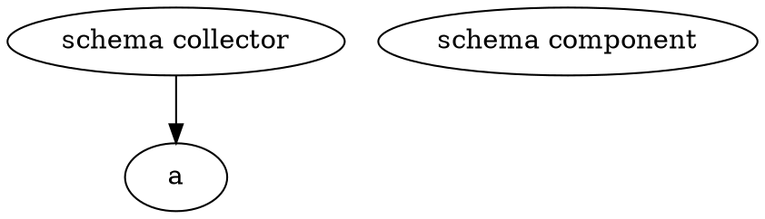

# Intent API planned architecture

Grafana's experimental Intent API is an enormous project. To help keep discussion and collaboration broadly aligned, this document contains a rough, handwavy system diagram indicating completed and planned dependencies between major parts.

TODO explain the basic rules we're following the keep the diagram simple

## Definitions

### Component

A Component is a subtree of Grafana backend code that is:

* Rooted by some kind of metadata file (TBD, but think of how `.git`, `go.mod` indicate the root of a tree)
* Owned by at least one team (as indicated by CODEOWNERS, which must exist)
* Has at least one group, as determined by component group conditions
* Is restricted in what packages it may import and what Go types it may reference, via the rules corresponding to its group(s)

The primary purpose of this "Component" construct is to create the thinnest possible mapping between code ownership, filesystem structure and certain logical roles the code plays in Grafana's backend overall. It is intended to compose cleanly with other abstractions, like Go's `internal` directory, Wire/different build modes, and the need to afford developers flexibility in package organization as a prerequisite to keeping codebases tidy.

Examples of components:

* Existing
  * `github.com/grafana/grafana/pkg/services/cleanup`
  * `github.com/grafana/grafana/pkg/services/ngalert` (will be in _service_ group)
  * ...many more
* Planned
  * `github.com/grafana/grafana/internal/serviceng/datasource` (group: _coreschema_)
  * User (group: _coreschema_)
  * ...many more

### Component Group

A Component Group is a named set of two properties:

* **Conditions**: the set of Component Group Conditions that trigger membership in a group when met by a particular Component. If any one condition is met, then all conditions must be met.
* **Import denylist**: a set of Go packages or type identifiers that MAY NOT be imported/referenced, directly or transitively, by any non-test package in the Component

Examples of service groups:

* **`coreschema`**
  * This group contains all the components that are sources of core schemas - those that are known at compile time.
  * **Conditions**:
    * References `github.com/grafana/grafana/internal/schema/di.Collector`
  * **Import denylist**:
    * `github.com/grafana/grafana/internal/extern.Client`
* **`externalizable`**
  * This group contains all the services that Grafana can either be run locally (gRPC-based communication with local subprocess, a la Hashicorp's Go plugins) or remotely (gRPC-based communication with a separately-compiled instance of the subtree that is run as an independent microservice).
  * **Conditions**: _(These should be imports/types that we expect any component that has to run remotely)_
    * `github.com/grafana/grafana-plugin-sdk-go/backend` (plausible, though it might be nice to move into main grafana repo?)
    * `github.com/grafana/grafana/internal/extern/client` (handwavy: contains abstractions over gh/g/g/pkg/plugins/backendplugin/{coreplugin,grpcplugin}, or some more general version that's usable outside plugins)
  * **Import denylist**:
    * `github.com/grafana/grafana/pkg/services/sqlstore` (you can't rely on sqlstore AND be runnable as an independent binary)

Places that CRDs come from:

* Core components (Go packages, compiled into the binary, that statically offer some struct/interface that emits the YAML representation of the CRD)
* Plugins (runtime-installed components that may define their own schema)
  * Some schemas are extensions of core components (e.g., a datasource offers some Thema lineage that conforms to a core-specified type) - these MUST come in through a plugin-system-defined interface
  * Some might be totally custom resources (e.g. synth monitoring probes). These should be just handled through normal k8s-style HTTP interactions with the intent API
* Pure k8s-style API HTTP interactions - inform about CRDs, set up watches, make calls through API

Fake datasource may be a good PoC?