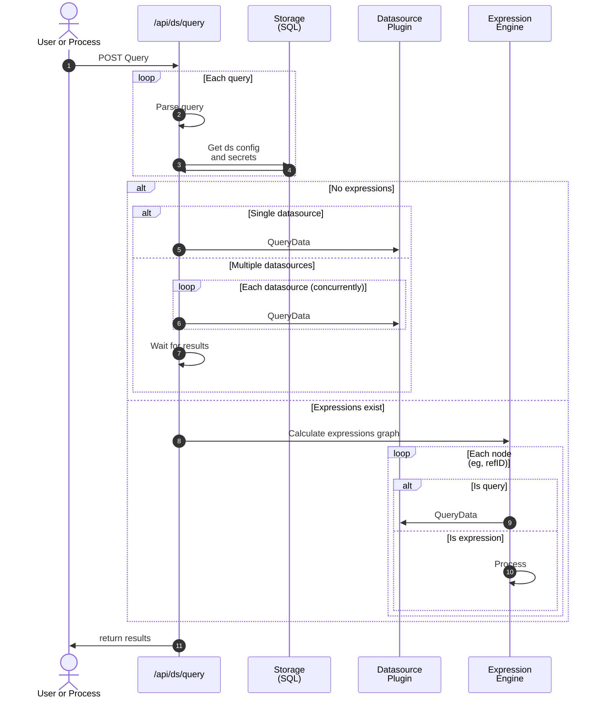
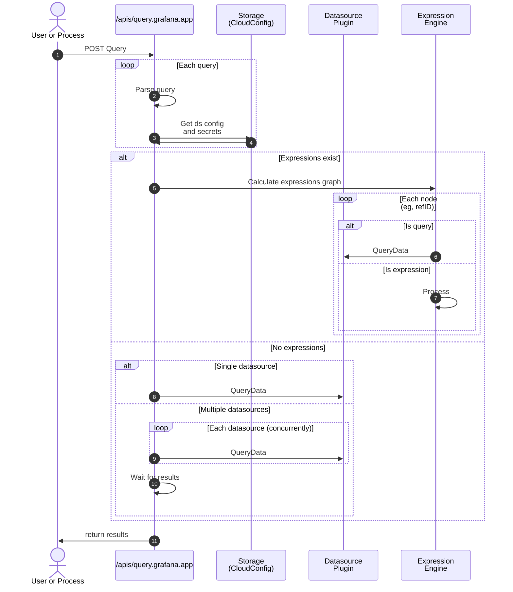

# Query service

This query service aims to replace the existing /api/ds/query, while preserving the same parsing and expression handling as `/api/ds/query`

### Current /api/ds/query workflow

### /apis/query.grafana.app (in single tenant grafana)

