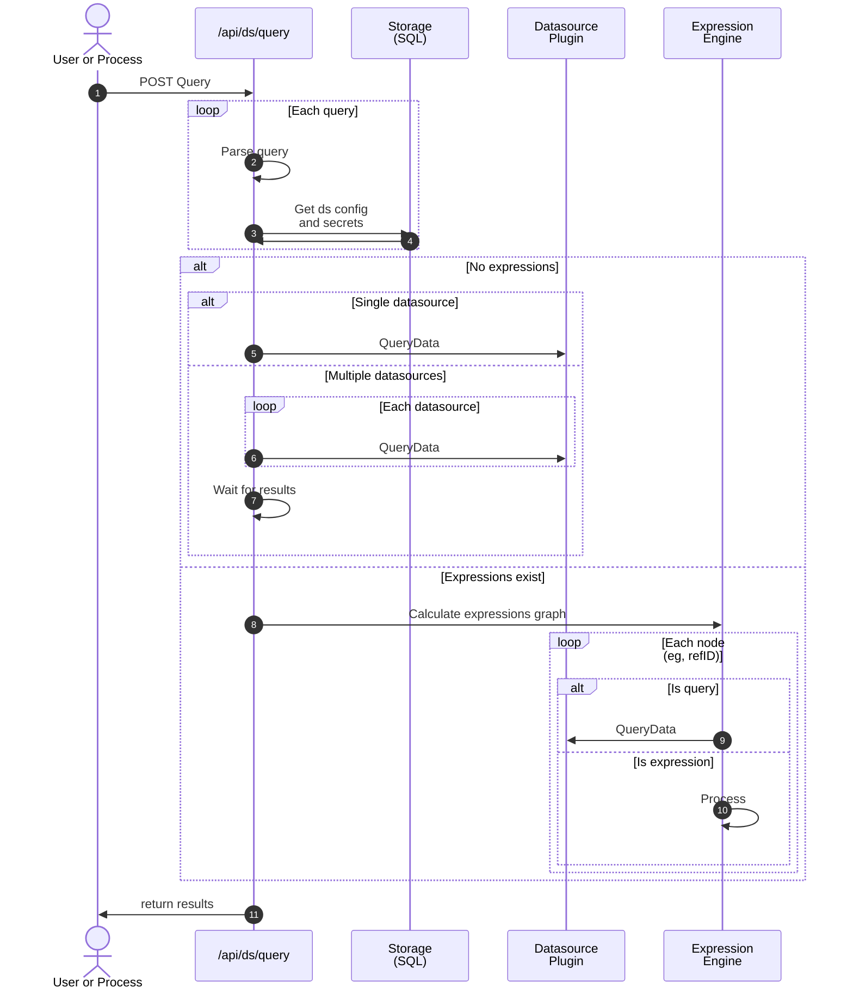

# Query service

This query service aims to replace the existing /api/ds/query.  

The key differences are:
1. This service has a stronger type system (not simplejson)
2. Same workflow regardless if expressions exist
3. Datasource settings+access is managed in each datasource, not at the beginning

### Current /api/ds/query workflow

