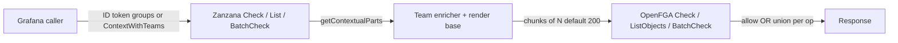

# Contextual `team#member` tuples (POC)

This document describes a proof of concept in which Grafana’s Zanzana server passes **user → member → team** relations as **contextual tuples** (from IdP / `AuthInfo` groups and `common.ContextWithTeams`) instead of relying only on **persisted** `team#member` tuples, with **chunking** to respect per-request contextual tuple limits.

## Architecture



- **Team source:** `authtypes.AuthInfoFrom(ctx).GetGroups()` entries prefixed with `team:`, unioned with `common.TeamsFromContext(ctx)` (for embedded / tests), then sorted and de-duplicated.
- **Base tuples:** Existing render-service contextual tuples are unchanged and merged with team tuples in every chunk.
- **Chunking:** `ZanzanaServerSettings.ContextualTeamsChunkSize` (INI: `contextual_teams_chunk_size`, default `200` via `setting.DefaultContextualTeamsChunkSize`) controls how many **team** tuples are attached per OpenFGA call. `buildContextualTupleChunks` repeats **base** (non-team) tuples in each chunk.
- **Feature flag:** `zanzanaContextualTeams` must be enabled **and** the server must be constructed with a non-nil `featuremgmt.FeatureToggles`; otherwise team contextual tuples are not emitted (no runtime change).

## OpenFGA call fan-out (complexity)

Let **T** = number of team contextual tuples, **C** = chunk size (≥ 1), **chunks** = ⌈T / C⌉ (0 if T = 0; then no extra fan-out).

| API        | OpenFGA calls (worst case) | Short-circuit |
|-----------|----------------------------|---------------|
| `Check`   | `chunks`                   | Stops on first `Allowed` |
| `List`    | `chunks` × (number of `listObjects` sub-calls in the list path) | None; results are **unioned** and sorted |
| `BatchCheck` | `chunks` × (BatchCheck invocations per internal phase) | Merges with **OR** per `correlation_id`; can stop a phase early if all items are allowed |

`listGeneric` / `listTyped` may call `listObjects` more than once (e.g. folder + subresource patterns); each call is multiplied by `chunks` when team tuples are split.

## Caching

- List/check caches key on the serialized `ListObjects` / check request, including **contextual tuple keys**, so each chunk uses a **distinct** cache entry.
- **Warm cache hit rate** drops when many chunks are used (same logical request, different tuple sets).
- **Cold path:** flushing the in-process cache (or process restart) forces full OpenFGA work per call.

## Latency and memory (how to measure)

Run benchmarks (from repo root):

```bash
go test -run=^$ -bench=BenchmarkContextualTeam -benchmem -count=5 ./pkg/services/authz/zanzana/server/
```

Commit the command output (or `benchstat` comparison) into your design doc / PR. **Do not** invent numbers; fill the tables below from real runs on representative hardware.

### Latency (template)

| Op | Mode | Teams | Cache | ns/op (fill) | p50 / p95 (if traced) |
|----|------|------|-------|--------------|-------------------------|
| Check | Stored | 1,10,50,100 | warm | | |
| Check | Contextual | 1,10,50,100 | warm | | |
| Check | Contextual | 1,10,50,100 | cold (cache flush) | | |
| List | Contextual | 1,10,50,100 | warm | | |
| List (large tree, `BenchmarkContextualTeamListLargeTree`) | Contextual | 1,100 | warm | | |
| BatchCheck | Contextual | 1,10,50,100 | warm | | |

**Crossover:** As **T** grows, chunking adds linear overhead in OpenFGA round-trips; stored tuples avoid per-request team tuple volume at the cost of **reconciliation** and DB growth.

### Memory (template)

| Op | Mode | Teams | B/op (fill) | allocs/op (fill) |
|----|------|------|-------------|------------------|
| Check | Contextual | 100 (1× chunk @ 200 default) | | |

Note extra allocations for: per-chunk `ContextualTupleKeys`, `proto.Clone` of `ListObjectsRequest`, and duplicated cache entries per chunk for list paths.

## Correctness and edge cases

- **0 teams:** No team tuples → `buildContextualTupleChunks` returns a single base-only chunk (or nil); **no** chunking loop overhead for the team path.
- **>100 teams:** Many chunks; largest cost is **List** and **BatchCheck** (no short-circuit like Check).
- **Nested team-to-team membership:** Contextual tuples only assert **user → member → team** for teams listed in context. They do **not** add transitive `team:X → member → team:Y` unless those are also provided as contextual or stored tuples (known limitation of contextual-only team graphs).
- **Coexistence with stored tuples:** The model is the same: OpenFGA unions contextual and stored facts. A user can have **both** stored `user#member@team` and contextual `user#member@team`; either can satisfy checks (redundant but safe per OpenFGA semantics).
- **Read/Write/Mutate/Query (authz ext):** Operate on **stored** tuples; not affected by this POC.

## Recommendations

| Prefer **contextual** when… | Prefer **stored** when… |
|----------------------------|---------------------------|
| Teams come from an IdP / token and should not be sync-reconciled | Few stable teams and very high QPS with hot caches |
| You want to avoid “reconciler storms” for large orgs | Users have extremely high team counts and chunk amplification dominates |
| You need per-request membership without DB writes | You rely on long-lived warm list/check caches keyed without chunk splitting |

## Open questions

- Raising OpenFGA’s **contextual tuple per request** limit vs. chunking trade-offs.
- How embedded Grafana will populate `AuthInfo` groups for **non-JWT** callers (until then, `common.ContextWithTeams` is the supported test/embedded hook).
- Interaction with computed relations / folder `parent` edges: contextual tuples do not replace model edges; they only add **membership** facts for the current request.

## Code map

- `getContextualParts` — `server.go`
- Chunking — `server_contextuals_chunked.go`
- `common.ContextWithTeams` / `TeamsFromContext` — `common/context_teams.go`
- Config — `pkg/setting` (`ContextualTeamsChunkSize`)
- Feature — `zanzanaContextualTeams` in `pkg/services/featuremgmt/registry.go`
- Benchmarks — `server_contextual_teams_bench_test.go`
