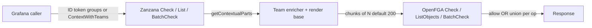

# Contextual `team#member` tuples (POC)

This document describes a proof of concept in which Grafana’s Zanzana server passes **user → member → team** relations as **contextual tuples** (from IdP / `AuthInfo` groups and `common.ContextWithTeams`) instead of relying only on **persisted** `team#member` tuples, with **chunking** to respect per-request contextual tuple limits.

## Architecture



- **Team source:** `authtypes.AuthInfoFrom(ctx).GetGroups()` entries prefixed with `team:`, unioned with `common.TeamsFromContext(ctx)` (for embedded / tests), then sorted and de-duplicated.
- **Base tuples:** Existing render-service contextual tuples are unchanged and merged with team tuples in every chunk.
- **Chunking:** `ZanzanaServerSettings.ContextualTeamsChunkSize` (INI: `contextual_teams_chunk_size`, default `200` via `setting.DefaultContextualTeamsChunkSize`) controls how many **team** tuples are attached per OpenFGA call. `buildContextualTupleChunks` repeats **base** (non-team) tuples in each chunk.
- **Feature flag:** `zanzanaContextualTeams` must be enabled **and** the server must be constructed with a non-nil `featuremgmt.FeatureToggles`; otherwise team contextual tuples are not emitted (no runtime change).
- **OpenFGA compatibility note:** OpenFGA API validation currently enforces a **max of 100 contextual tuples per request** (`ContextualTupleKeys.TupleKeys`, plus request-level validation). In practice, effective chunk size should not exceed 100 unless upstream OpenFGA validation limits are changed.

## OpenFGA call fan-out (complexity)

Let **T** = number of team contextual tuples, **C** = chunk size (≥ 1), **chunks** = ⌈T / C⌉ (0 if T = 0; then no extra fan-out).

| API        | OpenFGA calls (worst case) | Short-circuit |
|-----------|----------------------------|---------------|
| `Check`   | `chunks`                   | Stops on first `Allowed` |
| `List`    | `chunks` × (number of `listObjects` sub-calls in the list path) | None; results are **unioned** and sorted |
| `BatchCheck` | `chunks` × (BatchCheck invocations per internal phase) | Merges with **OR** per `correlation_id`; can stop a phase early if all items are allowed |

`listGeneric` / `listTyped` may call `listObjects` more than once (e.g. folder + subresource patterns); each call is multiplied by `chunks` when team tuples are split.

## OpenFGA: stored `team#member` vs contextual (performance)

There is **no universal “faster on OpenFGA”** answer—trade-offs differ by dimension:

| Concern | Stored `user#member@team` in OpenFGA’s datastore | Contextual `user#member@team` (request-only) |
|--------|-----------------------------------------------------|---------------------------------------------|
| **Writes** | Every membership change is a `Write` (tuples in DB + changelog) | **No** tuple writes for membership; larger **read-time** request payload |
| **A single `Check` / `ListObjects`** (same effective teams) | Often **one** RPC; membership read from the store; graph is stable for cache keys that depend on the stored set | **At least** one RPC; with chunking, **up to** ⌈T/C⌉ RPCs per `Check` / per internal `ListObjects` path |
| **“Hot” path over time** | `Check`/`List` can see **high OpenFGA cache hit rate** (same user–team relations until tuples change) | **Chunk key churn**: different contextual sets or chunk boundaries → **fewer** repeated hits for the *same* logical user if teams vary or chunking splits the set |

So: contextual wins on **synchronizing** membership to the store and on **write amplification**; stored can win on **per-request** latency and **caching** when many identical checks/lists repeat with stable membership. At **large T** with chunking, contextual often **loses** on *single-request* work versus one check backed by a few stored tuples.

## Caching: Grafana (Zanzana) vs OpenFGA

**Grafana Zanzana (in-process)**: `listObjectCached` / check caching keys on a serialized request that **includes** contextual tuple keys. Each team **chunk** is a different key → more entries, **lower** hit rate for “same” user when T is high or chunks > 1. A cache flush (or `BenchmarkContextualTeam…/Contextual_ColdCache`) re-runs the full path.

**OpenFGA (embedded in this POC or a separate OpenFGA process)** can enable **Check query cache** and **Check iterator cache** (see the [caching](https://github.com/openfga/openfga/blob/main/docs/caching.md) write-up in the OpenFGA repo, and the fields `checkQueryCache`, `checkIteratorCache`, `listObjects*IteratorCache` in the server config for your deployment):

- Cache keys are tied to the **evaluated** check/list query, including the **combination of stored and contextual** facts. Changing contextual tuples (or the chunk a request is split into) generally produces **different** sub-query keys than a request that relies only on stored `member` edges.
- **ListObjects** and **Check** with `HIGHER_CONSISTENCY` (when used) **bypass** some of these caches per OpenFGA’s rules—see OpenFGA docs for your version.
- **Store writes** drive invalidation: membership stored as **tuples in the datastore** participates in the changelog; **contextual** tuples are **not** in the store, so membership that exists **only** in context does not trigger the same “tuple write → invalidate” path as stored team edges.

**Explicit note on cache behavior:** passing contextual tuples is **not** inherently bad for caching. If a user's contextual tuple set is stable over time (and requests are deterministic), Grafana/Zanzana and OpenFGA caches can still achieve strong hit rates. The downside appears when contextual sets vary often or require chunking into many requests, which increases cache-key cardinality and lowers warm-cache reuse.

**Takeaway:** contextual reduces **persistence and reconciliation** work; it can **increase** per-request evaluation work and **fragment** both Grafana-side and OpenFGA-side **cache** effectiveness when T is large and chunking runs often.

## Benchmark results (latency, memory, throughput)

`go test -bench` reports **mean** time per op (`ns/op`) and, with **`-benchmem`**, `B/op` and `allocs/op`. It does **not** produce p50/p95. For p50/p95, use **many runs** + [benchstat](https://pkg.go.dev/golang.org/x/perf/cmd/benchstat) (spread / interval), or production tracing.

Run and paste the output (or a `benchstat` comparison) into the block below—**replace** the sample lines; numbers are only placeholders showing the line format.

```bash
go test -run=^$ -bench=BenchmarkContextualTeam -benchmem -count=5 ./pkg/services/authz/zanzana/server/ 2>&1 | tee /tmp/zanzana-contextual-teams-bench.txt
# optional: benchstat <(go test -bench=BenchmarkContextualTeam -count=5 ...) <(go test -bench=BenchmarkContextualTeam -count=5 ...)
```

### Collected output (fill in from your machine / CI)

```
# paste `go test -bench=BenchmarkContextualTeam -benchmem` (and benchstat) below, e.g.:
# BenchmarkContextualTeamCheck/Teams_10/Contextual_WarmCache-8          20000   60000 ns/op   10000 B/op   200 allocs/op
# BenchmarkContextualTeamList/Root_Teams_100-8                           2000   5000000 ns/op  500000 B/op  2000 allocs/op
# …
```

**Crossover (qualitative):** as **T** grows, chunking adds OpenFGA round-trips; stored team tuples on the hot path often get **better** mean latency under repeated access until membership writes invalidate caches.

## Correctness and edge cases

- **0 teams:** No team tuples → `buildContextualTupleChunks` returns a single base-only chunk (or nil); **no** chunking loop overhead for the team path.
- **>C teams:** Many chunks; largest cost is **List** and **BatchCheck** (no short-circuit like Check).  
  **Important:** OpenFGA currently caps contextual tuples at 100/request, so safe `C` is `<=100` with stock OpenFGA.
- **Nested team-to-team membership:** Contextual tuples only assert **user → member → team** for teams listed in context. They do **not** add transitive `team:X → member → team:Y` unless those are also provided as contextual or stored tuples (known limitation of contextual-only team graphs).
- **Coexistence with stored tuples:** The model is the same: OpenFGA unions contextual and stored facts. A user can have **both** stored `user#member@team` and contextual `user#member@team`; either can satisfy checks (redundant but safe per OpenFGA semantics).
- **Read/Write/Mutate/Query (authz ext):** Operate on **stored** tuples; not affected by this POC.

## Recommendations

| Prefer **contextual** when… | Prefer **stored** when… |
|----------------------------|---------------------------|
| Teams come from an IdP / token and should not be sync-reconciled | Few stable teams and very high QPS with hot caches |
| You want to avoid “reconciler storms” for large orgs | Users have extremely high team counts and chunk amplification dominates |
| You need per-request membership without DB writes | You rely on long-lived warm list/check caches keyed without chunk splitting |

### Team-count and chunk-size policy

This section compares two approaches:

| Approach | OpenFGA request count | Main benefit | Main downside | Where it becomes a problem |
|---|---|---|---|---|
| **High per-request contextual limit, no chunking** | 1 request per logical check/list sub-call | Best per-request latency and cache locality | Requires OpenFGA to accept large contextual tuple sets | With stock OpenFGA, not viable above request validation cap (100 contextual tuples) |
| **Lower per-request limit + chunking** | `ceil(T/C)` requests per logical check/list sub-call | Works for any team count (`T`) without hard-capping users | Fan-out cost on Check/List/BatchCheck; more cache-key fragmentation | As `T` grows well beyond `C`, list and batch paths amplify latency |

- **Current reality with stock OpenFGA:** contextual tuples are validated at **max 100 per request**. So "high limit with no chunking" is only feasible if `T <= 100` for every request.
- **Recommendation:** keep **chunking** as the default mechanism for correctness and scale, and cap chunk size to OpenFGA limits.
- **Default `C` recommendation:** `100` (or slightly lower, e.g. `80`, for operational safety margin).
- **When does the limit become a problem?** It starts being material as soon as `T > C` (fan-out begins), and becomes significant for list/batch-heavy traffic when users are in many hundreds of teams.
- **Do not hard-cap total teams to 100**; cap **chunk size**, not user membership size.
- **Guardrails:** clamp `contextual_teams_chunk_size` to safe max and emit warn/metric when configured above supported limit.
- **If upstream OpenFGA raises the cap in the future:** reevaluate with benchmarks. A higher `C` reduces fan-out, but still leaves eventual very-high-`T` cases where stored tuples may perform better on hot paths.

## Open questions / current findings

- **OpenFGA contextual tuple limit:** Current upstream validation enforces **100 contextual tuples max per request**. This is not a simple runtime tuning knob in Grafana; raising it requires upstream OpenFGA/API validation changes (or a fork) and compatibility review.
- **Embedded non-JWT callers:** In current authlib, `AuthInfo.GetGroups()` returns empty (`[]string{}`), so groups are not automatically populated in embedded non-JWT paths. Today, `common.ContextWithTeams` is the practical mechanism for passing team memberships in those paths.
- **Interaction with computed relations / folder `parent` edges:** contextual tuples do not replace model edges; they only add **membership** facts for the current request.

## Code map

- `getContextualParts` — `server.go`
- Chunking — `server_contextuals_chunked.go`
- `common.ContextWithTeams` / `TeamsFromContext` — `common/context_teams.go`
- Config — `pkg/setting` (`ContextualTeamsChunkSize`)
- Feature — `zanzanaContextualTeams` in `pkg/services/featuremgmt/registry.go`
- Benchmarks — `server_contextual_teams_bench_test.go`
