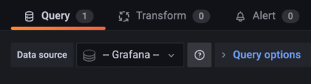
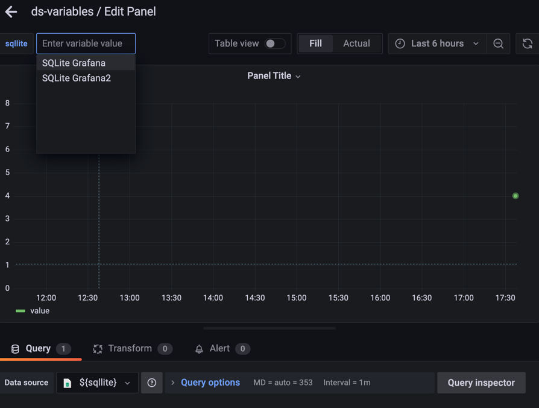

## datasources & permissions


### current state in searchV2

The dashboard entity returned from `SearchV2` contains a JSON field called `ds_uid`:

```json
{
  "schema": {
    "name": "Query results",
    "meta": {
...
    },
    "fields": [
...
      {
        "name": "ds_uid",
        "type": "other",
        "typeInfo": {
          "frame": "json.RawMessage",
          "nullable": true
        }
      },
...
    ]
  },
  "data": {
    "values": [
...
      [
        [
          "some-datasource-uid",
          "PD8C576611E62080A"
        ]
      ],
...
    ]
  }
}

```

`ds_uid` is an array containing the uids of all the datasources used in the dashboard. 

We consider a datasource to be "used in a dashboard" when it meets at least one of these conditions:

1. it is used directly by a panel 
2. it is the currently selected choice for a datasource template variable thats used in a panel 
3. it is one of the selected options in a multivalue datasource template variable thats used in a panel  

Currently, we are not considering datasource permissions at all when constructing the search response. That means:

1. The `ds_uid` will be always populated with _all_ datasources used in a dashboard, even if user can't see or query some of them.
2. The search result will contain dashboards that user can see only partially, e.g. when the user has query access to only half of the datasources used in a dashboard.
3. The search result will contain dashboards that user can not use at all, ie. when the user has no query or view access to _all_ datasources used in a dashboard.


### going forward

Regardless of whether we want to return partially/not-at-all usable dashboards from the search query, it would be useful to add some kind of datasource permission metadata to the query result, similar to how it's done for annotations - https://github.com/grafana/grafana/blob/d076bedb5e6af0d5e720b820587e48f0d44f69d2/pkg/api/dtos/dashboard.go#L35-L47.

#### idea 1 - add `permissions` field, leave the `ds_uid` array as is - do not filter it based on the ds permissions

```json
{
  "schema": {
    "name": "Query results",
    "meta": {
...
    },
    "fields": [
...
      {
        "name": "ds_uid",
        "type": "other",
        "typeInfo": {
          "frame": "json.RawMessage",
          "nullable": true
        }
      },
      {
        "name": "permissions",
        "type": "other",
        "typeInfo": {
          "frame": "json.RawMessage",
          "nullable": true
        }
      },
...
    ]
  },
  "data": {
    "values": [
...
      [
        [
          "some-datasource-uid",
          "PD8C576611E62080A"
        ]
      ],
      [
        {
          "self": {
            "edit": true,
            "view": true,
            "delete": true
          },
          "links": {
            "PD8C576611E62080A": {
              "query": false,
              "view": false
            },
            "some-datasource-uid": {
              "query": false,
              "view": false
            }
          }
        }
      ],
...
    ]
  }
}

```

with the following typing:

```ts
enum Action {
    query = "query",
    edit = "edit",
    delete = "delete",
    view = "view",
} 

type EntityUID = string

export type Permissions = {
    self: Record<Action, boolean>;
    links: Record<EntityUID, Record<Action, boolean>>;
}
```


We could also think about replacing `ds_uid` array with something like `linked_entity_uid` containing `uids` of _all_ linked entities:


```json
{
  "schema": {
    "name": "Query results",
    "meta": {
...
    },
    "fields": [
...
      {
        "name": "linked_entity_uid",
        "type": "other",
        "typeInfo": {
          "frame": "json.RawMessage",
          "nullable": true
        }
      },
      {
        "name": "permissions",
        "type": "other",
        "typeInfo": {
          "frame": "json.RawMessage",
          "nullable": true
        }
      },
...
    ]
  },
  "data": {
    "values": [
...
      [
        [
          { "uid": "some-datasource-uid", "type": "datasource"},
          { "uid": "PD8C576611E62080A", "type": "datasource"}
        ]
      ],
      [
        {
          "self": {
            "edit": true,
            "view": true,
            "delete": true
          },
          "links": {
            "PD8C576611E62080A": {
              "query": false,
              "view": false
            },
            "some-datasource-uid": {
              "query": false,
              "view": false
            }
          }
        }
      ],
...
    ]
  }
}

```

