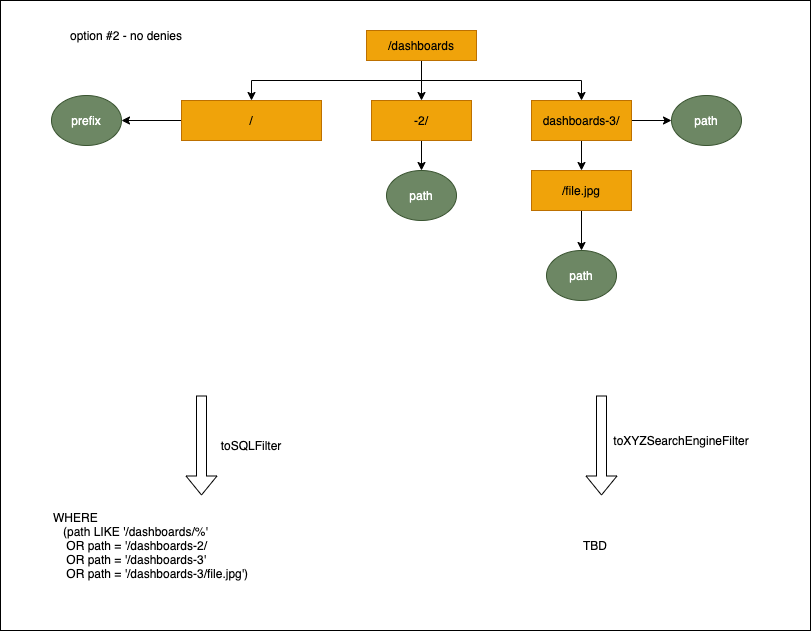
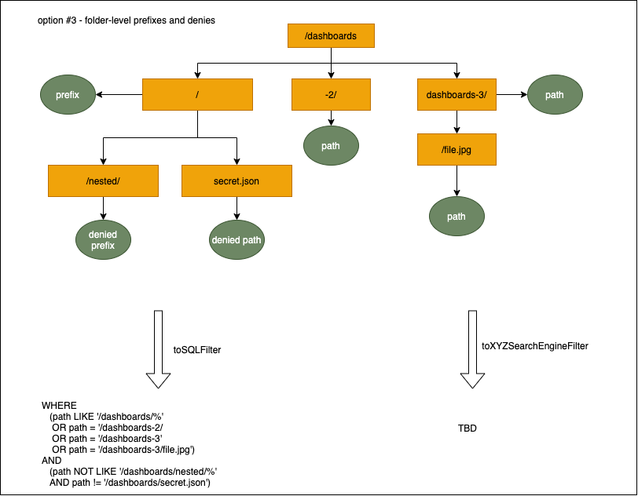

# Storage authorization

# Authorization use cases

1. Grant/revoke access to a file 
   1. implies view-only access to parent folder(s)
2. Grant/revoke access to a folder but not to the files inside
3. Grant/revoke access to a folder and all files inside
4. Grant/revoke access to all files and all folders
5. NEW - Grant/revoke access to a folder and all nested folders/files 

# Integrating file store authorization with the `accesscontrol` module

## Permission scopes design

Decisions applicable to all options:
1. Authorization is based solely on the file paths, but the chosen option shouldn't rule out adding more complicated conditions (e.g. with `tags` or some other metadata) in the future
2. Access is denied by default
3. All paths are in the format of `/<storage_name>/<path_in_storage>` where `<path_in_storage>` can contain one or more folders
4. Paths do not include `org_id` - storages are defined per organization


### Option #1 - Introduce new actions representing operations on files

- `files:create`
- `files:update`
- `files:delete`
- `files:read`


#### Option #1.1 - file scopes support paths - no prefixes, no denies

```
permissions:
  - action: 'files:read' 
    scope: 'files:path:/dashboards/'          <---- can view folder `/dashboards/`
                                               ---- there is no hierarchy => can view folder, but can't view files inside
  - action: 'files:read'
    scope: 'files:path:/dashboards/a.json'    <---- can view file `/dashboards/a.json`
  - action: 'files:read' 
    scope: 'files:path:/dashboards/b.json'    <---- can view file `/dashboards/b.json`
  - action: 'files:read' 
    scope: 'files:path:/dashboards-2/'        <---- can view folder `/dashboards-2/`
```

pros:
- supports all use cases
- logic determining access to an individual file needs to read just a single permission

cons:
- each file in each folder needs a separate permission - provisioning can be painful
- we need to add permissions each time a new file is added which can be problematic with external storages
- does not support 

#### Option #1.2 - file scopes support paths and folder-level prefixes, no denies

```
permissions:
  - action: 'files:read' 
    scope: 'files:path:/dashboards/*'           <---- can view folder `/dashboards/` and all folders/files recursively
  - action: 'files:read' 
    scope: 'files:path:/dashboards-2/'          <---- can view folder `/dashboards-2/`
  - action: 'files:update' 
    scope: 'files:path:/dashboards-3/file.jpg'  <---- can edit file `/dashboards-3/file.jpg`
                                                 ---- and, implicitly, view folder `/dashboards-3/`
```

Folder-level prefixes can be used only at the folder level, ie. `/dashboards/*` is OK, but `/dashboards/file-abc*` isn't

pros:
- simplicity - the majority of use cases can be supported with prefixes
- when listing files, the evaluation engine needs to parse a lot fewer rules as compared to option #1
  - for individual file access we would need to read `number_of_parent_folders + 1` rules

cons:
- doesn't support the _revoke access_ use cases => e.g. granting access to all files but one in a folder is not possible unless we "unroll" prefixes and devolve into option #1
- no simple way of adding access to individual files with the same name with differing extensions without using folder-level prefixes, e.g. 
   - grant access to `/dashboards/my-folder/dash.json` and `/dashboards/my-folder/dash.jpg` without using `/dashboards/my-folder/*`


#### Option #1.3 - file scopes support paths, folder-level prefixes, denies (this PR)

```
permissions:
  - action: 'files:read' 
    scope: 'files:path:/dashboards/*'            <---- can view folder `/dashboards/` and all folders/files recursively
  - action: 'files:read' 
    scope: 'files:path:/dashboards-2/'           <---- can view folder `/dashboards-2/`
  - action: 'files:update' 
    scope: 'files:path:/dashboards-3/file.jpg'   <---- can edit file `/dashboards-3/file.jpg`
                                                  ---- and, implicitly, view folder `/dashboards-3/`    
  - action: 'files:read' 
    scope: 'files:path:!/dashboards/nested/*'    <---- can't view `/dashboards/nested/` or anything inside    
  - action: 'files:read' 
    scope: 'files:path:!/dashboards/secret.json` <---- can't view `/dashboards/secret.json`
```

Denies always take priority over allows

pros:
- supports all use cases
- assumption: it should share the simplicity of option #2 in the majority of use cases

cons:
- evaluation engine has to take into account more rules when evaluating access e.g. 
  - all denied files have to be added to filter when listing files
  - when evaluating access to `/dashboards/folder1/folder2/file.jpg` we can't stop once we reach a broad `/dashboards/*` folder-level prefix, we have to still search for nested denies
- same as option #2: no simple way of adding access to individual files with the same name but different extension without using folder-level prefixes, e.g.
  - `/dashboards/my-folder/dash.json` and `/dashboards/my-folder/dash.jpg`


note: that's the option implemented in this PR

#### Option #1.4 - file scopes support paths, folder- & file-level prefixes, denies

```
permissions:
  - action: 'files:read' 
    scope: 'files:path:/dashboards/*'            <---- can view folder `/dashboards/` and all files but not folders
  - action: 'files:read' 
    scope: 'files:path:/dashboards-2/**'         <---- can view folder `/dashboards-2/` and all files/folders recursively
  - action: 'files:update' 
    scope: 'files:path:/dashboards-3/file.*'     <---- can view 
```

Differentiate between the recursive `**` and non-recursive `*` similar to https://git-scm.com/docs/gitignore

pros:
- supports all use cases
- simple solution to the same name/different ext problem 

cons:
- on top of the first con from option #3, this option adds even more complexity to the evaluation engine

### Option #2 - use existing actions with `path:*` (rather than `id:*`) scopes

TODO


## Predefined roles 

- `fixed:files:reader` - assigned to `Viewer`
  - can read all files: action `files:read` in scope `files:path:/*`
- `fixed:files:editor` - assigned to `Editor`
  - TODO: can do everything to files, but only at specific "default" prefixes, e.g. scope `files:path/dashboards/general/*` 
- `fixed:files:admin` - assigned to `Admin`
  - can do everything on all files and folders
  
## Evaluation engine 

### Option #1 - trie

We can construct a (compressed) trie representing user's permissions to avoid iterating through each permission one-by-one for each file.

The trie can be constructed either from all or from just a subset of user's file permissions depending on the use case:
- all permissions for a general search
- subset of permissions for e.g. listing files from a single storage

We can use the trie for checking access to individual files (see https://github.com/grafana/grafana/blob/storage-auth/pkg/infra/filestorage/filter.go#L133-L156) as well as for creating storage-specific filters required for listing operations (see https://github.com/grafana/grafana/blob/storage-auth/pkg/infra/filestorage/filter.go#L56)





# Integration with the search index

TODO: we can probably just save a list of paths used for constructing each searchable entity and then re-use the trie
