# Unified Storage

The unified storage projects aims to provide a simple and extensible backend to unify the way we store different objects within the Grafana app platform.

It provides generic storage for k8s objects, and can store data either within dedicated tables in the main Grafana database, or in separate storage.

By default it runs in-process within Grafana, but it can also be run as a standalone GRPC service (`storage-server`).

## Storage Overview

There are 2 main tables, the `resource` table stores a "current" view of the objects, and the `resource_history` table stores a record of each revision of a given object.

## Running Unified Storage

### Playlists: baseline configuration

The minimum config settings required are:

```ini
; need to specify target here for override to work later
target = all

[server]
; https is required for kubectl
protocol = https

[feature_toggles]
; store playlists in k8s
kubernetesPlaylists = true

[grafana-apiserver]
; use unified storage for k8s apiserver
storage_type = unified

# Dualwriter modes
# 0: disabled (default mode)
# 1: read from legacy, write to legacy, write to unified best-effort
# 2: read from legacy, write to both
# 3: read from unified, write to both
# 4: read from unified, write to unified
# 5: read from unified, write to unified, ignore background sync state
[unified_storage.playlists.playlist.grafana.app]
dualWriterMode = 0
```

**Note**: When using the Dualwriter, Watch will only work with mode 5.

### Folders: baseline configuration

NOTE: allowing folders to be backed by Unified Storage is under development and so are these instructions. 

The minimum config settings required are:

```ini
; need to specify target here for override to work later
target = all

[server]
; https is required for kubectl
protocol = https

[feature_toggles]
grafanaAPIServerWithExperimentalAPIs = true
kubernetesClientDashboardsFolders = true

[unified_storage.folders.folder.grafana.app]
dualWriterMode = 4

[unified_storage.dashboards.dashboard.grafana.app]
dualWriterMode = 4

[grafana-apiserver]
; use unified storage for k8s apiserver
storage_type = unified
```

### Setting up a kubeconfig 

With this configuration, you can run everything in-process. Run the Grafana backend with:

```sh
bra run
```

or

```sh
make run
```

The default kubeconfig sends requests directly to the apiserver, to authenticate as a grafana user, create `grafana.kubeconfig`:
```yaml
apiVersion: v1
clusters:
- cluster:
    insecure-skip-tls-verify: true
    server: https://127.0.0.1:3000
  name: default-cluster
contexts:
- context:
    cluster: default-cluster
    namespace: default
    user: default
  name: default-context
current-context: default-context
kind: Config
preferences: {}
users:
- name: default
  user:
    username: <username>
    password: <password>
```
Where `<username>` and `<password>` are credentials for basic auth against Grafana. For example, with the [default credentials](https://github.com/grafana/grafana/blob/HEAD/contribute/developer-guide.md#backend):
```yaml
    username: admin
    password: admin
```

### Playlists: interacting with the k8s API

In this mode, you can interact with the k8s api. Make sure you are in the directory where you created `grafana.kubeconfig`. Then run:
```sh
kubectl --kubeconfig=./grafana.kubeconfig get playlist
```

If this is your first time running the command, a successful response would be:
```sh
No resources found in default namespace.
```

To create a playlist, create a file `playlist-generate.yaml`:
```yaml
apiVersion: playlist.grafana.app/v0alpha1
kind: Playlist
metadata:
  generateName: x # anything is ok here... except yes or true -- they become boolean!
  labels:
    foo: bar
  annotations:
    grafana.app/slug: "slugger"
    grafana.app/updatedBy: "updater"
spec:
  title: Playlist with auto generated UID
  interval: 5m
  items:
  - type: dashboard_by_tag
    value: panel-tests
  - type: dashboard_by_uid
    value: vmie2cmWz # dashboard from devenv
```
then run:
```sh
kubectl --kubeconfig=./grafana.kubeconfig create -f playlist-generate.yaml
```

For example, a successful response would be:
```sh
playlist.playlist.grafana.app/u394j4d3-s63j-2d74-g8hf-958773jtybf2 created
```

When running
```sh
kubectl --kubeconfig=./grafana.kubeconfig get playlist
```
you should now see something like:
```sh
NAME                                   TITLE                              INTERVAL   CREATED AT
u394j4d3-s63j-2d74-g8hf-958773jtybf2   Playlist with auto generated UID   5m         2023-12-14T13:53:35Z 
```

To update the playlist, update the `playlist-generate.yaml` file then run:
```sh
kubectl --kubeconfig=./grafana.kubeconfig patch playlist <NAME> --patch-file playlist-generate.yaml
```

In the example, `<NAME>` would be `u394j4d3-s63j-2d74-g8hf-958773jtybf2`.

### Folders: interacting with the k8s API

Make sure you are in the directory where you created `grafana.kubeconfig`. Then run:
```sh
kubectl --kubeconfig=./grafana.kubeconfig get folder
```

If this is your first time running the command, a successful response would be:
```sh
No resources found in default namespace.
```

To create a folder, create a file `folder-generate.yaml`:
```yaml
apiVersion: folder.grafana.app/v1beta1
kind: Folder
metadata:
  generateName: x # anything is ok here... except yes or true -- they become boolean!
spec:
  title: Example folder
```
then run:
```sh
kubectl --kubeconfig=./grafana.kubeconfig create -f folder-generate.yaml
```

### Run as a GRPC service

#### Start GRPC storage-server

Make sure you have the gRPC address in the `[grafana-apiserver]` section of your config file:
```ini
[grafana-apiserver]
; your gRPC server address
address = localhost:10000
```

You also need the `[grpc_server_authentication]` section to authenticate incoming requests:
```ini
[grpc_server_authentication]
; http url to Grafana's signing keys to validate incoming id tokens
signing_keys_url = http://localhost:3000/api/signing-keys/keys
mode = "on-prem"
```

This currently only works with a separate database configuration (see previous section).

Start the storage-server with:
```sh
GF_DEFAULT_TARGET=storage-server ./bin/grafana server target
```

The GRPC service will listen on port 10000

#### Use GRPC server

To run grafana against the storage-server, override the `storage_type` setting:
```sh
GF_GRAFANA_APISERVER_STORAGE_TYPE=unified-grpc ./bin/grafana server
```

You can then list the previously-created playlists with:
```sh
kubectl --kubeconfig=./grafana.kubeconfig get playlist
```

## Changing protobuf interface

- install [protoc](https://grpc.io/docs/protoc-installation/)
- install the protocol compiler plugin for Go
```sh
go install google.golang.org/grpc/cmd/protoc-gen-go-grpc@latest
```
- make changes in `.proto` file
- to compile all protobuf files in the repository run `make protobuf` at its top level

## Setting up search
To enable it, add the following to your `custom.ini` under the `[feature_toggles]` section:
```ini
[feature_toggles]
; Used by the Grafana instance
unifiedStorageSearchUI = true
kubernetesClientDashboardsFolders = true

; Used by unified storage
unifiedStorageSearch = true
; (optional) Allows you to sort dashboards by usage insights fields when using enterprise
; unifiedStorageSearchSprinkles = true
; (optional) Will skip search results filter based on user permissions
; unifiedStorageSearchPermissionFiltering = false
```

The dashboard search page has been set up to search unified storage. Additionally, all legacy search calls (e.g. `/api/search`) will go to
unified storage when the dual writer mode is set to 3 or greater. When <= 2, the legacy search api calls will go to legacy storage.

## Running load tests
Load tests and instructions can be found [here](https://github.com/grafana/grafana-api-tests/tree/main/simulation/src/unified_storage).

## Running with a distributor

For this deployment model, the storage-api server establishes a consistent hashing ring to distribute tenant requests. The distributor serves as the primary request router, mapping incoming traffic to the appropriate storage-api server based on tenant ID. When testing functionalities reliant on this sharded persistence layer, the following steps are mandatory.

### 0. Update your network interface to allow processes to bind to localhost addresses

For this setup to work, we need to have more than one instance of `storage-api` and at least one instance of
`distributor` service. This step is a requirement for MacOS, as it by default will only allow processes to bind to `127.0.0.1` and not
`127.0.0.2`.

Run the command below in your terminal for every IP you want to enable:

```sh
sudo ifconfig lo0 alias <ip> up
```

### 1. Start MySQL DB

The storage server doesn't support `sqlite` so we need to have a dedicated external database. You can start one with
docker in case you don't have one:

```sh
docker run -d --name db -e "MYSQL_DATABASE=grafana" -e "MYSQL_USER=grafana" -e "MYSQL_PASSWORD=grafana" -e "MYSQL_ROOT_PASSWORD=root" -p 3306:3306 docker.io/bitnami/mysql:8.0.31
```

### 2. Create dedicated ini files for every service

Example distributor ini file:

* Bind grpc/http server to `127.0.0.1`
* Bind and join `memberlist` on `127.0.0.1:7946` (default memberlist port)

```ini
target = distributor

[server]
http_port = 3000
http_addr = "127.0.0.1"

[grpc_server]
network = "tcp"
address = "127.0.0.1:10000"

[grafana-apiserver]
storage_type = unified

[grpc_server_authentication]
signing_keys_url = http://localhost:3011/api/signing-keys/keys
mode = "on-prem"

[unified_storage]
enable_sharding = true
memberlist_bind_addr = "127.0.0.1"
memberlist_advertise_addr = "127.0.0.1"
memberlist_join_member = "127.0.0.1:7946"
```

Example unified storage ini file:

* Bind grpc/http server to `127.0.0.2`
* Configue MySQL database parameters
* Enable a few feature flags
* Give it a unique `instance_id` (defaults to hostname, so you need to define it locally)
* Bind `memberlist` to `127.0.0.2` and join the member on `127.0.0.1` (the distributor module above)

You can repeat the same configuration for many different storage-api instances by changing the bind address
from `127.0.0.2` to something else, eg `127.0.0.3`

```ini
target = storage-server

[server]
http_port = 3000
http_addr = "127.0.0.2"

[resource_api]
db_type = mysql
db_host = localhost:3306
db_name = grafana ; or whatever you defined in your currently running database
db_user = grafana ; or whatever you defined in your currently running database
db_pass = grafana ; or whatever you defined in your currently running database

[grpc_server]
network = "tcp"
address = "127.0.0.2:10000"

[grafana-apiserver]
storage_type = unified

[grpc_server_authentication]
signing_keys_url = http://localhost:3011/api/signing-keys/keys
mode = "on-prem"

[feature_toggles]
kubernetesClientDashboardsFolders = true
kubernetesDashboardsAPI = true
kubernetesFolders = true
unifiedStorage = true
unifiedStorageSearch = true

[unified_storage]
enable_sharding = true
instance_id = node-0
memberlist_bind_addr = "127.0.0.2"
memberlist_advertise_addr = "127.0.0.2"
memberlist_join_member = "127.0.0.1:7946"
```

Example grafana ini file:

* Bind http server to `127.0.0.2`.
* Explicitly declare the sqlite db. This is so when you run a second instance they don't both try to use the same sqlite
  file.
* Configure the storage api client to talk to the distributor on `127.0.0.1:10000`
* Configure feature flags/modes as desired

Then repeat this configuration and change:

* the `stack_id` to something unique
* the database
* the bind address (so the browser can save the auth for every instance in a different cookie)
```ini
target = all

[environment]
stack_id = 1

[database]
type = sqlite3
name = grafana
user = root
path = grafana1.db

[grafana-apiserver]
address = 127.0.0.1:10000
storage_type = unified-grpc

[server]
protocol = http
http_port = 3011
http_addr = "127.0.0.2"

[feature_toggles]
kubernetesClientDashboardsFolders = true
kubernetesDashboardsAPI = true
kubernetesFolders = true
unifiedStorageSearchUI = true

[unified_storage.dashboards.dashboard.grafana.app]
dualWriterMode = 3
[unified_storage.folders.folder.grafana.app]
dualWriterMode = 3
[unified_storage.playlists.playlist.grafana.app]
dualWriterMode = 4
```

### 3. Run the services

Build the backend:

```sh
GO_BUILD_DEV=1 make build-go
```

You will need a separate process for every service. It's the same command with a separate `ini` file to it. For
example, if you created a `distributor.ini` file in the `conf` directory, this is how you would run the distributor:

```sh
./bin/grafana server target --config conf/distributor.ini
```

Repeat for the other services.

```sh
./bin/grafana server target --config conf/storage-api-1.ini
./bin/grafana server target --config conf/storage-api-2.ini
./bin/grafana server target --config conf/storage-api-3.ini

./bin/grafana server target --config conf/grafana1.ini
./bin/grafana server target --config conf/grafana2.ini
./bin/grafana server target --config conf/grafana3.ini
```

etc

### 4. Verify that it is working

If all is well, you will be able to visit every grafana stack you started and use it normally. Visit
`http://127.0.0.2:3011`, login with `admin`/`admin`, create some dashboards/folders, etc.

For debugging purposes, you can view the memberlist status by visitting `http://127.0.0.1:3000/memberlist` and check
that every instance you create is part of the memberlist.
You can also visit `http://127.0.0.1:3000/ring` to view the ring status and the storage-api servers that are part of the
ring.

---

## Dual Writer System

The Dual Writer system is a critical component of Unified Storage that manages the transition between legacy storage and unified storage during the migration process. It provides six different modes (0-5) that control how data is read from and written to both storage systems.

### Dual Writer Mode Reference Table

| Mode | Description | Read Source | Read Behavior | Write Targets | Write Behavior | Error Handling | Background Sync |
|------|-------------|-------------|---------------|---------------|----------------|----------------|-----------------|
| **0** | Disabled | Legacy Only | Synchronous | Legacy Only | Synchronous | Legacy errors bubble up | None |
| **1** | Legacy Primary + Best Effort Unified | Legacy Only | Legacy: Sync<br/>Unified: Async (background) | Legacy + Unified | Legacy: Sync<br/>Unified: Async (background) | Only legacy errors bubble up.<br/>Unified errors logged but ignored | Active - syncs legacy → unified |
| **2** | Legacy Primary + Unified Sync | Legacy Only | Legacy: Sync<br/>Unified: Sync (verification read) | Legacy + Unified | Legacy: Sync<br/>Unified: Sync | Legacy errors bubble up first.<br/>Unified errors bubble up (except NotFound which is ignored).<br/>If write succeeds in legacy but fails in unified, unified error bubbles up and legacy is cleaned up | Active - syncs legacy → unified |
| **3** | Unified Primary + Legacy Sync | Unified Primary | Unified: Sync<br/>Legacy: Fallback on NotFound | Legacy + Unified | Legacy: Sync<br/>Unified: Sync | Legacy errors bubble up first.<br/>If legacy succeeds but unified fails, unified error bubbles up and legacy is cleaned up | Prerequisite - only available after sync completes |
| **4** | Unified Only (Post-Sync) | Unified Only | Synchronous | Unified Only | Synchronous | Unified errors bubble up | Prerequisite - only available after sync completes |
| **5** | Unified Only (Force) | Unified Only | Synchronous | Unified Only | Synchronous | Unified errors bubble up | None - bypasses sync requirements |


### Dual Writer Architecture

The dual writer acts as an intermediary layer that sits between the API layer and the storage backends, routing read and write operations based on the configured mode.

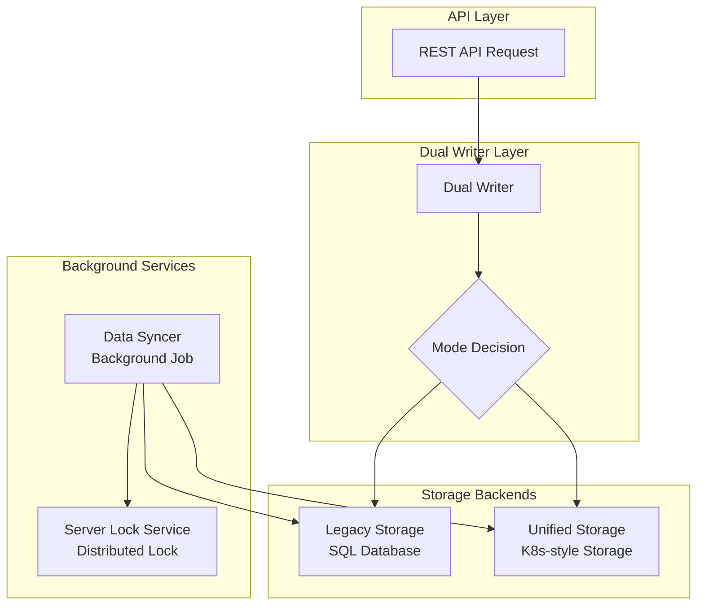

### Mode-Specific Data Flow Diagrams

#### Mode 0: Legacy Only (Disabled)
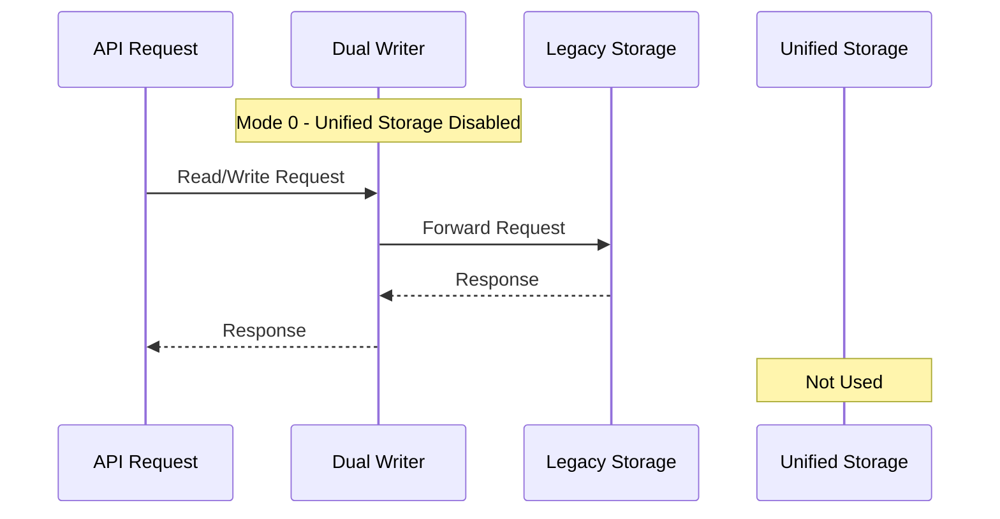

#### Mode 1: Legacy Primary + Best Effort Unified
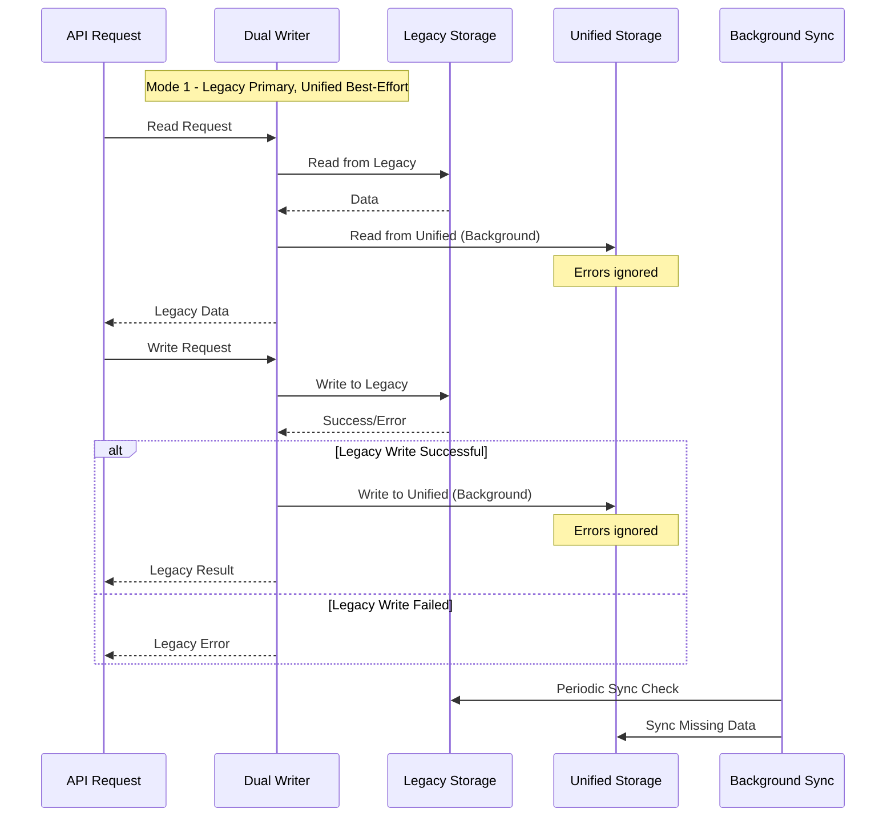

#### Mode 2: Legacy Primary + Unified Sync
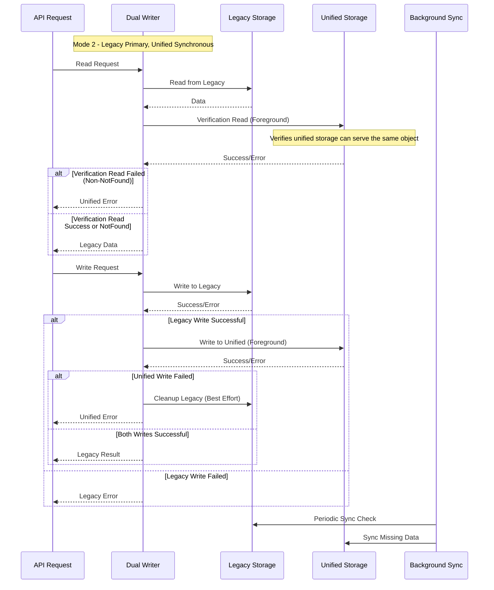

#### Mode 3: Unified Primary + Legacy Sync
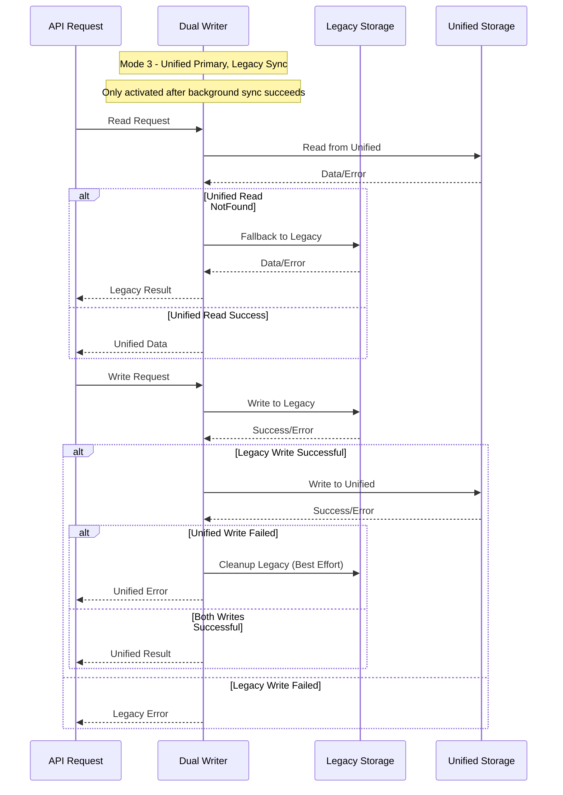

#### Mode 4 & 5: Unified Only
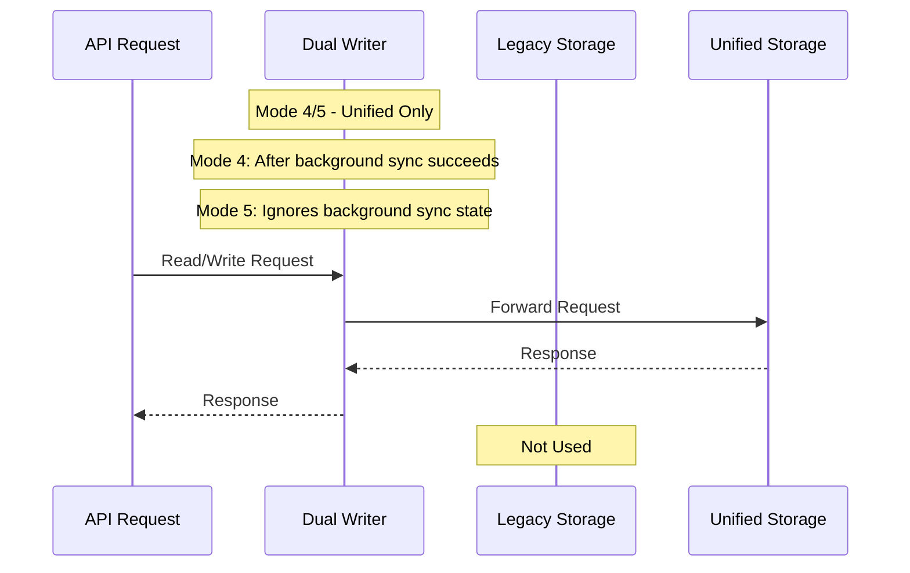

### Background Sync Behavior

The background sync service runs periodically (default: every hour) and is responsible for:

1. **Data Synchronization**: Ensures legacy and unified storage contain the same data
2. **Mode Progression**: Enables transition from Mode 2 → Mode 3 → Mode 4
3. **Conflict Resolution**: Handles cases where data exists in one storage but not the other

#### Sync Process Flow

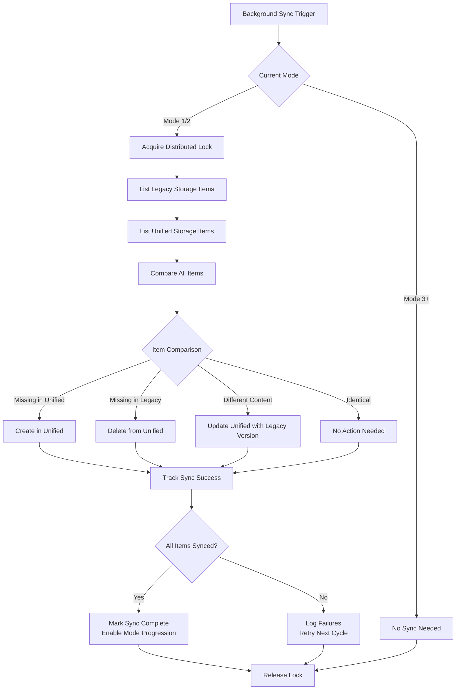

#### Mode Transition Requirements

- **Mode 0 → Mode 1**: Configuration change only
- **Mode 1 → Mode 2**: Configuration change only  
- **Mode 2 → Mode 3**: Requires successful background sync completion
- **Mode 3 → Mode 4**: Requires successful background sync completion
- **Mode 4 → Mode 5**: Configuration change only
- **Any Mode → Mode 5**: Configuration change only (bypasses sync requirements)

### Error Handling Strategies

#### Write Operation Error Priority
1. **Legacy Storage Errors**: Always bubble up immediately if legacy write fails
2. **Unified Storage Errors**: 
   - Mode 1: Logged but ignored
   - Mode 2+: Bubble up after legacy cleanup attempt
3. **Cleanup Operations**: Best effort - failures are logged but don't fail the original operation

#### Read Operation Fallback
- **Mode 2**: `NotFound` errors from unified storage are ignored (object may not be synced yet), but other errors bubble up
- **Mode 3**: If unified storage returns `NotFound`, automatically falls back to legacy storage
- **Other Modes**: No fallback - errors bubble up directly

### Configuration

#### Setting Dual Writer Mode
```ini
[unified_storage.{resource}.{kind}.{group}]
dualWriterMode = {0-5}
```

#### Background Sync Configuration
```ini
[unified_storage]
; Enable data sync between legacy and unified storage
enable_data_sync = true

; Sync interval (default: 1 hour)
data_sync_interval = 1h

; Maximum records to sync per run (default: 1000)  
data_sync_records_limit = 1000

; Skip data sync requirement for mode transitions
skip_data_sync = false
```

### Monitoring and Observability

The dual writer system provides metrics for monitoring:

- `dual_writer_requests_total`: Counter of requests by mode, operation, and status
- `dual_writer_sync_duration_seconds`: Histogram of background sync duration
- `dual_writer_sync_success_total`: Counter of successful sync operations
- `dual_writer_mode_transitions_total`: Counter of mode transitions

Use these metrics to monitor the health of your migration and identify any issues with the dual writer system.

---

## Unified Search System

The Unified Search system provides a scalable, distributed search capability for Grafana's Unified Storage. It uses a ring-based architecture to distribute search requests across multiple search server instances, with namespace-based sharding for optimal performance and data distribution.

### System Architecture

The search system provides both unified and legacy search capabilities, with routing based on dual writer mode configuration:

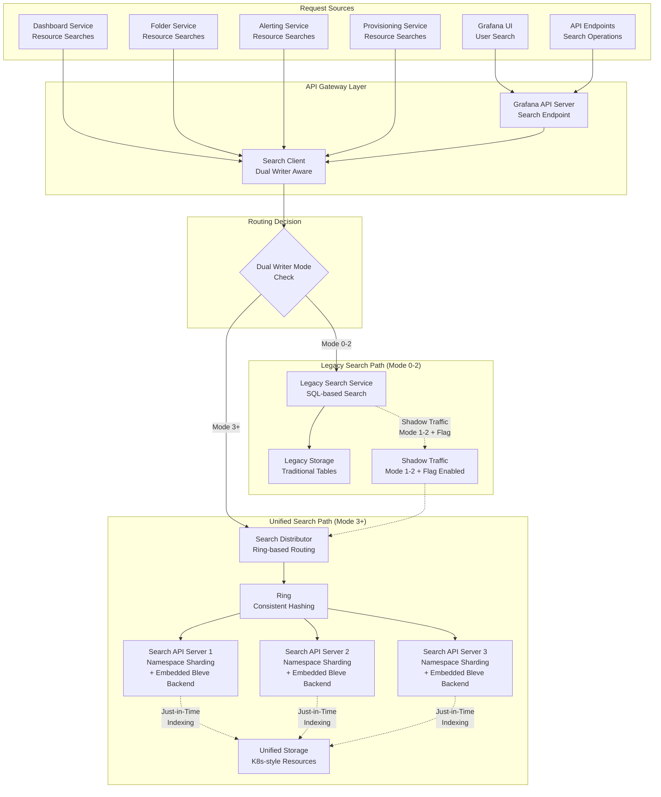

### Search Backend Routing

The search client routes requests based on the dual writer mode configuration for each resource type:

#### Dual Writer Mode → Backend Routing
- **Mode 0-2**: Route to **Legacy Search**
  - Mode 1-2: Shadow traffic to Unified Search (if `unifiedStorageSearchDualReaderEnabled` is enabled)
  - Mode 0: No shadow traffic
- **Mode 3+**: Route to **Unified Search** 
  - No shadow traffic needed (unified is primary)

### Feature Flags

Unified Search requires several feature flags to be enabled depending on the desired functionality:

#### Prerequisites (Required for Unified Storage)

| Feature Flag | Purpose | Stage | Required For |
|--------------|---------|-------|--------------|
| `kubernetesClientDashboardsFolders` | Enable k8s-style APIs for dashboards/folders | GA | Unified storage for dashboards and folders |
| `grafanaAPIServerWithExperimentalAPIs` | Allow experimental API groups | Development | Access to v0alpha1 APIs (including search) |

#### Unified Search Specific Flags

| Feature Flag | Purpose | Stage | Required For |
|--------------|---------|-------|--------------|
| `unifiedStorageSearch` | Core search functionality | Experimental | Search API servers, indexing |
| `unifiedStorageSearchUI` | Frontend search interface | Experimental | Grafana UI search |
| `unifiedStorageSearchPermissionFiltering` | User permission filtering | GA | Access control in search results |
| `unifiedStorageSearchSprinkles` | Usage insights integration | Experimental | Dashboard usage sorting (Enterprise) |
| `unifiedStorageSearchDualReaderEnabled` | Shadow traffic to unified search | Experimental | Shadow traffic during migration |

#### Basic Configuration
```ini
[feature_toggles]
; Prerequisites for unified storage (required)
kubernetesClientDashboardsFolders = true
grafanaAPIServerWithExperimentalAPIs = true

; Core search functionality (required)
unifiedStorageSearch = true

; Enable search UI (required for frontend)
unifiedStorageSearchUI = true

; Enable permission filtering (recommended)
unifiedStorageSearchPermissionFiltering = true

; Enable shadow traffic during migration (optional)
unifiedStorageSearchDualReaderEnabled = true

; Enable usage insights sorting (Enterprise only)
unifiedStorageSearchSprinkles = true
```

### Request Flow Diagrams

#### Search Request Flow with Dual Writer Mode Routing

Search requests originate from multiple sources, and the search client routes based on dual writer mode configuration:

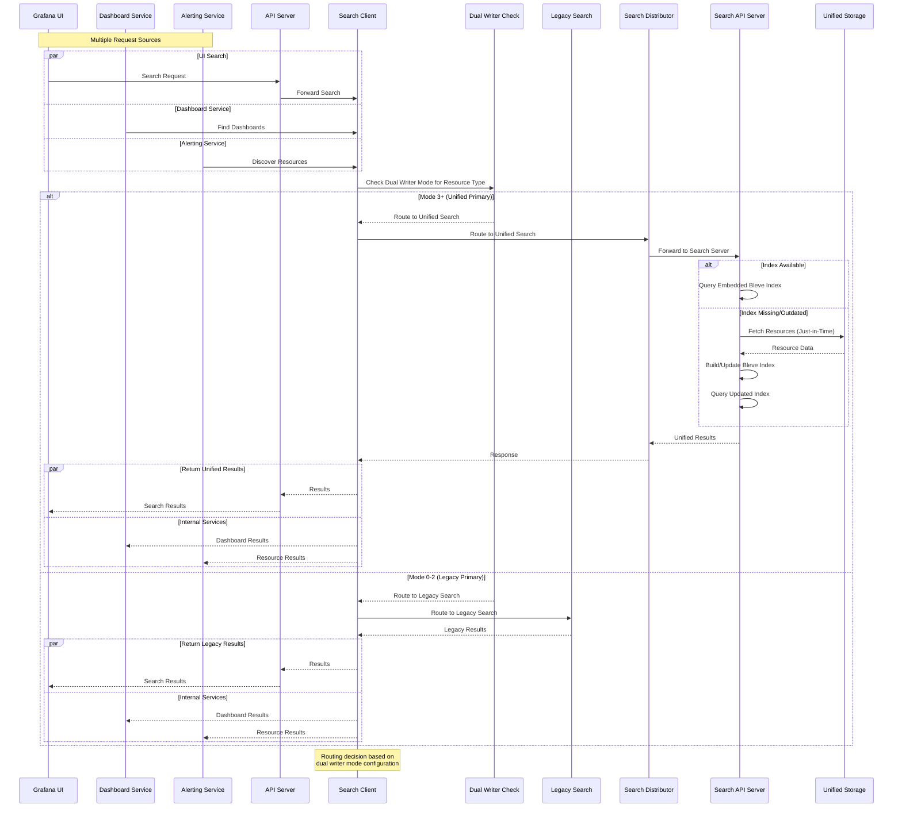

#### Search Request Flow with Shadow Traffic

When `unifiedStorageSearchDualReaderEnabled` is enabled and resource is in dual writer Mode 1-2 (legacy primary), shadow traffic is generated:

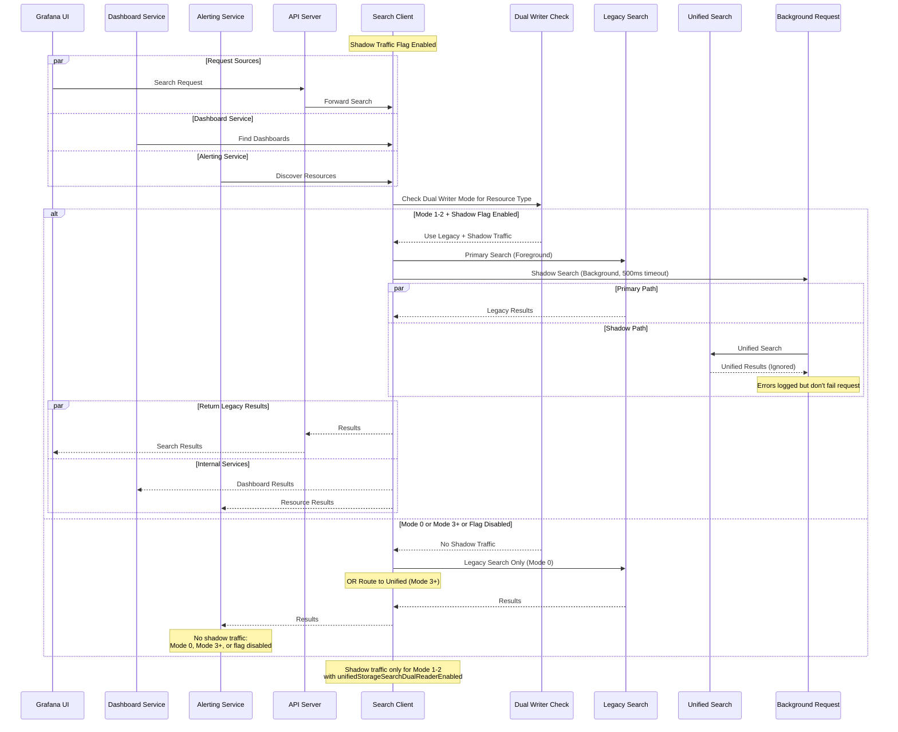

### Distributor Architecture

The Search Distributor acts as a smart proxy that routes search requests to the appropriate search API server based on namespace hashing:

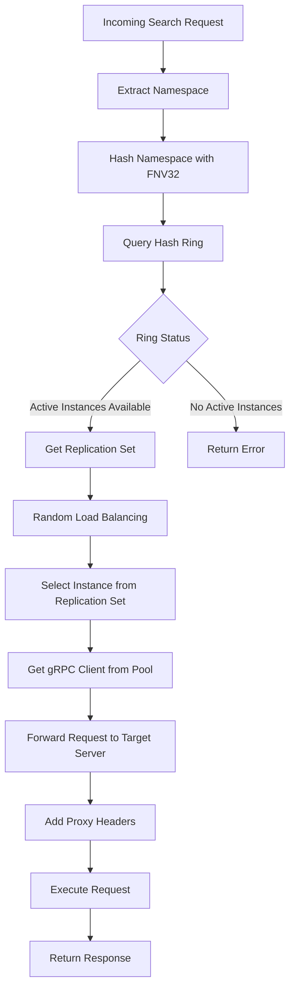

#### Key Features:
- **Namespace-based routing**: Each request is routed based on the target namespace
- **Load balancing**: Random selection among available replicas for the namespace
- **Health awareness**: Only routes to `ACTIVE` ring instances
- **Connection pooling**: Reuses gRPC connections for efficiency
- **Proxy headers**: Adds metadata for debugging and tracing

### Ring Architecture

The hash ring provides consistent, distributed assignment of namespaces to search API servers:

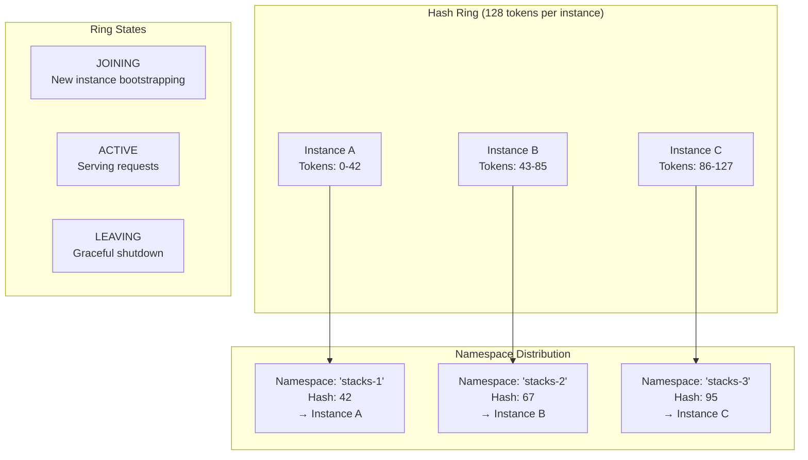

#### Ring Properties:
- **Consistent hashing**: Uses FNV32 hash function for namespace distribution
- **128 tokens per instance**: Provides good distribution across the ring
- **Replication factor**: Configurable redundancy (default based on cluster size)
- **State management**: Instances transition through JOINING → ACTIVE → LEAVING
- **Automatic rebalancing**: Ring adjusts when instances join/leave

### Namespace-Based Sharding

Unified Search uses namespace-based sharding to distribute search indexes across multiple search API servers:

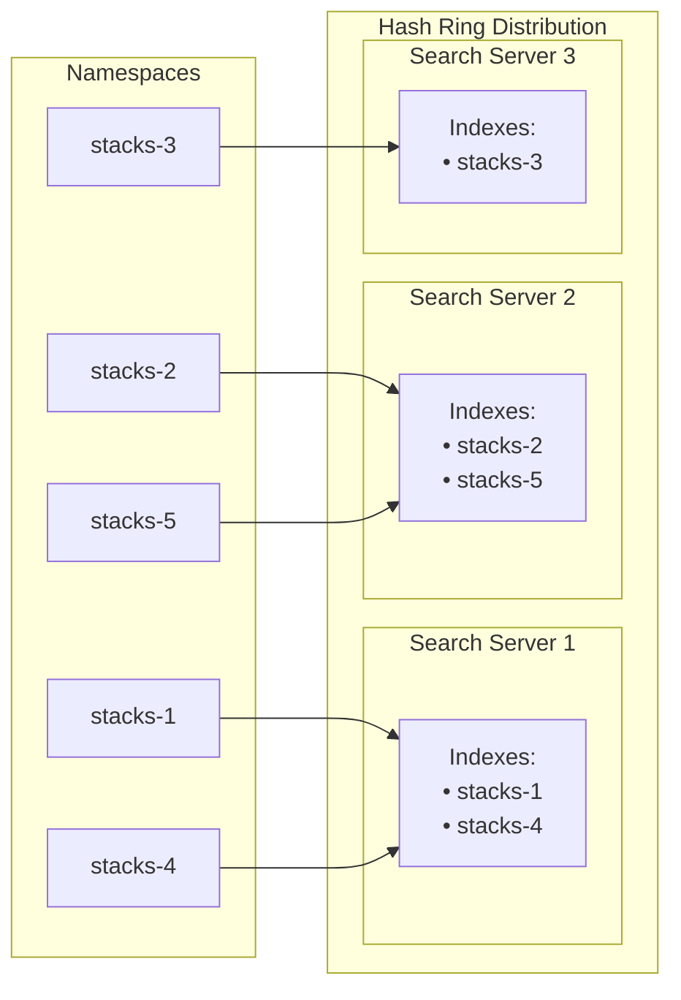

#### Sharding Benefits:
1. **Horizontal scalability**: Add more search servers to handle more namespaces
2. **Resource isolation**: Each namespace's index is independent
3. **Parallel processing**: Multiple searches can run simultaneously across different servers
4. **Fault tolerance**: Namespace availability depends only on its assigned server(s)

#### Sharding Algorithm:
```go
func getSearchServer(namespace string) string {
    hash := fnv.New32a()
    hash.Write([]byte(namespace))
    
    // Get replication set from ring
    replicationSet := ring.GetWithOptions(
        hash.Sum32(), 
        searchRingRead, 
        ring.WithReplicationFactor(ring.ReplicationFactor())
    )
    
    // Random load balancing within replication set
    instance := replicationSet.Instances[rand.Intn(len(replicationSet.Instances))]
    return instance.Id
}
```

### Search Index Management

Each search API server contains an embedded Bleve search engine that manages indexes for its assigned namespaces:

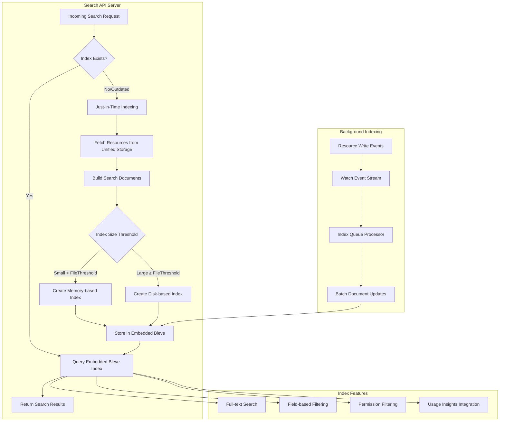

#### Index Architecture Details:

**Embedded Bleve Backend**: Each Search API Server contains its own Bleve search engine instance, not a shared external service.

**Just-in-Time Indexing**: When a search request arrives for a namespace that doesn't have an index (or has an outdated index):
1. The Search API Server fetches all resources for that namespace from Unified Storage
2. Builds search documents in memory
3. Creates either a memory-based or disk-based Bleve index depending on size
4. Executes the search query against the newly built index
5. Returns results to the user

**Index Storage Strategy**:
- **Memory indexes**: For small datasets (< `index_file_threshold` documents)
- **Disk indexes**: For large datasets (≥ `index_file_threshold` documents)
- Indexes are stored per Search API Server instance, not globally shared

**Background Updates**: In addition to just-in-time indexing, Search API Servers also maintain indexes through background watch events for incremental updates.

#### Index Configuration:
```ini
[unified_storage]
; Path for disk-based search indexes
index_path = /var/lib/grafana/unified-search/bleve

; Threshold for file-based vs memory indexes  
index_file_threshold = 1000

; Maximum batch size for indexing
index_max_batch_size = 100

; Number of worker threads for indexing
index_workers = 4

; Cache TTL for indexes
index_cache_ttl = 1h

; Periodic rebuild interval (for usage insights)
index_rebuild_interval = 24h

; Minimum resource count required to build an index (default: 1)
; If a namespace has fewer resources than this threshold, no index will be created
index_min_count = 1

; Maximum resource count before creating an empty index (default: 0 = no limit)
; When exceeded, creates an empty index instead of indexing all resources for performance
index_max_count = 0
```

### Search Request Sources

Unified Search serves multiple types of consumers within the Grafana ecosystem:

#### 1. User-Initiated Searches
- **Source**: Grafana UI search interface
- **Purpose**: Interactive dashboard and folder discovery
- **Characteristics**: Real-time, user-facing, latency-sensitive
- **Endpoint**: `/api/v1/search` (legacy search UI) or `/apis/dashboard.grafana.app/v0alpha1/namespaces/{namespace}/search` (when `unifiedStorageSearchUI` is enabled)

#### 2. Internal Service Searches

Internal services use different search backends depending on dual writer mode configuration:

- **Dashboard Service**: 
  - Find related dashboards based on tags, folders, or content
  - Discover dashboards for playlist creation
  - Validate dashboard references during operations
  - **Backend**: Depends on dashboard dual writer mode (Legacy for Mode 0-2, Unified for Mode 3+)

- **Folder Service**:
  - Retrieve folder contents and nested structures
  - Resolve folder hierarchy relationships
  - Check folder permissions and accessibility
  - **Backend**: Depends on folder dual writer mode (Legacy for Mode 0-2, Unified for Mode 3+)

- **Alerting Service**:
  - Discover dashboards and panels for alert rule creation
  - Find existing alert rules across namespaces
  - Resolve dashboard/panel references in alert definitions
  - **Backend**: Mixed - dashboard searches use dashboard dual writer mode, alert rule searches typically use legacy

- **Provisioning Service**:
  - Check for existing resources before provisioning
  - Validate resource uniqueness and naming conflicts
  - Discover resources for bulk operations
  - **Backend**: Depends on each resource type's dual writer mode configuration

- **API Services**:
  - Backend support for various API endpoints
  - Resource validation and dependency checking
  - **Backend**: Routes based on resource type's dual writer mode

#### 3. Search Operation Types

Unified Search supports multiple types of search operations:

##### Resource Search
- **Purpose**: Find resources (dashboards, folders, etc.) by content
- **Endpoint**: `/api/v1/search` (legacy) or `/apis/dashboard.grafana.app/v0alpha1/namespaces/{namespace}/search` (when `unifiedStorageSearchUI` is enabled)
- **Additional endpoint**: `/apis/dashboard.grafana.app/v0alpha1/namespaces/{namespace}/search/sortable` for retrieving sortable fields
- **Features**: Full-text search, filtering, sorting

**Sortable Fields:**

The `/search/sortable` endpoint currently returns a limited static list:
```json
{
  "fields": [
    {"field": "title", "display": "Title (A-Z)", "type": "string"},
    {"field": "-title", "display": "Title (Z-A)", "type": "string"}
  ]
}
```

However, the search backend actually supports sorting by many more fields:

**Standard Fields:**
- `title` - Resource display name (uses `title_phrase` for exact sorting)
- `name` - Kubernetes resource name
- `description` - Resource description
- `folder` - Parent folder name
- `created` - Creation timestamp (int64)
- `updated` - Last update timestamp (int64)
- `createdBy` - Creator user ID
- `updatedBy` - Last updater user ID
- `tags` - Resource tags (array)
- `rv` - Resource version (int64)

**Dashboard-Specific Fields** (require `fields.` prefix):
- `fields.schema_version` - Dashboard schema version
- `fields.link_count` - Number of dashboard links
- `fields.panel_types` - Panel types used in dashboard
- `fields.ds_types` - Data source types used
- `fields.transformation` - Transformations used

**Usage Insights Fields** (Enterprise only, require `fields.` prefix):
- `fields.views_total` - Total dashboard views
- `fields.views_last_1_days` / `fields.views_last_7_days` / `fields.views_last_30_days` - Recent views
- `fields.views_today` - Today's views
- `fields.queries_total` - Total queries executed
- `fields.queries_last_1_days` / `fields.queries_last_7_days` / `fields.queries_last_30_days` - Recent queries
- `fields.queries_today` - Today's queries
- `fields.errors_total` - Total errors
- `fields.errors_last_1_days` / `fields.errors_last_7_days` / `fields.errors_last_30_days` - Recent errors
- `fields.errors_today` - Today's errors

**Usage Examples:**
```bash
# Sort by title (ascending)
GET /apis/dashboard.grafana.app/v0alpha1/namespaces/{namespace}/search?sortBy=title

# Sort by creation date (descending)  
GET /apis/dashboard.grafana.app/v0alpha1/namespaces/{namespace}/search?sortBy=-created

# Sort by usage insights (Enterprise)
GET /apis/dashboard.grafana.app/v0alpha1/namespaces/{namespace}/search?sortBy=-fields.views_total
```

*Note: There's currently a discrepancy between the limited fields exposed by `/search/sortable` and the full range of fields actually supported by the search backend.*

##### Federated Search  
- **Purpose**: Search across multiple resource types simultaneously
- **Features**: Cross-resource queries, unified result ranking, combined sorting and faceting
- **Implementation**: Uses Bleve IndexAlias to combine multiple indexes for unified searching
- **Default behavior**: When no type is specified, automatically federates dashboards and folders

**How Federated Search Works:**

Federated search is implemented using Bleve's IndexAlias feature, which allows searching across multiple indexes as if they were a single unified index. This enables:

1. **Cross-resource queries**: Search for content across dashboards, folders, and other resource types
2. **Unified sorting**: Results from different resource types are merged and sorted together
3. **Combined faceting**: Aggregate facet statistics across all federated resource types
4. **Permission filtering**: Respects user permissions for each resource type independently

**API Usage Examples:**

**1. Default Federation (Dashboards + Folders):**
```bash
# When no type is specified, automatically searches dashboards and folders
GET /apis/dashboard.grafana.app/v0alpha1/namespaces/{namespace}/search?query=my-search
```

**2. Single Resource Type Search:**
```bash
# Search only folders (despite the "dashboard" API group, type parameter controls what's searched)
GET /apis/dashboard.grafana.app/v0alpha1/namespaces/{namespace}/search?type=folders&query=my-search

# Search only dashboards
GET /apis/dashboard.grafana.app/v0alpha1/namespaces/{namespace}/search?type=dashboards&query=my-search
```

**3. Explicit Two-Type Federation:**
```bash
# Search dashboards (primary) with folders federated
GET /apis/dashboard.grafana.app/v0alpha1/namespaces/{namespace}/search?type=dashboards&type=folders&query=my-search
```

**4. Protocol Buffer Request Structure:**
```protobuf
message ResourceSearchRequest {
  ListOptions options = 1;          // Primary resource type to search
  repeated ResourceKey federated = 2; // Additional resource types to federate
  string query = 3;                 // Search query applied across all types
  // ... other fields
}
```

**Example gRPC/Protocol Buffer Usage:**
```go
searchRequest := &resourcepb.ResourceSearchRequest{
    Options: &resourcepb.ListOptions{
        Key: dashboardKey, // Primary: search dashboards
    },
    Federated: []*resourcepb.ResourceKey{
        folderKey, // Also search folders
    },
    Query: "monitoring",
    Limit: 50,
    SortBy: []*resourcepb.ResourceSearchRequest_Sort{
        {Field: "title", Desc: false}, // Sort combined results by title
    },
}
```

**5. Unified Results:**
Federated search returns a single result set containing resources from all specified types, with:
- **Unified ranking**: All results scored and ranked together
- **Cross-type sorting**: Resources from different types sorted by common fields (title, tags, etc.)
- **Resource type identification**: Each result includes metadata indicating its resource type
- **Permission-aware filtering**: Only returns resources the user has permission to see

**Limitations:**
- Federation only works across resource types with **common fields** (title, tags, folder, etc.)
- All federated indexes must be of the same search backend type (currently Bleve)
- Currently supports up to 2 resource types in federation via the API endpoint
- **Architectural note**: The search endpoint is under `dashboard.grafana.app` but can search any resource type via the `type` parameter - this is a design choice where the "dashboard search" has evolved into a generic search endpoint

##### Managed Objects
- **Purpose**: Administrative queries for resource management
- **Operations**: Count, list, statistics

##### Stats and Monitoring
- **Purpose**: Index health and performance metrics
- **Metrics**: Document counts, index sizes, search latency


### Monitoring and Observability

Key metrics for monitoring Unified Search:

- `unified_search_requests_total`: Search request counts by type and status
- `unified_search_request_duration_seconds`: Search request latency
- `unified_search_index_size_bytes`: Size of search indexes
- `unified_search_documents_total`: Number of indexed documents
- `unified_search_indexing_duration_seconds`: Time to build/update indexes
- `unified_search_shadow_requests_total`: Shadow traffic request counts
- `unified_search_ring_members`: Number of active search server instances


