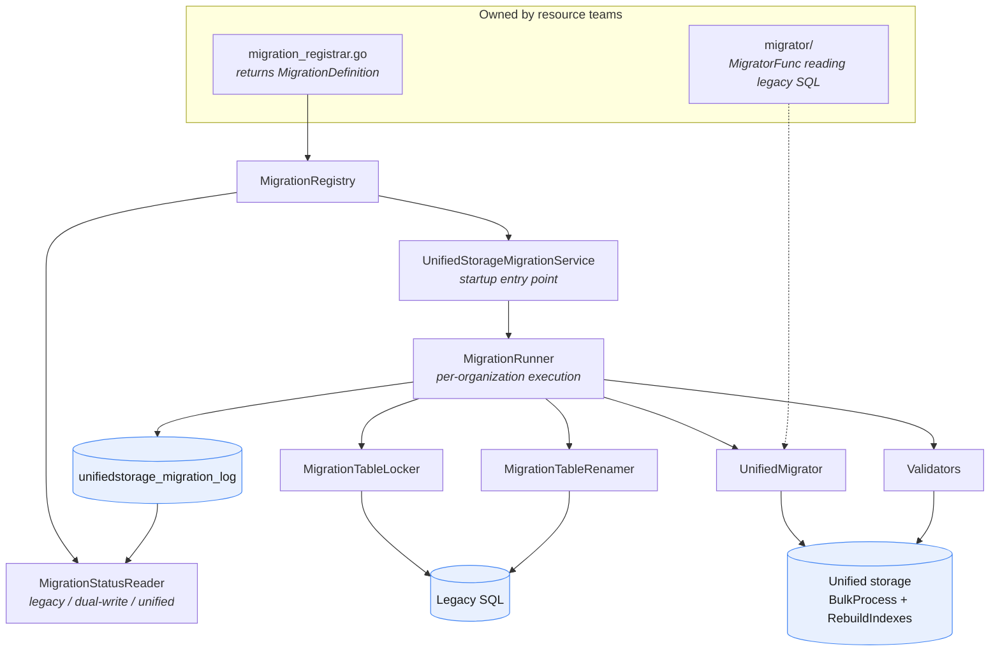
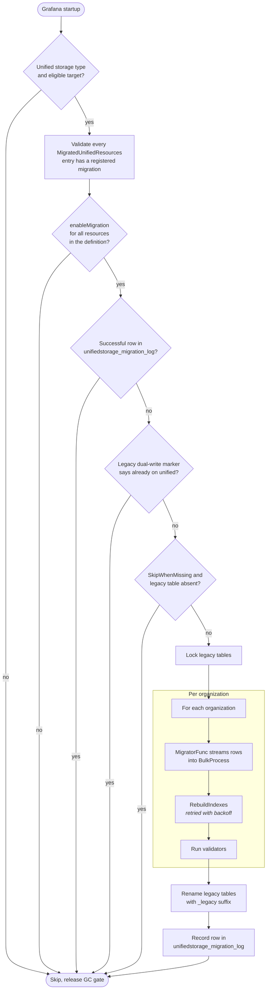

# Unified storage data migrations

Automated migration of Grafana resources from legacy SQL tables to unified storage. Migrations run
once at startup, per organization, and are validated before being recorded as complete.

## Resources

| Resource | Group | Legacy tables | Migrated by default |
|---|---|---|---|
| Folders | `folder.grafana.app` | `dashboard`, `dashboard_version`, `dashboard_provisioning` | yes |
| Dashboards | `dashboard.grafana.app` | `dashboard`, `dashboard_version`, `dashboard_provisioning` | yes |
| Playlists | `playlist.grafana.app` | `playlist`, `playlist_item` | yes |
| Snapshots | `dashboard.grafana.app` | `dashboard_snapshot` | no |
| Short URLs | `shorturl.grafana.app` | `short_url` | no |
| Stars | `collections.grafana.app` | `star`, `user` | no |
| Preferences | `preferences.grafana.app` | `preferences`, `user`, `team` | no |
| Datasources | `datasource.grafana.app` | `data_source` | no |
| Query cache configs | `querycaching.grafana.app` | `data_source_cache`, `data_source` | no |

Defaults come from `MigratedUnifiedResources` in [setting_unified_storage.go](../../../setting/setting_unified_storage.go)
and can be overridden per resource with `enableMigration`.

## Architecture



### Components

- [registry.go](registry.go) — `MigrationDefinition`, `ResourceInfo`, `MigratorFunc`, `Validator`, and the thread-safe `MigrationRegistry`
- [service.go](service.go) — `UnifiedStorageMigrationServiceImpl`, the Wire-provided startup entry point
- [resource_migration.go](resource_migration.go) — `MigrationRunner` (per-org logic) and `ResourceMigration` (SQL migration wrapper)
- [resources.go](resources.go) — registration into the SQL migrator and `enableMigration` resolution
- [migrator.go](migrator.go) — `UnifiedMigrator`: BulkProcess streaming and index rebuilds with backoff
- [validator.go](validator.go) — `CountValidator` and `FolderTreeValidator`
- [table_locker.go](table_locker.go) / [table_renamer.go](table_renamer.go) — locking legacy tables during migration and renaming them afterwards
- [status_reader.go](status_reader.go) — resolves the storage mode for a resource from the migration log plus config, with caching
- [contract/migrations.go](contract/migrations.go) — `StorageMode` and the interfaces consumers depend on, kept separate to avoid import cycles

### Registrars

Each team owns a `migration_registrar.go` in its root package exposing an `Xxx…Migration` factory,
plus a `MigratorFunc` implementation in a `migrator/` (or existing `legacy/`) subpackage.

| Package | Factory |
|---|---|
| [pkg/registry/apis/dashboard](../../../registry/apis/dashboard/migration_registrar.go) | `FoldersDashboardsMigration` |
| [pkg/registry/apis/dashboard/snapshot](../../../registry/apis/dashboard/snapshot/migration_registrar.go) | `SnapshotMigration` |
| [pkg/registry/apis/datasource](../../../registry/apis/datasource/migration_registrar.go) | `DataSourceMigration` |
| [pkg/registry/apis/collections](../../../registry/apis/collections/migration_registrar.go) | `StarsMigration` |
| [pkg/registry/apis/preferences](../../../registry/apis/preferences/migration_registrar.go) | `PreferencesMigration` |
| [pkg/registry/apps/playlist](../../../registry/apps/playlist/migration_registrar.go) | `PlaylistMigration` |
| [pkg/registry/apps/shorturl](../../../registry/apps/shorturl/migration_registrar.go) | `ShortURLMigration` |
| [pkg/registry/apps/querycaching](../../../registry/apps/querycaching/migration_registrar.go) | `QueryCacheConfigMigration` |

All definitions are assembled in `ProvideMigrationRegistry` in [pkg/server/wire_helpers.go](../../../server/wire_helpers.go).

## Migration flow



Notes on the guards:

- **Eligibility** — `cfg.ShouldRunMigrations()` requires the `unified` storage type and an `all` or `core`
  target. The GC gate is released on every exit path so storage garbage collection can start.
- **Enablement parity** — a definition covering several resources fails fast if `enableMigration` differs
  between them; they must all be enabled or all disabled.
- **Dual-write marker** — folders and dashboards only. Older Grafana versions recorded dual-write state in
  `kv_store` (12.1+) or `<data_path>/dualwrite.json` (12.0). If it says the resources are already on unified
  storage, the migration is skipped rather than wiping unified storage and repopulating it from SQL.
- **Namespace** — comes from `types.OrgNamespaceFormatter` (`default` for org 1, `org-{orgId}` otherwise)
  and reaches the migrator as `opts.Namespace`. Never build it by hand.
- **Pre-migration delete** — BulkProcess deletes the whole collection before writing, in the same
  transaction, so a failed migration rolls back and a re-run cannot duplicate data.
- **SQLite fallback** — if the in-memory bulk write fails, the run is retried once with a parquet buffer.

## Storage mode

`MigrationStatusReader` is what consumers ask to decide where a resource lives. Resolution order:

1. Successful migration log entry → `unified`
2. Config `dualWriterMode` 1–3 → `dual-write`
3. Config `dualWriterMode` 4–5 → `unified`
4. Otherwise → `legacy`

Results are cached (`storage_mode_cache_ttl`); a resolved `unified` is cached permanently. If the log table
cannot be created at startup the reader falls back to config-only resolution and retries later.

`ResourceInfo.FloorVersion` declares the oldest apiVersion that may exist in unified storage for a resource.
The served-version guard uses it to prevent unregistering a version that migrated data still carries, which
would make that data unservable. Datasources register one floor for `datasource.grafana.app`; it also covers
the per-plugin subgroups.

## Legacy table rename

After a successful migration, legacy tables listed in `RenameTables` get a `_legacy` suffix so old pods
cannot write to them during a rolling upgrade. Renaming is skipped when `disable_legacy_table_rename = true`
or when `migration_locking = false` — the MySQL path needs the read lock to order the rename.

| Database | Lock | Rename |
|---|---|---|
| Postgres | `LOCK TABLE … IN SHARE MODE` on the migration session | `ALTER TABLE … RENAME TO` on the same session; Postgres upgrades the lock to `ACCESS EXCLUSIVE` |
| MySQL | `LOCK TABLES … READ` on a dedicated connection | One `RENAME TABLE` per table on separate connections; DDL priority puts them ahead of pending DML when the lock is released |
| SQLite | Shared transaction (single writer) | `ALTER TABLE … RENAME TO` on the same session |

On Postgres and SQLite the rename is part of the framework transaction. On MySQL, DDL auto-commits, so a
crash can leave tables partially renamed; `RecoverRenamedTables()` runs before each migration and restores
`_legacy` tables to their original names so the migration can re-run cleanly.

## Validators

Validators run per organization after the index rebuild, and a failure fails the migration. Items the bulk
API rejected are accounted for and do not fail validation on their own.

- **`CountValidation`** — compares legacy row count with unified storage. `Where` scopes to the org,
  `Distinct` counts unique values, and `Join` adds an inner join so orphaned rows the migrator skips are not
  counted. Uses direct table queries on SQLite and `GetStats` elsewhere.
- **`FolderTreeValidation`** — compares folder parent maps built from legacy and unified storage to confirm
  the hierarchy survived.

## Configuration

Per resource, in `conf/defaults.ini` or custom config:

```ini
[unified_storage.playlists.playlist.grafana.app]
dualWriterMode = 0
enableMigration = true
```

Equivalent env vars are supported: `GF_UNIFIED_STORAGE_PLAYLISTS_PLAYLIST_GRAFANA_APP_ENABLEMIGRATION`.

Global keys in `[unified_storage]`:

| Key | Default | Purpose |
|---|---|---|
| `migration_locking` | `true` | Lock legacy tables during migration. Disabling also disables the rename and risks data drift; only safe with a single instance and no other writers. |
| `disable_legacy_table_rename` | `false` | Skip the `_legacy` rename, e.g. during development |
| `rename_wait_deadline` | `1m` | How long MySQL waits for renames to queue behind the read lock |
| `migration_cache_size_kb` | `1000000` | SQLite page cache during bulk inserts; prevents a cache spill deadlocking with the legacy read cursor |
| `migration_parquet_buffer` | `false` | Buffer bulk writes through parquet |
| `migration_chunked_writes` | `false` | Commit bulk writes in multiple transactions. Needs `migration_locking` for HA read isolation. |
| `migration_chunk_max_bytes` | `256MiB` | Soft byte budget per chunk |

## Adding a new resource

### 1. Implement the migrator

Write a function matching `MigratorFunc` that reads your legacy table and sends resources to the stream.
Buffer rows and close the cursor before streaming — `stream.Send` can be slow and holding a cursor open
across it starves the connection pool. Paginate for large tables. Take the namespace from `opts.Namespace`.

Expose it behind a small interface in a `migrator/` subpackage:

```go
// pkg/registry/apps/myresource/migrator/migrator.go
package migrator

type MyResourceMigrator interface {
    MigrateMyResources(ctx context.Context, orgId int64, opts migrations.MigrateOptions,
        stream resourcepb.BulkStore_BulkProcessClient) error
}

func ProvideMyResourceMigrator(db legacysql.LegacyDatabaseProvider) MyResourceMigrator {
    return &myResourceMigrator{db: db}
}
```

### 2. Create the migration definition

Add `migration_registrar.go` to your team's root package:

```go
package myresource

func MyResourceMigration(m migrator.MyResourceMigrator) migrations.MigrationDefinition {
    gr := schema.GroupResource{Group: myresourceV1.APIGroup, Resource: "myresources"}

    return migrations.MigrationDefinition{
        ID:          "myresources",
        MigrationID: "myresources migration",
        Resources: []migrations.ResourceInfo{
            {
                GroupResource: gr,
                LockTables:    []string{"my_resource_table"},
                FloorVersion:  myresourceV1.APIVersion,
            },
        },
        Migrators: map[schema.GroupResource]migrations.MigratorFunc{
            gr: m.MigrateMyResources,
        },
        Validators: []migrations.ValidatorFactory{
            migrations.CountValidation(gr, migrations.CountValidationOptions{
                Table: "my_resource_table",
                Where: "org_id = ?",
            }),
        },
        RenameTables:    []string{"my_resource_table"},
        SkipWhenMissing: false,
    }
}
```

`LockTables` must list every table the migrator reads. Set `SkipWhenMissing` when new deployments no longer
create the legacy table, so a missing table skips the migration instead of failing it. Leave `RenameTables`
empty while other code paths still read the legacy table. Set `ResourceGroupsFunc` only if the groups
present in a namespace have to be discovered at runtime, as datasources do for per-plugin groups.

### 3. Wire it up

Add the migrator provider to your `wire.go`, register the definition in `ProvideMigrationRegistry`
in [pkg/server/wire_helpers.go](../../../server/wire_helpers.go), then run `make gen-go`.

### 4. Declare the resource in settings

Add a constant and a `MigratedUnifiedResources` entry in
[setting_unified_storage.go](../../../setting/setting_unified_storage.go). This is required: startup
validation fails if a map entry has no registered migration, and the map supplies the compiled-in
`enableMigration` default.

```go
const MyResource = "myresources.myresource.grafana.app"

var MigratedUnifiedResources = map[string]bool{
    MyResource: false,
}
```

### Checklist

- [ ] `MigratorFunc` implemented and tested, exposed through a `migrator/` interface
- [ ] `migration_registrar.go` created with `LockTables`, `FloorVersion`, and at least a `CountValidation`
- [ ] Migrator provider added to `wire.go` and registered in `ProvideMigrationRegistry`
- [ ] `wire_gen.go` regenerated with `make gen-go`
- [ ] `RenameTables` decided, and code audited for legacy table reads not behind the status reader
- [ ] Resource added to `MigratedUnifiedResources`
- [ ] Test case added to [testcases/](testcases/) and registered in `defaultMigrationTestCases()`

### Adding a validator

Implement `Validator` and expose it as a `ValidatorFactory`, then add the factory to the `Validators` slice
of your definition:

```go
func MyValidation(resource schema.GroupResource) ValidatorFactory {
    return func(client resourcepb.ResourceIndexClient, driverName string) Validator {
        return &MyValidator{resource: resource, client: client}
    }
}
```

## Testing

### Test cases

Every resource owner maintains a test case in [testcases/](testcases/) implementing
`ResourceMigratorTestCase`: it seeds representative legacy data in `Setup` and asserts the result in
`Verify`.

```go
type ResourceMigratorTestCase interface {
    Name() string
    Resources() []schema.GroupVersionResource
    FeatureToggles() []string
    RenameTables() []string
    AddLegacySQLMigrations(mg *migrator.Migrator)
    Setup(t *testing.T, helper *apis.K8sTestHelper) bool
    Verify(t *testing.T, helper *apis.K8sTestHelper, shouldExist bool)
}
```

| Test case | File | Coverage |
|---|---|---|
| `NewFoldersAndDashboardsTestCase` | [folders_dashboards.go](testcases/folders_dashboards.go) | Nested folders, dashboards with library panels |
| `NewPlaylistsTestCase` | [playlists.go](testcases/playlists.go) | Dashboard UID, tag, and mixed items |
| `NewSnapshotsTestCase` | [snapshots.go](testcases/snapshots.go) | Dashboard snapshots |
| `NewShortURLsTestCase` | [shorturls.go](testcases/shorturls.go) | Short URL entries |
| `NewStarsTestCase` | [stars.go](testcases/stars.go) | Starred dashboards per user |
| `NewPreferencesTestCase` | [preferences.go](testcases/preferences.go) | User, team, and org owners |
| `NewDataSourceTestCase` | [datasources.go](testcases/datasources.go) | Secure JSON data. Skipped on SQLite. |
| `NewQueryCacheConfigsTestCase` | [querycacheconfigs.go](testcases/querycacheconfigs.go) | Query cache config entries |

They are shared by the suites in [migrator_test.go](migrator_test.go), which cover the default path, chunked
writes, and the KV backend.

### Re-running a migration

Delete the log row and restart Grafana. Re-running is safe: the bulk write deletes the collection first.

```sql
SELECT * FROM unifiedstorage_migration_log;
DELETE FROM unifiedstorage_migration_log WHERE migration_id = 'playlists migration';
```

### Logs

Migration progress is logged under `storage.unified.migration_runner.{id}`, and the bulk stream under
`storage.unified.migrator`. `migration_status_reader_bootstrap_failures_total` counts failures to create the
migration log table at startup.
