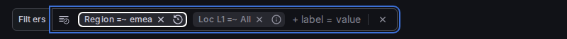

# Pinned filters — visual grouping design options

The pinned filter controls and the bulk filters combobox form one logical filtering input, but in
the baseline design nothing visually unifies them. These mockups explore ways to show the
grouping. All options were rendered live against the real components (the styling variants via a
temporary style switch that is not part of this PR; the pills option by disabling the
`grafana.pinnedFilters` toggle, which falls back to the shipped dashboard-origin pill rendering
inside the combobox).

State shown in each shot: `Region` pinned (`emea` selected), `Loc L1` pinned (`uk` selected),
plus the bulk "Filters" input.

## A. Baseline (current PR)

Standalone controls, standard control spacing, no explicit grouping element.

## B. Boxed group

One bordered container (`border.medium`, default radius, 4px padding) wraps pinned controls and
the bulk input.

## C. Tinted group

No border; a shared background tint (`action.selected`, default radius) marks the group.

## D. Underline

A 2px primary-colored underline spans the whole group.

## E. Connector glyphs

An en-dash between neighbouring controls chains them together, with tightened spacing.

## F. Scenes pills (for contrast — the pre-existing UX)

What viewers get with the toggle **off**: dashboard-origin filters render as non-removable pills
inside the single combobox. Everything is inherently unified, but the pinned fields read as
`key =~ value` pills rather than labeled value pickers, and empty state shows as `=~ All`.

## Notes

- B/C/D/E are pure CSS on the `PinnedAdHocFilters` wrapper — trivially adoptable in this PR if
  reviewers prefer one.
- F would mean dropping the standalone-control UX (or moving it into `@grafana/scenes` as a new
  origin-pill rendering mode) — a different product direction rather than a styling change.
- Wrapping behavior: B/C/D group visually even when the controls wrap to multiple lines; E reads
  poorly across line breaks.
