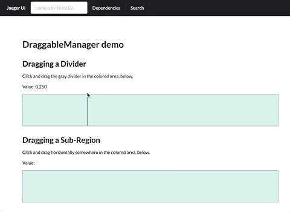

# DraggbleManager Information and Demo

In the `src/utils/DraggableManager/demo` folder there is a small project that demonstrates the use of the `DraggableManager` utility.

The demo contains two components:

- `DividerDemo`, which occupies the top half of the web page
- `RegionDemo`, which occupies the bottom half of the web page, as shown in the GIF, below



## Caveat

This DraggableManager utility does not actually "drag" anything, it does not move or drag DOM elements, it just tells us where the mouse is while the mouse is down. Primarily, it listens for `mousedown` and subsequent `mousemove` and then finally `mouseup` events. (It listens to `window` for the `mousemove` and `mouseup` events.)

What we do with that information is up to us. This is mentioned because you need to handle the DraggableManager callbacks _to create the illusion of dragging_.

## In brief

DraggableManager instances provide three (and a half) conveniences:

- Handle mouse events related to dragging.
- Maps `MouseEvent.clientX` from the [client area](https://developer.mozilla.org/en-US/docs/Web/API/MouseEvent/clientX) to the local context (yielding `x` (pixels) and `value` (0 -> 1, e.g, `x/width`)).
- Maintains a sense of state in terms of whether or not the subject DOM element is being dragged. For example, it fires `onMouseMove` callbacks when not being dragged and `onDragMove` when being dragged.
- Two other minor conveniences (relating to window events)

And, DraggableManager instances have two (or three) primary requirements:

- Mouse events need to be piped into it
- The `getBounds()` constructor parameter must be provided
- At least some of the callbacks need to be handled

## Conveniences

### Handles the mouse events related to dragging

For the purposes of handling mouse events related to the intended dragging functionality, DraggableManager instances expose the following methods (among others):

- `handleMouseEnter`
- `handleMouseMove`
- `handleMouseLeave`
- `handleMouseDown`

To use a DraggableManager instance, relevant mouse events should be piped to the above handlers:

```jsx
<div className="DividerDemo--realm">
  <div className="DividerDemo--divider" onMouseDown={this._dragManager.handleMouseDown} />
</div>
```

> **Note:** Not all handlers are always necessary. See "Mouse events need to be piped into it" for more details.

### Maps the `clientX` to `x` and `value`

`MouseEvent` (and `SyntheticMouseEvent`) events provide the [`clientX`](https://developer.mozilla.org/en-US/docs/Web/API/MouseEvent/clientX) property, which generally needs some adjustments before it's useful. For instance, in the following snippet we transform `clientX` to the `x` within the `<div>`. The `value` is simply the `x/width` ratio, which is pretty much the percent but divided by `100`.

```jsx
<div className="DividerDemo--realm">
  <div
    className="DividerDemo--divider"
    onMouseDown={(event) => {
      const { clientX, target } = event;
      const { left, width } = target.getBoundingClientRect();
      const localX = clientX - left;
      console.log('within the client area, x:', clientX);
      console.log('within the div, x:        ', localX);
      console.log('position along the width: ', localX / width);
    }}
  />
</div>
```

In other words, DraggableManager instances convert the data to the relevant context. (The "relevant context" is, naturally, varies... see the `getBounds()` constructor parameter below).

### Maintains a sense of state

The callbacks for DraggableManager instances are:

- onMouseEnter
- onMouseLeave
- onMouseMove
- onDragStart
- onDragMove
- onDragEnd

Implicit in the breakdown of the callbacks is the notion that `onDrag*` callbacks are fired when dragging and `onMouse*` callbacks are issued, otherwise.

Therefore, using the DraggableManager util relieves us of the necessity of keeping track of whether we are currently dragging or not.

### Two other minor conveniences

When dragging starts, the util then switches over to listening to window events (`mousemove` and `mouseup`). This prevents the dragging from having strange behavior if / when the user moves the mouse anywhere on the page.

Last but not least...

The util listens for window resize events and makes adjustments accordingly, preventing things from going crazy (due to miscalibration) if the user resizes the window. This primary relates to the `getBounds()` constructor option (see below).

## Requirements

### Mouse events need to be piped into it

In my use, DraggbaleManager instances become the receiver of the relevant mouse events instead of handlers on the React component.

For instance, if implementing a draggable divider (see `DividerDemo.js` and the top half of the gif), only `onMouseDown` needs to be handled:

```jsx
<div className="DividerDemo--realm">
  <div className="DividerDemo--divider" onMouseDown={this._dragManager.handleMouseDown} />
</div>
```

But, if implementing the ability to drag a sub-range (see `RegionDemo.js` and the bottom of demo gif), you generally want to show a vertical line at the mouse cursor until the dragging starts (`onMouseDown`), then you want to draw the region being dragged. So, the `onMouseMove`, `onMouseLeave` and `onMouseDown` handlers are necessary:

```jsx
<div
  className="RegionDemo--realm"
  onMouseDown={this._dragManager.handleMouseDown}
  onMouseMove={this._dragManager.handleMouseMove}
  onMouseLeave={this._dragManager.handleMouseMove}
>
  {/* Draw visuals for the currently dragged range, otherwise empty */}
</div>
```

### `getBounds()` constructor parameter

The crux of the conversion from `clientX` to `x` and `value` is the `getBounds()` constructor parameter.

The function is a required constructor parameter, and it must return a `DraggableBounds` object:

```
type DraggableBounds = {
  clientXLeft: number,
  maxValue?: number,
  minValue?: number,
  width: number,
};
```

This generally amounts to calling [`Element#getBoundingClientRect()`](https://developer.mozilla.org/en-US/docs/Web/API/Element/getBoundingClientRect) on the DOM element that defines the valid dragging range.

For instance, in the `DividerDemo`, the function used is `DivideDemo#_getDraggingBounds()`:

```ts
_getDraggingBounds = (): DraggableBounds => {
  if (!this._realmElm) {
    throw new Error('invalid state');
  }
  const { left: clientXLeft, width } = this._realmElm.getBoundingClientRect();
  return {
    clientXLeft,
    width,
    maxValue: 0.98,
    minValue: 0.02,
  };
};
```

In the snippet above, `this._realmElm` is the `<div>` that fills the green draggable region.

On the other hand, if you need more flexibility, this function can ignore the DOM altogether and do something else entirely. It just needs to return an object with `clientXLeft` and `width` properties, at the minimum.

`maxValue` and `minValue` are optional and will restrict the extent of the dragging. They are in terms of `value`, not `x`.

### The callbacks need to be handled

Last but not least, if the callbacks are ignored, nothing happens.

In the `DividerDemo`, we're only interested in repositioning the divider when it is dragged. We don't care about mouse related callbacks. So, only the drag related callbacks are handled. And, all of the drag callbacks are handled in the same way: we update the position of the divider. Done. See `DividerDemo#_handleDragEvent()`.

In the other scenario, `RegionDemo`, we care about showing the red vertical line for mouse-over. This sort of indicates to the user they can click and drag, and when they drag we want to show a region that spans the current drag. So, we handle the mousemove and mouseleave callbacks along with the drag callbacks.

The `RegionDemo` is a bit more involved, so, to break down how we handle the callbacks... First, we store the following state (in the parent element, incidentally):

- `regionCursor` is where we draw the cursor indicator (a red vertical line, in the demo).
- `regionDragging` represents the start (at index `0`) and current position (at index `1`) of the region currently being dragged.

```
{
  regionCursor: ?number,
  regionDragging: ?[number, number],
}
```

Then, we handle the callbacks as follows:

- `onMouseMove`
  - Set `regionCursor` to `value`
  - This allows us to draw the red vertical line at the cursor
- `onMouseLeave`
  - Set `regionCursor` to `null`
  - So we know not to draw the red vertical line
- `onDragStart`
  - Set `regionDragging` to `[value, value]`
  - This allows us to draw the dragging region
- `onDragMove`
  - Set `regionDragging` to `[regionDragging[0], value]`
  - Again, for drawing the dragging region. We keep `regionDragging[0]` as-is so we always know where the drag started
- `onDragEnd`
  - Set `regionDragging` to `null`, set `regionCursor` to `value`
  - Setting `regionDragging` to `null` lets us know not to draw the region, and setting `regionCursor` lets us know to draw the cursor right where the user left off

This is a contrived demo, so `onDragEnd` is kind of boring... Usually we would do something more interesting with the final `x` or `value`.

## API

### Constants `updateTypes`

Used as the `type` field on `DraggingUpdate` objects.

```
{
  DRAG_END: 'DRAG_END',
  DRAG_MOVE: 'DRAG_MOVE',
  DRAG_START: 'DRAG_START',
  MOUSE_ENTER: 'MOUSE_ENTER',
  MOUSE_LEAVE: 'MOUSE_LEAVE',
  MOUSE_MOVE: 'MOUSE_MOVE',
};
```

### Type `DraggingUpdate`

The data type issued for all callbacks.

```
type DraggingUpdate = {
  event: SyntheticMouseEvent<any>,
  manager: DraggableManager,
  tag: ?string,
  type: UpdateType,
  value: number,
  x: number,
};
```

### Type `DraggableBounds`

The type the `getBounds()` constructor parameter must return.

```
type DraggableBounds = {
  clientXLeft: number,
  maxValue?: number,
  minValue?: number,
  width: number,
};
```

`clientXLeft` is used to convert [`MouseEvent.clientX`](https://developer.mozilla.org/en-US/docs/Web/API/MouseEvent/clientX) from the client area to the dragging area.

`maxValue` and `minValue` are in terms of `value` on the updates, e.g. they are in the range from `[0, 1]` where `0` is the far left (e.g. style `left: 0;`) end of the draggable region and `1` is the far right end (style `right: 0`). If set, they will restrict the `x` and `value` issued by the callbacks.

`width` is used to convert `x` to `value` and is also the span on which `minValue` and `maxValue` are mapped onto when calculating `x` and `value` for issuing callbacks.

### Constructor parameters

```
type DraggableManagerOptions = {
  getBounds: (?string) => DraggableBounds,
  onMouseEnter?: DraggingUpdate => void,
  onMouseLeave?: DraggingUpdate => void,
  onMouseMove?: DraggingUpdate => void,
  onDragStart?: DraggingUpdate => void,
  onDragMove?: DraggingUpdate => void,
  onDragEnd?: DraggingUpdate => void,
  resetBoundsOnResize?: boolean,
  tag?: string,
};
```

`getBounds()` is used to map the `clientX` to whatever the dragging context is. **It is called lazily** and the returned value is cached, until either `DraggableManager#resetBounds()` is called, the window is resized (when `resetBoundsOnResize` is `true`) or `DraggableManager#dispose()` is called.

The callbacks are all optional. The callbacks all present the same data (`DraggingUpdate`), with the `type` field being set based on which callback is firing (e.g. `type` is `'MOUSE_ENTER'` when `onMouseEnter` is fired), and the `x` and `value` representing the last know position of the mouse cursor.

If `resetBoundsOnResize` is `true`, the instance resets the cached `DraggableBounds` when the window is resized.

`tag` is an optional string parameter. It is a convenience field for distinguishing different `DraggableManager` instances. If set on the constructor, it is set on every `DraggingUpdate` that is issued.

### `DraggableManager# isDragging()`

Returns `true` when the instance is in a dragged state, e.g. after `onDragStart` is fired and before `onDragEnd` is fired.

### `DraggableManager# dispose()`

Removes any event listeners attached to `window` and sets all instance properties to `undefined`.
