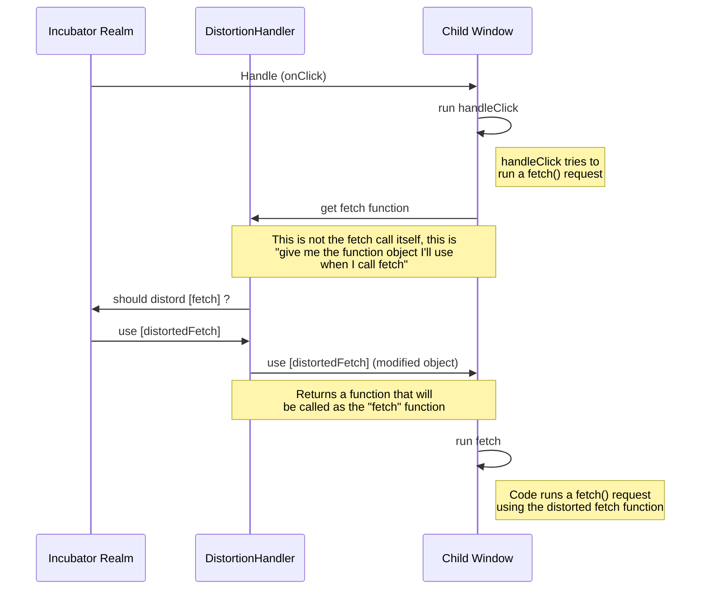

# Frontend plugin sandboxing.

This folder contains the code responsible for front end plugins sandboxing. A small part of the code
exists in the plugin loader as a required entry point here.

# General idea

The general idea of the sandbox is javascript [shadow realms](https://github.com/tc39/proposal-shadowrealm).

With shadowrealms you can run javascript code that runs on the same thread as your main application but doesn't have
access to the same global scope as your main application.

Sadly at the moment of writing this readme file, shadow realms are still in a proposal stage and not yet developed for
any browser. Instead we are using a library that implements a similar concept called [near membrane](https://github.com/salesforce/near-membrane)

# Plugin Loading

When a plugin is marked for loading, grafana decides if it should load it in the incubator realm (no sandbox, same as loading any script on the browser) or in a sandbox (child realm, evaluated with near-membrane).

- If a plugin is marked to load in the incubator realm, it is loaded via systemJS

- If a plugin is marked to load in a sandbox, first the source code is downloaded with `fetch`, then pre-processed to adjust sourceMaps and CDNs and finally evaluated inside a new near-membrane virtual environment.

In either case, Grafana receives a pluginExport object that later uses to initialize plugins. For Grafana's core, this
pluginExport is idential in functionality and properties regardless of the loading method.

# Plugin execution

The plugin execution from Grafana's perspective doesn't change in anyway when loaded inside a sandbox.

The main difference is that all the plugin code executed that was evaluated inside a child realm, will always execute in
the child realm, regardless of where it is called.

# Components rendering and React

Likewise the sandboxed components are rendered using React as usual. The main difference is that when React executes the
React components (functions) that come from a child realm, those components will be executed in the child realm context
with its limited scope and distortions (to be covered later). This in general terms doesn't affect the way React works,
access to React contexts, portals, etc...

## Event handlers

Any event handling (clicks, keyboard, etc..) by components is done in the child realm, since those event handlers where
defined inside the child realm.

## DOM API and DOM Element access

Plugins can have access to DOM Elements in the present document using the regular APIs but there are restriction set in
place by distortions (see later)

## Error handling

Errors inside the sandbox are reported as errors inside the sandbox. This means the stacktrace of an error from a plugin
inside the sandbox will contain additional information of the many layers that exist between the regular grafana code
and the plugin code.

## Performance

Due to the nature of distortions (see later). There could be a minimal performance degradation in specific scenarios, mostly
those plugins that use web workers. Performance is still under tests when this was written.

# Distortions

Distortions is the mechanism to intercept calls from the child realm code to JS APIS and DOM APIs. e.g: `Array.map` or
`document.getElement`.

Distortions allow to replace the function that will execute inside the child realm wnen the function is invoked.

Distortions also allow to intercept the exchange of objects between the child realm and the incubator realm, we can, for
example, inspect all DOM elements access and generally speaking all objects that go to the child realm.

Currently the distortions implemented are in the distortion_map folder and mostly revolve around preventing plugins from
creating forbidden elements (iframes) and to fix functionality that is otherwise broken inside the child realm (e.g. Web
workers)

## Diagram

Here's an example of a distortion in an fetch call from inside a child realm upon an onClick event:

