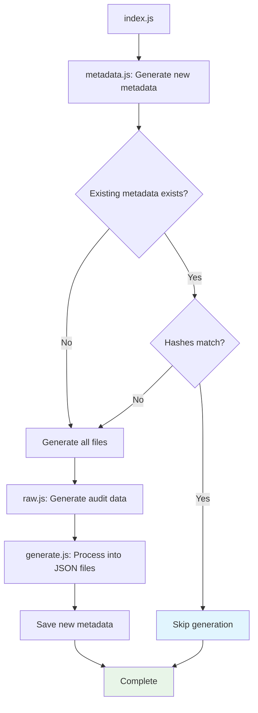

# Codeowners Manifest Scripts

Scripts for generating and caching CODEOWNERS manifest data.

Each of these scripts can be run individually if needed, but `index.js` is most useful because it combines them all.

## Usage

```bash
# Combined script
node index.js     # Generate complete manifest with caching

# Individual scripts
node metadata.js  # Generate metadata with hashes
node raw.js       # Generate raw audit data
node generate.js  # Process raw data into manifest files
```

## Control flow of `index.js`



## Default output

By default these scripts will write the following files to the `/codeowners-manifest/*` directory.

- `audit-raw.jsonl` - Raw CODEOWNERS audit data in JSONL format _(for fast stream processing)_
- `teams.json` - List of all codeowners _(for validating codeowner names)_
- `teams-by-filename.json` - Files mapped to their respective codeowners
- `filenames-by-team.json` - Codeowners mapped to their respective files
- `metadata.json` - Hashes for cache validation
