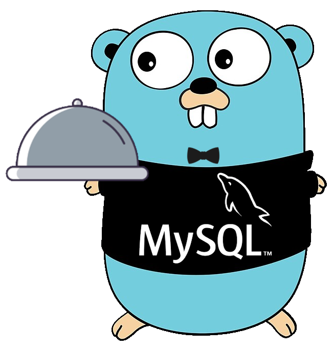

# A MySQL compatible database engine written in Go

**go-mysql-server** is a data-source agnostic SQL engine and server
which runs queries on data sources you provide, using the MySQL
dialect and wire protocol. A simple in-memory database implementation
is included, and you can query any data source you want by
implementing your own backend.

[Dolt](https://www.doltdb.com), a SQL database with Git-style
versioning, is the main production database implementation of this
package.  [Check
out](https://docs.dolthub.com/introduction/what-is-dolt) that project
for a reference implementation. Or, hop into the Dolt Discord server
[here](https://discord.com/invite/RFwfYpu) if you want to talk to the
[core developers](https://www.dolthub.com/team) behind
**go-mysql-server** and Dolt.

## Compatibility

With the exception of specific limitations (see below),
**go-mysql-server** is a drop-in replacement for MySQL. Any client
library, tool, query, SQL syntax, SQL function, etc. that works with
MySQL should also work with **go-mysql-server**. If you find a gap in
functionality, please file an issue.

For full MySQL compatibility documentation, see the [Dolt
docs](https://docs.dolthub.com/sql-reference/sql-support) on this
topic.

## Scope of this project

- SQL server and engine to query your data sources.
- In-memory database backend implementation suitable for use in tests.
- Interfaces you can use to implement new backends to query your own
  data sources.
- With a few caveats and using a full database implementation, a
  drop-in MySQL database replacement.

**go-mysql-server** has two primary uses case:

1. Stand-in for MySQL in a golang test environment, using the built-in
   `memory` database implementation.

2. Providing access to arbitrary data sources with SQL queries by
   implementing a handful of interfaces. The most complete real-world
   implementation is [Dolt](https://github.com/dolthub/dolt).

## Installation

Add **go-mysql-server** as a dependency to your project. In the
directory with the `go.mod` file, run:

```
go get github.com/dolthub/go-mysql-server@latest
```

To implement ICU-compatible regexes, `go-mysql-server` has a dependency on
[go-icu-regex](github.com/dolthub/go-icu-regex), which has a Cgo dependency on
[ICU4C](https://unicode-org.github.io/icu/userguide/icu4c/). To build a project
which depends on `go-mysql-server`, you should have a C/C++ toolchain, you
should build with Cgo enabled, and you should have libicu-dev, or the
equivalent for your environment, installed and available to your C++ toolchain.

For convenience, `go-mysql-server` also includes a non-compatible regex
implementation based on the Go standard library `regex.Regex`. To build against
that, instead of the `go-icu-regex` implementation, you must compile with
`-tags=gms_pure_go`.  Please note that some of go-mysql-server's tests do not
pass with `-tags=gms_pure_go` and in general `gms_pure_go` is not recommended
for users seeking MySQL compatibility.

## Using the in-memory test server

The in-memory test server can replace a real MySQL server in
tests. Start the server using the code in the [_example
directory](_example/main.go), also reproduced below.

```go
package main

import (
	"context"
	"fmt"
	"time"

	"github.com/dolthub/vitess/go/vt/proto/query"

	sqle "github.com/dolthub/go-mysql-server"
	"github.com/dolthub/go-mysql-server/memory"
	"github.com/dolthub/go-mysql-server/server"
	"github.com/dolthub/go-mysql-server/sql"
	"github.com/dolthub/go-mysql-server/sql/types"
)

// This is an example of how to implement a MySQL server.
// After running the example, you may connect to it using the following:
//
// > mysql --host=localhost --port=3306 --user=root mydb --execute="SELECT * FROM mytable;"
// +----------+-------------------+-------------------------------+----------------------------+
// | name     | email             | phone_numbers                 | created_at                 |
// +----------+-------------------+-------------------------------+----------------------------+
// | Jane Deo | janedeo@gmail.com | ["556-565-566","777-777-777"] | 2022-11-01 12:00:00.000001 |
// | Jane Doe | jane@doe.com      | []                            | 2022-11-01 12:00:00.000001 |
// | John Doe | john@doe.com      | ["555-555-555"]               | 2022-11-01 12:00:00.000001 |
// | John Doe | johnalt@doe.com   | []                            | 2022-11-01 12:00:00.000001 |
// +----------+-------------------+-------------------------------+----------------------------+
//
// The included MySQL client is used in this example, however any MySQL-compatible client will work.

var (
	dbName    = "mydb"
	tableName = "mytable"
	address   = "localhost"
	port      = 3306
)

func main() {
	pro := createTestDatabase()
	engine := sqle.NewDefault(pro)

	session := memory.NewSession(sql.NewBaseSession(), pro)
	ctx := sql.NewContext(context.Background(), sql.WithSession(session))
	ctx.SetCurrentDatabase(dbName)

	// This variable may be found in the "users_example.go" file. Please refer to that file for a walkthrough on how to
	// set up the "mysql" database to allow user creation and user checking when establishing connections. This is set
	// to false for this example, but feel free to play around with it and see how it works.
	if enableUsers {
		if err := enableUserAccounts(ctx, engine); err != nil {
			panic(err)
		}
	}

	config := server.Config{
		Protocol: "tcp",
		Address:  fmt.Sprintf("%s:%d", address, port),
	}
	s, err := server.NewServer(config, engine, sql.NewContext, memory.NewSessionBuilder(pro), nil)
	if err != nil {
		panic(err)
	}
	if err = s.Start(); err != nil {
		panic(err)
	}
}

func createTestDatabase() *memory.DbProvider {
	db := memory.NewDatabase(dbName)
	db.BaseDatabase.EnablePrimaryKeyIndexes()

	pro := memory.NewDBProvider(db)
	session := memory.NewSession(sql.NewBaseSession(), pro)
	ctx := sql.NewContext(context.Background(), sql.WithSession(session))

	table := memory.NewTable(db, tableName, sql.NewPrimaryKeySchema(sql.Schema{
		{Name: "name", Type: types.Text, Nullable: false, Source: tableName, PrimaryKey: true},
		{Name: "email", Type: types.Text, Nullable: false, Source: tableName, PrimaryKey: true},
		{Name: "phone_numbers", Type: types.JSON, Nullable: false, Source: tableName},
		{Name: "created_at", Type: types.MustCreateDatetimeType(query.Type_DATETIME, 6), Nullable: false, Source: tableName},
	}), db.GetForeignKeyCollection())
	db.AddTable(tableName, table)

	creationTime := time.Unix(0, 1667304000000001000).UTC()
	_ = table.Insert(ctx, sql.NewRow("Jane Deo", "janedeo@gmail.com", types.MustJSON(`["556-565-566", "777-777-777"]`), creationTime))
	_ = table.Insert(ctx, sql.NewRow("Jane Doe", "jane@doe.com", types.MustJSON(`[]`), creationTime))
	_ = table.Insert(ctx, sql.NewRow("John Doe", "john@doe.com", types.MustJSON(`["555-555-555"]`), creationTime))
	_ = table.Insert(ctx, sql.NewRow("John Doe", "johnalt@doe.com", types.MustJSON(`[]`), creationTime))

	return pro
}
```

This example populates the database by creating `memory.Database` and
`memory.Table` objects via golang code, but you can also populate it
by issuing `CREATE DATABASE`, `CREATE TABLE`, etc. statements to the
server once it's running.

Once the server is running, connect with any MySQL client, including
the golang MySQL connector and the `mysql` shell.

```bash
> mysql --host=localhost --port=3306 --user=root mydb --execute="SELECT * FROM mytable;"
+----------+-------------------+-------------------------------+----------------------------+
| name     | email             | phone_numbers                 | created_at                 |
+----------+-------------------+-------------------------------+----------------------------+
| Jane Deo | janedeo@gmail.com | ["556-565-566","777-777-777"] | 2022-11-01 12:00:00.000001 |
| Jane Doe | jane@doe.com      | []                            | 2022-11-01 12:00:00.000001 |
| John Doe | john@doe.com      | ["555-555-555"]               | 2022-11-01 12:00:00.000001 |
| John Doe | johnalt@doe.com   | []                            | 2022-11-01 12:00:00.000001 |
+----------+-------------------+-------------------------------+----------------------------+
```

## Limitations of the in-memory database implementation

The in-memory database implementation included with this package is
intended for use in tests. It has specific limitations that we know
of:

- [Not
  threadsafe](https://github.com/dolthub/go-mysql-server/issues/1306). To
  avoid concurrency issues, limit DDL and DML statements (`CREATE
  TABLE`, `INSERT`, etc.) to a single goroutine.
- [No transaction
  support](https://github.com/dolthub/go-mysql-server/issues/1506). Statements
  like `START TRANSACTION`, `ROLLBACK`, and `COMMIT` are no-ops.
- [Non-performant index
  implementation](https://github.com/dolthub/go-mysql-server/issues/1347). Indexed
  lookups and joins perform full table scans on the underlying tables.

## Custom backend implementations

You can create your own backend to query your own data sources by
implementing some interfaces. For detailed instructions, see the
[backend guide](./BACKEND.md).

## Technical documentation for contributors and backend developers

- [Architecture](./ARCHITECTURE.md) is an overview of the various
  packages of the project and how they fit together.
- [Contribution guide](./CONTRIBUTING.md) for new contributors,
  including instructions for how to get your PR merged.

## Powered by go-mysql-server

* [dolt](https://github.com/dolthub/dolt)
* [Grafana](https://www.dolthub.com/blog/2025-09-25-grafana-with-go-mysql-server/)
* [gitbase](https://github.com/src-d/gitbase) (defunct)

Are you building a database backend using **go-mysql-server**? We
would like to hear from you and include you in this list.

## Security Policy

[go-mysql-server's security
policy](https://github.com/dolthub/go-mysql-server/blob/main/SECURITY.md) is
maintained in this repository. Please follow the disclosure instructions there.
Please do not initially report security issues in this repository's public
GitHub issues.

## Acknowledgements

**go-mysql-server** was originally developed by the `{source-d}`
organzation, and this repository was originally forked from
[src-d](https://github.com/src-d/go-mysql-server). We want to thank
the entire `{source-d}` development team for their work on this
project, especially Miguel Molina (@erizocosmico) and Juanjo Álvarez
Martinez (@juanjux).

## License

Apache License 2.0, see [LICENSE](/LICENSE)
